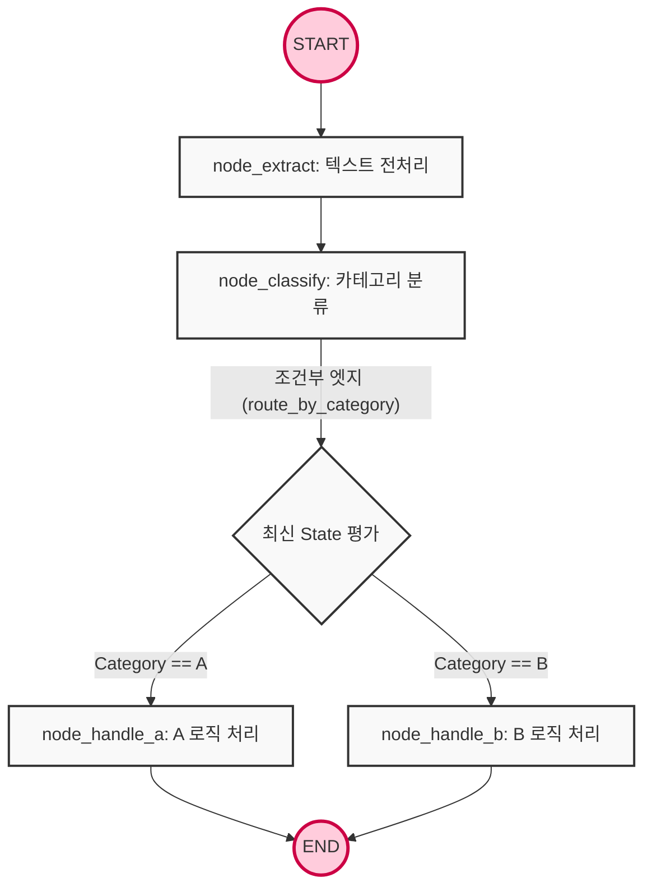

# LangGraph 기반 Agent DAG

질문으로 시작해보자 LLM 기반 에이전트가 복잡한 태스크를 수행할 때, 무한루프에 빠지거나 이전 단계의 컨텍스트를 잃어버리는 문제를 어떻게 프레임워크 레벨에서 통제할 수 있을까?

LangGraph는 LLM을 활용한 에이전트 애플리케이션의 state를 관리하고, 실행 흐름을 그래프 이론에 기반하여 제어하기 위해 LangChain 생태계에서 파생된 오케스트레이션 프레임워크다.

- **State(상태스키마)**: 상태 스키마로 그래프 내의 모든 노드가 공유하고 수정할 수 있는 전역 데이터 구조다 `TypedDict`, `Pydantic`을 사용하여 엄격한 타입으로 정의되며, 에이전트의 기억 역할을 수행한다.
- **Node(노드)**: 그래프의 정점으로 실제 연산이나 LLM 호출을 수행하는 파이썬 함수다. 현재의 state를 입력으로 받아 작업으로 처리한 후, state의 특정 필드를 업데이트하는 딕셔너리를 반환한다.
- **Edge(엣지)**: 노드 간 제어 흐름을 정의하는 간선이다. 실행 순서를 하드코딩하는 일반 엣지와, state의 조건에 따라 동적으로 다음 노드를 결정하는 조건부 엣지로 나뉜다.
- **DAG(Directed Acyclic Graph)**: 순환이 발생하지 않고 한 방향으로만 흐르는 방향성 그래프다. 에이전트의 실행이 무한 반복에 빠지지 않고 반드시 종료 지점에 도달함을 아키텍처적으로 보장할 때 사용된다.

<br>

## 문제 정의

단순한 LangChain의 chain이나 기존 `AgentExecutor`를 사용할 경우, 실무 수준의 복잡한 에이전트 시스템에서 다음과 같은 한계에 직면한다.

- **블랙박스화된 실행 흐름:** 기존 에이전트 프레임워크는 프롬프트와 도구를 던져주면 내부에서 알아서 동작하는 블랙박스 구조다. 이는 예외 상황 발생시 디버깅을 불가능하게 만들고, 특정 로직에서 개발자가 원하는 방향으로 제어권을 강제하기 어렵게 만든다.
- **상태 유실 및 컨텍스트 관리의 한계:** 여러 단계의 추론, 도구 호출, 데이터 정제가 혼합된 파이프라인에서 중간 결과물을 완전하게 보관하고 다음 단계로 전달하는 명시적인 전역 메모리 메커니즘이 부족하다.
- **비결정적 동작과 무한 루프의 위험:** LLM이 스스로 다음 행동을 결정하는 구조에는 환각현상으로 인해 잘못된 도구를 계속 반복해서 호출하거나 종료 조건에 도달하지 못하는 통제 불능 상태가발생할 수 있다.

### 해결 방식

- **상태 기반 오케스트레이션:** 에이전트의 모든 입출력을 중앙 집중화된 state 객체로 통일한다. 각 노드는 서로의 존재를 알 필요 없이 오직 state 객체만을 읽고 쓰며 동작하므로 시스템의 결합도를 낮추고 모듈화를 촉진한다.
- **명시적 그래프 선언 (Declarative Graph Construction)**: 태스크의 분기 처리, 예외 상황에서 대한 폴백, 그리고 종료 조건을 노드와 엣지로 명시적으로 선언, 이를 통해 LLM의 비결정적 추론 능력을 활용하면서도, 전체적인 실행 궤적은 개발자가 설계한 DAG 내에서만 움직이도록 통제한다.

<br>

## 상세 동작 원리 및 구조화

에이전트의 실행 흐름이 LangGrahp 엔진 내부에서 어떻게 초기화되고, 노드간의 데이터 병합이 되며 조건에 따라 라우팅 되는지 메모리 제어 흐름 관점에서 나열해보면




1. **상태 초기화 및 그래프 컴파일 (initiaization & compile)**: 개발자가 `StateGraph` 객체를 인스턴스화할 때, 상태를 구성할 데이터 스키마를 주입한다. 이후 모든 노드와 엣지를 등록하고 `.compile()` 메서드를 호출하면, LangGraph 내부 엔진은 노드 간의 연결 유효성을 검증하고 실행 가능한 그래프 런타임을 메모리에 구축한다.
2. **시작 노드 진입 (START Node Entry)**: 클라이언트가 `invoke()` 메서드와 함께 초기 입력값을 전달하면 그래프의 내장된 START 지점과 연결된 첫 번째 비즈니스 노드가 트리거된다. 입력값은 즉시 state 스키마에 바인딩되어 전역 상태 객체로 인스턴스화 된다.
3. **노드 실행 및 상태 병합 (exectuion & state reducer)**: 첫 번째 노드 (파이썬 함수)가 실행되며 현재 state 객체를 인자로 받는다. 로직 llm 호출등 처리가 완료되면 노드는 전체 state를 반환할 필요 없이 업데이트가 필요한 필드만을 딕셔너리 형태로 반환한다. LangGraph 엔진은 내부적으로 리듀서 함수를 가동하여, 기존 state에 노드가 반환한 새로운 데이터를 병합(또는 overwrite, append) 하여 최신 state를 생성한다.
4. **조건부 엣지 평가 (Conditional Edge Evaluation)**: 노드의 실행이 끝나면, 엔진은 해당 노드에 연결된 간선을 확인하고 만약 일반 엣지라면 지정된 다음 노드로 즉시 제어권을 넘긴다. 반면 조건부 엣지가 등록되어 있다면, 엔진은 라우팅 함수를 호출한다. 라우팅 함수는 최신 상태의 state를 읽어들여 (ex.LLM이 판별한 카테고리 값 같은) 평가한 뒤, 분기해야할 다음 목적지 노드 이름을 문자열로 반환한다.
5. **종료 조건 도달 (Terminaiton to End)**: 라우팅 또는 엣지를 통해 제어 흐름이 그래프의 내장된 END 지점에 도달하게 되면 메인 이벤트 루프가 중단되고 LangGraph는 실행이 완료된 시점의 최정 state 객체를 클라이언트에게 반환하며 전체 생명주기를 종료한다 DAG 구조이므로 이 흐름은 역방향이나 무한 순환을 허용하지 않는다.

### Example

LLM을 배제하고 데이터를 순차적이고 분기적으로 처리하는 방향성 비순환 그래프 즉 DAG의 뼈대와 state 역할의 본질을 이해해보자.

```py
from typing import TypedDict
from langgraph.graph import StateGraph, START, END

# 1. 전역 상태(State) 스키마 정의
class AgentState(TypedDict):
    input_text: str
    processed_data: str
    category: str

# 2. 개별 노드(Node) 함수 정의
def node_extract(state: AgentState):
    # 입력 텍스트를 처리하고 상태 업데이트 반환
    return {"processed_data": state["input_text"].strip().upper()}

def node_classify(state: AgentState):
    # 처리된 데이터를 기반으로 카테고리 분류 (LLM 모사)
    data = state["processed_data"]
    category = "A" if "URGENT" in data else "B"
    return {"category": category}

def node_handle_a(state: AgentState):
    return {"processed_data": state["processed_data"] + " [HANDLED AS A]"}

def node_handle_b(state: AgentState):
    return {"processed_data": state["processed_data"] + " [HANDLED AS B]"}

# 3. 라우팅 함수 (조건부 엣지용)
def route_by_category(state: AgentState) -> str:
    if state["category"] == "A":
        return "node_a"
    return "node_b"

# 4. StateGraph 선언 및 구축 (DAG 구성)
workflow = StateGraph(AgentState)

# 노드 등록
workflow.add_node("extractor", node_extract)
workflow.add_node("classifier", node_classify)
workflow.add_node("node_a", node_handle_a)
workflow.add_node("node_b", node_handle_b)

# 엣지 연결 (제어 흐름 정의)
workflow.add_edge(START, "extractor")
workflow.add_edge("extractor", "classifier")

# 조건부 엣지 등록 (classifier 노드 종료 후 route_by_category 함수 평가)
workflow.add_conditional_edges(
    "classifier",
    route_by_category,
    {
        "node_a": "node_a", # 라우팅 반환값이 "node_a"일 때 이동할 노드
        "node_b": "node_b"
    }
)

# 분기된 흐름을 END 노드로 수렴 (비순환 보장)
workflow.add_edge("node_a", END)
workflow.add_edge("node_b", END)

# 그래프 컴파일
app = workflow.compile()

# 실행
initial_state = {"input_text": " This is an urgent message "}
result = app.invoke(initial_state)
print(result)
# 출력: {'input_text': ' This is an urgent message ', 'processed_data': 'THIS IS AN URGENT MESSAGE [HANDLED AS A]', 'category': 'A'}
```

LLM을 연동하여 실제 문서 검토 에이전트를 구축한다고 해보자.

Pydantic의 구조화된 출력 (Structured Output)을 활용하여 라우팅 안정성을 확보하고, 리듀서를 사용하여 메시지 기록이 덮어씌워지지 않고 누적되도록 최적화된 구성이다.

```py
import operator
from typing import TypedDict, Annotated, Sequence
from pydantic import BaseModel, Field
from langchain_core.messages import BaseMessage, HumanMessage, AIMessage
from langchain_openai import ChatOpenAI
from langgraph.graph import StateGraph, START, END

# 1. Pydantic을 활용한 LLM 구조화 출력 스키마 정의 (라우팅용)
class OutputFormat(BaseModel):
    is_valid: bool = Field(..., description="문서가 요구사항을 충족하는지 여부")
    reason: str = Field(..., description="판단 사유")

# 2. 리듀서(Annotated + operator.add)가 적용된 프로덕션 State 스키마
# messages 리스트는 새로운 반환값이 들어올 때마다 기존 리스트에 append 됨
class GraphState(TypedDict):
    document: str
    messages: Annotated[Sequence[BaseMessage], operator.add]
    is_valid: bool

# 3. LLM 초기화 (구조화된 출력 강제)
llm = ChatOpenAI(model="gpt-4o", temperature=0)
evaluator_llm = llm.with_structured_output(OutputFormat)

# 4. 노드 정의
def document_analyzer_node(state: GraphState):
    """문서를 분석하고 유효성을 평가하는 노드"""
    doc = state["document"]
    prompt = f"다음 문서를 평가하여 완성도를 판단하세요. 문서: {doc}"
    
    # LLM 추론 및 구조화된 결과 파싱
    result: OutputFormat = evaluator_llm.invoke(prompt)
    
    ai_message = AIMessage(content=f"평가 완료. 사유: {result.reason}")
    
    # 상태 업데이트: 메시지 누적 및 유효성 플래그 세팅
    return {"messages": [ai_message], "is_valid": result.is_valid}

def success_handler_node(state: GraphState):
    """유효한 문서일 때 후속 처리를 담당하는 노드"""
    return {"messages": [AIMessage(content="[System] 문서가 승인되어 데이터베이스에 저장되었습니다.")]}

def rejection_handler_node(state: GraphState):
    """유효하지 않은 문서일 때 피드백을 생성하는 노드"""
    return {"messages": [AIMessage(content="[System] 문서가 반려되었습니다. 작성자에게 피드백을 전송합니다.")]}

# 5. 라우팅 로직
def route_based_on_validity(state: GraphState) -> str:
    """State의 is_valid 플래그를 검사하여 분기"""
    if state.get("is_valid"):
        return "success"
    return "rejection"

# 6. DAG 그래프 빌드
builder = StateGraph(GraphState)

builder.add_node("analyzer", document_analyzer_node)
builder.add_node("success", success_handler_node)
builder.add_node("rejection", rejection_handler_node)

builder.add_edge(START, "analyzer")

# 유효성에 따른 분기 (조건부 엣지)
builder.add_conditional_edges(
    "analyzer",
    route_based_on_validity,
    {
        "success": "success",
        "rejection": "rejection"
    }
)

builder.add_edge("success", END)
builder.add_edge("rejection", END)

# 런타임 컴파일
agent_app = builder.compile()

# 실행 예시
def run_agent(doc_text: str):
    inputs = {
        "document": doc_text,
        "messages": [HumanMessage(content="초기 문서 제출")]
    }
    
    # stream()을 사용하여 노드 실행 시점마다 실시간으로 상태 변경을 추적(Observability)
    for event in agent_app.stream(inputs):
        for node_name, state_update in event.items():
            print(f"--- [Node: {node_name}] Executed ---")
            print(state_update["messages"][-1].content)
            print("-" * 40)

# run_agent("이 문서는 완벽하게 작성된 최종 보고서입니다.")
```

### DAG

DAG는 방향성 비순환 그래프 Directed Acyclic Graph 데이터나 작업의 흐름이 한쪽 방향으로만 전진하고 절대 왔던 길로 되돌아가는 무한루프가 발생하지 않는 논리적 구조를 뜻한다.

데이터 파이프라인이나 ai 에이전트의 워크플로우를 설계할 대 작업은 반드시 안전하게 종료 지점에 도달하도록 보장하기 위해 DAG를 채택한다.