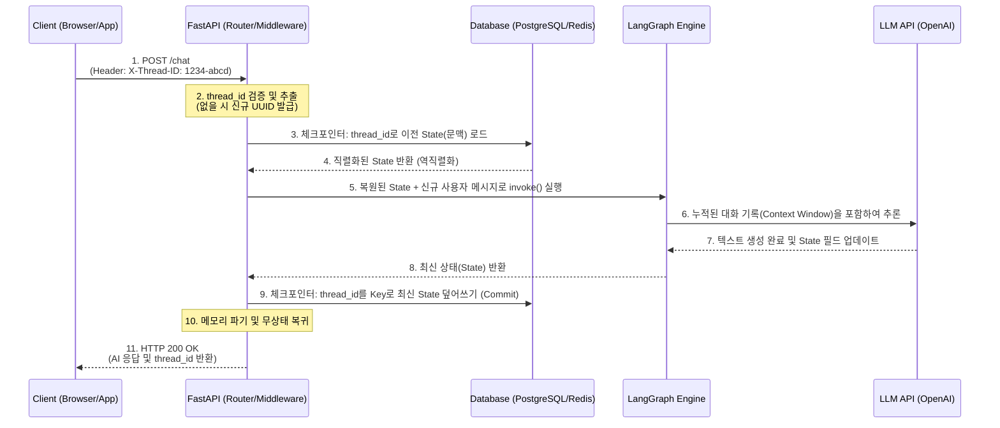

# Stateless 프로토콜에서 Agent 문맥 식별 라우터

HTTP 프로토콜은 본질적으로 각각의 요청이 독립적인 무상태 stateless 통신이다.

그렇다면 수천 명의 사용자가 동시에 접속하는 단일 api 서버에서 에이전트는 어떻게 각 사용자의 5분 전 대화 내용을 정확하게 기억하고 문맥을 이어나갈 수 있을까?

대규모 언어 모델을 활용한 챗봇이나 자율 에이전트는 사용자와의 연속적인 상호작용 multi-turn이 필수적이다.

그러나 백엔드 인프라를 구성하는 HTTP 기반의 API 서버와 LLM 자체는 이전의 상태나 기억을 전혀 보존하지 않는다.

이를 해결하기 위해 분산 시스템에서는 고유한 식별자인 `thread_id`를 사용해 네트워크 계층의 요청과 데이터베이스 계층의 문맥을 매핑하는 영속성 아키텍처를 구축한다.

- **무상태성**: stateless는 서버가 클라이언트의 이전 상태를 메모리에 보존하지 않는 네트워크 통신 패러다임이다. 이로 인해서 서버는 트래픽 증가시 단순히 인스턴스를 늘리는 scale out 만으로는 부하를 분산할 수 있지만, 역으로 모든 요청에는 처리에 필요한 완전한 정보가 포함되어야 한다는 제약이 발생한다.
- **스레드 식별자 thread_id**: 단일 사용자의 특정환 대화 세션이나 논리적인 작업흐름을 고유하게 구분하는 문자열 주로 UUID 형식이고 사용자 id랑은 다르다. 한 명의 사용자가 여러개의 독립적인 스레드를 가질 수 있으므로 문맥 복원에는 가장 작은 논리적 단위가 thread_id인 것이다.
- **Context Isolation**: async eventloop 기반의 프레임워크들은 동시에 처리되는 수 많은 http 요청들이 서로 메모리 공간을 침범하지 않도록 안전하게 분리해야하는것이 필요한데 이가 context isolation
- **Checkpointer**: LangGraph 같은 에이전트 프레임워크에서 특정 thread_id에 종속된 그래프의 상태 스키마를 매 노드 실행 시점마다 데이터베이스에 직렬화하여 저장하고, 다음 요청시 역직렬화하여 메모리로 복원해주는 영속성 관리 컴포넌트다.

<br>

## 문제 정의

다시 돌아와서 단순한 변수나 클라이언트의 로컬 스토리지에 의존하여 대화 기록을 관리할 경우, 프로덕션 환경의 백엔드 시스템에서는 치명적인 보안 사고와 구조적 결함이 발생한다

- **동시성 환경에서의 데이터 오염 (Data Bleed)**: 파이썬의 단순 전역 딕셔너리 `global dict`에 사용자 id나 토큰을 기준으로 대화 내역을 저장하면, 싱글 프로세스 내의 비동기 컨텍스트 스위칭 과정에서 경쟁 상태가 발생하고 a 사용자 요청을 처리하기 위해 I/O 대기를 하는동안 B사용자 요청이 인입되면 메모리 주소가 혼재되어 A사용자의 화면에 B사용자의 민감한 대화 내역이 노출되는 대형 보안 사고로 직결된다.
- **프론트엔드 페이로드의 비대화 및 네트워크 지연**: 서버가 무상태성을 유지한답시고 클라이언트(웹브라우저)에게 전체 대화 기록을 관리하게 한 뒤에 매 API 요청마다 수천토큰에 달하는 누적 대화 기록을 HTTP Body에 담아 전송하게 된다면 이는 안티패턴이다. 막대한 아웃바운드 네트워크 대역폭을 낭비해 모바일 환경에서는 치명적인 레이턴시 증폭도 유발할 수 있고 또한 클라이언트에서 대화 기록을 임의로 조작하는 보안 취약점도 존재한다.
- **스케일 아웃이 불가능**: 로컬 서버의 메모리 리소스 RAM에 세션을 저장하는 stateful 상태 유지 방식으로 서버를 구축하면 로드 밸런서 환경에서 문제가 발생한다. 첫 번째 요청이 1번 서버로 두 번째 요청이 2번 서버로 라우팅될 경우 2번 서버에서는 해당 사용자의 이전 대화 메모리가 존재하지 않아 에이전트 문맥이 즉시 단절된다.


### Solution

**표준화된 헤더를 통한 식별자 주입**을 하게 된다면 클라이언트는 대화 시작 시점 또는 서버가 발급한 고유 `thread_id`를 HTTP 헤더에 ex. `X-Thread-ID`에 포함하여 전송한다. 이렇게 하면 본문 데이터 크기와 무관하게 서버는 헤더 파싱만으로 이 요청이 어떤 대화 문맥에 속하는지 O(1) 정도로 즉각 식별한다.

**중앙 집중식 상태 저장소**인건데 결국 FastAPI 라우터는 추출한 thread_id 기반으로 외부에 독립된 db에서 해당 세션에 직렬화된 이전 대화 상태 객체로 조회를 하고 이로서 물리적 서버 인스턴스로 요청이 어느곳으로 되든 동일한 디비를 보니 state를 불러올 수 있게 되는것이다. 사실 이건 인증시스템과 비슷한 구조로 문제를 푼거같긴하다.

**LangGraph Checkpointer 구현**: 에이전트 호출시 `thread_id`를 `configurable` 설정 객체에 주입하여 프레임워크 내부로 넘긴다. 프레임워크는 내부적으로 ID를 사용해 이전 그래프 상태를 메모리에 로드하고 새로운 응답이 생성되면 다시 해당 ID 레코드를 원자적으로 덮어쓰기 또는 스냅샷으로 저장한다.

<br>

## 상세 동작 원리 및 구조화

운영체제 네트워크 스택에서 수신된 패킷이 애플리케이션 메모리에 적재되고 데이터베이스와 상호작용하여 상태를 복원하기까지의 과정을 이벤트 루프 관점에서 분석해보면



1. **HTTP 패킷 수신 및 파싱**: 클라이언트의 패킷이 서버에 도착하면 ASGI 서버 (uvicorn)가 TCP 버퍼에서 데이터를 읽어 HTTP 헤더를 파싱하고 Request 객체를 동적 할당
2. **미들웨어/의존성 주입 계층에서 헤더검증**: FastAPI 라우터 진입전에 Depends로 묶인 의존성 주입 함수가 가동되고 딕셔너리에 X-Thread-ID 값을 추출후에 존재하지 않으면 새로운 값을 생성해 바인딩도한다.
3. **영속성 계층 조회 io blocking**: 해당 thread_id 값으로 컨트롤러는 추출된 아이디를 인자삼아 LangGraph의 Checkpointer (ex. AsyncSqliteSaver or RedisSaver) 한테 접근해 비동기 io를 쏴 스레드 제어권을 이벤트 루프에 반환해 다른 사용자의 요청이 처리할 수 있게 한다.
4. **그래프 상태 역직렬화**: 데이터베이스에서 조회된 이전 세션 Binary 또는 JSON 데이터가 메모리로 로드된다. 프레임워크는 이 데이터를 기반으로 LangGraph의 전역 state 객체(예: 누적된 messages 리스트, 플래그 변수 등)를 완벽하게 이전 상태로 복원하여 인스턴스화 한다.
5. **에이전트 실행 및 문맥 누적:** 복원된 state 객체에 이번 http 요청으로 새로 들어온 클라이언트의 메시지를 append후 이후 LLM 추론 로직이 실행되어 LLM은 방금 복원된 전체 대화 기록을 컨텍스트 윈도우에 포함하여 응답을 생성함.
6. **직렬화 및 원자적 커밋**: 에이전트 노드의 실행이 종료되어 최종 `State`가 완성되면 체크포인터는 다시 `thread_id`를 기준키로 삼아 이 최신 상태를 디비에 덮어 쓴다. 스냅샷 방식이면 타임스탬프와 함께 insert
7. **응답 반환 후 컨텍스트 파기**: 직렬화가 완료되면 컨트롤러는 최종 생성된 텍스트 응답을 json 형태로 묶어 클라이언트에게 HTTP 200 OK와 함께 반환한다. 처리가 끝난 Request 객체와 복원되었던 메모리상의 State 객체는 파이썬 가비지 컬렉터에 의해 메모리에서 완전히 소멸하여 서버는 다시 stateless가 된다.

### Example

외부 디비나 복잡한 프레임워크없이 fastapi dict를 사용하면서 thread_id 추출과 컨텍스트 격리 뼈대를 이해해보면

```py
import uuid
from fastapi import FastAPI, Depends, Header
from typing import Dict, List
from pydantic import BaseModel

app = FastAPI()

# 원리 이해용: 외부 DB를 대체하는 인메모리 세션 저장소 (멀티 프로세스에서는 공유되지 않음)
SESSION_DB: Dict[str, List[str]] = {}

class ChatRequest(BaseModel):
    message: str

# 1. 의존성 주입 함수: HTTP Header에서 thread_id 추출 및 검증
async def get_or_create_thread_id(x_thread_id: str = Header(None)) -> str:
    # 헤더에 ID가 없으면 새로운 대화 세션으로 간주하여 UUID 발급
    if not x_thread_id:
        return str(uuid.uuid4())
    return x_thread_id

@app.post("/v1/chat")
async def chat_endpoint(
    request: ChatRequest,
    thread_id: str = Depends(get_or_create_thread_id)
):
    # 2. 해당 thread_id의 이전 문맥(Context) 로드
    if thread_id not in SESSION_DB:
        SESSION_DB[thread_id] = []
        
    context_history = SESSION_DB[thread_id]
    
    # 3. 새로운 메시지 누적
    context_history.append(f"User: {request.message}")
    
    # 4. (가상) 에이전트 실행 로직: 문맥 길이를 참조하여 응답 생성
    response_text = f"이전까지 총 {len(context_history)-1}번의 대화가 있었습니다. 방금 하신 말씀은 잘 들었습니다."
    context_history.append(f"Agent: {response_text}")
    
    # 5. 응답 반환 시 사용자가 다음 요청에 사용할 수 있도록 thread_id를 명시적으로 전달
    return {
        "thread_id": thread_id,
        "response": response_text
    }
```

FastAPI 라우터와 LangGraph의 `MemorySaver`를 결합해 thread_id를 설정(configurable)으로 주입해 방향성 비순환 그래프 DAG의 연속성을 보장하는 코드를 살펴보자

```py
import operator
import uuid
from typing import Annotated, TypedDict, Sequence
from fastapi import FastAPI, Header, HTTPException
from pydantic import BaseModel
from langchain_core.messages import BaseMessage, HumanMessage, AIMessage
from langgraph.graph import StateGraph, START, END
from langgraph.checkpoint.memory import MemorySaver

app = FastAPI()

# 1. LangGraph State 스키마 정의 (메시지가 누적되도록 operator.add 지정)
class GraphState(TypedDict):
    messages: Annotated[Sequence[BaseMessage], operator.add]

# 2. 간단한 에이전트 노드 함수 (실제로는 LLM 추론 로직이 위치함)
def mock_agent_node(state: GraphState):
    history_length = len(state["messages"])
    ai_response = AIMessage(content=f"[서버 응답] 현재 누적된 메시지 수는 {history_length}개 입니다.")
    return {"messages": [ai_response]}

# 3. 그래프 선언 및 체크포인터(영속성 계층) 부착
workflow = StateGraph(GraphState)
workflow.add_node("agent", mock_agent_node)
workflow.add_edge(START, "agent")
workflow.add_edge("agent", END)

# 실무에서는 AsyncSqliteSaver.from_conn_string() 또는 RedisSaver 등을 사용합니다.
# 인메모리 Saver도 thread_id를 기준으로 상태를 완벽히 격리합니다.
checkpointer = MemorySaver()

# 그래프 컴파일 시 checkpointer 주입
agent_app = workflow.compile(checkpointer=checkpointer)

# 4. API 엔드포인트 요청 스키마
class AgentRequest(BaseModel):
    user_input: str

@app.post("/v2/agent/invoke")
async def invoke_agent(
    payload: AgentRequest,
    x_thread_id: str = Header(None, description="대화 세션을 식별하는 고유 UUID")
):
    # A. 식별자 검증
    if not x_thread_id:
        x_thread_id = str(uuid.uuid4())
        
    # B. LangGraph 실행을 위한 Configuration 객체 조립
    # 이 설정값 내부의 'thread_id' 키를 체크포인터가 가로채어 데이터베이스 조회를 수행합니다.
    run_config = {"configurable": {"thread_id": x_thread_id}}
    
    # C. 입력 데이터 구성
    inputs = {"messages": [HumanMessage(content=payload.user_input)]}
    
    try:
        # D. 그래프 실행 (invoke 내부에서 상태 복원 -> 연산 -> 상태 직렬화가 자동으로 일어남)
        result_state = agent_app.invoke(inputs, config=run_config)
        
        # 최종 상태에서 마지막 AI 응답 텍스트 추출
        final_response = result_state["messages"][-1].content
        
        return {
            "status": "success",
            "thread_id": x_thread_id,
            "agent_response": final_response
        }
        
    except Exception as e:
        raise HTTPException(status_code=500, detail=f"에이전트 실행 중 오류 발생: {str(e)}")
```