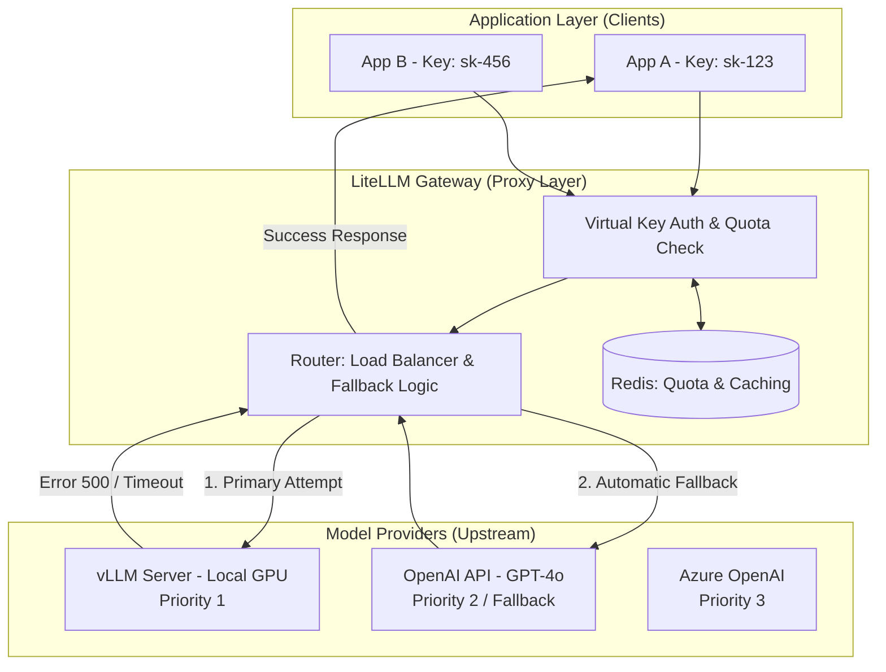

# LiteLLM 프록시 서버 구성

서비스 규모가 커지면서 OpenAI의 GPT-4도 쓰고, 보안이 중요한 데이터는 사내 vLLM 서버로 처리해야하는 상황을 떠올려보자.

그런데 개발팀마다 API 키를 따로 관리하고, 각기 다른 API 규격에 맞춰 코드를 수정해야한다면 어떨까? 게다가 특정 모델 서버가 터졌을 때 자동으로 다른 모델로 전환되는 기능을 모든 서비스 코드에 일일이 구현하는것이 효율적일까?

**LiteLLM Proxy**는 다양한 LLM 공급자(OpenAI, Anthropic, vLLM, Azure) 등 각기 다른 API 규격을 OpenAI 표준 포맷으로 통합해주는 고성능 리버스 프록시이자 LLM 게이트웨이다

- **Unified Inference(통합 인터페이스)**: 백엔드 엔진이 vLLM이든 Anthropic이든 관계없이 클라이언트는 오직 `https://gateway.internal/v1/chat/completions` 주소 하나로 요청을 보내면 된다. 이는 인프라 복잡성을 애플리케이션 레이어로부터 완전히 격리시킨다.
- **Multi-tenancy & Virtual Keys**: 하나의 게이트웨이에서 여러팀 tenant에 가상 api 키를 발급하고 각 키마다 budget, RPM, TPM을 제어하는 계층적 관리 구조다.
- **Fallback Routing**: 특정 모델 예를들어 프라이빗 vLLM이 응답하지 않으면 500이거나 429이거나, 그럴때 사전에 정의된 우선순위에 따라 자동으로 다른 모델 GPT-4o 등 요청을 우회시키는 장애 조치 failover 메커니즘이다.

<br>

## 문제 정의

기업용 LLM 인프라를 구축할 때 직면하는 가장 큰 엔지니어링 병목은 엔드포인트의 파편화와 가용성 보장이다

- **인터페이스 파편화**: vLLM은 OpenAI 규격을 따르려하지만 미묘한 파라미터 차이가 존재하고, Anthropic이나 Google은 완전히 다른 페이로드를 요구한다. 이를 개별 마이크로서비스에서 처리하면 코드의 결합도가 높아져 엔진 교체가 불가능해진다.
- **신뢰성 문제 SPOF**: 단일 LLM 공급자에 의존하면 해당 서비스의 api 장애나 rate limit 발생시 서비스 전체가 마비되기 때문에 특히 대규모 트래픽 환경에선 429도 빈번해서 즉각적인 대체 경로 확보가 필수적이다.
- **비용 및 보안 거버넌스 부재**: 각 개발자가 개인 api 키를 발급받아 사용하면 전체 비용 추적이 불가능하며, 내부 데이터가 외부 LLM으로 유출되는 경로를 통제하거나 로깅할 포인트가 유실된다.

### 해결 방식

- **LLM Gateway Layer**: 애플리케이션과 LLM 공급자 사이에서 LiteLLM Proxy를 배치하여 모든 통신을 중앙 집중화한다. 이를 통해 클라이언트는 엔진의 실체를 알 필요 없는 모델 추상화를 달성한다.
- **선언적 라우팅 설정 (Declarative Routing)**: YAML 설정을 통해 모델 그룹화를 정의한다. 예를 들어 `gpt-4-level` 이라는 그룹에 vLLM 서버와 OpenAI GPT-4를 묶어두고, 평소에는 저비용인 vLLM을 쓰다가 장애 시에만 GPT-4로 넘어가도록 설계한다.
- **중앙 집중식 정책 관리**: 게이트웨이 레벨에서 Redis를 연동하여 실시간으로 각 api키별 쿼터를 체크하고, 가상 키 기반의 사용량 제한 및 모든 입출력 로그를 표준화된 포맷으로 수집한다.(Centrailized Loogging)

<br>

## 상세 동작 원리 및 구조화

LiteLLM Proxy가 요청을 수신하여 가용성 정책에 따라 적절한 엔드포인트로 라우팅하고 실패시 대체 경로를 탐색하는 내부 메커니즘이다.



1. **Request Ingestion**: 클라이언트가 openAI sdk등을 사용해 LiteLLM Proxy로 요청을 보낸다. 이때 model 이름은 실제 엔진명이 아닌 논리적 그룹명 production-llm을 사용한다.
2. **Identity & Quota Verfication**: Proxy는 redis에 저장된 가상 키 정보를 조회하여 해당 테넌트의 남은 예산과 rpm을 확인하고 제한 초과시 즉시 429 에러를 반환하여 업스트림 부하를 방지한다.
3. **Dynamic Routing**: 라우터는 설정된 전략 최소 부하, 라운드 로빈 등에 따라 타겟인 vLLM으로 요청을 전달한다.
4. **Fallback Trigger**: 만약 vLLM 서버에서 타임아웃이나 하드웨어 장애로 인한 에러가 발생하면, Proxy 내부의 Fallback Handler가 이를 가로챈다. 클라이언트에게 에러를 돌려주는 대신, 리스트에 정의된 다음 우선순위인 openai api로 페이로드를 즉시 재구성해 재시도한다.
5. **Response Transformation**: 상위 공급자로부터 받은 응답을 다시 표준 openai 포맷으로 정규화하여 클라이언트에게 최종 반환한다. 클라이언트는 중간에 장애가 발생했는지조차 모른채 안정적인 응답을 받게된다.

```yaml
model_list:
  # 'my-llm'이라는 하나의 이름으로 두 모델을 그룹화
  - model_name: my-llm 
    litellm_params:
      model: openai/facebook/opt-125m # vLLM에 로드된 모델명
      api_base: http://vllm-server:8000/v1
      api_key: "not-needed"
  
  - model_name: my-llm
    litellm_params:
      model: gpt-4o
      api_key: os.environ/OPENAI_API_KEY

router_settings:
  routing_strategy: round-robin # 기본적으로 번갈아가며 호출
```

fallback룰및 테넌트 관리가 포함된 프로덕션 설정을 또 보겠다

실제 멀티 테넌트 환경에서 가용성을 극대화하기 위해 에러코드별 fallback과 우선순위를 정교하게 세팅한 예시이다.

```yaml
model_list:
  # [Primary] 사내 vLLM 서버 (가장 높은 우선순위)
  - model_name: enterprise-gpt
    litellm_params:
      model: openai/Llama-3-70B
      api_base: https://vllm.internal.com/v1
      api_key: sk-vllm-internal
      rpm: 100 # vLLM 서버 성능에 맞춘 제한
    model_info:
      id: "vllm-1"

  # [Secondary] OpenAI GPT-4o (vLLM 장애 시 대체)
  - model_name: enterprise-gpt
    litellm_params:
      model: gpt-4o
      api_key: os.environ/OPENAI_API_KEY
    model_info:
      id: "openai-fallback"

router_settings:
  routing_strategy: latency-based-routing # 응답 속도가 빠른 곳 우선
  # [핵심] Fallback 로직 정의
  # vLLM(vllm-1)에서 아래 에러 발생 시 openai-fallback으로 즉시 전환
  fallbacks: [{"vllm-1": ["openai-fallback"]}]
  allowed_fails: 3 # 3번 실패 시 해당 모델을 일정 시간 동안 목록에서 제외 (Circuit Breaker)
  cooldown_time: 30 # 장애 모델 제외 시간(초)

general_settings:
  master_key: sk-master-1234
  database_url: "redis://localhost:6379/0" # 쿼터 및 캐싱용 Redis
  store_model_in_db: True # 새 모델 동적 추가 허용

# 테넌트별 가상 키 설정 (API를 통해 생성 가능하지만 예시로 표기)
# Key A: 'SearchTeam' - Budget $100/mo, RPM 50
# Key B: 'AdTeam' - Budget $1000/mo, RPM 500
```

<br>

## LiteLLM

LiteLLM에 대해서 보충 설명을 조금 더 붙여보자.

LiteLLM은 다양한 대규모 언어 모델 LLM 제공자들의 각기 다른 api 규격을 단일 표준으로 통합해주는 오픈소스 프록시 서버이자 llm 게이트웨이다.

현대의 대규모 ai 서비스는 단일 모델에 의존하지 않고 목적과 비용에 따라 외부 상용 api와 내부 프라이빗 서버 vLLM을 혼합하여 사용하는 멀티 모델 아키텍처를 채택한다.

그러나 각 제공자마다 엔드포인트 url, 인증 방식, json 페이로드 구조가 완전히 다르기 때문에, 백엔드 애플리케이션 모델을 교체하거나 추가할때마다 비즈니스 로직을 대대적으로 수정해야하는 결합도 문제가 발생한다.

- 클라이언트는 타겟 모델이 무엇이든 상관없이 openai api 표준 규격 하나만 사용하여 LiteLLM 프록시로 요청을 전송한다.
- LiteLLM은 수신된 페이로드를 분석한 뒤 실제 타겟 모델이 요구하는 고유의 데이터 구조로 동적 변환하여 백엔드에 전달한다.
- 이를 통해 애플리케이션 계층은 하위 llm 인프라 변경에 영향을 받지않는 모델 추상화를 달성하게 된다.
 
### 게이트웨이 기반 주요 엔터프라이즈 기능

LiteLLM은 모든 트래픽이 거쳐가는 spof 이기 때문에 spof만의 이점을 통해 서비스 서버에서 구현하기 까다로운 글로벌 제어 기능들을 중앙에서 처리한다.

- **가용성 보장을 위한 라우팅 및 폴백**: 특정 LLM 서버에 하드웨어 장애가 발생하거나 api limiting이 걸리면 사전에 정의된 라우팅 규칙에 따라 우선순위 모델로 우회시키기
- **성능 및 비용 최적화를 위한 시맨틱 캐싱**: 단순한 문자열이 아닌 프롬프트 의미론적 유사도를 임베딩 벡터를 통해 비교한다. 설정된 임계치 이상 유사한 요청이 인입될경우에 무거운 백엔드 llm 연산을 생략하고 redis, vector db에 캐싱된 이전 응답을 즉각 반환한다.
- **멀티 테넌트 예산 통제**: 단일 api 키를 공유하는 대신 게이트웨이에서 부서나 사용자별로 가상 api 키를 발급하고 redis의 원자적 연산을 기반으로 각 키의 분당 요청수 rpm과 토큰 사용량을 추적해 할당된 예산을 초과하는 트래픽을 선제적으로 차단한다.

