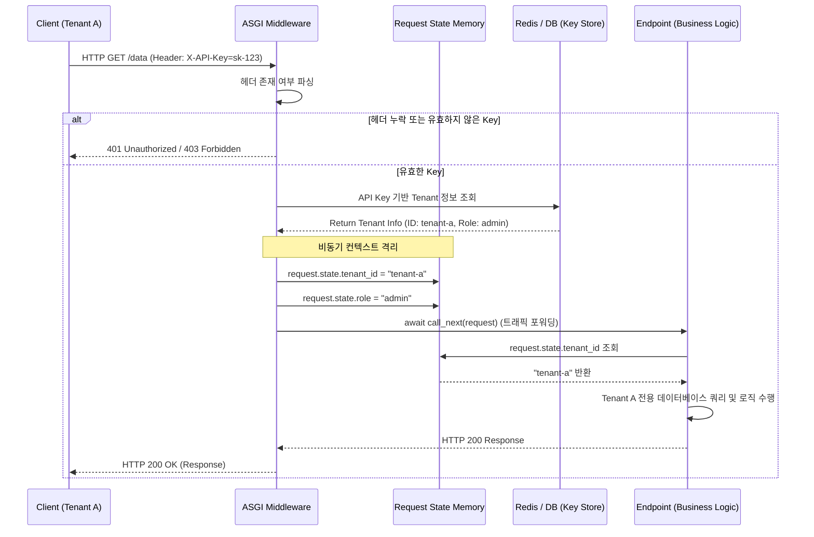

# 테넌트별 요청 분리 권한 인가 미들웨어 개발

질문으로 시작해보자, 단일 api 서버에 마케팅팀, 개발팀, 재무요청 팀의 요청이 동시에 인입될때 서버는 어떻게 각 요청의 소유자를 정확히 식별하고, A팀이 B팀의 데이터 접근을 막도록 원천적으로 통제할 수 있을까

대규모 트래픽을 처리하는 단일 서버 환경에서 여러 고객사나 부서가 시스템을 공유하는 것을 멀티 테넌시라고 한다. 이 환경에서 각 테넌트의 요청을 논리적으로 분리하기 위해 미들웨어와 헤더검증 기술이 사용된다.

- **인증과 인가**: 인증은 api key를 통해 요청자가 누구인지를 확인하는 과정이고 인가는 식별된 테넌트가 해당 엔드포인트나 리소스에 접근할 권한이 있는지를 제어하는 과정이다.
- **미들웨어**: 운영체제의 interrupt 처리나 네트워크 계층의 프록시처럼 클라이언트의 http 요청이 최종 라우터에 도달하기 전과 후에 개입하여 패킷을 가로채고 조작하는 소프트웨어 계층이다.
- **컨텍스트 격리**: 비동기 이벤트 루프 기반의 fastapi 환경에서는 수많은 요청이 단일 스레드에서 동시에 처리된다. 이때 특정 테넌트의 정보가 다른 테넌트의 요청과 섞이지 않도록 각 요청 객체 생명주기에 종속된 독립적인 메모리 공간 request.state를 할당하여 데이터를 격리한다.

<br>

## 문제 정의

멀티 테넌트 환경의 api 서버를 설계할 때, 권한 검증을 잘못 구현하면 심각한 아키텍처 결함과 보안 취약점이 발생한다.

- **횡단 관심사 Cross cutting Concerns의 파편화**: 수십, 수백개의 api 엔드포인트마다 api key를 읽고 테넌트를 검증하는 코드를 중복해서 작성하면, 코드의 결합도가 극도로 높아진다. 새로운 부서가 추가되거나 인증 로직이 변경될 때 모든 api를 수정해야하는 유지보수 불능 상태에 빠지게 된다.
- **데이터 오염의 위험**: 전역 변수나 싱글톤 패턴을 잘못 사용하여 현재 요청의 테넌트 id를 사용할 경우 비동기 환경 특성상 컨텍스트 스위칭이 발생하면서 a팀 요청에 b팀 식별자가 덮어씌워지는 보안 사고가 발생할 수 있다.
- **인가 우회 취약점**: 비즈니스 로직 내부에서 테넌트 분리를 처리하다 보면, 개발자가 실수로 특정 엔드포인트에 검증 로직이 누락되어 다른 테넌트 리소스에 무단 접근하는 경로가 노출될 수 있다. (Insecure Direct Object Reference)

### 해결 방식

- **미들웨어를 통한 관점 지향 프로그램 aop 적용**: 테넌트 식별 및 인증 로직을 개별 api 컨트롤러에서 완전히 뜯어내어, 애플리케이션 진입점인 ASGI(Asynchronous Server Gateway Interface) 미들웨어 계층으로 격상시킨다. 이를 통해 라우터는 도달하는 모든 트래픽은 이미 검증이 완료된 상태임을 아키텍처 레벨에서 보장한다.
- **HTTP Header 기반의 식별자 전달**: 보안 표준에 따라 api key나 토큰은 URL이 아닌 http header(X-API-Key)에 담아 전송하도록 강제하여 로깅 시스템에 중요 정보가 남는 것을 방지한다.
- **Request State를 활용한 안전한 메타데이터 전파**: 미들웨어에서 추출한 테넌트 식별자 부서명 등을 request.state 객체에 바인딩하고 이 객체는 해당 http 요청이 시작되어 응답이 반환될 때까지만 유지되는 격리된 생명주기를 가지므로 동시성 환경에서도 안전하다.

<br>

## 상세 동작 원리 및 구조화

다음은 클라이언트의 요청이 fast api 서버로 들어와 미들웨어를 거쳐 최종 비즈니스 로직에 도달하기까지의 권한 인가 흐름이다.



1. **Request Interception (가로채기)**: 클라이언트가 요청을 보내면 Uvicorn 같은 ASGI 서버가 이를 받아 FastAPI 앱으로 넘긴다. 이때 최전선에 배치된 미들웨어가 가장 먼저 요청 객체 Request를 가로챈다.
2. **Header Parsing & Verfication**: 미들웨어는 http 헤더 딕셔너리 X-API-Key를 추출한다. 내부 캐시나 DB를 조회하여 해당 키가 유효한지, 어느 테넌트 부서에 할당된 키인지 식별하고 실패할 경우 라우터로 트래픽을 넘기지 않고 즉시 HTTP 401/403 예외를 클라이언트에게 반환하여 토잇ㄴ을 차단한다.
3. **State Injection (상태 주입)**: 검증이 완료되면, 해당 요청의 고유한 메모리 영역인 `request.state` 공간에 테넌트의 고유 식별자 tenant_id와 Role을 데이터에 주입한다.
4. **Forwarding & Execution (위임 및 실행)**: call_next(request) 함수를 호출하여 검증이 끝난 요청 객체를 하위 라우터 비즈니스 로직에 포워딩하고 라우터 개발자는 더 이상 인증 코드를 짤 필요없이 `request.state.tenant_id` 를 꺼내어 해당 부서의 데이터만 필터링하는 핵심 로직에만 집중하게 된다.

### Example

의존성 주입을 활용해서 기초 테넌트를 분리하는 예시를 보자

미들웨어를 적용하기 이전에 FastAPI의 설계 철학인 Depends를 활용해 엔드포인트 레벨에서 HTTP Header를 검사하고 테넌트를 식별하는 직관적인 뼈대 코드다.

```py
from fastapi import FastAPI, Depends, HTTPException, Security
from fastapi.security.api_key import APIKeyHeader

app = FastAPI()

# 1. 검사할 HTTP Header Key 이름 지정
API_KEY_NAME = "X-API-Key"
api_key_header = APIKeyHeader(name=API_KEY_NAME, auto_error=False)

# 2. 임시 테넌트 데이터베이스 (API Key -> 부서명 매핑)
TENANT_DB = {
    "key-marketing-101": "Marketing_Department",
    "key-dev-202": "Development_Department"
}

# 3. 인증 및 식별 로직 (의존성 함수)
async def get_current_tenant(api_key: str = Security(api_key_header)):
    if api_key not in TENANT_DB:
        raise HTTPException(
            status_code=401,
            detail="Invalid or missing API Key"
        )
    # 식별된 테넌트(부서) 이름 반환
    return TENANT_DB[api_key]

# 4. 비즈니스 로직 (엔드포인트)
@app.get("/api/v1/dashboard")
async def get_dashboard_data(tenant_name: str = Depends(get_current_tenant)):
    # 엔드포인트는 이미 검증된 tenant_name만 넘겨받아 해당 부서의 데이터만 반환합니다.
    return {
        "message": "Access Granted",
        "tenant": tenant_name,
        "data": f"Confidential data for {tenant_name}"
    }
```

BaseHTTPMiddleware를 상속한 전역 인가 파이프라인

프로덕션 환경에서 모든 요청이 빠짐없이 검증되도록 BaseHTTPMiddleware를 통해 전역 수준에서 트래픽을 통제하고 request.state를 통해 데이터를 격리한다.

```py
from fastapi import FastAPI, Request, HTTPException
from fastapi.responses import JSONResponse
from starlette.middleware.base import BaseHTTPMiddleware
import time

app = FastAPI()

# 실무 환경을 가정한 가상의 비동기 DB 조회 함수
async def fetch_tenant_from_db(api_key: str) -> dict:
    # (실제로는 Redis나 RDBMS에서 API Key 조회 및 캐싱 수행)
    mock_db = {
        "sk-finance-prod": {"tenant_id": "T_FIN_001", "role": "admin"},
        "sk-hr-prod": {"tenant_id": "T_HR_002", "role": "viewer"}
    }
    return mock_db.get(api_key)

# 1. 전역 인가 미들웨어 클래스 정의
class TenantAuthMiddleware(BaseHTTPMiddleware):
    async def dispatch(self, request: Request, call_next):
        # 2. 인증을 우회해야 하는 공개 엔드포인트(Health Check 등) 예외 처리
        if request.url.path in ["/health", "/docs", "/openapi.json"]:
            return await call_next(request)

        # 3. HTTP Header에서 API Key 추출
        api_key = request.headers.get("X-API-Key")
        if not api_key:
            return JSONResponse(
                status_code=401,
                content={"detail": "Missing X-API-Key header"}
            )

        # 4. API Key 검증 및 테넌트 식별
        tenant_info = await fetch_tenant_from_db(api_key)
        if not tenant_info:
            return JSONResponse(
                status_code=403,
                content={"detail": "Invalid API Key or Revoked Access"}
            )

        # 5. [핵심] 식별된 테넌트 데이터를 request.state에 격리하여 주입
        # 이 변수는 현재 요청의 생명주기 동안에만 스레드-안전하게 유지됩니다.
        request.state.tenant_id = tenant_info["tenant_id"]
        request.state.role = tenant_info["role"]
        request.state.request_time = time.time()

        # 6. 다음 계층(라우터 또는 다음 미들웨어)으로 요청 포워딩
        response = await call_next(request)
        
        return response

# 미들웨어 앱에 등록
app.add_middleware(TenantAuthMiddleware)

# 비즈니스 로직 엔드포인트
@app.get("/api/v1/billing")
async def get_billing_info(request: Request):
    # 7. 컨트롤러는 미들웨어가 주입한 request.state 값을 꺼내어 사용
    tenant_id = request.state.tenant_id
    role = request.state.role
    
    # 인가(Authorization) 확인: 관리자 권한인지 체크
    if role != "admin":
        raise HTTPException(status_code=403, detail="Admin role required for billing access")
        
    # 테넌트 분리 로직: DB 쿼리 시 무조건 WHERE tenant_id = request.state.tenant_id 조건을 붙이도록 강제됨
    return {
        "status": "success",
        "tenant_id": tenant_id,
        "billing_data": [
            {"month": "April", "amount": 10000}
        ]
    }
```