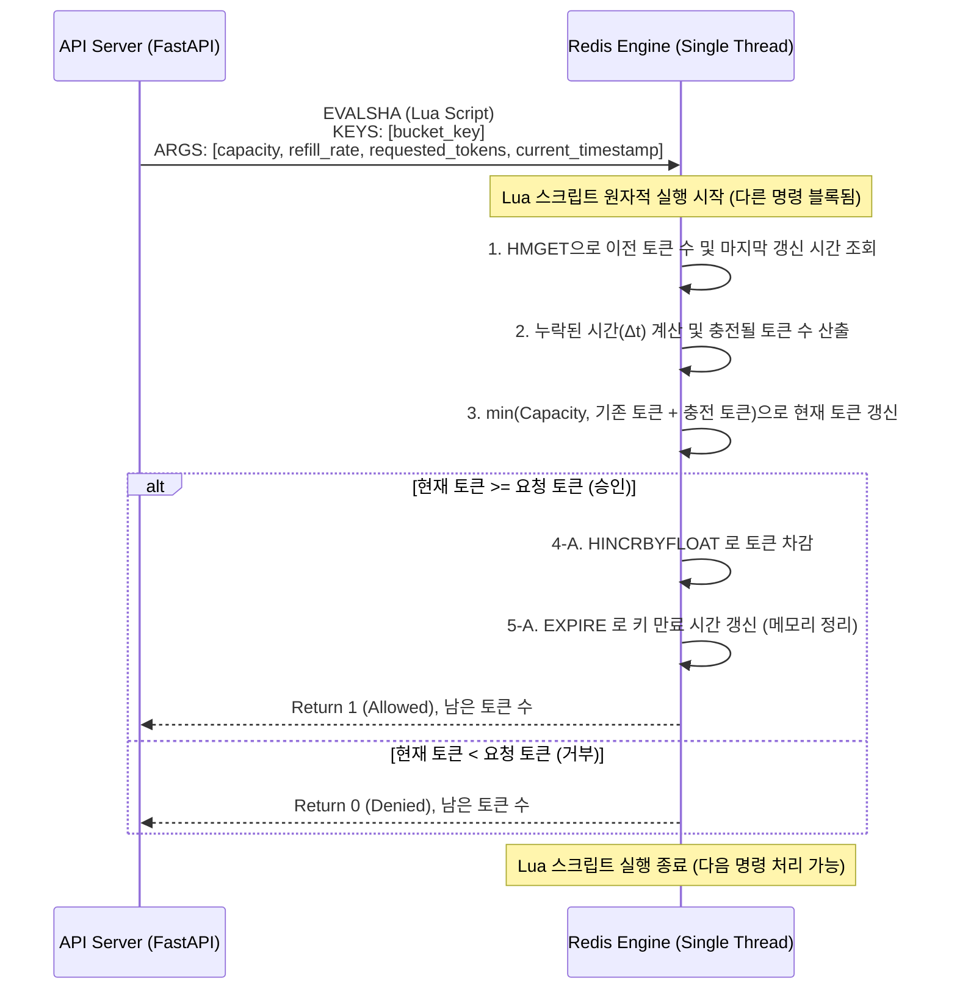

# Token Bucket 기반 Rate Limiting

분산된 여러 대의 api 서버에 수천건의 트래픽이 인입될 때, 어떻게 단일 데이터베이스 병목 없이 정확히 허용된 트래픽(분당 100건)만 통과시키고 초과분을 차단할 수 있을까? 특히 남은 토큰(요청 권한)의 수를 조회하고 차감하는 과정에서 발생하는 동시성 충돌을 어떻게 제어해야할까?

Rate Limiting 처리율 제한은 시스템의 가용성을 보호하기 위해 클라이언트의 요청 빈도를 제어하는 핵심 네트워크 아키텍처 기술이다. 이를 분산환경에서 구현하기 위해 인메모리 저장소 redis lua 스크립팅으로 구현을 결합해서 사용해볼 것이다.

- **Token Bucket**: 일정한 속도 (Refill Rate)로 토큰 버킷이 채워지고, 클라이언트가 요청을 보낼때마다 버킷에서 토큰을 하나씩 꺼내어 사용하는 알고리즘이다. 토큰이 없으면 요청은 거부된다. 트래픽의 일시적인 폭주(Burst)를 허용하면서도 평균적인 처리율을 제어할 수 있다.
- **원자성과 lua 스크립트**: redis는 싱글스레드 기반으로 동작하고 내장된 루아 스크립트 엔진으로 여러 명령어(GET, INCRBY, EXPIRE)를 하나의 스크립트로 묶어 실행하면 redis는 해당 스크립트가 끝날때까지 다른 클라이언트의 명령어를 처리하지 않는다. 이는 분산 환경에서 완벽한 트랜잭션 격리와 원자성을 보장한다.

<br>

## 문제 정의

단순한 애플리케이션 레벨의 로직으로 Rate Limiting을 구현할 경우, 심각한 동시성 문제와 성능 병목에 직면한다.

- **경쟁 상태**: 서버 a b가 있을때 동일한 클라이언트의 남은 토큰을 조회하고 차감한뒤 저장하는 3단계로직 (GET SET or INCRBY)을 실행한다고 가정해보자, 두 서버가 동일한 초기값을 읽어가면 토큰 차감이 중복 누락되는 업데이트 손실이 발생하게 된다.
- **네트워크 IO 오버헤드**: 원자성을 보호하기위해 Redis의 `MULTI/EXEC` 으로 트랜잭션을 사용하더라도 클라이언트 Redis 간 여러번의 네트워크 왕복 RTT 가 발생해 지연시간이 크게 증가한다.

### 해결 방식

- **Lua 스크립트를 통한 연산 위임**: 상태 조회, 토큰 계산, 차감 그리고 메모리 누수 방지를 위한 expire 설정 로직 전체를 lua 스크립트로 작성해 redis 엔진 내부로 밀어넣는다.
- **네트워크 비용 최소화 및 동시성 보장**: 애플리케이션은 스크립트 해시값 EVALSHA와 인자 Argument 만을 레디스에 한번에 보내고 레디스는 내부적으로 이 스크립트를 단일 원자적 작업으로 실행하므로 경쟁상태가 원천적으로 차단되며, 네트워크 RTT는 1회로 단축된다.

<br>

## 상세 동작 원리 및 구조화

클라이언트의 요청이 도달했을 때 redis 내부의 lua 스크립트가 token bucket 알고리즘의 수학적 모델을 어떻게 원자적으로 처리하는지 보여주는 흐름이다.

token bucket의 토큰 충전 수식은 다음과 같이 정의된다.

$$ Current\_Tokens = \min(Capacity, Previous\_Tokens + (\Delta Time \times Refill\_Rate)) $$



1. **상태조회**: lua 스크립트는 `bucket_key`를 통해 마지막으로 요청이 처리된 시간 (`last_refill_time`)과 남은 토큰수 (`tokens`) 를 가져온다. 키가 없으면 최초 요청으로 간주하여 버킷을 최대 용량으로 초기화한다.
2. **토큰 충전 계산**: 현재 타임스탬프와 `last_refill_time`의 차이를 구한뒤, 초당 충전 `refill_rate`을 곱하여 그동안 누적되어야할 토큰 수를 수학적으로 계산한다.
3. **토큰 차감 (deduction) 및 만료 (expire)**: 계산된 토큰이 요청량보다 많으면 `INCRBY` (또는 실수 연산을 위한 `HINCRBYFLOAT`)를 사용하여 토큰을 즉시 차감한다. 동시에 해당 키가 영구적으로 메모리를 차지하지 않도록 `EXPIRE` 명령어를 호출하여 TTL을 설정한다. 이 모든 과정이 context switch 없이 0.1ms 이내에 완료된다.

### Example

redis 내장 엔진에서 실행될 핵심 비즈니스 로직이다. 분산 환경의 시간을 동기화하기 위해 타임스탬프는 레디스 서버 시간이 아닌 호출하는 애플리케이션의 인자를 전달받는 것이 안전하다.

```lua
-- token_bucket.lua
local key = KEYS[1]
local capacity = tonumber(ARGV[1])
local refill_rate = tonumber(ARGV[2])  -- 초당 충전되는 토큰 수
local requested = tonumber(ARGV[3])    -- 소비할 토큰 수
local now = tonumber(ARGV[4])          -- 현재 타임스탬프 (초 단위)

-- Redis Hash 구조에서 이전 상태 조회
local bucket = redis.call('HMGET', key, 'tokens', 'last_refill_time')
local tokens = tonumber(bucket[1])
local last_refill_time = tonumber(bucket[2])

if not tokens then
    -- 최초 요청 시 버킷을 최대 용량으로 초기화
    tokens = capacity
    last_refill_time = now
else
    -- 경과 시간에 따른 토큰 충전 로직 적용
    local delta_time = math.max(0, now - last_refill_time)
    local refilled_tokens = delta_time * refill_rate
    tokens = math.min(capacity, tokens + refilled_tokens)
end

-- 토큰 차감 가능 여부 판별
if tokens >= requested then
    tokens = tokens - requested
    -- 토큰 차감 및 마지막 갱신 시간 저장 (HSET 원자적 실행)
    redis.call('HMSET', key, 'tokens', tokens, 'last_refill_time', now)
    
    -- [핵심] 메모리 낭비 방지를 위한 TTL 설정 (EXPIRE)
    -- 버킷이 완전히 채워지기까지 걸리는 시간 계산 후 여유 있게 만료 설정
    local ttl = math.ceil(capacity / refill_rate) + 10
    redis.call('EXPIRE', key, ttl)
    
    return {1, tokens} -- 1: 허용 (Allowed)
else
    -- 거부 시에는 토큰을 차감하지 않고 현재 남은 토큰만 반환
    return {0, tokens} -- 0: 거부 (Denied)
end
```

실제 서버 환경에서 매 요청마다 긴 lua 문자열을 네트워크로 전송하지는 않는다.

서버 기동시 스크립트를 redis에 미리 load(register_script) 하여 SHA 해시값으로만 호출(EVALSHA) 함으로써 대역폭을 최소화한다.

```py
import time
import redis.asyncio as redis
from fastapi import FastAPI, HTTPException, Request

app = FastAPI()

# 비동기 Redis 클라이언트 연결
redis_client = redis.Redis(host='localhost', port=6379, decode_responses=True)

# 1. 서버 구동 시 Lua 스크립트를 Redis에 등록(캐싱)하여 스크립트 객체 생성
# 이를 통해 매 호출마다 EVALSHA가 자동으로 사용됩니다.
LUA_SCRIPT = """
-- (위 5번 항목의 token_bucket.lua 코드 내용과 동일)
-- 생략됨
"""
rate_limit_script = redis_client.register_script(LUA_SCRIPT)

# Token Bucket 정책 설정 (예: 최대 10개의 버킷, 초당 2개씩 충전)
BUCKET_CAPACITY = 10
REFILL_RATE = 2

async def check_rate_limit(client_ip: str) -> dict:
    bucket_key = f"rate_limit:ip:{client_ip}"
    current_timestamp = time.time()
    
    # 2. 캐싱된 Lua 스크립트 실행 (원자적 연산)
    # keys 리스트는 KEYS[1]로, args 리스트는 ARGV[1]~ARGV[4]로 매핑됩니다.
    result = await rate_limit_script(
        keys=[bucket_key],
        args=[BUCKET_CAPACITY, REFILL_RATE, 1, current_timestamp]
    )
    
    is_allowed = bool(result[0])
    remaining_tokens = result[1]
    
    return {"is_allowed": is_allowed, "remaining": remaining_tokens}

@app.middleware("http")
async def rate_limiting_middleware(request: Request, call_next):
    client_ip = request.client.host
    
    # 3. 인입되는 모든 요청에 대해 O(1) 시간 복잡도로 검증
    limit_status = await check_rate_limit(client_ip)
    
    if not limit_status["is_allowed"]:
        raise HTTPException(
            status_code=429,
            detail="Too Many Requests. Token bucket is empty."
        )
        
    response = await call_next(request)
    
    # 4. 클라이언트가 남은 요청 수를 알 수 있도록 표준 헤더(RateLimit) 주입
    response.headers["X-RateLimit-Remaining"] = str(limit_status["remaining"])
    response.headers["X-RateLimit-Limit"] = str(BUCKET_CAPACITY)
    
    return response
```