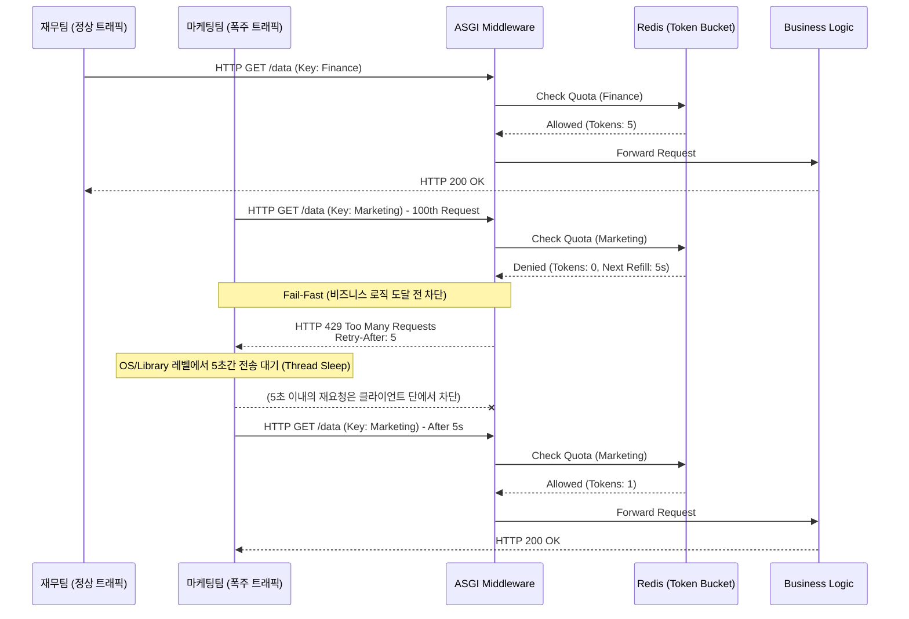

# Noisy Neigbor 차단 로직 구현

질문으로 시작해보자, 멀티 테넌트 아키텍처에서 특정 부서(마케팅팀)가 대규모 배치 작업을 돌려 초당 수천 건의 api를 호출할 때, 서버의 스레드풀과 tcp 커넥션이 고갈되어 다른 부서(재무팀)의 정상적인 요청까지 타임아웃이 발생하는 현상을 어떻게 네트워크 표준 규약으로 방어할 수 있을까?

분산 시스템에서 공유 자원을 특정 테넌트가 독점하여 전체 시스템의 가용성을 떨어트리는 현상을 **Noisy Neighbor(시끄러운 이웃)**문제라고 한다.

이를 네트워크 계층에서 통제하는 핵심은 HTTP 429(too many requests)와 Retry-After를 사용해볼 수 있는것이다.

- **HTTP 429 Too Many Requests (RFC 6585)**: 서버가 클라이언트의 요청 빈도가 허용치를 초과했음을 명시적으로 알리는 상태코드다. 단순히 연결을 끊어버리는 503(Service Unavailable)과 달리, 클라이언트에게 당신의 요청이 많아서 거부되었다 라는 정확한 사유를 전달한다.
- **Retry-After 헤더 (RFC 7231)**: 429 응답과 함께 동반되는 제어 헤더로, 클라이언트가 다음 요청을 재시도하기 전까지 대기해야하는 물리적 시간(초 단위 정수 또는 HTTP-Date 포멧)을 지시한다.
- **Fail-Fast(빠른 실패)**: 백엔드의 무거운 비즈니스 로직이나 데이터베이스 I/O에 도달하기 전에 API 진입점 (Middleware/Gateway)에서 즉시 연결을 종료하여 서버의 컴퓨팅 리소스를 보존하는 아키텍처 패턴이다.

<br>

## 문제 정의

HTTP 표전 제어 헤더 없이 단순히 요청을 무시하거나 일반 에러 (500 등) 처리할 경우, 시스템 레벨에서 치명적인 연쇄 장애가 발생한다

- **TCP Backlog 및 Worker Thread 고갈**: 서버는 동시 처리가능한 연결수에 한계가 되어 있다. 악성 트래픽이 비즈니스 계층까지 깊숙이 들어오면 트랜잭션을 처리하느라 스레드를 점유하게 되고, OS 커널의 TCP Listen Backlog 큐가 가득 차 정상적인 타 부서의 연결 요청(syn)이 drop 된다.
- **Thundering Herd(무리지은 양 떼) 문제**: 429 상태 코드만 반환하고 retry-after 헤더를 누락하면, 클라이언트 애플리케이션의 기본 재시도 로직이 즉각적으로 트래픽을 재전송한다. 차단된 수천개의 요청이 백오프 없이 0.1초 단위로 계속 서버를 두드려 rate limiter 자체에 리소스 과부하를 유발하는 분산 서비스 거부 ddos 상태를 만들게 된다.

### 해결 방식

- **Early Rejection**: 트래픽이 프레임워크 라우터에 도달하기 전, ASGI 미들웨어 계층에서 테넌트 식별 (API Key) 직후 토큰 버킷 상태를 검사한다. 임계치 초과시 본문 (Body) 처리를 생략하고 즉시 429 응답을 반환하여 os 레벨의 file descriptor를 빠르게 해체한다.
- **Cooperative Throttling (협력적 스로틀링)**: Retry After 헤더를 통해 30초후에 다시 시도하라고 명시한다. 이를 통해서 클라이언트 네트워크 라이브러리(axios, requests등) 해당 시간동안 물리적으로 아웃바운드 패킷을 생성하지 않고 대기하도록 강제하며 서버로 향하는 인바운드 트래픽 자체를 소멸시킨다.

<br>

## 상세 동작 원리 및 구조화

특정 테넌트의 한도가 소진되었을 때 api gateway 미들웨어가 트래픽을 어떻게 처리하고 `Retry-After`를 지시하는지 알아보자



1. **정상 트래픽 처리**: 재무팀 요청은 redis 토큰 버킷 조회 결과 allow이므로 정상적인 비즈니스 로직 스레드에 할당되어 처리된다
2. **한도 초과 식별**: 마케팅팀의 폭주 트래픽이 인입되어 미들웨어가 redis에서 거부응답을 받는다. 이때 redis는 토큰이 거절된 사실뿐만아니라 다음 1개의 토큰이 충전되기까지 남은시간도 함께 계산하여 미들웨어에 전달한다.
3. **Fail-Fast 및 헤더 주입**: 미들웨어는 비즈니스 로직 db 쿼리 등으로 라우팅하지 않고 커넥션을 가로챈다 HTTP 상태 코드를 429로 변경하고 응답 헤더에 `Retry-After:5`를 명시하여 클라이언트에게 반환한다. 이 과정은 매우 가벼워 서버의 메인이벤트 루프를 블로킹하지 않는다.
4. **Client Backoff**: 표준을 준수하는 클라이언트 시스템은 이 헤더를 수신하면 자체 스케줄러를 통해 5초간 해당 api로 패킷 생성을 중지하고 이로써 서버의 네트워크 소켓 큐가 보호된다.

<br>

## 429, Retry-After 헤더 반환 구조

redis 연동 없이, 특정 부서의 요청 횟수를 메모리에서 카운트하여 초과시 명시적으로 제어 헤더를 주입하는 가장 직관적인 형태의 엔드포인트 방어로직이다.

```py
from fastapi import FastAPI, Request, HTTPException
from fastapi.responses import JSONResponse

app = FastAPI()

# 원리 이해용 인메모리 카운터 및 제한 설정
tenant_usage = {"marketing": 150}
LIMIT = 100
RETRY_WAIT_SECONDS = 30

@app.get("/api/v1/resource")
async def get_resource(request: Request):
    # 실제로는 미들웨어에서 추출된 request.state.tenant_id를 사용합니다.
    tenant_id = "marketing" 
    
    if tenant_usage[tenant_id] > LIMIT:
        # HTTP 429 예외를 발생시키고, headers 딕셔너리에 Retry-After 주입
        raise HTTPException(
            status_code=429,
            detail="Rate limit exceeded. Please slow down.",
            headers={"Retry-After": str(RETRY_WAIT_SECONDS)}
        )
        
    return {"message": "Success"}
```

token 버킷 기반 동적 retry-after 계산 미들웨어도 알아보자

이전 글에서의 token bucket lua스크립트와 결합해 단순히 하드코딩된 대기 시간이 아닌 실제 다음 1개의 토큰 버킷이 충전되기까지 남은 정확힌 ms를 계산하여 Retry-After 헤더로 반환하는 로직을 보자

```py
import time
import math
from fastapi import FastAPI, Request
from fastapi.responses import JSONResponse
from starlette.middleware.base import BaseHTTPMiddleware

app = FastAPI()

# 가상의 Rate Limiter 클래스 (내부적으로 Redis Lua 스크립트 호출)
class RedisRateLimiter:
    async def is_allowed(self, tenant_id: str):
        # Redis 검증 후 반환되는 결과값 시뮬레이션
        # 실무에서는 Lua 스크립트가 토큰이 없을 경우 남은 시간(time_to_next_token)을 계산하여 반환하도록 작성됩니다.
        refill_rate = 5  # 초당 5개 충전 (1개당 0.2초 소요)
        
        # [시나리오] 마케팅팀 버킷이 완전히 비어있다고 가정
        if tenant_id == "marketing_team":
            # 1개 토큰이 차는 데 필요한 초(seconds) 계산 (올림 처리)
            # 수식: 1 / refill_rate
            time_until_valid = math.ceil(1 / refill_rate) 
            return {"allowed": False, "retry_after": time_until_valid}
            
        return {"allowed": True, "retry_after": 0}

limiter = RedisRateLimiter()

class RateLimitMiddleware(BaseHTTPMiddleware):
    async def dispatch(self, request: Request, call_next):
        # 1. 헤더 검증 미들웨어 등을 통해 식별된 테넌트 ID 획득
        # (예제를 위해 하드코딩, 실제로는 request.state 등에서 조회)
        tenant_id = request.headers.get("X-Tenant-ID", "unknown")
        
        # 2. Redis 기반 토큰 검증 수행
        limit_result = await limiter.is_allowed(tenant_id)
        
        # 3. 토큰이 고갈된 경우 (Noisy Neighbor 차단)
        if not limit_result["allowed"]:
            retry_after_seconds = limit_result["retry_after"]
            
            # [핵심] JSONResponse를 직접 생성하여 비즈니스 로직 개입 없이 Fail-Fast 처리
            return JSONResponse(
                status_code=429,
                content={
                    "error": "Too Many Requests",
                    "detail": f"Tenant '{tenant_id}' quota exceeded.",
                    "wait_seconds": retry_after_seconds
                },
                headers={
                    # HTTP 표준 제어 헤더 주입 (문자열 타입의 초 단위 정수)
                    "Retry-After": str(retry_after_seconds),
                    # 필요에 따라 커스텀 헤더 추가
                    "X-RateLimit-Reset": str(int(time.time()) + retry_after_seconds)
                }
            )
            
        # 4. 검증을 통과한 정상 트래픽만 라우터로 포워딩
        return await call_next(request)

app.add_middleware(RateLimitMiddleware)

@app.get("/data")
async def fetch_data():
    return {"data": "This is protected data"}
```