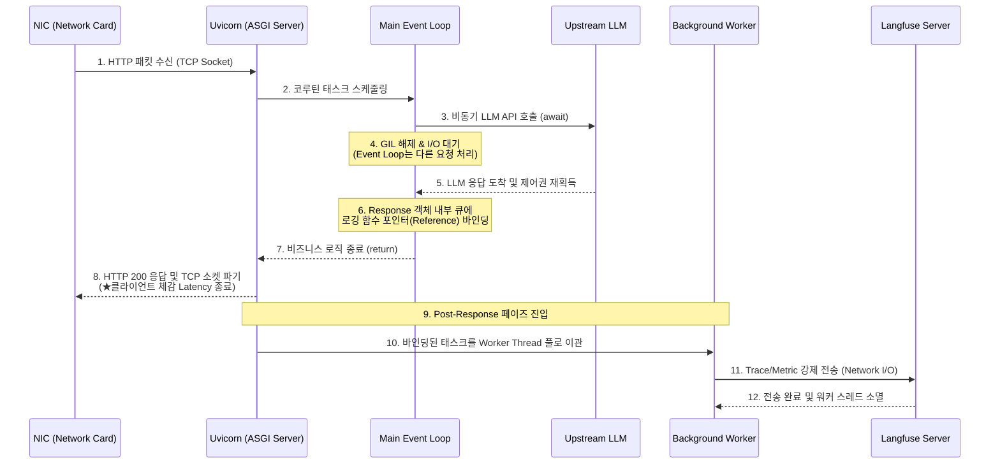

# 지연 없이 프롬프트 토큰 사용량을 로깅하는 관측성 파이프라인

LLM 응답 텍스트 생성이 완료되었음에도, 상욜야 데이터를 외부 로깅 서버로 전송하는 네트워크 대기시간까지 클라이언트가 감수해야될까?

LLM 애플리케이션의 응답 속도와 최적화 모니터링 무결성을 동시에 달성하기 위해 프레임워크 수준의 비동기 큐와 전문 관측성 도구를 결합해 문제를 해결해볼 수 있다.

- **Langfuse SDK (Observability Platform)**: 애플리케이션에서 발생하는 LLM의 입출력 프롬프트, 소요시간, 사용된 토큰 지표를 하나의 궤적(Trace)으로 묶어 중앙 서버로 수집하고 시각화 해주는 LLMOps 전용 관측성 도구다
- **FastAPI BackgroundTasks**: 별도의 무거운 메시지 브로커를 인프라 구축 없이 fastapi 기반이 되는 starlette 프레임워크 내부에서 동작하는 경량 작업큐다
- **Fire-and-Forget 패턴**: 메인 프로세스가 작업을 워커에 던져놓고(Fire) 그 작업의 성공 여부나 종료를 기다리자 않은채 forget 곧바로 클라이언트와 tcp 소켓을 닫아버리는 비동기 아키텍처 패턴이다.

<br>

## 문제 정의

관측성(로깅) 로직을 메인 비즈니스 로직과 강하게 결합 (tight coupling)할 경우 치명적인 성능 및 가용성 문제가 발생한다.

- **동기식 io 병목에 의한 latency 증폭**: 파이썬 환경에서 Langfuse API로 데이터를 쏘는 작업은 외부 HTTP 요청이므로 필연적으로 수십~수백 ms의 io 블로킹을 유발한다. 이를 메인 흐름에 두면, 클라이언트는 LLM 추론이 끝났음에도 로그 전송이 완료될때까지 소켓 대기 (TTFB 지연)을 겪어야한다.
- **SPOF 전이**: Langfuse 클라우드 서버가 일시적으로 다운되거나 네트워크 타임아웃이 발생할 경우 예외와 지연이 메인 서버 HTTP 응답 스레드에 그대로 전파되어 핵심 비즈니스 자체가 실패하는 연쇄 장애를 유발하게 된다.

### 해결 방식

- **라이프사이클 물리적 격리:** HTTP 응답 라이프사이클과 로깅 파이프라인 사이클을 프레임워크 레벨에서 찢어낸다. 메인 앤드포인트는 외부 LLM으로 부터 답변을 받는 즉시 클라이언트에게 HTTP 200 응답을 쏴서 통신을 종료한다.
- **Response 바인딩 큐 활용**: 메인 로직이 끝날때 BackgroundTasks 객체를 통해 프롬프트와 토큰 데이터 객체를 넘겨주면, 프레임워크는 이 함수 포인터들을 응답 객체에 바인딩해 두었다가 연결이 파기된 직후 백그라운드에서 조용히 실행시킨다.

<br>

## 상세 동작 원리 및 구조화

event loop 및 스레드 레벨 분석을 해보겠다

다이어그램 없이, 클라이언트 패킷 수신부터 백그라운드 로깅 완료까지 os 및 프레임워크 내부에서 일어나는 극도로 상세한 동작 메커니즘이다.




1. **HTTP Request 수신 및 Event loop 할당:** 클라이언트의 패킷이 서버의 NIC에 도달하면 ASGI 서버인 Uvicorn이 TCP 소켓에서 데이터를 읽어 HTTP 파싱을 수행한다. 이후 파싱된 데이터를 기반으로 메인 이벤트루프에 코루틴 태스크를 스케줄링하여 컨트롤러에 띄운다.
2. **메인 비즈니스 로직 io 제어권 반환:** 컨트롤러가 외부 LLM API를 await으로 호출한다. 이때 파이썬의 GIL(Global Interpreter Lock)이 해제되고 이벤트 루프는 응답을 기다리는 동안 블로킹되지 않고 다른 사용자의 트래픽을 처리하러 이동한다. LLM 응답이 도착하면 다시 제어권을 획득하여 돌아온다.
3. **BlockingTasks 객체 메모리 적재:** LLM 응답 텍스트와 토큰 정보가 취합된 직후, 컨트롤러 코드 내에서 `background_tasks.add_task(로깅함수, 인자)`가 호출된다. 주의할점은 이 시점에서 로깅 함수가 실행되는 것이 절대 아니라는 것이다. Starlette 프레임워크는 단순히 반환될 Response 객체 내부의 비공개 리스트 메모리에 해당 함수 포인터와 인자들을 큐잉해둘 뿐이다.
4. **소켓 연결 종료 (Early Return 및 Latency 확정)**: 비즈니스 로직이 return문을 만나 종료되면 uvicorn은 준비된 json payload와 http 200 코드를 클라이언트와 연결된 파일 디스크립터 소켓에 쓰고, 즉시 tcp 커넥션을 논리적으로 종료(`FIN` or Keep-Alive 대기 상태 전환)한다. 이 시점에서 클라이언트가 체감하는 대기시간은 종료된다
5. **Post-Response Scheduling**: 클라이언트와 응답처리가 완전히 끝난 직후, Starlette의 응답 미들웨어 계층이 파기되기 전에 마지막으로 Response 객체에 바인딩된 태스크 리스트가 있는지 확인한다. 적재된 작업이 있다면 파이썬의 anyio 또는 asyncio 워커 스레드풀로 해당 태스크들을 던져 순차적으로 실행시킨다.
6. **로깅 IO및 백그라운드 소멸**: 워커 스레드에서 Langfuse로 HTTPS POST 요청을 보내는 Network IO가 발생한다. 여기서 타임아웃이나 예외가 발생하더라도 메인 이벤트 루프나 이미 응답을 받은 클라이언트에게는 어떠한 영향도 미치지 못한다. 전송이 완료되면 해당 백그라운드 스레드 컨텍스트는 메모리에서 조용히 소멸한다.

### Examples

Langfuse 연동 전에 클라이언트와 http 응답 라이프사이클 바깥에서 로깅 코드가 완전히 독립적으로 실행되는 것을 구현하는 코드다.

```py
from fastapi import FastAPI, BackgroundTasks
import time
import logging

app = FastAPI()
logger = logging.getLogger("uvicorn")

# 클라이언트 응답과 무관하게 백그라운드에서 동작할 딜레이 함수
def simulate_heavy_logging(prompt: str, response: str):
    logger.info(f"백그라운드 워커 진입: {prompt}")
    # 무거운 Network I/O 대기시간(3초)을 강제 모사
    # 이 3초 동안 클라이언트는 이미 응답을 받고 떠난 상태임
    time.sleep(3) 
    logger.info("백그라운드 워커 소멸: 로그 저장 완료")

@app.post("/v1/simple_chat")
async def simple_chat_endpoint(prompt: str, background_tasks: BackgroundTasks):
    # 1. 메인 비즈니스 로직 (즉시 완료된다고 가정)
    fake_llm_response = f"'{prompt}' 텍스트 생성 완료"
    
    # 2. 백그라운드 태스크 메모리 큐에 함수 포인터와 인자 적재
    background_tasks.add_task(
        simulate_heavy_logging, 
        prompt=prompt, 
        response=fake_llm_response
    )
    
    # 3. 로깅 대기 없이 클라이언트 소켓에 즉시 반환 및 연결 파기
    return {"status": "success", "data": fake_llm_response}
```

이번에는 프롬프트, 소요시간, 메타데이터, 토큰 사용량 지표를 Langfuse의 `Trace`, `Generation` 객체로 구조화하고 백그라운드 스레드에서 안전하게  flush하는 코드 예제를 보자

```py
import time
from fastapi import FastAPI, BackgroundTasks
from langfuse import Langfuse
from pydantic import BaseModel

app = FastAPI()

# 1. Langfuse SDK 클라이언트 초기화
# 내부적으로 HTTP 연결 풀링을 사용하며 비동기/멀티스레드 환경에서 Thread-safe 보장
langfuse = Langfuse(
    public_key="pk-lf-...",
    secret_key="sk-lf-...",
    host="https://cloud.langfuse.com"
)

class ChatRequest(BaseModel):
    user_id: str
    prompt: str

# 2. 백그라운드 스레드에서 실행될 실제 Langfuse 로깅 파이프라인
def async_langfuse_logger(user_id: str, prompt: str, completion: str, metrics: dict, latency_ms: int):
    try:
        # A. 단일 실행 흐름을 묶는 최상위 Trace 객체 생성
        trace = langfuse.trace(
            name="chat_generation_pipeline",
            user_id=user_id,
            metadata={"latency_ms": latency_ms}
        )
        
        # B. Trace 내부에 구체적인 LLM 호출 내역(Span/Generation) 및 토큰 매핑
        trace.generation(
            name="openai-gpt-4o-call",
            model="gpt-4o",
            input=prompt,
            output=completion,
            usage=metrics # 예: {"prompt_tokens": 15, "completion_tokens": 10, "total_tokens": 25}
        )
        
        # C. [핵심] 메모리 버퍼에 쌓인 이벤트를 네트워크를 통해 Langfuse 서버로 강제 전송
        # 이 과정에서 발생하는 I/O 딜레이는 메인 서버 성능에 영향을 주지 않음
        langfuse.flush()
    except Exception as e:
        # 로깅 서버 장애가 메인 서비스 장애로 역전파되지 않도록 예외 차단
        print(f"[Observability Error] Langfuse 로깅 실패 (Non-fatal): {e}")

@app.post("/v1/production_chat")
async def production_chat_endpoint(request: ChatRequest, bg_tasks: BackgroundTasks):
    start_time = time.time()
    
    # 3. 외부 LLM 호출 모사 (실제 환경에서는 vLLM 등 await I/O 호출 수행)
    mock_llm_output = "안녕하세요, 무엇을 도와드릴까요?"
    mock_token_usage = {
        "prompt_tokens": 15, 
        "completion_tokens": 10, 
        "total_tokens": 25
    }
    
    # 추론 소요 시간 밀리초 단위 계산
    duration_ms = int((time.time() - start_time) * 1000)

    # 4. BackgroundTasks에 로깅 함수와 추출된 메트릭 데이터를 바인딩
    bg_tasks.add_task(
        async_langfuse_logger,
        user_id=request.user_id,
        prompt=request.prompt,
        completion=mock_llm_output,
        metrics=mock_token_usage,
        latency_ms=duration_ms
    )

    # 5. 로깅 전송 완료를 기다리지 않고 HTTP 200 즉시 반환 (Fail-fast 패턴 응용)
    return {
        "response": mock_llm_output,
        "usage": mock_token_usage
    }
```

<br>

## Additional

### Starlette 이란

FastAPI의 심장이자 물리 엔진이다.

우리가 FastAPI라고 부르는 프레임워크는 사실 그 자체로 바닥부터 모든 웹 기능을 다 만든것이 아니다.

Starlette 라는 극도로 빠르고 가벼운 비동기 (ASGI) 웹 툴킷 위에 data 검증 (Pydantic) 그리고 문서화 (OpenAPI) 스펙을 붙여놓은 껍데에 가깝다.

- **역할**: Request - Response를 보내는 행위, 라우팅, 미들웨어 처리, 웹소켓 연동, 그리고 BackgroundTasks 메커니즘 자체 구현하고 실행하는 주체. 이것이 Starlette

### GIL (Global Interpreter Lock)

파이썬 인터프리터의 초대형 단일 자물쇠다

GIL은 CPython(가장 표준적인 파이썬 구현체)이 한 번에 단 하나의 스레드만 파이썬 바이트코드를 실행할 수 있도록 강제하는 상호 배제 락 mutex 이다.

병목이 되는 이유는 멀티 코어의 이점을 무력화 시키기 때문이다

- cpu 코어가 8개인 서버에서 스레드를 8개를 만들어 무거운 수학 연산 혹은 cpu bound한 작업을 돌린다고 가정해보겠다.
- C, Java면 8개의 코어가 동시에 일을 하겠지만, 파이썬은 GIL 이라는 자물쇠가 1개밖에 없다.
- 결국 8개의 스레드가 이 자물쇠를 서로 쥐기 위해서 번갈아가며 context switching이 실행되므로 사실상 실글 코어로 동작하는 것과 같은 시간이 걸리며 오버헤드 때문에 더 느려지기도한다.

단 네트워크 통신이나 db 쿼리처럼 외부 응답을 갖는 io bound 작업을 할때는 파이썬이 스스로 GIL을 내려놓고 대기하므로 async나 멀티스레딩의 이점을 정상적으로 누릴 수 있다.

그런데도 왜 파이썬은 GIL을 버리지 못했는가?

GIL은 단순히 레거시의 산물이 아니라 파이썬 생태계를 지탱해온 강력한 무기인건데

1. **메모리 관리의 완벽한 안정성 GC 보장**
   1. 파이썬은 변수가 몇 번 참조되었는지 세는 레퍼런스 카운팅 기법으로 메모리를 관리한다.
   2. 만약 GIL이 없으면 여러 스레드가 동시에 변수의 카운트를 조작하는 숫자가 꼬여 race condition이 되고 사용중인 메모리가 날아가거나 메모리 누수가 발생한다. GIL은 이를 원천 차단한다.
2. **단일 스레드에서 고도의 성능**
   1. 메모리 충돌을 막기 위해 수만개의 변수에 일일이 작은 fine-grainded lock을 채우고 푸는 과정은 컴퓨터에게 오버헤드를 준다
   2. 파이썬은 그냥 방 전체 하나에 자물쇠 하나만 건느낌이라 덕분에 단일 스레드로 동작할때는 락을 관리하는 연산비용이 거의없아 빠르다.
3. **C 확장 생태계의 폭발적 성장 견인**
   1. 이게 핵심인데 numpy, pandas, tensorflow, pytorch 같은 핵심 라이브러리들은 내부적으로 c cpp로 짜져있다
   2. c로 짠 모듈들은 파이썬에 붙일때 GIL이라는 커다란 방패가 스레드 안정성을 보호해주기때문에 개발자들이 복잡한 동시성 처리 없이 쉽게 파이썬용 라이브러리를 만들수있고 파이썬이 ai와 데이터 사이언스의 표준이 된 것은 역설적으로 GIL 덕분이라 볼 수 있다.