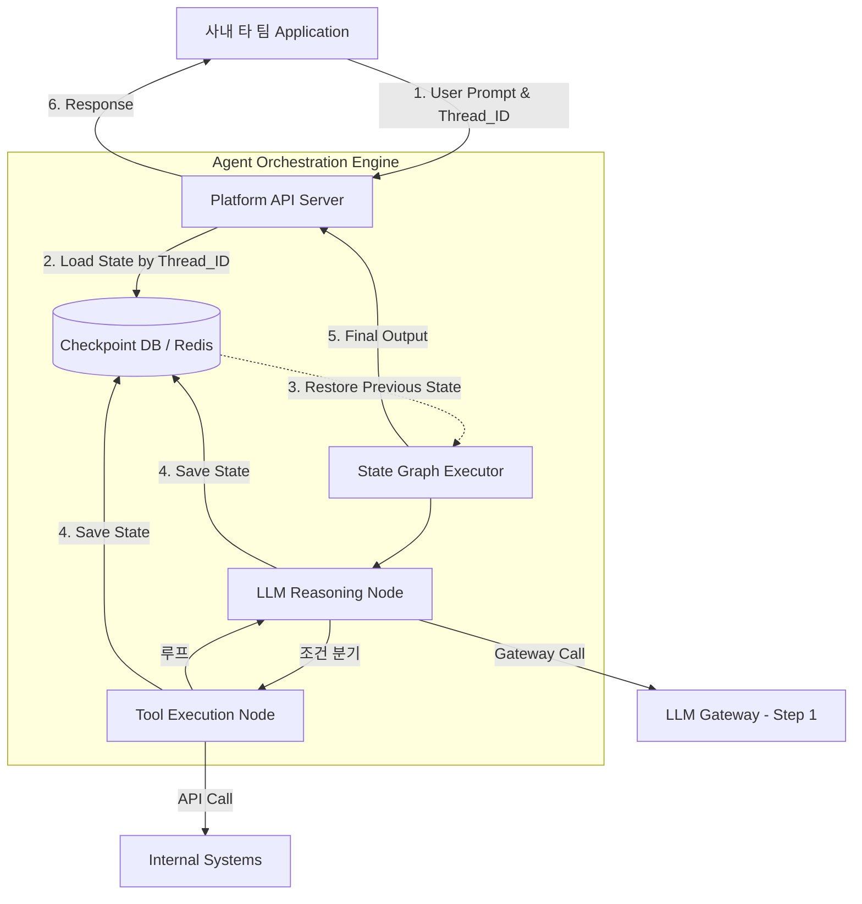

# RAG 및 Agent 서빙 파이프라인

데이터 사이언티스트가 Jupyter Notebook 환경에서 검증을 마친 복잡한 Agent 로직을, 수천명의 동시 요청을 처리하는 프로덕션 API 서버로 전환하려면 어떻게 해야할까?

실험 환경의 코드는 단일 스레드에서 메모리를 점유하며 동기적으로 실행되지만, 프로덕션 서버는 언제든 스케일아웃이나 재시작이 발생할 수 있는 stateless 환경이다.

도구를 호출하고 LLM의 응답을 기다리는데 수 초 이상 걸리는 Agent의 장기실행 프로세스를, 서버의 휘발성 메모리에 의존하지 않고 끝까지 안정적으로 서빙하려면 어떤 기반이 필요할까?

위 질문을 해결하기 위해 도입하는 아키텍처가 **State Machine 기반의 Agent 오케스트레이션 플랫폼이다.**

코드의 절차적 실행을 넘어, Agent의 작업 흐름을 이벤트와 상태 집합으로 분리하여 데이터베이스에 기록하고 추적하는 서빙 방법론이다.

- **State Graph**: Agent의 실행 로직을 방향성 비순환 그래프 DAG 형태의 노드와 간선으로 정의하는 선언적 구조
- **Checkpointing**: Agent가 하나의 노드(ex. tools calling) 작업을 마칠 대마다 현재까지의 모든 컨텍스트(프롬프트 이력, 내부 변수)를 redis, postgresql 같은 외부 저장소에 스냅샷 형태로 저장하는 기술
- **Long-running Workflow**: http request-response의 짧은 생명주기를 벗어나, 수 분에서 수 시간에 걸쳐 외부 api를 호출하거나 사람의 승인을 기다려야하는 비동기 작업 흐름

<br>

## 문제 정의

**데이터 사이언티스트의 로컬 실험 코드와 stateless 기반 프로덕션 백엔드 환경이 구조적으로 단절되어 있어 배포시 마다 로직을 재구현(추론 다시 시작)하는 불일치 문제가 생겼고 일반적인 동기 웹서버에서는 여러 도구를 연속적으로 호출하는 Agent의 복잡한 프로세스를 추적하거나 장애 발생시 복구할 수없는 한계가 존재했다.**

ex. 모델 엔지니어가 파이썬 스크립트로 완성한 복잡한 RAG 프롬프트 체인을 백엔드 개발자가 서버 코드로 포팅하는 과정에서 미세한 로직 누락이 발생해 검색 품질이 달라지거나 Agent가 사내 외부 api 응답을 10초간 기다리던 도중 쿠버네티스 파드 스케일링의 이유로 재시작되면 메모리가 진행중이던 agent의 작업 컨텍스트를 증발시켜 사용자에게 500 반환하고 첨부터 다시 시작해야하는 문제다.

### Solving

- **그래프 기반의 선언적 워크플로우 분리**: Agent의 로직을 while 루프같은 절차적 코드 내부에 하드코딩하지 않는다 대신에, retrieve node, generate node, execute node를 분리하고 각 노드간의 이동 조건을 그래프 형태로 선언하여 플랫폼에 등록한다. 이를 통해 실험 환경의 그래프 정의를 프로덕션 엔진에 그대로 배포하여 동작시킬 수 있다.
- **외부 저장소를 활용한 상태 영속화 (Persistence)**: 서버 메모리에 의존하던 Agent의 컨텍스트(대화 이력, 중간 연산 결과)를 제거한다. 그래프상의 각 노드 실행이 완료될 때마다 전체 상태 state를 redis에 직렬화하여 저장 checkpointing 한다. 서버 인스턴스가 다운되더라도 새로운 인스턴스가 클라이언트 thread id를 조회하여 redis에서 중단된 지점의 상태를 불러와 작업을 정확히 재개한다.

<br>

## 동작 원리 및 구조화

프로덕션 환경에서 무상태 api 서버가 checkpoint db를 활용해 agent 그래프를 서빙하는 논리적 데이터 플로우를 보자



1. **초기화 및 복구**: 클라이언트가 요청과 함께 고유의 `Thread_ID`를 전송하면 api 서버는 Checkpoint DB에서 해당 스레드의 이전 상태를 로드한다.
2. **그래프 순회 (Traversal)**: `State Graph Executor`가 현재 상태를 바탕으로 다음 실행할 노드 LLM, 추론을 결정하고 실행한다.
3. **Checkpointing**: 노드 실행이 끝나고 다음 노드로 넘어가기 직전 변경된 상태 페이로드를 db에 즉시 덮어쓴다. 이 시점에 서버가 다운되어도 안전하다.
4. **종료**: 종료 노드에 도달하면 최종 생성된 텍스트를 클라이언트에게 반환한다.


```json
{
  "thread_id": "usr-session-9912",
  "checkpoint_id": "cp-step-004",
  "data": {
    "messages": [
      {"role": "user", "content": "내 최근 주문 내역 알려줘."},
      {"role": "assistant", "content": null, "tool_calls": [{"id": "call_1", "name": "get_orders", "args": {"user_id": "A101"}}]},
      {"role": "tool", "tool_call_id": "call_1", "content": "[{'id': 'ORD-01', 'item': '의자'}]"}
    ],
    "values": {
      "user_status": "VIP",
      "last_retrieved_orders": ["ORD-01"]
    }
  },
  "metadata": {
    "current_node": "order_retrieval_node",
    "parent_checkpoint_id": "cp-step-003",
    "timestamp": "2026-04-22T14:50:00Z"
  }
}
```

위와같이 redis나 db에 저장되는 직렬화된 형태의 state checkpoint 데이터 구조다.

이 데이터로 서버가 완전히 꺼졌다 켜져도 해당 지점부터 다시 추론을 시작할 수 있다.

### Example

절차적 코드가 아닌 state 스키마를 정의후 각 작업을 노드에 등록한뒤 연결하여 실행 가능한 그래프로 묶어내는 핵심 로직을 보자 langgraph 프레임워크 개념을 차용한거다

```py
from typing import TypedDict, List
import json

# 1. 그래프 전체를 관통하는 상태(State) 데이터 스키마 정의
class AgentState(TypedDict):
    messages: List[str]      # 대화 이력 누적
    next_step: str           # 다음 실행할 노드 지정
    tool_result: str         # 도구 실행 결과 저장소

# 2. 개별 노드(작업 단위) 함수 정의
def llm_reasoning_node(state: AgentState) -> AgentState:
    """LLM을 호출하여 판단을 내리는 노드"""
    print("[Node: LLM] 이력과 도구 결과를 바탕으로 추론 중...")
    # 가정: LLM이 텍스트 생성을 완료했거나, 도구 호출이 필요하다고 판단함
    state["messages"].append("LLM: 고객 데이터 조회가 필요합니다.")
    state["next_step"] = "tool_node" # 다음 이동 경로 지정
    return state

def tool_execution_node(state: AgentState) -> AgentState:
    """실제 사내 API를 실행하는 노드"""
    print("[Node: Tool] 데이터베이스 접근 및 API 실행 중...")
    state["tool_result"] = "{'status': 'VIP', 'discount': 0.1}"
    state["next_step"] = "llm_node" # 도구 실행 후 다시 LLM으로 반환
    return state

# 3. 그래프 엔진 시뮬레이션 (Orchestrator)
def run_agent_graph(initial_state: AgentState, max_steps: int = 5):
    """정의된 노드들을 상태 기반으로 순회하며 실행합니다."""
    current_state = initial_state
    
    for _ in range(max_steps):
        # 현재 상태를 DB에 저장하는 Checkpointing 위치
        save_to_db("thread_123", current_state) 
        
        current_step = current_state.get("next_step")
        if current_step == "llm_node":
            current_state = llm_reasoning_node(current_state)
        elif current_step == "tool_node":
            current_state = tool_execution_node(current_state)
        elif current_step == "end":
            break
            
    return current_state

def save_to_db(thread_id, state):
    # 실제로는 Redis 등에 JSON 직렬화하여 저장
    pass
```

플랫폼팀이 fast api 웹서버 내에서 db와 통신하여 agent 그래프를 안전하게 제어하는 백엔드 라우터 구조다.

클라이언트의 네트워크 단절이나 서버 크래시가 발생하더라도 작업 이력이 안전하게 보장된다.

```py
from fastapi import FastAPI, BackgroundTasks
from pydantic import BaseModel
import redis

app = FastAPI()
redis_client = redis.Redis(host='platform-redis', port=6379, db=0)

class AgentRequest(BaseModel):
    thread_id: str      # 사용자 또는 세션을 식별하는 고유 ID
    user_input: str     # 새로운 프롬프트

def load_checkpoint(thread_id: str) -> dict:
    """Redis에서 그래프의 이전 상태를 복구합니다."""
    data = redis_client.get(f"agent_state:{thread_id}")
    if data:
        return json.loads(data)
    # 초기 상태 반환
    return {"messages": [], "next_step": "llm_node", "tool_result": ""}

def save_checkpoint(thread_id: str, state: dict):
    """그래프의 현재 상태를 Redis에 덮어씁니다."""
    redis_client.set(f"agent_state:{thread_id}", json.dumps(state))

@app.post("/api/v1/agent/invoke")
def invoke_agent_workflow(request: AgentRequest):
    """
    무상태(Stateless) API 엔드포인트. 
    메모리가 아닌 DB에서 컨텍스트를 가져와 Agent 작업을 재개합니다.
    """
    
    # 1. 상태 복구 (이전 대화 내역 및 중단된 노드 정보 로드)
    current_state = load_checkpoint(request.thread_id)
    
    # 2. 새로운 사용자 입력 반영
    current_state["messages"].append(f"User: {request.user_input}")
    
    # 3. 플랫폼 그래프 엔진 구동 (예시 1의 run_agent_graph 형태)
    # 내부적으로 각 노드를 통과할 때마다 save_checkpoint가 호출되도록 설계됨
    try:
        final_state = run_agent_graph(current_state)
        
        # 4. 최종 결과 반환 직전 상태 저장
        save_checkpoint(request.thread_id, final_state)
        
        return {
            "thread_id": request.thread_id,
            "response": final_state["messages"][-1]
        }
        
    except Exception as e:
        # 5. 서버 다운이나 장애 발생 시, DB에 기록된 마지막 체크포인트까지만 안전하게 보존됨
        return {"error": f"Agent 프로세스 중단: {str(e)}"}
```