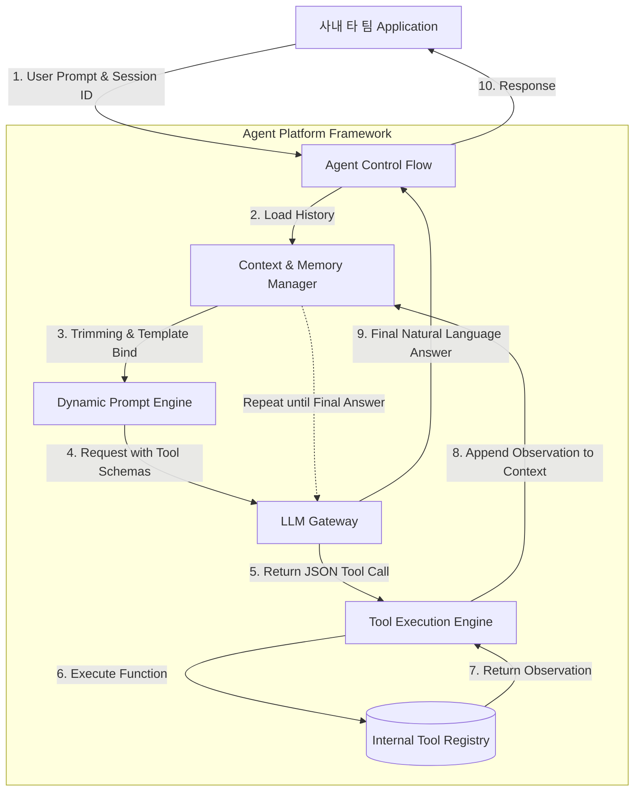

# AI Agent 도구화(Tooling) 및 동적 프롬프트·컨텍스트 관리 플랫폼

LLM은 기본적으로 과거에 학습된 가중치 weight 덩어리일 뿐이므로 현재 데이터베이스의 고객정보를 조회하거나, 이메일을 발송하는등의 물리적인 Action을 직접 수행할 능력이 없다.

또한 여러 팀이 각기 다른 목적의 Agent를 만들 때 대화 이력을 단순히 누적하여 하드코딩하게 되면, 컨텍스트 윈도우 한계를 초과하여 서버가 다운되거나 api 비용이 폭증한다.

그렇다면 플랫폼에서 어떻게 LLM에게 사내 시스템 접근 권한(도구)을 표준화된 방식으로 부여하고, 폭발적으로 늘어나는 대화의 맥락을 효율적으로 관리하도록 기반을 제공해줘야할까?

위 질문ㅇ르 해결하기 위해 구축하는 것이 **Agentic Workflow 플랫폼이다.**

LLM의 추론 능력과 사내 시스템의 실행 능력을 결합하고 state, memory를 플랫폼 레벨에서 중앙 통제하는 아키텍처다.

- **AI Agent**: 단순한 텍스트 생성기를 넘어 주어진 목표를 달성하기 위해 스스로 계획을 세우고, 외부 도구(Tools)를 사용하여 환경과 상호작용하며 문제를 해결하는 자율형 시스템
- **Tool Use (Function Calling)**: LLM이 직접 코드를 실행할 수 없는 구조적 한계를 극복하는 표준 통신 규약, LLM에게 사전에 사용 가능한 함수들의 명세 signature/json schema를 주입하면 LLM이 자연어 분석을 통해 어떤 함수를, 어떤 파라미터를 넣어 실행해야 하는지, JSON 형태로 반환하고 백엔드 서버 플랫폼이 이를 대신 실행하여 그 결과값을 다시 LLM에게 넘겨준다.
- **ReAct(Reasoning and Acting) 페러다임**: Agent가 작업을 수행하는 논리적 사이클로 [현재 상태 분석 thought -> 사용할 도구를 결정 action -> 도구의 실행 결과를 관찰 observation] 하는 과정을 정답이 나올때까지 loop 하도록 강제하는 프롬프팅 엔지니어링 기법이다.
- **Context Window Optimization**: LLM이 한 번에 처리할 수 있는 최대 토큰 수 (8k, 128k) 제한 내에서, 템플릿 엔진을 통해 프롬프트를 동적으로 졸입하고, 과거 대화 이력의 토큰 수를 계산하여 중요도가 낮은 순서대로 잘라내거나(Trimming/Sliding Window) 요약하여 주입하는 메모리 관리 기술


<br>

## 문제 정의

**LLM 자체는 실시간 데이터 접근 능력이 없어 환각 현상이 발생하는 문제가 존재했고, 각 제품팀이 프롬프트 템플릿과 대화 이력을 개별 애플리케이션 레벨에서 하드코딩해 관리함에 따라 토큰 최적화가 불가능해져 비용 폭증 및 응답시간 초과가 발생하는 한계가 있었다. 예를들면 이런 문제다**

ex) 사내 CS 챗봇 팀이 **오늘 고객 환불 내역 조회해줘**라는 요청을 처리하기 위해 시스템 프롬프트에 환불 api 호출 로직을 텍스트로 억지로 끼워넣었다가 LLM 포맷이 틀려 에러가 발생하거나, 수십 번의 이전 대화 이력을 아무런 정제없이 그대로 LLM 서버에 전송하여 한 번의 API 호출에 수천원의 토큰 비용이 낭비되고 결국 `max_tokens` 에러로 서비스가 뻗어버리는 문제다.

### 문제 해결 방식

- **표준화된 Tool Registry 및 규약 제공**: 플랫폼 팀은 사내의 다양한 백엔드 api(환불 조회, 재고 확인등)를 JSON Schema 형태의 표준 명세로 변환하여 중앙 저장소에 등록한다. 개별 제품팀은 코드 구현 없이 필요한 도구의 ID만 선택하여 Agent 인스턴스에 주입할 수 있다. 플랫폼 프레임워크가 LLM 응답을 파싱하고 실제 함수를 호출하는 Control Flow를 전담한다.
- **동적 템플릿 엔진 및 메모리 파이프라인 구축**: `Jinja2`와 같은 템플릿 엔진을 도입해, 실행 시점에 사용자의 세션 정보, 권한, 현재 날짜 등 프롬프트 변수로 동적 바인딩한다. 동시에 플랫폼은 요청이 LLM Gateway로 넘어가기 전, 전체 페이로드의 토큰 수를 사전 계산 Tiktoken등을 사용하여 임계치를 초과시 가장 오래된 메시지부터 queue에서 자동 제공하는 token text splitter를 적용한다.

<br>
 
## 상세 동작 원리 및 구조화

플랫폼이 제공하는 Agent 프레임워크 내부에서 Tool Calling과 Context 관리가 이루어지는 ReAct 루프 구조다.



1. **초기화**: 사용자의 요청과 세션 ID가 들어오면 `Context Manager`가 저장소에서 과거 대화 이력을 불러오고, 설정된 한계점 (ex. 4000 tokens)에 맞춰 이력을 자른다.
2. **명세 주입**: 시스템 프롬프트와 함께 사용할 수 있는 도구들의 명세서 schema를 LLM Gateway로 전송한다.
3. **ReAct Loop 실행**: LLM이 텍스트가 아닌 함수 호출 지시를 반환하면 tool execution engine이 사내 api를 실제 실행한다. 그 결과 Observation를 다시 Context에 추가하고 LLM에 다시 보낸다.
4. **종료**: LLM이 더 이상 도구가 필요없다고 판단하고 최종 텍스트 답변을 생성하면 클라이언트에게 반환한다.

### Example

LLM에게 사내 api의 존재와 사용법을 가르쳐주기 위해 플랫폼이 정의하는 표준 json 스키마 규격이다.

자연어로된 description이 가장 핵심적인 역할을 하며 LLM은 이 설명을 읽고 언제 이 도구를 써야할지 추론한다.

```py
# 플랫폼 팀이 정의한 '고객 주문 조회' 도구의 JSON Schema 명세
# LLM은 이 명세를 읽고 파라미터 타입에 맞는 JSON을 생성하여 반환하게 됩니다.

get_order_status_tool_schema = {
    "type": "function",
    "function": {
        "name": "get_order_status",
        "description": "고객의 현재 주문 배송 상태를 데이터베이스에서 조회합니다. 사용자가 주문 번호를 언급할 때만 사용하세요.",
        "parameters": {
            "type": "object",
            "properties": {
                "order_id": {
                    "type": "string",
                    "description": "조회할 주문 번호 (예: ORD-12345)"
                },
                "user_id": {
                    "type": "string",
                    "description": "요청한 고객의 시스템 ID"
                }
            },
            "required": ["order_id", "user_id"]
        }
    }
}
```

사내 개발자들이 복잡한 프롬프트 문자열을 덧붙이기 연산이나 토큰 계산을 직접 하지 않도록 플랫폼 코어에서 제공하는 context manager 클래스도 봐보자. 동적 프롬프트 엔진 및 토큰 트리밍을 해준다.

```py
import tiktoken
from typing import List, Dict
from jinja2 import Template

class PlatformContextManager:
    """
    LLM의 Context Window 한계를 방어하고 프롬프트를 동적으로 바인딩하는 플랫폼 클래스
    """
    def __init__(self, model_name: str = "gpt-4", max_tokens: int = 4000):
        # 1. 모델별 토크나이저(인코더) 초기화
        self.tokenizer = tiktoken.encoding_for_model(model_name)
        self.max_tokens = max_tokens
        
        # 2. 동적 시스템 프롬프트 템플릿 (Jinja2 문법)
        self.system_template = Template(
            "You are an AI assistant for the {{ department }} team.\n"
            "Today's date is {{ current_date }}.\n"
            "You have access to internal tools."
        )

    def _count_tokens(self, text: str) -> int:
        """문자열의 실제 토큰 수를 정확히 계산합니다."""
        return len(self.tokenizer.encode(text))

    def build_context(
        self, 
        department: str, 
        current_date: str, 
        chat_history: List[Dict[str, str]], 
        new_user_message: str
    ) -> List[Dict[str, str]]:
        """
        변수를 바인딩하고, 토큰 제한을 넘지 않도록 과거 이력을 안전하게 잘라내어 최종 페이로드를 생성합니다.
        """
        
        # 1. 시스템 프롬프트 렌더링 및 토큰 계산
        system_content = self.system_template.render(
            department=department, current_date=current_date
        )
        final_messages = [{"role": "system", "content": system_content}]
        current_tokens = self._count_tokens(system_content) + self._count_tokens(new_user_message)
        
        # 2. 과거 이력 슬라이딩 윈도우 (최신 메시지부터 역순으로 추가하며 제한 검사)
        safe_history = []
        for message in reversed(chat_history):
            msg_tokens = self._count_tokens(message["content"])
            if current_tokens + msg_tokens > self.max_tokens:
                break # 토큰 제한 초과 시 과거 이력은 버림 (Trimming)
            
            safe_history.insert(0, message)
            current_tokens += msg_tokens
            
        # 3. 최종 조립
        final_messages.extend(safe_history)
        final_messages.append({"role": "user", "content": new_user_message})
        
        return final_messages

# --- 사내 애플리케이션 적용 예시 ---
# context_mgr = PlatformContextManager(max_tokens=3000)
# safe_payload = context_mgr.build_context(
#     department="CS",
#     current_date="2026-04-22",
#     chat_history=[{"role": "user", "content": "어제 주문한 건..."}], # 긴 과거 데이터 배열
#     new_user_message="배송 상태 조회해줘."
# )
# 
# # 개발자는 토큰 OOM 걱정 없이 safe_payload를 LLM Gateway로 전송하면 됨
```