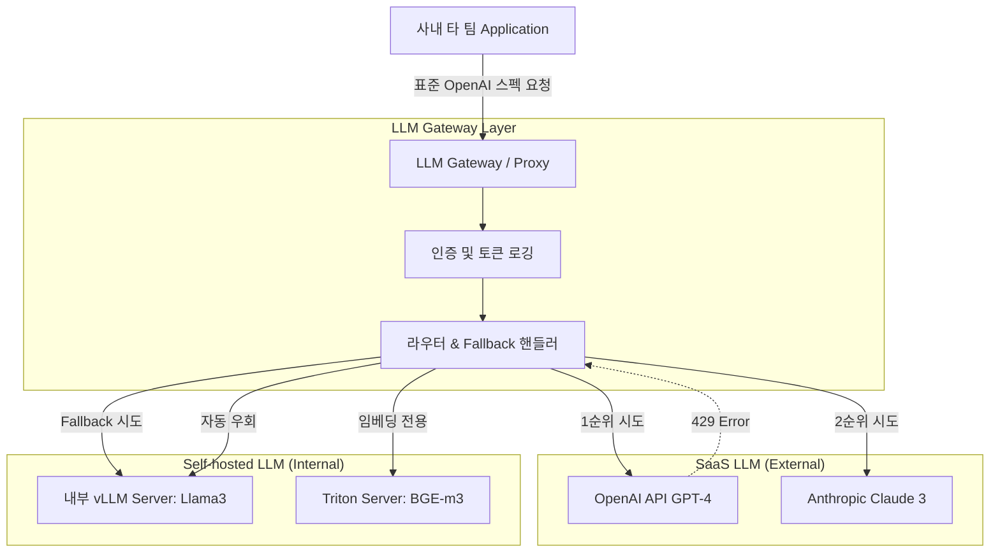

# LLM Gateway와 다중 모델(SaaS & Self-hosted) 통합 라우팅

A팀은 OpenAI API를 사용하고, B팀은 보안을 위해 내부망에 띄운 vLLM(Llama3)를 쓴다고 하자.

두 팀이 각각 api 호출 코드를 별도로 구현하고 유지보수하고 있다.

만약 OpenAI 서버에 장애가 발생했을 때, 클라이언트 코드 수정 없이 즉각 내부 vLLM 서버로 트래픽을 우회시키고 전체 조직의 토큰 사용량을 중앙에서 통제하려면 시스템을 어떻게 설계해야할까

위 문제를 해결하기 위해 도입하는 기술이 **LLM Gateway(AI Proxy)** 이다.

**클라이언트와 여러 LLM(SaaS or Self Hosted) 사이에 위치해 api 스펙을 표준화하고 로드밸런싱, 장애 조치 fallback, token monitoring 중앙집중화하는 미들웨어 아키텍처다.**

<br>

## 문제 정의

다양한 LLM 프로바이더 (OpenAI, Anthropic, 오픈소스 마다) API 스펙과 인증 방식이 파편화되어 있어 타 팀이 플랫폼을 도입할 때마다 개별 연동 코드를 짜야하는 중복 구현 문제가 존재한다.

특정 외부 모델이 장애나 rate limit이 발생했을 때 다른 모델로 즉각적인 우회가 불가능한 시스템적 한계가 존재했다. 예를들어

프로덕션 서비스 중인 Agent가 OpenAI GPT-4 API를 호출하다 HTTP 429 too many requests를 받게 된다면 내부적으로 띄워둔 자체 vLLM 서버로 요청을 즉시 넘기지 못해 서비스 전체가 멈추고 에러를 반환하는 문제다.

### 문제 해결 방식

- **단일 표준 API 스펙 제공**: 플랫폼 팀은 사내 개발자들에게 오직 OpenAI Compatible API 스펙 하나만 제공한다. 사내 개발자는 백엔드에 어떤 LLM이 있는지 알 필요 없이 Gateway로 요청을 보낸다. Gateway가 내부적으로 요청을 각 프로바이더의 스펙에 맞게 tranlation해서 전달한다.
- **동적 라우팅 및 fallback**: gateway 레벨에서 라우팅 룰을 설정한다. 주 모델 호출시 실패하거나 타임아웃이 발생하면, 미리 정의된 보조 모델로 요청을 retry하는 파이프라인을 구축하여 가용성을 보장한다.


<br>

## 상세 동작 원리 및 구조화

LLM Gateway가 SaaS API의 사내 호스팅 모델을 통합하여 처리하는 데이터 플로우다.



1. **요청수신**: 사내 클라이언트는 게이트웨이 서버로 모델명 `model=gpt-4`과 프롬프트를 전송한다.
2. **라우팅 룰 평가**: Gateway는 해당 모델에 매핑된 실제 엔드포인트를 찾는다.
3. **요청 변환 및 전달**: 대상이 Antropic 이라면 OpenAI 포맷을 Anthropic 포맷으로 변환하여 요청한다. 대상이 내부 vLLM 이라면 그대로 전달한다. vLLM은 OpenAI 스펙을 기본 지원한다.
4. **장애 감지 및 우회**: 1순위 타겟에서 4xx/5xx 에러가 반환되면, gateway는 클라이언트에게 에러를 내리지 않고 내부 설정에 따라 2순위 타겟으로 프롬프트를 다시 보낸다.

### Example

Gateway가 에러를 감지하고 다른 모델로 요청을 우회시키는 원리를 구현한 로직을 보자.

실무에서는 LiteLLM 같은 검증된 프록시 라이브러리를 사용한다.


```py
import openai
import anthropic
import time

def gateway_routing_with_fallback(prompt: str):
    """
    1순위: OpenAI GPT-4 호출 시도
    2순위: 실패 시 내부 호스팅 vLLM 서버로 Fallback
    """

    try:
        print("1순위 open api 시도")
        client = openai.OpenAI(api_key="sk...")
        response client.chat.completions.create(
            model="gpt-4",
            messages=[{"role": "user", "content: prompt"}],
            timeout=5
        )
        return response.choices[0].message.content
    except Exception as e:
        print(f"openai api failed {e}. vLLM Fallback")
    
    try:
        print("2순위: 사내 vLLM 서버 시도 중...")
        vllm_client = openai.OpenAI(
            base_url="http://internal-vllm-server:8000/v1",
            api_key="EMPTY" # 내부망은 인증 생략
        )
        response = vllm_client.chat.completions.create(
            model="meta-llama/Llama-3-8B-Instruct",
            messages=[{"role": "user", "content": prompt}]
        )
        return response.choices[0].message.content

    except Exception as e:
        return f"모든 LLM 서버 응답 불가: {e}"

# print(gateway_routing_with_fallback("안녕하세요."))
```

LiteLLM 프록시 환경 설정 

직접 라우팅 코드를 짜지는 않고, `LiteLLM`과 같은 전문 Gateway 프레임워크를 컨테이너로 띄워 사용한다.

사내 팀들에게 플랫폼 형태로 제공하기 위한 라우팅 및 Fallback 설정 파일 구조다.

```yaml
# litellm_config.yaml
# LLM 플랫폼 팀이 중앙에서 관리하는 Gateway 설정 파일

model_list:
  # 1. SaaS LLM 설정
  - model_name: platform-gpt
    litellm_params:
      model: gpt-4
      api_key: os.environ/OPENAI_API_KEY
      
  # 2. 내부 호스팅 LLM 설정 (vLLM)
  - model_name: platform-local
    litellm_params:
      model: openai/meta-llama/Llama-3-8B-Instruct
      api_base: http://internal-vllm-server:8000/v1
      api_key: EMPTY

# 라우터 로드밸런싱 및 Fallback 룰 정의
router_settings:
  fallback_dict:
    # 사내 클라이언트가 "platform-gpt"를 호출했다가 장애가 나면,
    # 플랫폼 코어에서 알아서 "platform-local"(vLLM)로 우회시킴
    platform-gpt: ["platform-local"]
```

이러한 LLM Gateway가 구축되면 사내 다른 팀들은 단순히 `http://사내-gateway-주소:4000` 으로 open api 규격의 요청만 보내면 된다. 모델 연동, 로드 밸런싱, 에러처리는 플랫폼팀이 통제한다.