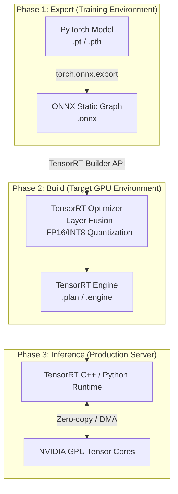

# 모델 경량화 및 추론 지연 시간 최적화 파이프라인

python 생태계 pytorch, tensorflow에서 학습이 완료된 딥러닝 모델을 그대로 프로덕션 API 서버에 올리면, 왜 GPU 연산 능력을 최대한 발휘하지 못하고 병목 현상이 발생할까?

모델 아키텍처는 동일하지만 유지하면서 프레임워크 종속성을 제거하고 타겟 하드웨어 NVIDIA GPU의 처리 속도를 극대화하려면 추론 파이프라인 설계를 어떻게 해야할까?

위에서 정의한 문제를 해결하기 위해 도입하는 파이프라인이 **ONNX 변환 및 TensorRT 엔진 빌드**다.

모델의 가중치와 연산 구조를 표준 포멧 onnx로 추출한 뒤, 이를 특정 gpu 아키텍처에 맞게 커널 레벨에서 최적화(TensorRT)하여 실행 속도를 비약적으로 단축하는 엔지니어링 기법이다.

<br>

## 문제 정의

즉, pytorch 같은 프레임워크의 동적 계산 그래프 (Dynamic Graph) 처리 및 PythonGIL(Global Interpreter Lock)의 오버헤드로 인해 gpu 실제 연산 시간보다 cpu의 메모리 할당 및 스케줄링 시간이 더 오래 걸리는 문제가 존재했고, 대용량 트래픽 상황에서 추론 지연시간 latency가 급증하니 서비스 가용성이 저하되는 한계가 존재했던 것,

예를 들면 이런 문제다. "초당 수백건의 임베딩 요청이 들어올때 모델의 순수 행렬곱 연산은 5ms면 완료되는데 파이썬 객체 생성 프레임워크 내부의 불필요한 안전검사가 개입되면서 실제 클라이언트가 체감하는 최종 api 응답시간은 100ms이상으로 늘어나요"

### 해결 방식 동작 원리

이 파이프라인은 두 단계의 변환 과정을 거친다

1. **프레임워크 독립적인 표준 포맷 변환 pytorch -> onnx**
   - pytorch 모델에 더미 텐서를 통과시켜 모든 실행 흐름을 tracing 한다.
   - 이를 통해 python 런타임이 필요없는 정적 연산 그래프 (static graph) 형태인 onnx 포맷으로 구조와 가중치를 직렬화한다.
2. **하드웨어 종속적인 커널 최적화 onnx -> tensorRT**
   - **Layer Fusion (수직/수평 융합)**: 여러 개의 독립적인 레이어 (Convolution, Batch Norm, ReLU)를 하나의 CUDA 커널 연산으로 병합해 gpu 메모리 io 읽기 쓰기 횟수를 줄인다.
   - **Precision Calibration(정밀도 보정)**: 연산 속도와 VRAM 사용량을 줄이기 위해, 가중치의 데이터 타입을 FP32에서 FP16으로 INT8로 낮춘다. (양자화)
   - **Kernel Auto-Tuning**: 현재 빌드가 수행되는 정확한 gpu 모델(ex. A100, T4)의 아키텍처에 가장 최적화된 실행 경로 execution path를 선택하여 바이너리 엔진 .engine / .plan 파일을 생성한다.

> **kernel auto-tuning 보충 설명을 좀 하면**    
> 텐서 알티는 엔진을 빌드할때 동일한 행렬곱 연산이라도 수십가지의 서로 다른 CUDA 커널 알고리즘을 실제 장착한 GPU에 일일이 구동해보고 초당 처리 속도를 직접 측정한다.
>
> A100과 T4는 내부 캐시 메모리나 텐서 코어의 물리적 구조가 완전히 다르기 때문에, 이 프로파일링 과정을 통해서 현재 하드웨어 환경에서 병목 없이 가장 빠르게 동작하는 커널만 선별하여 조립하는 것이다.
>
> 이러한 하드웨어 밀착형 튜닝 방식때문에 완성된 .engine 바이너리 파일은 다른 종류의 gpu 서버로 복사해서 재사용할 수 없으니 반드시 실제 서비스가 구동될 타겟 장비에서 새로 빌드해야한다.
>
> 여기서 조립한다라는 의미는 ai모델은 수십 수백개의 수학공식 레이어들이 순서대로 연결된 파이프라인이고 그런데 독같은 곱셈과 덧셈을 하더라도 계산하는 방법 알고리즘은 수십가지라 지급 꽂혀있는 gpu에서 어떤 공식으로 어떤 순서로 해야 빠른지를 판단하고 최적화된 방식들만 선택해 하나의 덩어리로 연결하는 과정. 그것을 조립한다고 한다. A100 gpu에서 빠른게 T4에선 느릴수있기때문에. gpu에 따라 연산을 다르게 유연하게 동작하도록 하는것이 목표.




코드 예시로 pytorch 모델을 onnx로 변환하는 로직을 보자

동적으로 동작하는 파이토치 모델을 입력 크기가 고정된 또는 가변적인 정적 그래프로 추적하여 저장하는 스크립트다.

```py
import torch
import torchvision.models as models

def export_to_onnx():
    # 1. 학습된 PyTorch 모델 로드 및 평가 모드 전환
    model = models.resnet50(pretrained=True)
    model.eval()

    # 2. 모델 연산 흐름을 추적하기 위한 더미 입력 데이터 생성 (Batch, Channel, Height, Width)
    dummy_input = torch.randn(1, 3, 224, 224, device='cpu')

    # 3. ONNX 포맷으로 Export
    # 주의: 배치 사이즈 등 동적으로 변해야 하는 차원은 dynamic_axes로 명시해야 합니다.
    torch.onnx.export(
        model, 
        dummy_input, 
        "resnet50.onnx",               # 저장할 파일명
        export_params=True,            # 가중치 포함 여부
        opset_version=13,              # ONNX 오퍼레이션 셋 버전
        do_constant_folding=True,      # 상수 폴딩 최적화 활성화
        input_names=['input'],         # 그래프 입력 노드 이름
        output_names=['output'],       # 그래프 출력 노드 이름
        dynamic_axes={                 # 배치 사이즈를 동적(가변)으로 설정
            'input': {0: 'batch_size'},    
            'output': {0: 'batch_size'}
        }
    )
    print("ONNX 변환 완료: resnet50.onnx")

# export_to_onnx()
```

실제 서빙할 장비 gpu 위에서 onnx 파일을 읽어들여 FP16 정밀도가 적용된 TensorRT 엔진 바이너리 파일로 빌드하는 스크립트도 보자. 

이 작업은 하드웨어 종속적이라 반드시 배포할 서버의 gpu 인프라와 동일한 환경에서 수행해야한다.

```py
import tensorrt as trt

# TensorRT 로거 초기화
TRT_LOGGER = trt.Logger(trt.Logger.WARNING)

def build_tensorrt_engine(onnx_file_path, engine_file_path):
    """ONNX 파일을 읽어 FP16 최적화가 적용된 TensorRT Engine으로 빌드합니다."""
    
    # 1. Builder 및 Network 초기화 (명시적 배치 사이즈 허용)
    builder = trt.Builder(TRT_LOGGER)
    network = builder.create_network(1 << int(trt.NetworkDefinitionCreationFlag.EXPLICIT_BATCH))
    config = builder.create_builder_config()
    
    # 2. 작업 공간(Workspace) 메모리 할당 및 정밀도 설정
    config.set_memory_pool_limit(trt.MemoryPoolType.WORKSPACE, 2 * (1 << 30)) # 2GB
    
    # 해당 GPU가 FP16(반정밀도) 연산을 지원한다면 활성화
    if builder.platform_has_fast_fp16:
        config.set_flag(trt.BuilderFlag.FP16)
        print("FP16 최적화 모드 활성화됨")

    # 3. ONNX 파서를 통해 모델 구조 파싱
    parser = trt.OnnxParser(network, TRT_LOGGER)
    with open(onnx_file_path, 'rb') as model:
        if not parser.parse(model.read()):
            print("ONNX 파싱 실패:")
            for error in range(parser.num_errors):
                print(parser.get_error(error))
            return None

    # 4. 동적 배치를 사용하는 경우 최적화 프로필(Optimization Profile) 설정 필수
    profile = builder.create_optimization_profile()
    # 파라미터: (입력명, 최소 차원, 최적 차원, 최대 차원)
    profile.set_shape("input", (1, 3, 224, 224), (8, 3, 224, 224), (32, 3, 224, 224))
    config.add_optimization_profile(profile)

    # 5. 직렬화된 엔진 바이너리 빌드 (이 과정에서 GPU 커널 튜닝이 일어나므로 수 분 소요됨)
    print("TensorRT 엔진 빌드 중... (시간이 소요됩니다)")
    serialized_engine = builder.build_serialized_network(network, config)

    # 6. 파일로 저장
    with open(engine_file_path, "wb") as f:
        f.write(serialized_engine)
    print(f"TensorRT 엔진 저장 완료: {engine_file_path}")

# build_tensorrt_engine("resnet50.onnx", "resnet50_fp16.engine")
```