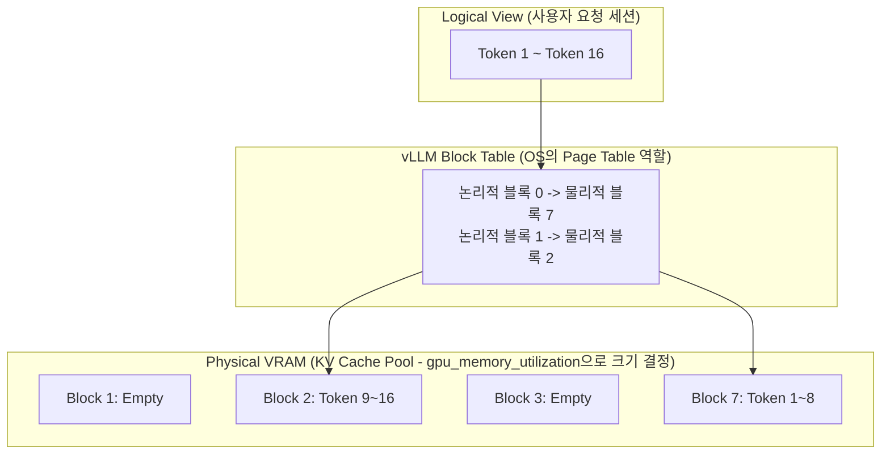
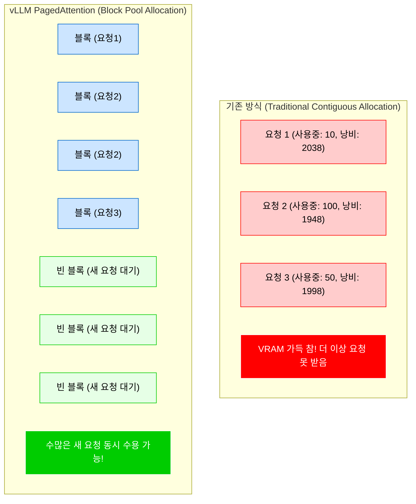

# vLLM 엔진 PagedAttention 기반 메모리 최적화 테스트

질문으로 시작해보자, LLM은 다음 단어를 예측하기 위해 이전에 등작했던 모든 단어들을 연산상태 KV Cache를 기억하고 있어야한다. 그런데 사용자가 질문을 던졌을때 LLM이 최종적으로 몇 글자의 답변을 생성할지 미리 알 수 있는가? 알 수 없다면 서버는 이 불확실한 길이의 데이터를 저장하기 위해 GPU VRAM을 얼마나 할당해두어야하는가?

이 메모리의 할당 딜레마를 운영체제 os의 가상 메모리 페이징 기법을 차용해 해결한 혁신적인 아키텍처가 vLLM의 **PageAttention**이다.

- **KV Cache**는 Key Value Cache로 LLM이 텍스트를 생성할 때, 앞서 계산한 토큰들의 Attention 벡터 값 key value를 매번 재계산하지 않기 위해 VRAM에 캐싱해두는 기법이다. LLM 서빙시 VRAM을 가장 많이 잡아 먹는 주범이다.
- **PagedAttention**은 운영체제가 물리 메모리를 일정한 크기의 페이지로 쪼개어 관리하듯 VRAM의 KV Cache를 고정된 크기의 블록 예 16 토큰 단위로 쪼갠다. 연속적인 메모리 공간이 필요없어져 메모리 파편화를 극적으로 줄인다.
- **gpu_memory_utilization**: vLLM 서버가 켜질 때, 전체 gpu vram중 얼마만큼의 비율(ex. 0.9)을 KV Cache 풀로 미리 점유할 것인지를 결정하는 파라미터다.
- **max_num_batched_tokens**: 한 번의 gpu 연산 (Forward pass) 단계에서 프롬프트 토큰과 생성 토큰을 모두 합쳐 최대 몇 개의 토큰을 동시에 처리할 것인지를 제현하는 파라미터다.

<br>

## 문제 정의

기존의 LLM 서빙 엔진(huggingface등)이 응답 길이가 얼마나 될지 모르기 때문에 무조건 모델이 허용하는 최대 길이 토큰 만큼 VRAM을 연속된 덩어리로 미리 할당해버리는 내부 파편화 문제가 존재했다.

예를 들면, 실제로 10토큰 짜리 짧은 단답형 응답을 생성하고 끝났는데, VRAM에서는 2048토큰만큼 방대한 공간이 예약되어 묶여있으니 다른 사용자의 요청을 받지 못하고 이로 인해 gpu의 연산 코어는 놀고있는데 vram이 꽉차서 oom 동시 접속자를 10명도 받지 못하는 치명적인 병목 현상인 것이다.

### 해결 방식

- **사전 블록 풀 할당**: 프로세스를 띄울때 `gpu_memory_utilization` 설정을 통해 모델 가중치를 차지하고 남은 VRAM의 대부분을 미리 거대한 블록 단위의 kv cache pool로 선점한다. 운영체제가 부팅시 메모리를 페이징 테이블로 관리하는 것과 동일하다. (여기서 풀 할당과 답변마다 kv cache 대한 매핑은 다르다.)
- **동적 블록 매핑 및 스루풋 제어**: 답변이 생성될 때마다 필요한 만큼만 물리적 블록을 동적으로 ㅁ 매핑하는 동시에 `max_num_batched_tokens`를 적절히 조절하여, 한 번의 연산 주기에 너무 많은 토큰이 들어와 KV Cache 풀이 순간적으로 고갈되거나 GPU 연산 한계를 초과하지 않도록 트래픽을 제어한다.

<br>

## 상세 동작 원리 및 구조화

운영체제의 페이지 테이블 처럼 논리적인 토큰 순서가 파편화된 물리적 VRAM 블록들에 매핑되는 PagedAttention 구조다.



가장 직관적으로 두 파라미터가 어떻게 적용되는지 예시를 보여주자면

```py
from vllm import LLM, SamplingParams

# 1. PagedAttention 엔진 초기화 및 파라미터 제어
llm = LLM(
    model="meta-llama/Llama-3-8B",
    # [핵심 파라미터 1] gpu_memory_utilization
    # 전체 VRAM의 80%만 vLLM이 사용하도록 제한. 
    # (나머지 20%는 다른 프로세스나 OS가 사용하도록 여유를 둠)
    gpu_memory_utilization=0.80, 
    
    # [핵심 파라미터 2] max_num_batched_tokens
    # 한 번의 GPU 틱(Tick)에서 처리할 최대 토큰 수. 
    # 너무 크면 연산 OOM이 발생하고, 너무 작으면 처리량(Throughput)이 떨어짐.
    max_num_batched_tokens=4096,
    
    # [옵션] KV Cache 블록 사이즈 (기본값 16). 
    # OS의 Page Size를 4KB로 할지 8KB로 할지 정하는 것과 같음.
    block_size=16 
)

# 2. 샘플링 파라미터 설정 및 추론 실행
prompts = ["리눅스 커널의 mmap() 동작 원리를 설명해줘.", "JVM의 G1GC에 대해 알려줘."]
sampling_params = SamplingParams(temperature=0.7, max_tokens=200)

# 내부적으로 PagedAttention을 통해 메모리 낭비 없이 2개의 프롬프트를 동시 처리
outputs = llm.generate(prompts, sampling_params)

for output in outputs:
    print(f"Prompt: {output.prompt!r}, Generated: {output.outputs[0].text!r}")
```

이런 식이고 FastAPI 서빙 환경에서 비동기 vLLM 엔진 구동을 더 보면 실제 프로덕션 환경에서 들어오는 무작위 트래픽을 처리하기 위해 `AsyncLLMEngine`에 최적화 파라미터를 주입해 구성할 수 있다.

```py
from fastapi import FastAPI
from vllm.engine.arg_utils import AsyncEngineArgs
from vllm.engine.async_llm_engine import AsyncLLMEngine
from vllm.sampling_params import SamplingParams
import uuid

app = FastAPI()

# 1. 실무용 비동기 엔진 파라미터 셋업
# 배포할 장비의 VRAM 스펙(예: A100 80GB)에 맞춰 튜닝된 값 주입
engine_args = AsyncEngineArgs(
    model="meta-llama/Llama-3-8B",
    # 프로덕션 전용 GPU라면 0.90 ~ 0.95로 최대화하여 KV Cache 풀을 극한으로 확보
    gpu_memory_utilization=0.90,
    
    # GPU 코어 성능이 높다면 이 값을 올려 한 번에 더 많은 토큰을 병렬 연산(Throughput 증대)
    max_num_batched_tokens=8192,
    
    # Tensor Parallelism을 쓴다면 (GPU 여러 대를 묶어 쓸 때)
    tensor_parallel_size=1
)

# 2. 엔진 빌드 (서버 기동 시 VRAM의 90%를 KV Cache용으로 Pre-allocation 함)
engine = AsyncLLMEngine.from_engine_args(engine_args)

# 3. 비동기 엔드포인트 구현
@app.post("/generate")
async def generate_endpoint(prompt: str):
    request_id = str(uuid.uuid4()) # 요청별 고유 ID
    sampling_params = SamplingParams(temperature=0.1, max_tokens=512)
    
    # vLLM 엔진이 내부적으로 요청을 큐잉(Queueing)하고, 
    # PagedAttention을 통해 블록을 할당해가며 비동기 스트리밍 반환
    results_generator = engine.generate(prompt, sampling_params, request_id)
    
    final_output = None
    async for request_output in results_generator:
        # 스트리밍 처리 (여기서는 간소화를 위해 최종 결과만 반환)
        final_output = request_output
        
    return {"text": final_output.outputs[0].text}
```

여기서 근데 gpu memory utilization으로 할당한거랑 기존에 2096 할당한거랑 어쨋든 메모리먹는건 같지않나? 저장된곳이 다른가? 라는 의문이 들 수 있다.

메모리 할당 페이지 메커니즘하고 비슷한데 결론부터 말하면 서버가 켜질때 VRAM 공간을 물리적으로 점유해두는 것은 동일하지만, 미리 확보된 그 메모리 공간을 **개별 사용자가 요청을 어떻게 나눠주느냐**에서 근본적인 차이가 발생한다.

핵심은 내부 파편화의 해결이다.

1. 기존 방식은 LLM이 최종적으로 몇 글자의 답변을 생성할지 서버 입장에선 알수없기때문에 요청마다 무조건 모델의 최대값만큼 VRAM을 연속적인 덩어리로 할당한다. 요청단위인것.
2. vLLM방식은 pagedAttention 방식으로 `gpu_memory_utilization` 설정은 이 서버의 전체 vram중 90%를 16토큰 단위의 아주 작은 블록 수만개로 잘라 쪼개서 거대한 공용창고를 만들어놓기때문에 요청이 들어오면 무식하게 주지않고 요청 각각마다의 메모리 점유율이 낮아지고 oom 가능성도 낮아진다. 효율적으로 쓸수있다는것.

미리 많은 공간을 할당한다는 점을 희생하고 효율적으로 처리한다는 이점을 얻은것이다.

100GB의 VRAM이 있다고 가정했을 때, 두 방식의 내부 메모리 적재 상태를 보면 



요약하면 서버 구동시 gpu 메모리를 90퍼 차지하고 시작한다는 물리적 현상은 같지만

기존 방식 그대로 그 거대한 공간을 단 10~20명이 요청을 듬성듬성 차지한채 낭비하는 것을 해결한것이다.

그리고 그 공간을 작은 블록으로 쪼개어 빈틈없이 꽉꽉 채워넣기 때문에 **수백명의 요청을 동시에 병렬로 처리 할 수 있게 된것이다.** 메모리 먹는양은 같아도 소화해내는 처리량이 수십배 차이가 난다.