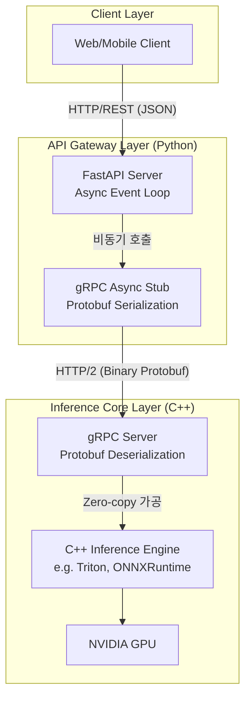

# 코어 추론 엔진과 통신하는 고성능 비동기 API 레이어 구현

딥러닝 모델 개발은 파이썬이 편하지만, 파이썬으로 짠 api 서버에서 무거운 이미지 텐서 연산을 직접 처리하면 어떻게 될까?

파이썬 특유의 한계 때문에 아무리 비동기로 처리를 해도 전체 서버가 멈칫 거리는 현상이 발생한다.

그렇다면 사용자 요청을 받는 api 서버와 수학 계산을하는 엔진을 분리하고 이 둘을 가장 빠른 통신망으로 연결하는게 보통일것이다.

이 구조를 구현하기 위해 일단 FastAPI와 grpc 그리고 C++기반 추론 엔진등이 있다고 쳤을때 이걸 결합하는 msa를 설계하자.

<br>

## 문제 정의

기존의 파이썬 단일 서버 Flask + pytorch로 ai 서비스를 운영한다고 했을때 두 가지의 치명적인 병목 현상이 있다.

- **Python GIL(Global Interpreter Lock) 한계**: 파이썬은 한 번에 하나의 스레드만 파이썬 바이트코드를 실행할 수 있어 무거운 모델 추론이 파이썬 메모리 공간안에서 돌기 시작하면, 다른 사용자의 가벼운 api 요청조차 처리하지 못하고 블로킹 되는 현상이 발생한다.
- **REST/JSON 직렬화 오버헤드:** 이미지나 대규모 임베딩 벡터 (1024차원의 float 배열 등)를 REST API를 통해 JSON 텍스트로 변환해 주고받을때 데이터 크기가 수 배로 뻥튀기 되고 텍스트를 파싱하는데 막대한 cpu 자원과 시간이 낭비된다.

### 해결 방식

- **Decoupling**: api 게이트웨이 역할은 비동기 io 처리에 특화된 python fastapi가 담당한다. 실제 무거운 gpu 텐서 연산은 c++로 작성된 trition inference server 전용 컨테이너로 넘긴다.
- **gRPC, protobuf**: FastAPI와 C++ 엔진 사이의 통신은 무거운 JSON REST API 대신 gRPC를 사용한다. 데이터를 텍스트가 아닌 압축된 이진 포맷으로 직렬화하여 네트워크 전송 크기를 획기적으로 줄이고 파싱 속도를 극대화하는 것이다.

<br>

## 상세 동작 원리 및 구조화

클라이언트의 HTTP JSON 요청을 FastAPI가 받아, 이진 데이터인 protobuf로 변환해 C++ 추론엔진과 gRPC로 통신하는 흐름을 구조화했다.



### Example

통신의 규약이 되는 인터페이스 설계도를 보자. 이 파일이 컴파일되어 python용 클라이언트 코드와 C++ 용 서버 코드를 동시에 찍어낸다.

```proto
syntax = "proto3";

package inference;

// 추론을 담당할 서비스 정의
service InferenceService {
  // 클라이언트가 요청을 보내면 결과를 반환하는 RPC 메서드
  rpc ModelInfer (InferRequest) returns (InferResponse) {}
}

// 요청 데이터 구조 (다차원 텐서 데이터를 이진 배열로 받음)
message InferRequest {
  string model_name = 1;
  message Tensor {
    string name = 1;
    repeated int64 shape = 2; // 예: [1, 3, 224, 224]
    bytes tensor_content = 3; // 실제 이미지/벡터 데이터를 Raw Binary로 전송
  }
  repeated Tensor inputs = 2;
}

// 응답 데이터 구조
message InferResponse {
  string model_name = 1;
  message Tensor {
    string name = 1;
    repeated int64 shape = 2;
    bytes tensor_content = 3;
  }
  repeated Tensor outputs = 2;
}
```

FastAPI 애플리케이션 내에서 grpc.aio를 사용해 cpp 서버로 넌블러킹 추론 요청을 보내는 로직도 보자

```py
import grpc
from fastapi import FastAPI, UploadFile
import numpy as np

# proto 컴파일러가 자동 생성한 파이썬 모듈 (위 5번 코드 기반)
import inference_pb2
import inference_pb2_grpc

app = FastAPI()

# 타겟 C++ 추론 엔진 주소
TRITON_GRPC_URL = "triton-server:8001"

@app.post("/predict")
async def predict_image(file: UploadFile):
    # 1. 클라이언트로부터 받은 이미지 바이트를 Numpy 배열로 변환 (전처리)
    image_bytes = await file.read()
    # (예시용 더미 변환 - 실제로는 cv2.imdecode 등 사용)
    input_array = np.zeros((1, 3, 224, 224), dtype=np.float32) 
    
    # 2. Numpy 배열을 Protobuf 이진 포맷으로 직렬화 (메모리 덤프)
    raw_binary_data = input_array.tobytes()

    # 3. gRPC 요청 객체 조립
    request = inference_pb2.InferRequest(
        model_name="resnet50_cpp",
        inputs=[
            inference_pb2.InferRequest.Tensor(
                name="input_tensor",
                shape=[1, 3, 224, 224],
                tensor_content=raw_binary_data
            )
        ]
    )

    # 4. 비동기 gRPC 채널 생성 및 요청 전송 (이 동안 FastAPI 스레드는 다른 유저 요청 처리)
    async with grpc.aio.insecure_channel(TRITON_GRPC_URL) as channel:
        stub = inference_pb2_grpc.InferenceServiceStub(channel)
        
        # C++ 서버로 연산 요청
        response = await stub.ModelInfer(request)

    # 5. 응답받은 이진 데이터를 다시 Numpy 배열로 역직렬화
    output_array = np.frombuffer(
        response.outputs[0].tensor_content, dtype=np.float32
    ).reshape(response.outputs[0].shape)

    return {"predictions": output_array.tolist()}
```

위 코드에서 가장 큰 문제가 있는데, **API 요청이 들어올때마다 gRPC 커넥션을 새로 맺고 끊는다는점이 존재한다.**

이는 막대한 지연을 유발하고 커넥션 풀링과 타임아웃 ,에러 핸들링등을 해주는것이 좋다.

```py
import grpc
from fastapi import FastAPI, HTTPException, status
from contextlib import asynccontextmanager
import inference_pb2
import inference_pb2_grpc
import logging

logger = logging.getLogger(__name__)

# 전역 gRPC 채널 및 스텁 (싱글톤)
grpc_channel: grpc.aio.Channel = None
grpc_stub: inference_pb2_grpc.InferenceServiceStub = None

# --- 1. Lifespan을 활용한 gRPC 채널 재사용 (Connection Pooling 역할) ---
@asynccontextmanager
async def lifespan(app: FastAPI):
    global grpc_channel, grpc_stub
    logger.info("C++ 추론 서버와 gRPC 연결 초기화 중...")
    
    # 애플리케이션 기동 시 단 한 번만 채널을 생성하여 유지 (HTTP/2 멀티플렉싱 활용)
    # 옵션을 통해 최대 메시지 송수신 크기(예: 1GB) 제한 해제
    MAX_MSG_LENGTH = 1024 * 1024 * 1024 
    grpc_channel = grpc.aio.insecure_channel(
        "triton-server:8001",
        options=[
            ('grpc.max_send_message_length', MAX_MSG_LENGTH),
            ('grpc.max_receive_message_length', MAX_MSG_LENGTH),
            ('grpc.keepalive_time_ms', 10000), # KeepAlive 핑으로 연결 유실 방지
        ]
    )
    grpc_stub = inference_pb2_grpc.InferenceServiceStub(grpc_channel)
    yield
    
    logger.info("gRPC 채널 안전하게 닫기...")
    await grpc_channel.close()

app = FastAPI(lifespan=lifespan)

# --- 2. 안정적인 예외 처리 및 타임아웃이 적용된 엔드포인트 ---
@app.post("/predict/v2")
async def predict_robust(request_data: dict):
    # ... (데이터 준비 로직 생략) ...
    request = inference_pb2.InferRequest(model_name="resnet50_cpp")
    
    try:
        # [핵심 품질 1] 타임아웃 설정: C++ 엔진이 뻗었을 때 FastAPI 서버가 무한 대기하는 것 방지
        response = await grpc_stub.ModelInfer(request, timeout=3.0)
        return {"status": "success", "data": "..."}
        
    except grpc.aio.AioRpcError as rpc_error:
        # [핵심 품질 2] gRPC 상태 코드를 HTTP 상태 코드로 적절히 변환하여 클라이언트에 전달
        if rpc_error.code() == grpc.StatusCode.DEADLINE_EXCEEDED:
            logger.error("추론 엔진 응답 시간 초과 (Timeout)")
            raise HTTPException(status_code=status.HTTP_504_GATEWAY_TIMEOUT, detail="Inference server timeout")
        
        elif rpc_error.code() == grpc.StatusCode.UNAVAILABLE:
            logger.error("추론 엔진 서버가 다운되었습니다.")
            raise HTTPException(status_code=status.HTTP_503_SERVICE_UNAVAILABLE, detail="Inference server offline")
            
        else:
            logger.error(f"알 수 없는 gRPC 에러: {rpc_error.details()}")
            raise HTTPException(status_code=status.HTTP_500_INTERNAL_SERVER_ERROR, detail="Internal inference error")
```