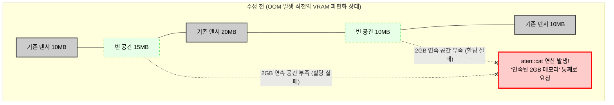

# Nesight Systems, PyTorch Profiler VRAM 메모리 병목 프로파일링

LLM 서빙중에 갑자기 `CUDA Out of Memory` 에러가 발생하여 서버가 죽었다고하자, 배치 사이즈를 무작정 절반으로 줄여서 해결하는 것이 올바른 엔지니어링은 아닐 것이다.

서버 애플리케이션에서 메모리 누수가 발생햇을 때 힙 덤프를 뜨고 객체 참조 그래프를 분석하듯, GPU VRAM 내부에서도 정확히 어떤 텐서 연산이 메모리를 많이 잡아먹고 있는지 들여다보는 것이 필요하다.

AI 모델 서빙 환경에서 GPU 리소스 낭비를 막고 보틀낵을 타파하기 위해서는 하드웨어 레벨과 프레임워크 레벨에서 각각 교차 검증을 수행하는 전문 프로파일링 기법이 필요하다.

- **Nsight Systems (nsys):** NVIDIA에서 제공하는 시스템 수준 프로파일러로 cpu, gpu 간의 상호작용 PCle 병목, CUDA API 호출 지연, 커널 실행 시간, os 스레드 스케줄링 등을 타임라인 상에서 거시적으로 분석한다.
- **Pytorch Profiler**: 프레임워크 내부의 미시적인 동작을 추적한다. 특정 모델 레이어 (`aten::matmul`, `atem::scaled_dot_product_attention`)가 실행될 때 VRAM이 동적으로 얼마나 할당되고 해제되는지 텐서의 형태는 어떠한지 기록한다.
- **VRAM Memory Spike**: 모델의 정적인 weight외에 Forward Pass 도중 순간적으로 생성되었다가 살아지는 Activiation 텐서들로 인해 VRAM 사용량이 일시적으로 치솟는 현상이다. oom의 주요 원인.

<br>

## 문제 정의

단순히 `nvidia-smi` 명령어로 VRAM 사용량을 확인하는 것은, 자동차가 달리고 있을 때 계기판의 연료 게이지를 보는것과 같다.

기름이 닳고 있다는 것은 알지만, 엔진이 어느 부품에서 기름이 새는지는 알 수 없다.

ex.) LLM의 Attention 연산은 시퀀스 길이의 제곱 ($O(N^2)$) 에 비례하여 메모리를 소모한다. 서빙 엔진에서 사용자 요청 길이가 4,096 토큰을 넘어가는 순간 중간 연산을 저장하기 위한 VRAM 할당량이 폭증하고 mmap() 실패나 페이지 폴트와 유사하게 VRAM 파편화가 발생하면, 남은 여유 공간의 총합은 충분하더라도 연속된 메모리 블록을 찾지못해 OOM 붕괴가 일어난다.

### Solution

- **Top-down 거시적 분석 Nsight System**: NVTX(NVIDA Tools Extension) 마커를 서버 코드에 삽입하여, HTTP 요청이 들어와 전처리, GPU 전송, 모델 추론, 응답 반환까지 이루어지는 파이프라인 중에서 어느 구간에서 CPU가 GPU를 기다리게 만들고 있는지 GPU Starvation을 식별한다.
- **Bottom-up 미시적 분석 Pytorch Profiler**: VRAM 메모리나 타임라인 기능, `profile_memory=True` 을 켜서 특정 Attention 커널이나 LayerNorm 블록에서 발생하는 불필요한 메모리 복사나 임시 텐서의 생명주기를 추적하고 이를 FlashAttention등 메모리 효율적인 커널로 교체하는 근거로 삼는다.

<br>

## 상세 동작 원리 및 구조화

py 애플리케이션의 동작이 하위 cuda 런타임을 거쳐 하드웨어 레벨까지 어떻게 추적되고 기록되는지 보여주는 프로파일링 아키텍처다.

```mermaid
graph TD
    subgraph "Application Layer (FastAPI / vLLM)"
        Req[API Request] --> P_Start[PyTorch Profiler Start]
        P_Start --> N_Mark[NVTX Range Push: 'Forward Pass']
        N_Mark --> Fwd[Model Forward Execution]
        Fwd --> N_End[NVTX Range Pop]
        N_End --> P_End[PyTorch Profiler End]
    end

    subgraph "Framework & Driver Layer"
        Fwd -.-> CudaMalloc[cudaMalloc / cudaFree (VRAM 동적 할당)]
        Fwd -.-> CudaKernel[CUDA Kernel Launch (행렬 연산)]
    end

    subgraph "Profiling Tools & Output"
        P_End == Export ==> TraceJson[Chrome Tracing (.json)\n- 연산자별 수행 시간\n- 텐서 메모리 라이프사이클]
        CudaMalloc & CudaKernel == Intercept ==> Nsys[nsys daemon]
        Nsys == Export ==> Qddb[Nsight Report (.nsys-rep)\n- 하드웨어 타임라인\n- PCIe 대역폭 병목]
    end
```

코드 예시를 더 보면 모델의 단일 foward pass 내부에서 어떤 연산이 VRAM을 가장 많이 점유하는지, 메모리가 해제되지 않고 누수되는 지점이 잇는지 추적하는 기본 스크립트를 짜보겠다.

```py
import torch
import torchvision.models as models
from torch.profiler import profile, record_function, ProfilerActivity

# 모델 및 더미 데이터 준비 (GPU 적재)
model = models.resnet50().cuda().eval()
inputs = torch.randn(16, 3, 224, 224).cuda()

# PyTorch Profiler 실행 컨텍스트
with profile(
    activities=[ProfilerActivity.CPU, ProfilerActivity.CUDA], # CPU/GPU 모두 추적
    profile_memory=True,  # [핵심] VRAM 메모리 할당/해제 추적 활성화
    record_shapes=True,   # 연산에 사용된 텐서의 크기(Shape) 기록
    with_stack=True       # 파이썬 소스 코드의 어느 줄에서 호출되었는지 콜스택 기록
) as prof:
    
    # 1. 특정 구간에 프로파일러 마커 삽입
    with record_function("model_inference"):
        with torch.no_grad():
            outputs = model(inputs)

# 2. 콘솔에 메모리 소모량이 가장 큰 순서대로 연산자 정렬하여 출력
print(prof.key_averages().table(sort_by="self_cuda_memory_usage", row_limit=10))

# 3. 크롬 브라우저(chrome://tracing)에서 시각적으로 분석 가능한 파일로 내보내기
prof.export_chrome_trace("trace_memory_profile.json")
```

그리고 api 서버가 실행중일때 외부에서 `nsys` cli 도구로 프로세스를 후킹하여 분석하려면, 소스 코드 내부 NVTX 마커를 심어주어야 거대한 하드웨어 타임라인 속에서 내가 작성한 함수의 위치를 시각적으로 찾을 수 있다.

```py
import torch
import torch.cuda.nvtx as nvtx
from fastapi import FastAPI, Request

app = FastAPI()
model = load_llm_model().cuda().eval()

@app.post("/generate")
async def generate_text(request: Request, prompt: str):
    # [핵심 1] NVTX 마커 Push: Nsight Systems 타임라인에 'API_Request_Processing' 블록 생성
    nvtx.range_push(f"API_Request_Processing_{request.client.host}")
    
    try:
        # 데이터 전처리 구간 마킹 (CPU 작업)
        nvtx.range_push("1_Tokenization")
        input_ids = tokenizer(prompt, return_tensors="pt").input_ids.cuda()
        nvtx.range_pop() # 1_Tokenization 종료
        
        # 실제 모델 추론 구간 마킹 (GPU 커널 런치)
        nvtx.range_push("2_Model_Forward")
        with torch.no_grad():
            output_ids = model.generate(input_ids, max_length=100)
        nvtx.range_pop() # 2_Model_Forward 종료
        
        return {"text": tokenizer.decode(output_ids[0])}
        
    finally:
        # [핵심 2] NVTX 마커 Pop: 에러가 나더라도 반드시 마커를 닫아줌
        nvtx.range_pop() # API_Request_Processing 종료

# ==========================================
# [서버 실행 명령어]
# 일반적인 uvicorn 실행 대신, nsys daemon으로 감싸서 실행합니다.
# $ nsys profile -t cuda,nvtx,osrt -s none -o llm_serve_profile uvicorn main:app --host 0.0.0.0
# ==========================================
```

프로덕센 레벨에서 VRAM 추출 파이프라인 코드를 보면

과거 네이티브 시스템에서 `mmap()` 반환값을 추적하거나 async-profiler 로 메모리 이슈를 잡았던 방식과 유사한데, PyTorch 2.1 이상에는 gpu 메모리의 물리적 상태를 힙덤프처럼 파일로 떠서 분석할 수 있는 강력한 기능이 추가되었다. 이 코드는 서빙 서버에 백도어 api를 뚫어 라이브 서비스 중 oom 징후가 보일때 즉시 메모리 스냅샷을 추출하는 고급 엔지니어링 기법이다.

```py
from fastapi import FastAPI, BackgroundTasks
import torch
import logging

logger = logging.getLogger(__name__)
app = FastAPI()

# 1. 서버 기동 시 VRAM 메모리 할당 이력(History) 기록을 백그라운드에서 활성화
@app.on_event("startup")
def enable_memory_history():
    logger.info("VRAM 메모리 할당 내역 추적기 활성화 (MAX_ENTRIES=100000)")
    # 최대 10만 개의 메모리 할당/해제 이벤트를 링 버퍼(Ring Buffer) 형태로 기록
    torch.cuda.memory._record_memory_history(max_entries=100000)

# 2. 관리자 전용 엔드포인트: 라이브 서비스의 메모리 스냅샷 추출
@app.get("/admin/profile/vram_snapshot")
async def dump_vram_snapshot():
    dump_filename = "/tmp/vram_snapshot.pickle"
    try:
        # 현재 GPU 메모리에 올라가 있는 모든 텐서 블록의 주소, 크기, 할당 스택 트레이스를 덤프
        snapshot = torch.cuda.memory._snapshot()
        
        # 파일로 직렬화하여 저장 (이후 https://pytorch.org/memory_viz 웹 도구에 드래그하여 시각화 분석)
        with open(dump_filename, "wb") as f:
            import pickle
            pickle.dump(snapshot, f)
            
        return {"status": "success", "message": f"VRAM Snapshot saved to {dump_filename}"}
    except Exception as e:
        logger.error(f"메모리 스냅샷 추출 실패: {e}")
        return {"status": "error", "message": str(e)}

# 3. [최적화 팁] CPU -> GPU 데이터 전송 시 Page Fault 방지 (Pinned Memory)
# 시스템 엔지니어링 관점에서 커널 메모리 페이지 폴트는 치명적인 지연을 낳습니다.
# DataLoader나 입력 텐서 생성 시 `.pin_memory()`를 사용하면,
# OS 커널이 해당 메모리를 페이징(Swap)하지 못하게 잠가버리므로(Locked),
# PCIe 버스를 통한 DMA(Direct Memory Access) 전송 속도가 극대화됩니다.
def prepare_tensor(data):
    # 일반적인 할당보다 PCIe 전송 병목을 줄이는 저수준 최적화
    return torch.tensor(data).pin_memory().cuda(non_blocking=True)
```

- `torch.cuda.memory._record_memory_history()`는 기존 cpp 기반 서버에서 메모리 릭을 찾기 위해 `valgrind`나 힙프로파일러를 붙이는 것과 정확히 동일한 역할을 VRAM 환경에서 수행한다.
- 이렇게 추출된 스냅샷을 분석 도구에 넣으면 마치 flamegraph처럼 어떤 파이썬 파일의 몇 번째 줄에서 생성된 텐서가 gpu 메모리 단편화를 유발하고 있는지 블록 단위의 시각적 증거를 확보할 수 있다. 무작정 배치 사이즈를 줄이는 것이 아니라, 원인이 되는 커널을 근본적으로 최적화하는 아키텍처 개선이 가능해진다.

<br>

### 트러블 슈팅 시나리오 ex

위에서 VRAM 등 프로파일링을 위한 방법들을 알아봤으니 실제 가상 시뮬레이션을 진행해보겠다, 어떤 병목이 있었고 어떤 지표를 보고 이를 판단했으며 어떤 방식으로 문제해결을 했는지 보겠다.


#### 시나리오

실제 겪을법한 OOM 장애 상황을 가정해보자. 장애 상황은 실시간 음성 기반 AI 에이전트 서버에서 발생했다. 

사용자와 AI가 긴 대화를 이어가던 중 갑자기 서버가 oom을 뱉어 죽어버렸다. 죽기 직전 `nvidia-smi`를 모니터링했는데 전체 80GB VRAM중 약 15GB의 여유공간이 있었는데도 말이다.

앞서 설명한 백도어 api를 통해 에러 발생 직전에 `vram_snapshot.pickle`을 추출하여 pytorch memory visualizer 사이트에 던져 넣었다치자.




1. **메모리 파편화**부터 알아볼수있다. 시각화 맵 지표를 보면 15gb가 있지만 큰 덩어리로 뭉쳐있는게 아니라 10mb 20mb씩 잘개 쪼개져있고 c나 os 커널단에서 잦은 메모리 할당과 해제로 인해 단편화가 발생한것이다.
2. 두번째 타임라인은 가장 우측 끝 서버가 죽은 시점에 솟아오른 거대한 메모리 스파이크 블록인데 상세 로그를 보면 `aten::cat` 텐서 병합 연산을 진행하다 순간적으로 2GB의 연속된 메모리 블록을 gpu에 요청했다가 파편화때문에 빈공간을 찾지못해 allocation 0gb 가 뜨면서 oom이 뜬것이다.

원인이 되는 코드를 찾기위해 `aten::cat` 블록을 클릭해보니 파이썬 코드 컨텍스트에 누적하는 라인이 범인으로 지목된다.

```py
# [수정 전 문제의 코드]
def update_chat_history(past_tensors, new_token_tensor):
    # 대화가 길어질 때마다 기존 텐서와 새로운 텐서를 계속 이어 붙임
    updated_history = torch.cat([past_tensors, new_token_tensor], dim=1)
    return updated_history
```

pytorch에서 torch.cat() 연산은 내부적으로 단순히 리스트 끝에 원소를 틱 추가하는것이 아니라 gpu 메모리상에서 기존크기에 새로운 크기만큼의 완전히 새로운 거대한 메모리 블록을 새로 할당 `cudaMalloc` 한 뒤 기존 데이터를 전부 복사하고 새로운 데이터를 이어붙인다음, 이전 메모리 블록을 지우는 `cudaFree` 무거운 작업을 토큰이 생성될때마다 반복한다.

대화가 길어질수록 복사해야할 텐서가 커지고 기존 메모리를 버리고 새로 잡는 과정때문에 VRAM의 파편화가 심해진다.

게다가 프로파일러 텐서 속성을 보니 개발자가 실수로 `requires_grad=True` 상태가 유지되어 연산 그래프까지 VRAM을 잡게 된다.

프로파일링 결과를 바탕으로 다음과 같이 수정해줄 수 있다.

```py
# [수정 후 코드: Static Cache (Memory Pool) 및 추론 모드 적용]

# 1. 서버 구동 시점에 최대 대화 길이를 감당할 수 있는 거대한 빈 텐서를 미리 할당 (메모리 풀링)
MAX_SEQ_LEN = 8192

# inference_mode를 씌워 역전파 기록이 절대 남지 않도록 원천 차단
with torch.inference_mode():
    # 연속된 메모리 공간을 초기에 한 번만 통째로 확보
    static_cache = torch.zeros((1, MAX_SEQ_LEN, hidden_size), device='cuda')

def update_chat_history_optimized(current_length, new_token_tensor):
    # 2. torch.cat()으로 메모리를 매번 재할당하는 대신, 
    # 이미 뚫어놓은 정적 텐서(static_cache)의 특정 인덱스 포인터에 값만 덮어씌움 (In-place operation)
    static_cache[:, current_length:current_length+1, :] = new_token_tensor
    return current_length + 1
```

매번 새로 메모리를 잡아 당기고 지우는 과정을 없앴으며, 시스템 프로그래밍에서 흔히 쓰이는 방식처럼 초기에 큰 메모리 덩어리를 잡아두고 오프셋 인덱스만 밀어가며 값을 채누는 STATIC KV CACHE로 아키텍처를 변경했다. 동시에 추론 모드를 강제해 메타데이터가 차지하는 공간도 날렸다.

이렇게 수정해서 배포한 뒤 프로파일러를 다시 떠보면 매 틱마다 산처럼 솟아오르던 메모리 스파이크가 소멸된뒤 VRAM 파편화 지표도 트래픽 폭주시 0퍼센트에 가깝게 유지되어 OOM이 해결된 것을 확인할 수 있다. 


```mermaid
graph TD
    subgraph "수정 전 (OOM 발생 직전의 VRAM 파편화 상태)"
        direction LR
        B1[기존 텐서 10MB]:::used
        F1[빈 공간 15MB]:::free
        B2[기존 텐서 20MB]:::used
        F2[빈 공간 10MB]:::free
        B3[기존 텐서 10MB]:::used
        
        Spike[aten::cat 연산 발생!<br/>'연속된 2GB 메모리' 통째로 요청]:::error

        B1 --- F1 --- B2 --- F2 --- B3
        
        F1 -. "2GB 안 들어감" .-x Spike
        F2 -. "2GB 안 들어감" .-x Spike
    end

    subgraph "수정 후 (Static Cache / Memory Pool 적용)"
        direction LR
        Pool[서버 기동 시 미리 뚫어놓은<br/>거대한 단일 정적 메모리 공간<br/>MAX_SEQ_LEN (연속된 10GB)]:::pool
        
        Token1[토큰 1 덮어쓰기]:::insert
        Token2[토큰 2 덮어쓰기]:::insert
        Token3[토큰 3 덮어쓰기]:::insert

        Pool --> Token1 --> Token2 --> Token3
    end

    classDef used fill:#cccccc,stroke:#333,stroke-width:2px,color:#000
    classDef free fill:#e6ffe6,stroke:#00cc00,stroke-dasharray: 5 5,color:#000
    classDef error fill:#ffcccc,stroke:#ff0000,stroke-width:3px,color:#000
    classDef pool fill:#cce5ff,stroke:#0066cc,stroke-width:2px,color:#000
    classDef insert fill:#ffffcc,stroke:#cccc00,stroke-width:1px,color:#000
```

