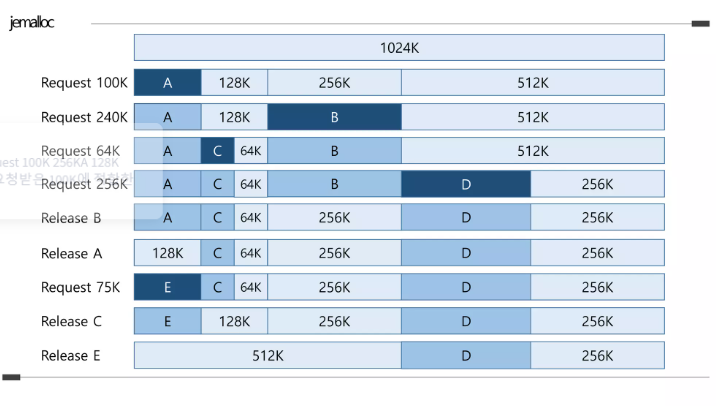

# jemalloc, arena, memory fragmentation

jemalloc은 jason evans가 FreeBSD를 위해서 개발한 malloc이다.

**메모리 단편화를 최소화**하고, **멀티프로세서/멀티스레드 환경에서 동시성**을 제공한다.

jemalloc에서는 새로운 개념으로 Arena, Thread Cache를 알 수 있는데 하나씩 알아보겠다.

### Arena

arena는 메모리를 여러 개로 나눈것인데, 기본적으로 16개(프로세서 x 4) thread는 arena에 round-robin 방식으로 선택한다.

thread가 메모리 할당을 하기 위해 arena에 접근하게 될 때 lock을 사용하게 된다.

즉 메모리 할당 요청이 충돌하지 않도록 만든 독립적인 메모리 할당기 인스턴스인 것이고 자체적으로 메모리 풀을 유지해 내부 락을 갖게된다.

새로 생성된 스레드는 round-robin방식 혹은 thread local storage 기반으로 arena를 할당받는다.

스레드는 할당받은 arena에서만 메모리를 할당하므로 병렬처리 시 락 경합이 거의 없게되고 즉 처리량 개선까지 달성하게 된다.

<br>

### Thread Cache

작은 단위의 잦은 메모리할당의 경우 Arena를 참조하지 않고 바로 malloc 할 수 있도록 각 스레드에게 thread cache라는 영역을 준다.

이로 인해 작은 메모리 할당이 필요한 연산의 경우에서는 스레드 내부에서 캐시를 이용함으로써 arena의 경합을 줄이며 성능 개선까지 이룬다.


<br>

## Memory Fragmentation

메모리 단편화는 메모리 공간을 할당할때 메모리를 사용하는 분포가 고르지 못해 효율적으로 사용할 수 없게되는 문제다.

외부 단편화와 내부 단편화 두 가지로 메모리 단편화 문제는 구별되고있다.

- **외부 단편화**: 다양한 크기의 메모리 할당하고 해제할 때 발생하는데, 전체 공간은 크나 고르게 분포되어있지 않아 할당할 공간이 부족한 경우 발생힌디. 
  - 예를 들어 100KB의 메모리 전체 영역이 존재하고 각각 20 (used) 20 (used) 로 40KB가 남았다고 해보자 여기서 30KB의 메모리 할당이 필요해졌을때 여유 공간이 존재하지 않으므로 할당할 수 없게 되는 문제가 발생한다.
- **내부 단변화**: 할당된 메모리 크기보다 적게 메모리가 사용될 때 발생한다. 
  - 예를들어 32byte정도의 공간을 요청했지만 막상 사용하는 공간은 24byte 라면 8byte가 남게되는 것이다.

외부 단편화를 해결하기 위한 알고리즘은 Buddy Allocation이 있고, 내부 단편화를 해결하기 위한 알고리즘은 Slab Allocation이 존재한다.

### Buddy Allocation

외부 단편화를 해결하기 위한 알고리즘으로 메모리의 크기를 절반씩 분할하면서 가장 잘 맞는 크기의 메모리를 찾는다.

2의 거듭제곱 값으로 메모리를 할당하는데, 프로그래머는 2^x 일때 x값의 상한선을 결정하거나 구할 수 있는 코드를 작성해야한다.

예를 들어 시스템이 2000k의 물리적인 메모리 장비를 가지고 있다면 2^10(1024K)이 할당할 수 있는 가장 큰 블록이기에 x=10이 상한선이 될것이다.

이는 단일 청크에 물리적인 메모리를 전부 할당하는 것이 불가능하기 때문에 남은 976k(2000 - 1024) 메모리는 좀 더 작은 블록들로 할당이 되어야한다.


여기서 메모리 조각들을 buddy라고 부른다. 작업 종료후 원본 버디들과 합치기 좋다는 장점이 존재하나 단점은 버디로 인해 내부 단편화가 생길수도 있고 버디 생성시 오버헤드가 꽤나 크다. 메모리를 쪼개기 때문에

- 메모리가 할당되면 적당한 크기의 메모리 슬롯을 찾는다. (최소한 요청된 메모리와 동일하거나 큰 2^k 블록을)
  - 적당한 크기의 메모리 슬롯이 발견되면 프로그램에 할당한다.
  - 적당한 크기의 메모리 슬롯이 발견되지 않는다면, 적당한 메모리 슬롯 만들기를 시도한다.
    - 요청된 메모리 크기보다 크게 절반씩 빈 메모리 슬롯을 찾는다.
    - 하한선에 도착하게 되면, 해당 메모리(하한선 크기의 메모리를)를 할당한다.
    - 다시 첫 번째 단계로 돌아간다. (적당한 크기의 메모리를 찾기 위해)
    - 적당한 메모리 슬롯이 발견될때까지 이 과정을 반복한다.
- 메모리가 해제되면
  - 메모리 블록을 해제한다.
  - 주변의 블록들을 살펴본다 - 주변도 해제가 되었나?
  - 만약 그렇다며ㅕㄴ 두 메모리 블록을 조합하고 다시 두 번째 단계로 돌아가고 해제된 모든 메모리들이 상한선에 도달할 때 까지 이 과정을 반복하거나 해제되지 않은 주변 블록들을 마주칠때까지 반복한다.

> 메모리를 해제 하는 이 방법은 log2(u/l)과 같은 가장 효과적인 간결화 숫자를 이용하면 간결화가 상대적으로 빠르게 이루어져서 꽤 능률적이다.(log2(u)- log2(l)) 전형적으로 버디 메모리 할당 시스템은 사용되거나 사용되지 않은 두 가지 상태로 메모리 블록들을 나누는 것을 뜻하는 이진 트리를 이용해서 구현 된다.



위에서 언급했듯 외부 단편화는 줄일 수 있지만, 2^x 단위로 분할하기 때문에 내부 단편화는 막을 수 없다. 

이를 해결하기위해 slab allocation 알고리즘을 사용한다.

<br>

### Slab Allocation

동일 크기의 객체를 효율저긍로 할당/해제하도록 설계된 메모리 관리 방식이고 각 객체 타입별로 캐시를 유지하고 메모리 단편화 초기화 비용을 줄이는 기법이다.

고정된 객체 크기/타입별로 앞서 언급한것처럼 캐시 단위로 메모리를 관리하며

하나 이상의 연속 페이지 묶음, 내부에 동일 크기 region을 포함하는 개념이 slab이다. 

즉 "동일한 크기와 타입의 객체들을 미리 정해진 공간(slab)에 모아서 관리하자" 라는 아이디어에서 고안되었다.

- 같은 크기만 관리하니 내부 단편화가 없다
- 객체가 늘 같은 자리에 위치하니 캐시 히트율이 높다.
- 메모리를 미리 정해진 방식으로 분할해두니 동적 분할이 필요 없다.

```
[ Cache (객체 타입별)]
  ├─ [ Slab 1 (4KB, 일부 사용 중) ]
  ├─ [ Slab 2 (4KB, 모두 사용 중) ]
  └─ [ Slab 3 (4KB, 모두 비어 있음) ]
```

<br>

그리고 huge 오브젝트(chunk-aligned)는 red-black tree에 할당해서 관리한다 log(n)안에 찾을 수 있다.

jemalloc은 small 혹은 large 할당은 buddy 알고리즘과 slab 알고리즘을 활용해 chunk page run에 할당한다.

성능을 높히려면 캐시히트율이 높아야하고 캐시히트율은 지역성을 잘 고려하여 짜여진 프로그램에서 좋은 성능을 낸다.

위와 같은 기법은 이를 잘 활용해 고성능 메모리 할당기로 발전시켰다고 생각하면 된다.

jemalloc을 firefox에 적용햇을 때 메모리 사용량이 약 22퍼 감소한 사례도 있다는 카더라가 있다.

기존 ptmalloc은 brk() mmap()을 통해 메모리를 할당해 내부적으로는 bin chunk arena 구조를 사용하나 기본적으로는 전역 락 기반의 구조기 때문에 멀티 스레드 환경에서 락 경합과 메모리 단편화 문제가 많았기에 고성능 애플리케이션 개발을 한다면 jemalloc을 고려해보자. 

또 프로파일링을 할때 더 자세한 정보를 준다는 말도 있던데, 이부분은 개인 취향인 듯 하다.