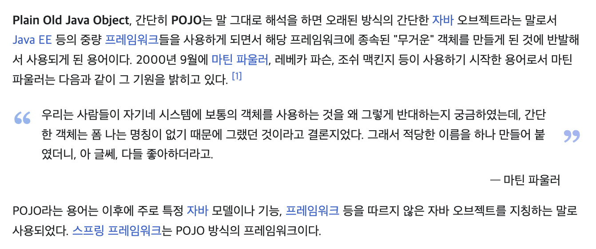

# 🧐 POJO (Plain Old Java Object) 알아보기

#### 개요

POJO란 무엇일까? 오늘은 무엇을 공부할까 하며 주제들을 찾고있었는데

POJO란게 눈에 보였다. 뭔가 이름이 귀여워보이기도하고 그래서 오늘 한번 공부해보겠다.

### POJO

POJO(Plain Old Java Ovject) 말 그대로 해석하면 오래된 방식의 간단한 자바 오브젝트라는 말이다.



오래된 방식의 간단한 오브젝트를 조금 더 풀어서 말해보자면 특정 기술에 종속되어 동작하는 것이 아닌 순수한 자바 객체 그 자체를 말하는 것입니다.

```
@Getter
@Setter
public class UserDto{

    private String name;
    private String email;
    private String password;
}
```

예를 들어 위 객체는 순수 자바 기능인 Getter, Setter만 가지고 있다.

특정 기술에 종속되지않고 순수한 자바 객체기 때문에 POJO라고 할 수 있다.

반대의 예시는

```
public class WindowExam extends WindowAdapter{
	
    @Override
    public void windowColsing(WindowEvent e){
    	System.exit(0);
    }
}
```

이 처럼 Window 기능을 사용하기 위해 WindowAdapter 클래스를 상속받았다.

이렇게 되면 다른 솔루션을 사용하고자 할 때 많은 양의 코드를 리팩터링 해야하는 문제도 있다.

이처럼 특정 기술과 환경에 종속되어 의존하면 코드의 가독성 뿐만 아니라 유지보수, 확장성에도 어려움이 생깁니다.

이러한 객체지향의 장점을 잃어버린 자바를 되살리기 위해 POJO라는 개념이 생겼습니다.

### POJO를 지향하는 이유?

스프링 프레임워크 전에는 엔터프라이즈 기술이 있었고 그 기술을 직접적으로 사용하는 객체를 설계했었습니다. 그리고 이러한 개발 방식이 만연하고 있었고 특정 기술과 환경에 **종속되어 의존하게 된 자바 코드**는 가독성이 떨어져 유지보수의 어려움이 생겼습니다. 또한 특정 기술에 클래스를 상속받거나 직접 의존하게 되어 확장성이 매우 떨어지는 단점도 있었습니다. **이 말은 객체지향의 화신인 자바가 객체지향 설계의 장점들을 잃은 것 입니다.**

그래서 POJO라는 개념이 등장했습니다. 본래 자바 장점을 살리는 오래된 방식의 순수한 자바 객체 말입니다.

### POJO의 기반의 코드인지 확인하는 방법

1. 특정 규약이나 환경에 종속되어 있지는 않는가?

2. 객체지향적으로 설계되었는가?

3. 테스트가 용이한가?

토비의 스프링에서는 진정한 POJO를 아래와 같이 정의했다.

*그럼 특정 기술규약과 환경에 종속되지 않으면 모두 POJO라고 말할 수 있는가? 많은 개발자가 크게 오해하는 것 중의 하나가 바로 이것이다. ...(중략)...*  
***진정한 POJO란 객체지향적인 원리에 충실하면서, 환경과 기술에 종속되지 않고 필요에 따라 재활용될 수 있는 방식으로 설계된 오브젝트를 말한다***

#### POJO Framework

POJO 프로그래밍이 가능하도록 기술적인 기반을 제공하는 프레임워크는 대표적으로 두가지가 있는데 그게 바로 우리에게 제일 익숙한 **Spring Framework, Hibernate**이다.

#### POJO 장점

1. 코드가 깔끔해진다.

2. 자동화된 테스트에 유리하다.

3. 객체지향적인 설계를 자유롭게 적용할 수 있다.
