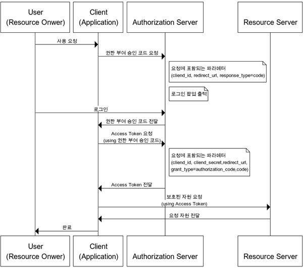
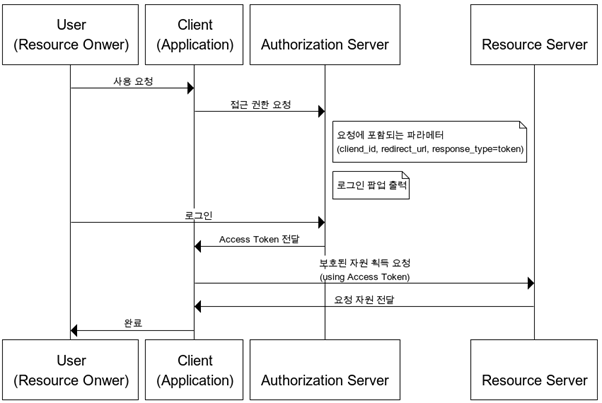
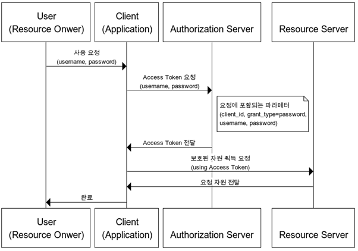

# ☁️ OAuth 2.0 개념과 권한 부여 방식 알아보기

### 개요

새로운 프로젝트를 하면서 oauth를 도입하기로 결정했다. oauth를 구현하면서도 어떻게 돌아가는지 잘 이해가 되지 않아 이번에 한번 개념들을 정리해보기로 했다.

### OAuth 2.0?

**OAuth 2.0 (Open Authorization 2.0)**

웹 서핑을 하다보면 google, facebook등 외부 소셜 계정을 기반으로 간편하게 회원가입 및 로그인을 할 수 있는 방법을 쉽게 찾아볼 수 있다. 이러한 서비스들은 연동되는 **외부 웹 어플리케이션에서 페이스북 및 트위터등이 제공하는 기능을 간편하게 사용할 수 있다는 장점**이 있다.

구글, 페이스북, 트위터, 네이버 등등 다양한 플랫폼에서 특정한 사용자가 데이터에 접근하기 위해 제 3자의 클라이언트가 사용자의 접근 권한을 받을 수 있는 인증을 위한 *개방형 표준 프로토콜*이다.

#### OAuth에서 역할

**Resource Owner: 리소스의 소유자로** 본인의 정보에 접근할 수 있는 자격을 승인하는 주체다. 예시로 구글 로그인을 할 사용자를 말한다. Resource Owner은 인증하는 역할을 수행하고, 인증이 완료되면 동의를 통해 권한 획득 자격(Authorization Grant)을 클라이언트에게 부여한다.

**Client:**Resource Owner의 리소스를 사용하고자 접근 요청을 하는 **어플리케이션**이다.

**Resource Server:**Resource Owner의 **정보가 저장된 서버**입니다.

**Authorization Server:**권한 서버입니다. 인증과 인가를 수행하는 서버로 클라이언트의 접근 자격을 확인하고 AccessToken을 발급해 권한을 부여하는 역할을 수행합니다,

**AccessToken:**자원에 대한 접근을 Resource Owner가 인가하였음을 나타내는 **자격 증명**

**RefreshToken:** AccessToken은 보안상 만료기간이 짧기 때문에 얼마 지나지 않아 만료되면 사용자는 로그인을 다시 시도해야한다. 그러나 RefreshToken을 사용하면 AccessToken을 다시 발급받아 로그인을 다시 할 필요가 없게끔 한다.

### 권한 부여 방식

OAuth2.0 프로토콜에서는 다양한 클라이언트 환경에 적합하도록 여러가지 권한 부여 방식에 따른 4가지 프로토콜을 제공합니다.

***1. Authorization Code Grant | 권한 부여 승인 코드 방식***

***2. Implicit Grant | 암묵적 승인 방식***

***3. Resource Owner Password Credentials Grant | 자원 소유자 자격증명 승인 방식***

***4. Client Credentials Grant | 클라이언트 자격증명 승인 방식***

#### Authorization Code Grant 권한 부여 승인 코드 방식

권한 부여 승인을위해 **Authorization Code를 보내는 방식으로 많이 쓰이고 기본이 되는 방식**입니다.

간편 로그인 기능에서 사용되는 방식이면서 클라이언트가 사용자를 대신해 특정 자원을 접근 요청을 할 때 사용되는 방식입니다. 타사의 클라이언트에게 보호된 자원을 제공하기 위한 인증에 사용됩니다. RefreshToken의 사용이 가능한 방식입니다.

권한 부여 승인 요청시에 response\_type을 code로 지정하여 요청합니다. 이후 클라이언트는 권한 서버에서 제공하는 로그인 페이지를 브라우저를 띄워 출력합니다. 이 페이지를 통해 사용자가 로그인을 하면 권한 서버는 권한 부여 승인 코드 요청 시 전달받은 redirect\_url로 Authorization Code를 전달합니다. Authorization Code는 권한 서버에서 제공하는 api를 통해 access token으로 교환됩니다.

#### Implict Grant | 암묵적 승인 방식

자격증명을 저장하기 어려운 클라이언트 예를들어 **자바스크립트 등의 스크립트 언어를 사용한 브라우저에게 최적화된 방식** 입니다.

암묵적 승인 방식에서는 권한 부여 승인 코드 없이 accessToken이 바로 발급이 됩니다. 바로 전달되기 때문에 만료기간을 짧게 잡습니다. RefreshToken을 사용할 수 없는 방식이며, 이 방식에서 권한 서버는 client\_secret을 사용해 클라이언트를 인증하지 않습니다. accessToken을 획득하기 위한 절차가 간소회되기에 응답성과 효율성은 높아지지만 url로 토큰이 전달되는 단점이 있습니다.

권한 부여 승인 요청시 response\_type을 token으로 설정해 요청합니다. 이후 클라이언트는 권한 서버에서 제공하는 로그인페이지를 브라우저에 띄워 출력하게 되며 로그인이 완료되면 서버는 Authorization Code대신 AccessToekn을 redirect\_url로 바로 전달합니다.

#### Resource Owner Password Credentials Grant | 자원 소유자 자격증명 승인 방식

간단하게 username, password로 AccessToken을 발급받는 방식입니다.

클라이언트가 **외부 프로그램일 경우에 이 방식을 적용합니다.** 자신의 서비스에서 제공하는 어플리케이션일 경우에만 사용되는 인증 방식으로 RefreshToken의 사용도 가능합니다.  
  
제공하는 api를 통해 username password을 전달하여 AccessToken을 받는것입니다. 중요한 점은 이 방식은 권한 서버, 리소스 서버, 클라이언트가 모두 같은 시스템에 속해 있을 때 사용되어야 하는 방식이라는 점입니다.

#### Client Credentials Grant  | 클라이언트 자격증명 승인 방식

클라이언트의 자격증면만으로 AccessToken을 획득하는 방식입니다.

OAuth2.0의 권한 부여 방식 중 가장 간단한 방식으로 클라이언트 자신이 관리하는 리소스 혹은 권한 서버에 해당 클라이언트를 위한 제한된 리소스 접근 권한이 설정되어 있는 경우 사용됩니다. 이 방식은 자격증명을 안전하게 보관할 수 있는 클라이언트에서만 사용되며 RefreshToken은 사용할 수 없습니다.
