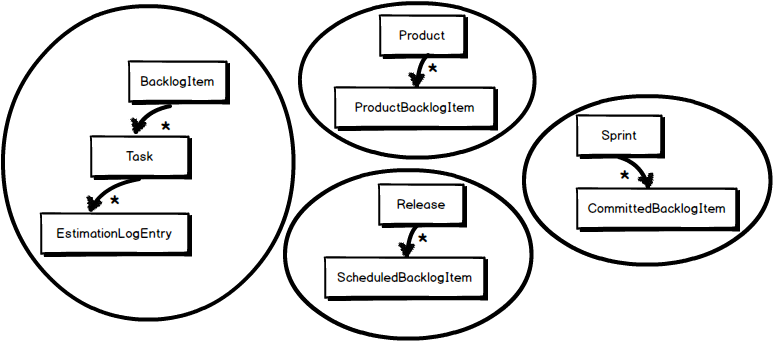

# [DDD] 도메인 주도 설계 애그리거트(Aggregate) 알아보기

### 개요

도메인 주도 설계 공부 3일차 오늘은 애그리거트에 대해서 알아보겠습니다.



### 애그리거트란?

애그리거트란 관련된 **객체**들을 모아 하나의 단위로 취급하는 개념으로, 객체지향 프로그래밍에서, 애그리거트는 객체 간의 관계를 정의하는 방법 중 하나로, 논리적으로 관련된 객체들을 그룹화하여 하나의 묶음으로 다룬다.

***쉽게 말해 여러 개의 객체를 묶어 하나의 큰 객체로 다루는 것이다.***

애그리거트는 일반적으로 Entity, Value로 구성되고, 애그리거트는 엔티티와 밸류의 관계를 나타내는 **루트 root** 엔티티를 포함하며 루트 엔티티는 애그리거트에 속한 다른 객체들과 관계를 정의한다. 애그리거트는 **불변성**을 유지하며, 내부 구현을 캡슐화한다.

애그리거트는 DDD 디자인 패턴에서 중요한 개념 중 하나로 애그리거트를 사용하여 복잡한 객체 간의 관계를 더 명확히 표현하고, 응용 프로그램의 유지 보수성과 확장성을 높일 수 있다. 또한 애그리거트를 사용해 데이터베이스 트랜잭션 처리를 단순화하고, 일관성을 유지할 수 있다.

예를 들어 게시판의 글과 댓글을 묶어서 애그리거트로만들 수 있고, 이를 통해 글과 댓글관에 관계를 더 명확하게 표현하고, 데이터베이스 처리를 단순화할 수 있다.

### 루트 Root 엔티티의 역할과 책임

애그리거트 루트 엔티티는 애그리거트의 핵심적인 역할과 책임을 가지고있으며, 애그리거트 내부의 모든 객체들은 애그리거트 루트 엔티티를 중심으로 관리된다.

**애그리거트 루트 엔티티의 주요 책임**

1. 애그리거트 내부의 모든 객체들을 관리하고 제어한다.
2. 애그리거트 루트 엔티티의 불변성을 보장한다.
3. 애그리거트 루트 엔티티와 다른 객체 간의 관계를 관리한다.
4. 애그리거트 루트 엔티티를 통해 애그리거트 전체를 제어한다.

### 애그리거트의 불변성 유지와 캡슐화

애그리거트는 불변성을 유지하면서 캡슐화를 지켜야한다.

**불변성 유지**

애그리거트의 상태는 루트 엔티티를 통해 변경되어야 하며, 한번 생성된 애그리거트는 그 상태가 변하지 않는다. 애그리거트의 내부 객체들도 마찬가지로 불변성을 유지해야한다. 이를 통해 애그리거트는 내부의 객체들이 외부에서 영향을 받지 않도록 보호하면서 일관성을 유지할 수 있다.

**캡슐화**

애그리거트 내부 객체들이 외부에서 직접 접근할 수 없도록 보호하는 것이다. 애그리거트의 내부 객체들은 애그리거트 루트 엔티티를 통해서만 접근할 수 있어야 하고, 이를 통해 애그리거트는 내부의 객체들을 외부에서 보호하면서 일관성을 유지할 수 있다.

불변성 유지와 캡슐화를 지키는 이유는 애그리거트 내부 객체들을 외부로부터 보호하면서 일관성을 유지할 수 있으며, 객체 간 결합도를 낮추어 유지 보수성과 확장성을 높일 수 있다.

**애그리거트 루트 엔티티를 구현해보았다 In Kotlin**

```
@Entity
@Table(name = "order")
class Order(
    @Id
    val id: Long,
    val customerName: String,
    @OneToMany(mappedBy = "order", cascade = [CascadeType.ALL], orphanRemoval = true)
    val orderItems: List<OrderItem>
) {
    fun addItem(item: OrderItem) {
        orderItems.add(item)
    }
}

@Entity
@Table(name = "order_item")
class OrderItem(
    @Id
    val id: Long,
    val itemName: String,
    val price: Int,
    @ManyToOne(fetch = FetchType.LAZY)
    @JoinColumn(name = "order_id")
    val order: Order
)
```

Order의 필드를 val로 설정해줌으로써 불변성의 원칙과 addItem을 통해 아이템을 추가하는 로직에서 orderItem은 Order에서만 호출되며 orderItem필드를 직접 조작할 수 없게 설계되어있는 것을 볼 수 있다.

### 애그리거트의 유지보수성과 확장성에 대한 이해

애그리거트는 관련된 객체들의 집합을 하나의 논리적인 단위로 묶어서 표현한다.

이를 통해서 **객체간의 의존성을 낮추고, 객체 간의 복잡한 관계를 단순화할 수 있다.** 이로 인해 유지보수성이 향상된다. 예를 들어서 애그리거트 내부에서 일어나는 변경 사항은 애그리거트 외부에 영향을 미치지 않으므로, 변경 시에 다른 부분에 영향을 주지 않는다.

애그리거트는 불변성을 유지하여 외부에서 변경되지 않도록 캡슐화가 되어있다. 이로 인해 시스템의 확장성이 향상된다. 예를 들어서, 애그리거트의 불변성이 보장되면, 시스템이 동시에 여러 스레드에서 사용되더라도 객체의 상태가 일관성을 유지할 수 있다.

### 마무리

이렇게 애그리거트 개념에 대해서 알아보았다. 이제 이것을 실제 개발에 적용해보면서 DDD를 공부해보아야 할 것 같다.
