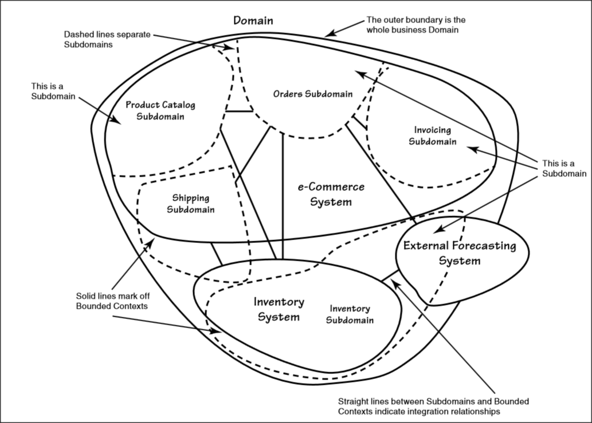

# [Domain-Driven-Design] 바운디드 컨텍스트 (Bounded-Context) ✍️

### 개요

나는 지금 DDD (도메인 주도 설계) 에 중요성을 느끼고 나서 개념들을 공부하기로 시작했고 DDD에 대해서 내가 공부한 내용들을 포스팅했다. 이번엔 **바운디드 컨텍스트라**는 용어를 공부해 볼 것이다.

### Bounded-Context

바운디드 컨텍스트는 도메인 주도 설계에서 처음 소개된 개념이다.

바운디드 컨텍스트는 큰 시스템을 여러 개의 작은 **컨텍스트**로 나누어 각 컨텍스트 내에서 특정한 비즈니스 규칙과 데이터 모델이 적용되는 것을 의미한다. 각 컨텍스트는 독립적으로 설계되고 구현되며, 서로 다른 컨텍스트 간에는 인터페이스를 통해 상호작용한다.

바운디드 컨텍스트는 도메인 안에서 특정한 비즈니스 문제 영역을 나타내며 그 영역 안에서 **용어,개념,규칙**등이 일관되게 적용된다.

바운디드 컨텍스트는 도메인 모델링을 할 때 중요한 역할을 하며 도메인 모델링을 할 때는 **전체 도메인을 작은 단위로 분리하여 각 바운디드 컨텍스트를 식별하고, 각 컨텍스트가 독립적으로 동작하도록 설계**한다. 이를 통해 전체 시스템의 복잡성을 줄이고 유연성을 높일 수 있다.

> 컨텍스트(Context)란?   
> 어떤 것을 이해하고 해석하는 데 있어서 그것이 속한 상황이나 배경, 관련된 다른 사항으로가 함께 고려되어야 한다는 의미다.  
>   
> 소프트웨어 개발에서 컨텍스트는 소프트웨어 시스템 일부로서 **비즈니스 문제 영역**을 나타낸다. 예를 들어, 은행 시스템에서 대출 신청, 계좌 개설, 이체 등 각각의 기능들은 서로 다른 컨텍스트를 가지고 있다.  
>   
> 여기서 도메인과 컨텍스트의 차이를 설명하자면 도메인은 **특정한 비즈니스 분야**를 의미한다. (예: 은행, 항공, 호텔) 그리고 컨텍스트는 **도메인 안에서 특정한 비즈니스 문제 영역**을 의미한다. (예: 은행 도메인의 대출 신청, 계좌 개설)

### 바운디드 컨텍스트의 이점

1. 복잡한 시스템의 구성요소를 쉽게 이해할 수 있다.
2. 각 컨텍스트가 독립적으로 동작해, 개발자들은 컨텍스트 단위로 작업할 수 있다.
3. 시스템이 커질수록 각 컨텍스트를 분리함으로써 확장성을 높일 수 있다.
4. 바운디드 컨텍스트는 팀 간의 의사소통을 간소화할 수 있다.

### 스프링부트에서 바운디드 컨텍스트는 서비스(Service)인가?

그렇지는 않다. 스프링부트에서 바운디드 컨텍스트는 사용되는 개념이긴 하지만 그 자체로 서비스는 아니다.

스프링부트에서는 바운디드 컨텍스트를 구현하기 위해 여러 방법을 제공한다.

예를 들면 독립적인 마이크로 서비스로 구현하거나, 애플리케이션 내에 여러 모듈로 나누어 구현할 수도 있다.

서비스(Service)는 비즈니스 로직을 구현하는 데 사용되는 컴포넌트로, 바운디드 컨텍스트 안에서 필요한 기능을 제공하는 역할을 수행할 수는 있고 바운디드 컨텍스트의 일부가 될 수는 있지만, 반드시 그렇지는 않다. 예를 들어, 여러 바운디드 컨텍스트에서 공통으로 사용되는 기능을 제공하는 서비스를 만들어서 사용할 수도 있기 때문이다.

따라서 바운디드컨텍스트는 서비스보다 더 큰 개념으로, **애플리케이션 전체적인 아키텍처를 설계하는 데 사용된다.**
