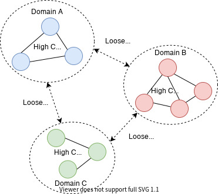

# 🔨 DDD(Domain Driven Design) 도메인 주도 설계와 도메인 모델

### **개요**

****도메인 주도 설계 개발자라면 코드를 짜는 것 뿐만 아닌 효율적으로 아키텍처를 구성하고 관리할 수 있는 환경을 만들어 나가야한다고 생각한다. 전체적인 틀을 잡지 않으면 효율적인 코드는 존재할 수 없다고 생각한다. 그렇기 때문에 도메인 주도 설계에 대해서 공부하려고 마음 먹었다.

### DDD 도메인 주도 설계란?

도메인 주도 설계는 소프트웨어 개발에서 사용되는 설계 방법론 중 하나로 이 방법론은 **비즈니스 도메인**을 중심으로 소프트웨어를 설계함으로써 비즈니스 문제를 해결하고, 유지보수가 가능한 소프트웨어를 만드는 것을 목적으로 한다.

도메인 주도 설계는 소프트웨어 개발 비즈니스 도메인과 관련된 용어, 개념, 규칙 등을 중심으로 이루어지도록 하고 이를 위해 **도메인 모델**이라는 개념을 도입해 비즈니스 도메인의 개념과 규칙을 명확하게 표현하고 이를 소프트웨어에 반영한다.

**DDD의 장점**

* 비즈니스 로직과 소프트웨어 모델링간의 강한 연결 : 비즈니스 도메인과 소프트웨어 모델링간의 강력한 연결을 제공한다.
* 복잡한 비즈니스 로직의 구현 용이성 : 복잡한 로직 구현의 적합한 환경을 제공해 가독성과 유지보수성을 높인다.
* 공통된 언어의 사용 : 개발자와 도메인 전문가간에 공통 언어를 사용해 의사소통을 활발하게 한다.
* 테스트 용이성 : 도메인 모델링을 통해 소프트웨어 시스템을 모듈화하고 결합도를 낮춤으로써 유연성을 높인다.

#### 도메인 모델

도메인 모델은 비즈니스 도메인의 중요한 개념과 규칙을 표현한 것이다. 이를 기반으로 소프트웨어를 설계한다. 이를 통해 개발자는 시스템의 요구사항을 분석해 요구사항에 맞게 시스템을 설계할 수 있다.

도메인 모델은 주로 객체지향 프로그래밍 OOP에서 사용되며, 객체의 속성과 메서드를 이용하여 도메인의 개념과 규칙을 모델링한다. 또한 도메인 모델은 시스템 전반에서 공통으로 사용되는 객체들을 모아 **도메인 계층**을 구성한다.

* 도메인 모델은 시스템의 요구사항, 비즈니스 로직의 변경에 따라 지속적으로 수정된다.
* 변경된 도메인 모델은 소프트웨어 시스템의 구현 및 테스트에 적용된다.
* 따라서, 도메인 모델은 소프트웨어 시스템 유연성, 유지보수성, 확장성을 높이는 중요한 역할을 한다.

**도메인 모델을 잘 설계하기 위한 방법**

1. 도메인 지식 이해
2. 요구사항 분석
3. 도메인 모델링
4. 도메인 모델 검증
5. 도메인 모델 업데이트
6. 도메인 모델 문서화

#### DDD 주요 용어

DDD에서 사용되는 주요 용어들을 가볍게 알아보겠다. 이 용어들은 다음 포스팅에서 더욱 자세히 다루어 볼 예정이다.

1. **도메인:**문제의 영역 또는 비즈니스 영역을 의미한다.
2. **도메인 모델:**도메인 내의 개념, 규칙, 관계 등을 모델링한 것이다.
3. **엔티티:**도메인 모델에서 고유한 식별자를 가지는 객체를 의미한다.
4. **값 객체:** 엔티티와 달리 고유한 식별자가 없는 객체를 의미한다. 일반적으로 변경이 불가능하고, 복합적인 속성을 가지고 있다.
5. **에그리게이트:**서로 관련된 엔티티와 값 객체들의 집합을 의미한다. 에그리게이트 내부에서는 일관성을 유지해야 하며, 다른 에그리게이트의 상태를 직접 변경할 수 없다.
6. **리퍼지토리:**도메인 모델의 상태를 영구 저장소에서 가져오거나 저장하는 역할을 한다.
7. **도메인 서비스:**도메인 로직 중에서 여러 엔티티나 값 객체가 참여해야 하는 로직을 처리하는 서비스를 의미한다.
8. **팩토리:**객체 생성을 추상화한 패턴으로 복잡한 객체 생성을 캡슐화하여 코드의 가독성과 유지보수성을 높인다.
9. **이벤트:**도메인에서 발생하는 중요한 사건을 나타내는 객체로 이벤트를 사용하면 시스템간의 상호작용을 단순화하고 유연성을 높일 수 있다.

#### 마무리

이번 포스팅에서는 DDD의 전반적인 개념과 용어들을 알아보았다. 더욱 깊숙히 공부하기 위해서는 이걸로 만족하지 않고 다른 포스팅을 더 올리도록 하겠다.
