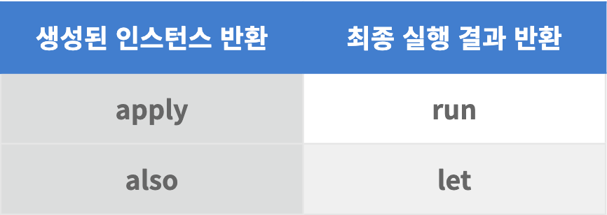

# Kotlin 스코프 함수 (Scope Function)

### 스코프 함수

스코프함수란 객체의 범위를 지정하는 데 사용되는 특수한 함수로, 객체 지향 프로그래밍에서 객체의 메서드와 유사하게 작동하지만, 스코프 함수는 객체의 범위를 한정하는 것이 목적이다.

코틀린에서는 다음 5가지의 스코프 함수를 제공한다. let, apply, run, als, with

이 그림을 참고하며 보도록 하자.

#### let

let 함수는 객체를 인자로 받아 람다식을 실행하고 결과를 반환한다. 예를 들어, 아래의 코드는 nullableVariable이 null이 아닌 경우 println을 실행한다.

```
nullableVariable?.let { value ->
    println(value)
}
```

let 함수는 null 값 처리에 유용하며, 예를 들어, 아래의 코드는 nullableVariable이 null인 경우 defaultValue 값을 반환한다.

```
val result = nullableVariable?.let { value ->
    value
} ?: defaultValue
```

#### apply

apply 함수는 객체를 인자로 받아 람다식을 실행하고 객체 자체를 반환합니다. 예를 들어, 아래의 코드는 Person 객체를 생성하고 필드 값을 초기화합니다.

```
val person = Person().apply {
    name = "esperer"
    age = 18
    address = "우리집"
}
```

#### run

run 함수는 객체를 인자로 받아 람다식을 실행하고 결과를 반환합니다. 예를 들어, 아래의 코드는 Person 객체를 생성하고 필드 값을 초기화한 후, displayName 함수를 실행한 결과를 반환합니다.

```
val result = Person().run {
    name = "esperer"
    age = 18
    address = "우우리이집"
    displayName()
}
```

#### also

also 함수는 객체를 인자로 받아 람다식을 실행하고 객체 자체를 반환합니다. 예를 들어, 아래의 코드 Person 객체를 생성하고 필드 값을 초기화한 후 println 함수를 실행하고 객체 자체를 반환합니다.

```
val person = Person().also {
    it.name = "esperer"
    it.age = 10
    it.address = "12myhouse"
    println(it)
}
```

#### with

with 함수는 객체를 인자로 받아 람다식을 실행하고 결과를 반환합니다. 예를 들어, 아래의 코드는 Person 객체를 생성하고 필드 값을 초기화한 후 displayName 함수를 실행한 결과를 반환합니다.

```
val result = with(Person()) {
    name = "esperer"
    age = 18
    address = "12asfasdfmyhouseSt"
    displayName()
}
```

### 각 스코프 함수의 특징과 차이 사용상황



1. apply : **인스턴스를 새로 생성하고 특정 변수에 할당하기 전에 초기화 작업을 해줄 수 있는 스코프를 만들어주는 함수**로 모든 명령이 수행되고 나면 명령들이 적용되어 새로 생성된 인스턴스를 반환한다는 특징을 가지고 있다.
2. run: apply와 명확한 차이점은 바로 반환하는 것이 **생성된 인스턴스가 아닌 스코프 내 명령 실행 결과** 값이라는 점이다. 따라서 이미 만들어진 인스턴스의 값 혹은 그를 이용한 특정 계산 값을 필요로 하는 경우 사용해볼 수 있다.
3. with 살짝 허무하게도 with은 run과 생긴 것만 다를 뿐, 동작 상, **특징 상 차이점이 없다..**
4. also/let, apply/run 은 위에서 보았던 그림처럼 함수들과 동작 (리턴 값)이 일치한다. 그러나 다른 점으로는 **it의 사용**이 있다.

스코프 함수라는 것이 특정 객체 컨텍스트 내에서 특정 동작을 한다는 점에서는 **also, let이 가장 좋은 스코프 함수**같다. 개인적인 견해

상황에 맞게 용도에 맞게 적절한 스코프 함수를 사용하면 된다.
