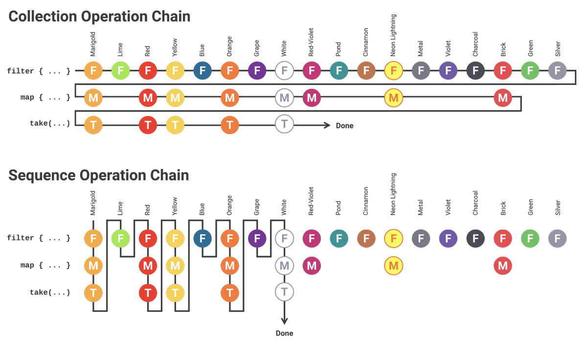

# Kotlin 시퀀스와 지연 계산 (Sequences and Lazy Evaluation)

### 개요

코틀린 인 액션을 읽으면서 sequences를 사용해 연산 성능을 향상시키는 것을 보고 백엔드 서버개발이나 알고리즘 문제를 풀 때 유용하게 사용되지 않을까하는 생각이 들어 개념을 더 잡기위해 공부를 해본다.



### 지연 계산 Lazy Evaluation

지연 계산은 값이 필요할 때까지 계산을 미루는 방식으로 코드에서 **값이 필요한 시점에서 계산을 수행하며, 그 이전에는 계산을 수행하지 않는다.** 이는 컴퓨팅 자원을 효율적으로 사용할 수 있도록 도와준다.

만약 모든 계산을 미리 수행한다면, 그 중 일부는 실제로 사용되지 않을 수 있다. 따라서 필요한 계산만 수행한다면 자원을 절약할 수 있다.

지연 계산은 대개 함수형 프로그래밍에서 사용되고, 함수형 프로그래밍에서는 값 자체보다는 값을 생성하는 함수를 중심으로 프로그래밍한다. 이때 함수의 반환값을 지연 계산하는 방식으로 값을 생성할 수 있다.

예를 들어, 코틀린에서 **Sequence**를 사용할 수 있거나 **lazy**키워드를 사용해 변수를 지연 초기화할 수 있다. 이를 통해서 변수의 초기화를 나중에 수행할 수 있으며, 이를 통해 자원을 절약할 수 있다.

### 시퀀스 Sequence

코틀린은 컬렉션을 다루는 다양한 api를 제공하고 그 중 하나가 시퀀스다. 시퀀스는 일련의 값들을 처리하는 데 사용된다. 시퀀스는 일반 컬렉션과는 다르게 **중간 처리 연산이 수행될 때마다 값을 생성 즉 지연 계산을 처리한다.**

**시퀀스의 장점**

* 지연 계산을 처리한다.
* 중간 처리 연산을 최적화한다. (예: filter 연산 후 map 연산을 수행하는 경우 시퀀스는 한 번에 두 연산을 수행할 수 있다.)
* 메모리 절약 ( 시퀀스는 한 번에 한 개의 요소만 생성하므로 컬렉션이 비해 메모리 사용량이 적다.
* 연산 체이닝 ( 시퀀스는 연산 체이닝을 사용하여 여러 연산을 한 줄에 연결하여 수행할 수 있다. -> 코드가 간결해진다.)
* 함수형 프로그래밍 스타일 ( 시퀀스는 함수형 프로그래밍 스타일에 부합하기 때문에 부작용을 최소화하고 코드의 가독성을 높인다.)
* 스레드 안정성 ( 시퀀스는 스레드에 안전하다. 즉, 여러 스레드에서 동시에 접근하여 사용할 수 있다. -> 멀티 스레드 환경에서 유용)

시퀀스는 sequenceOf() 함수를 사용하여 생성할 수 있으며, 또한, 다른 컬렉션을 시퀀스로 변환할 수도 있다. 이를 위해서는 asSequence()함수를 사용한다.

시퀀스는 일반적으로 map(), filter(), flatMap() 등의 중간 처리 연산과 toList(), toSet(), toMap() 등의 종료 연산을 제공한다.

### 시퀀스의 성능 측정

```
val list = (1..1000000).toList()

// 컬렉션 사용
val result1 = list.filter { it % 2 == 0 }.map { it * it }.toList()

// 시퀀스 사용
val result2 = list.asSequence().filter { it % 2 == 0 }.map { it * it }.toList()

val time1 = measureTimeMillis {
    list.filter { it % 2 == 0 }.map { it * it }.toList()
}

val time2 = measureTimeMillis {
    list.asSequence().filter { it % 2 == 0 }.map { it * it }.toList()
}

println("컬렉션 사용 ${time1}ms")
println("시퀀스 사용 ${time2}ms")
```

위의 코드는 1000000개의 요소를 처리하는 경우의 시간 측정 예시로 filter()연산 후 map()연산을 수행한다. asSequence()를 사용해 시퀀스로 변환한 후 연산을 수행하고, 결과를 다시 리스트로 변환하며. 결과로는 다음과 같다.

```
컬렉션 사용 20ms
시퀀스 사용 15ms
```

위 예시로는 시퀀스를 사용하면 컬렉션을 사용한 경우보다 약간 빠른 성능을 보여주지만 이는 실행 환경에 따라 다를 수도 있다. 따라서 시퀀스를 사용할 때에는 각각의 상황에서 성능을 측정하고 비교해보는 것이 좋다.

#### **시퀀스 사용을 피해야하는 상황?**

1. 작은 데이터셋에서의 연산 (지연 계산이 추가 오버헤드를 발생시킬 수 있기 때문)
2. 중간 결과가 필요한 경우 (지연 계산때문에 중간 결과를 볼 수 없어서 디버깅이나 테스트를 어렵게 한다.)
3. 병렬 처리가 필요한 경우 (단일 스레드에서 처리된다. 따라서 병렬 처리가 필요한 경우 시퀀스를 사용하는 것은 비효율적이다.)
   * 시퀀스는 스레드 안정성을 보장하지만 시퀀스를 처리하는 도중에 발생하는 다른 스레드와의 상호작용은 스레드 안전성을 보장하지 않는다.
   * 따라서 멀티 스레드 환경에서 시퀀스를 사용할 때에는 스레드 안정성에 대해 충분히 고려하여 적절한 동기화를 수행해야한다.
   * 멀티 스레드 환경에서도 스레드 안정성과 동기화 문제를 고려해야한다. 안정성을 보장하지만 적절한 동기화가 필요한 경우에는 적절히 동기화를 수행하자
