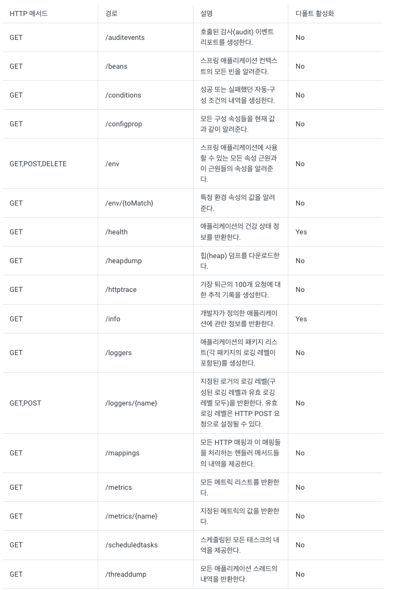
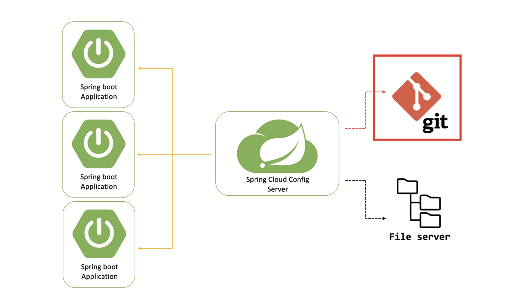

# 📗 Spring boot Actuator 스프링 부트 액추에이터 API + Spring Cloud를 사용한 예제

### 개요

Spirng boot 개발 환경에서 데이터들이 변경되거나 yaml 이 변경되었을때 서버를 재 가동시키는 방법 이외에 데이터 상태를 불러오는 방법이 있을까? 바로 Spring Actuator라는 라이브러리를 사용하는 것이다. 오늘은 그 Spring Actuator에 대해서 알아보겠다.

### 🧐 **Spring Actuator**

Spring Actuator란 무엇일까?

Spring Actuator는 스프링 부트 프레임워크에서 제공되는 라이브러리로서 스프링 푸트 애플리케이션의 모니터링이나 메트릭과 같은 기능을 HTTP와 JMX 엔드 포인트를 통해서 제공한다.

> **메트릭**이란?  
> 시스템, 프로세스, 제품 또는 서비스의 성능을 측정하는 데 사용되는 측정 항목이나 지표다.

Spring Actuator는 애플리케이션의 내부 확인이 가능하며, 어느 정도는 애플리케이션의 작동을 제어할 수 있게 해준다.

* 애플리케이션 환경의 구성 속성
* 로깅 레벨
* 사용 중인 메모리
* 지정된 엔드포인트가 받은 리퀘스트 횟수
* 애플리케이션의 건강 상태 정보

### 🖥  **Spring Actuator API**

스프링 액츄에이터를 사용하려면 다음과 같은 의존성을 추가해야한다.

```
implementation("org.springframework.boot:spring-boot-starter-actuator")
```

스프링 액츄에이터의 스타터 라이브러리가 빌드되면 다음과 같은 여러 액츄에이터 엔드포인트로 api를 사용할 수 있다.



### 🔨 **Spring Cloud와 함께 사용하는 예제**

spring cloud를 통해 다른 저장소에 있는 yml를 읽어 return하는 RestController Client Server와 ConfigServer를 구성하고 yml의 값을 업데이트했을때 스프링 부트 애플리케이션에서도 서버를 재실행하지않고 바로 값을 덤프하도록 refresh라는 api를 사용해보겠다.



#### Config Server

```
@SpringBootApplication
@EnableConfigServer
class ConfigServerApplication

fun main(args: Array<String>) {
    runApplication<DmsBackendApplication>(*args)
}
```

```
server:
  port: 8081

spring:
  cloud:
    config:
      server:
        git:
          uri: https://github.com/대충yml파일있는곳 # configtest-dev
```

#### Client Server

Controller

```
@RestController
class TestController(){
    @Value("test.value")
    private val configStr: String
    
    @GetMapping("/")
    fun test() = configStr
}
```

application.yml

```
server:
  port: 8082
  
spring:
  cloud:
     config:
       name: configtest-dev
       import: optional:configserver:http://localhost8081
```

configtest-dev

```
test:
  value: dev-test
```

여기서 http://localhost:8082로 GET 요청을 보내면 configtest-dev의 yml 정보 결과 값을 받아볼 수 있다. test.value = dev-test라는 정보도 함께 말이다.

> response: dev-test

자 여기서 test.value 의 값을 dev-test-2로 바꿔서 다시 GET요청을 보내본다면 어떻게 될까? **수정을 하더라도 똑같이 dev-test**의 결과값이 반환이된다. 데이터 상태가 로딩되지 않아서 이런 결과가 나오게 된다.

여기서 스프링 액츄에이터를 사용해 refresh 해보겠다.

application.yml에 다음과같은 정보들을 추가해보자

```
<-- .... -->

management:
  endpoints:
    web:
      exposure:
        include : refresh # 액츄에이터 기능중 refresh를 사용한다는 뜻이다 * 를 달면 다 사용한다는 뜻
```

그리고 TestController에 다음과같은 어노테이션을 달아준다.

```
@RestController
@RefreshScope
class TestController(){
    @Value("test.value")
    private val configStr: String
    
    @GetMapping("/")
    fun test() = configStr
}
```

자 이제 다시 dev-test로 데이터를 복구시키고 GET을 보내보면 똑같이 test.value: dev-test로 응답이 오게된다.

dev-test-2로 바꾸고 GET요청을 보내면 똑같이 값이 바뀌지 않은 상태로 dev-test응답이 오게되는데 여기서

http://localhost:8082/refresh로 POST 요청을 보내고 다시한번 http://localhost:8082에 GET요청을 보내주면

dev-test-2라는 데이터로 데이터가 리프레쉬되는것을 확인할 수 있다.

> response : dev-test-2

이렇게 스프링 액츄에이터를 사용해서 데이터 리프레쉬를 해봤다. 리프레쉬 이외에도 여러 기능들이 있으니 한번 공부해보고 사용해보면 좋을 것 같다. 포스팅 읽어주신분들에게 감사의 말을 전하며 Spring Cloud와 MSA에 대해서도 더욱 공부할 예정이다.
