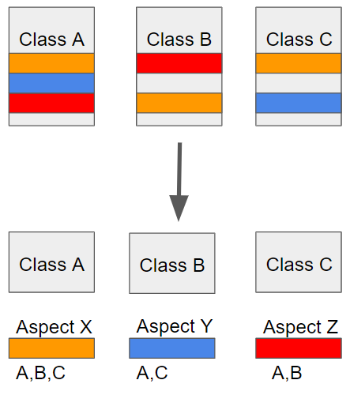

# 🌱 [Spring] AOP(Aspect Oriented Programming) 대체 뭘까? 🧐

### 개요

학교 내 만들어진 팀중 Lifestyle이라는 팀이 있다. 난 그곳의 리더로서 온라인 스터디라는걸 진행했다.

물론 참여자는 두명뿐이였지만.. 처음이니까 뭐 가볍게 하자는 마인드로

어쨌든 온라인 스터디의 메커니즘은 이렇다.

참여한 인원의 수만큼 스터디 주제를 정한다. -> 인원마다 하나씩 주제를 배정받는다 -> 1시간 스터디 후 발표

그래서 나는 이번에 AOP라는 주제를 받게되었고 정리해보려 한다.

### AOP(Aspect Oriented Programming)

AOP는 Aspect Oriented Programming의 약자로 **관점 지향 프로그래밍**이라고 불린다.

공통 관심 기능을 분리해 반복되는 부분을 추출해 핵심 로직에 영향을 미치지 않고 소스의 중복을 줄이는 기법으로

기존 OOP에서 공통 관심 기능을 여러 모듈에 적용해 발생하는 중복된 코드 양산의 한계를 극복하기 위해 나오게 되었습니다.

그 관점지향은 쉽게 말해 **어떤 기능을 기준으로 핵심적인 관점과 부가적인 관점으로 나누어서 보고**

**그 관점을 기준으로 각각 모듈화 하겠다는 것이다**.

*음.. 더 쉽게 말하면 핵심 로직에 집중할 수 있도록,*

*필요하지만 중복해서 작성해야 하는 핵심 로직 이외의 코드들은 외부로 빼놓는 것이다.*

위의 이미지처럼 한 클래스에 여러개의 관점이 있는 것이 아니라 전부 모듈화 하여

각각에 필요한 클래스가 가져다 사용하게 만든다.

***(예시)***

예시를 들어보겠다. 내가 만약 팩토리얼을 구하는 프로그램을 만들었다. 그러면 팩토리얼을 입력받아 값을 리턴하는

클래스를 재귀함수를 이용해 만들었다. 그리고 요구사항이 추가되었다. 계산을 시작하는 시점과 종료되는 시점의

시간을 밀리세컨드초로 구해달라는 요구사항이었다. 그렇게 팩토리얼을 계산하는 코드에 시작시간과 종료시간을 측정하는

기능을 구현했다. 그리고 여기서 또 요구사항이 추가되었다. 이번에는 반복문으로 팩토리얼을 구하는 프로그램에

시작 시간 종료 시간을 측정하는 기능을 넣어달라고 했다. 또다시 그 클래스들을 작성했다.

그리고 이번에는 다른 계산로직들을 여러개 받아 시작초 종료초에 대한 로직을 구현했다.

그렇게 1000개의 계산프로그램을 만들었다고 해보자. 그때 밀리세컨드로 구하라했던 시간을 마이크로세컨으로 수정하라는

요구가 들어왔다. 그러면 1000개의 계산 프로그램을 다 수정해야한다.

분명 핵심 로직은 계산일 것인데 다른 로직때문에 골머리를 앓게 된 것이다.

그렇다 관점 지향 프로그래밍의 관점은 관심사로도 볼 수 있다.

**핵심적인 관점(관심사), 부가적인 관점(관심사)**로 나누어 본다는 것도 여기서 알 수 있다.

위의 예시에서 핵심적인 관점은 계산로직이고 부가적인 관점은 시간을 구하는 로직이다.

그렇게 계산로직과 시간을 구하는 로직을 분리시켜 계산로직에 실행만 시켜주는 코드만 추가하면 해결할 일이다.

즉, 핵심 로직에 집중할 수 있도록, 필요하지만 중복해서 작성해야하는 핵심 로직 이외의 코드들은 **외부로 빼놓는 것**이다.

또한, AOP는 흩어진 Aspect들을 모아 모듈화 하는 기법입니다.

*Aspect란?*

*-> 객체지향 언어의 클래스와 비슷한 개념이라고 생각하면 쉽다.*

*-> 그 자체로 애플리케이션의 도메인 로직을 담은 핵심기능은 아니지만, 많은 오브젝트에 걸쳐 부가기능을 추상화해놓은 것이다.*

### AOP 주요 개념(용어)

**- Aspect:** 위에서 설명한 흩어진 관심사를 모듈화 한 것, 주로 부가기능을 모듈화 한다.

**- Target: Aspect**를 적용하는 곳(클래스, 메서드 등등)

**- Advice:** 실질적으로 어떤 일을 해야할 지에 대한 것으로 실질적인 부가기능을 담은 구현체

**- JoinPoint: Advice**가 적용될 위치로 끼어들 수 있는 지점.(= 메서드 진입 지점, 생성자 호출 시점, 필드에서 값을 꺼내올 때 등 다양한 시점에 적용 가능)

**- PointCut: JoinPoint**의 상세한 스펙을 정의한 것. 'A란 메서드의 진입시점에 호출할 것'과 같이 구체적으로 Advice가 실행될 지점을 정할 수 있음

### AOP 특징

- 프록시 패턴 기반의 AOP 구현체, 프록시 객체를 쓰는 이유는 접근 제어 및 부가기능을 추가하기 위해서임

*프록시 객체란?*

*여기서는 간단하게 특정 객체를 감싸 프로퍼티의 읽기 쓰기와 같은 객체가 가해지는 작업을 중간에서 가로채는 객체라고*

*간단하게 생각해두면 된다. 일단은 대행자라고 생각하자 가로채진 작업은 프록시 자체에서 처리되거나 원래 객체가 처리되도록 그대로 전달되기도 한다.*

- 스프링 빈에만 AOP를 적용 가능

- 모든 AOP 기능을 제공하는 것이 아닌 스프링 IoC와 연동하여 엔터프라이즈 애플리케이션에서 가장 흔한 문제(중복 코드, 프록시 클래스 작성의 번거러움, 객체들 간 관계 복잡도 증가...) 에 대한 해결책을 지원하는 것이 목적

### @AOP

- @Aspect: 이 어노테이션을 붙여 이 클래스가 Aspect라는걸 나타내는 클래스라 명시해 준다.

- @Around: 이 어노테이션은 타겟 메서드를 감싸 특정 Advice(구현체)를 실행한다는 의미다.

**e****xecution(\* com.saelobi..\*.EventService.\*(..)) 이런식으로 실행시점을 정해질 수 있다.**

또한 경로지정 방식말고 특정 어노테이션이 붙은 포인트에 해당 **Aspect**를 실행할 수 있는 기능도 제공한다.

@Around("@annotation(ANNOTATION)")

public class ...

그리고 스프링 빈의 모든 메서드에 적용할 수 있는 기능도 제공한다.

@Around("bean(SERVICENAME)")

public class ...

이 외에도 @Around외에 타겟 메서드의 Aspect를 실행 시점을 지정할 수 있는 어노테이션이 있다.

* @Before (이전) : 어드바이스 타겟 메소드가 호출되기 전에 어드바이스 기능을 수행
* @After (이후) : 타겟 메소드의 결과에 관계없이(즉 성공, 예외 관계없이) 타겟 메소드가 완료 되면 어드바이스 기능을 수행
* @AfterReturning (정상적 반환 이후)타겟 메소드가 성공적으로 결과값을 반환 후에 어드바이스 기능을 수행
* @AfterThrowing (예외 발생 이후) : 타겟 메소드가 수행 중 예외를 던지게 되면 어드바이스 기능을 수행
* @Around (메소드 실행 전후) : 어드바이스가 타겟 메소드를 감싸서 타겟 메소드 호출전과 후에 어드바이스 기능을 수행
