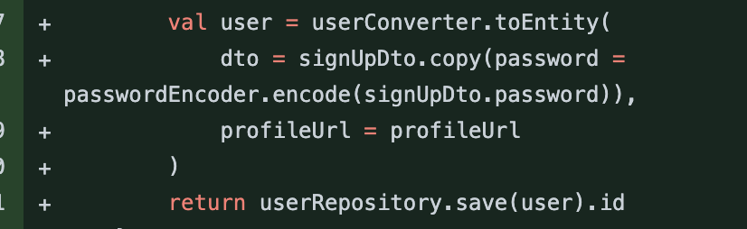
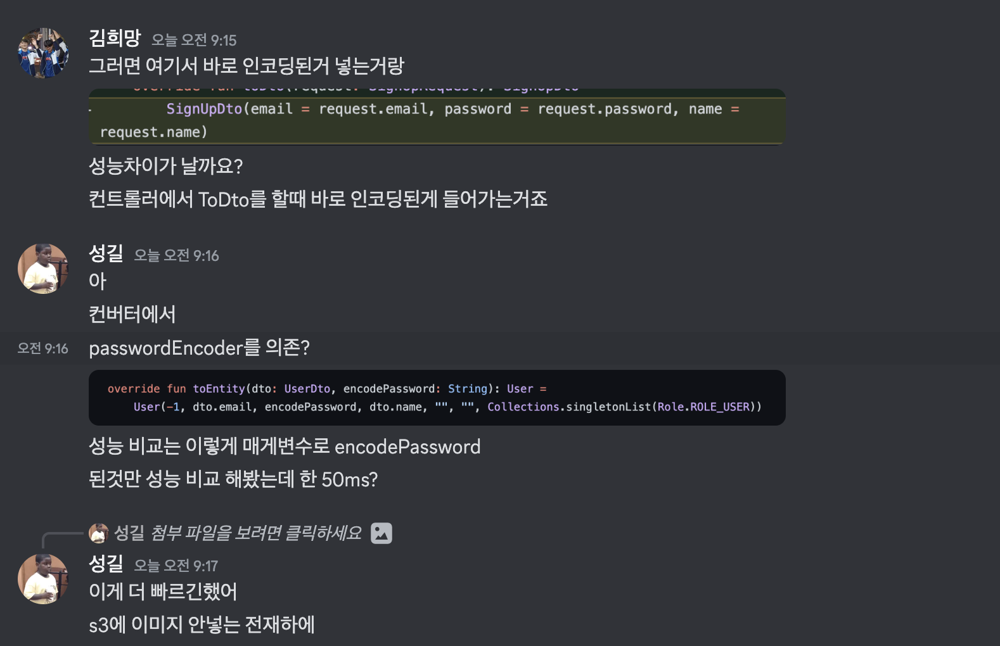

# [Kotlin, Spring boot] copy() 깊은복사, 얕은복사 성능상의 이점? 🤔

### **개요**

Kotlin Spring boot로 클린아키텍처를 적용하며 프로젝트를 만들어가고 있을때 RequestDto를 그냥 Dto로 변경해주고(toDto) 엔티티로 다시 변환할때(toEntity) copy() 메서드를 사용하여 password를 인코딩 시켰다. 이는 컨버터에서 패스워드 인코더를 의존하지 않고 서비스에서만 의존하는다는 이점이 있었다. (toDto에서 패스워드를 바로 인코딩시키면 패스워드 인코더를 컨버터가 의존하게 된다.)



여기서 copy()메서드는 새로운 객체를 만들어 다른 메모리공간에 할당한다는 점을 보아 성능상으로 차이가 많이 날까 궁금했다. 그렇게 성능 차이를 찍어본 결과 copy()를 사용하는 것이 조금 더 빨랐다.



그런데 갑자기 궁금해졌다 다른 메모리를 사용하여 공간을 할당한다해도 이게 프로젝트 전체를 보았을때 정말로 안전하고 또 빠를까? 그래서 copy()와 깊은 복사 얕은 복사에 대해서 조사를 해보았다.

#### **copy()와 얕은 복사, 깊은 복사**

**copy()**

* 코틀린에서 copy() 메서드는 객체를 복사하는 데 사용이 됩니다. 코틀린은 데이터 클래스에 대해서 copy()를 자동으로 생성해줍니다.
* copy()는 객체를 복사한 다음 일부 속성을 수정할 수 있도록 합니다.
* 코틀린에서 copy를 사용할때 성능 차이는 발생할 수 있으며 일반적으로 copy 함수를 사용하는 객체의 **크기에 따라 성능이 결정됩니다.**
* 당연하게도 작은 객체는 매우 빠르게 기능이 작동하지만 큰 객체는 복사 기간이 매우 오래 걸릴 수 있습니다.

**얕은 복사**

* copy함수는 얕은 복사를 수행하는데 이는 객체의 내부 참조를 복사하지 않고 **단순히 참조만 복사하는 것을 의미합니다.**
* 그렇기에 원본 객체를 참조하므로 복사된 객체와 원본 객체가 같은 객체를 참조합니다. **그래서 복사된 객체의 값을 변경하면 원본 객체의 값도 변경됩니다.**
* 객체에 내부 참조가 많이 포함되어 있거나 객체의 깊은 복사가 필요한 경우에는 성능이 저하될 수 있습니다.

```
val originalList = mutableListOf(1, 2, 3)
val shallowCopyList = originalList

shallowCopyList[0] = 0
println(originalList) // [0, 2, 3]
println(shallowCopyList) // [0, 2, 3]
```

위의 코드처럼 얕은복사를 했을때 객체가 가지고 있는 리스트의 값을 복사된 객체에서 수정할 경우 원본 객체의 리스트의 값도 수정이 됩니다.

**깊은 복사**

* 깊은 복사는 객체의 내용 전체를 복사합니다. 이는 복사된 객체와 원본 객체가 다른 객체를 참조하므로, 복사된 객체의 값응ㄹ 변경하더라도 원본 객체의 값은 변경되지 않습니다.
* 예를 들어 다음과 같이 리스트를 깊은 복사하고 값을 변경하면, 복사된 리스트만 변경됩니다.

```
val originalList = mutableListOf(1, 2, 3)
val deepCopyList = originalList.toMutableList()

deepCopyList[0] = 0
println(originalList) // [1, 2, 3]
println(deepCopyList) // [0, 2, 3]
```

따라서 얕은 복사와 깊은 복사는 객체의 복사 방법에 따라 복사된 객체와 원본 객체가 참조하는 객체가 같은 수도 있고 다를 수도 있습니다. 코틀린에서는 대부분의 객체가 얕은 복사와 깊은 복사를 모두 지원합니다.

```
data class Person(val name: String, val age: Int, val address: String, val phone: Phone)
data class Phone(val number: String)

val person1 = Person("hope", 18, "Korea", Phone("123-4567"))
val person2 = person1.copy(phone = Phone("555-5555"))
```

위의 코드처럼 두개의 데이터 클래스가 있고 copy를 사용해 다른 값 Phone 객체를 새로 생성해 넣으면 **깊은 복사**가 일어나며 서로 다른 객체가 됩니다. 그리고 값을 변경하지 않는 경우에는 **얕은 복사**가 발생합니다.

*만약 객체의 내용을 변경해도 원본 객체를 변경하고 싶지 않은 경우, 깊은 복사를 수행해야합니다. 이 경우에는 copy메서드에 인자를 전달해 새로운 객체를 생성할 때, 필요한 객체를 새로 생성하여 전달해주어야합니다.*

#### **얕은 복사 깊은 복사 객체의 동등성과 동일성**

***얕은 복사와 깊은 복사의 객체의 동등성과 동일성은 다릅니다.***

얕은 복사 객체는 객체의 참조값만 복사합니다 그래서 복사된 객체와 원본 객체가 같은 객체를 참조하고 있게 됩니다. 그래서 객체의 비교 연산자인 ==, === 연산의 결과는 true가 됩니다. 한마디로 동등성과 동일성 둘다 만족합니다.

반면에 깊은 복사 객체는 원본 객체와 다른 객체이므로 동일성도 다르고 동등성도 다릅니다. 새로운 객체가 생성되기 때문에 깊은 복사 객체의 원본 객체는 서로 다른 객체를 참조합니다. 따라서 깊은 복사 객체와 원본 객체는 동일하지도 않고 동등하지 않습니다.

==, ===의 연산자가 false가 됩니다.

***얕은 복사 객체는 ==, === 전부 true***

***깊은 복사 객체는 ==, === 전부 false***

#### **copy() 메서드를 사용했을 때 이점**

* **메모리 사용 감소**: copy() 메서드는 객체를 복사할 때, 새로운 메모리 공간을 할당하고 데이터를 복사합니다. 이때, 복사한 객체는 원본 객체와는 별개의 메모리 공간을 사용하므로, 메모리 사용량이 감소합니다.
* **속도 향상**: copy() 메서드는 객체를 복사할 때, 데이터를 복사하는 과정에서 빠른 알고리즘을 사용합니다. 따라서, 복사 과정이 빠르게 처리됩니다. 이는 대규모 데이터 처리에서 성능 향상에 도움을 줄 수 있습니다.
* **안정성 보장**: copy() 메서드는 객체를 복사할 때, 원본 객체와는 별개의 메모리 공간을 사용하므로, 복사 과정에서 생길 수 있는 오류나 예외를 방지할 수 있습니다. 또한, 다중 스레드 환경에서도 안전하게 사용할 수 있습니다.
* **코드 간결성**: copy() 메서드를 사용하면, 객체를 복사하는 코드를 직접 작성할 필요가 없으므로, 코드의 간결성을 유지할 수 있습니다. 이는 코드의 가독성과 유지보수성을 높일 수 있습니다.

***다시 프로젝트 내용으로 돌아와 SignUpDto를 컨버팅하는 과정에서 copy를 사용하면 좋은 이유가 무엇일까?***

-> 패스워드를 인코딩하는 과정은 상대적으로 오래걸리는 작업이다 그래서 엔티티 객체로 변환하면, 유저 엔티티 객체를 생성하는 작업과 **패스워드 인코딩하는 작업이 함께 이루어지기 때문에 객체를 생성하는 작업과 패스워드 인코딩 작업이 함께 이루어진다. 따라서 변환 작업에 걸리는 시간이 오래걸릴 수 있다.**

복사를 사용하여 새로운 객체를 생성한다면 원본 객체를 그대로 두고 새로운 객체를 생성하기 때문에 원본 객체의 상태를 그대로 유지할 수 있습니다. 따라서, 복사를 사용하여 새로운 객체를 생성하고 패스워드를 인코딩하는 작업을 따로 처리하면, 원본 객체의 상태를 그대로 유지할 수 있습니다. 따라서 복사를 사용하여 새로운 객체를 생성하고 패스워드를 인코딩하는 작업을 따로 처리하면 원본 객체의 상태를 변경하지 않고도 변환 작업을 수행할 수 있습니다.

**여기서 의문이 원본 객체를 그대로 두면 이점이 뭐가있을까? 한번 생각해보았다**

1. 원본 객체 상태를 그대로 유지하면 원본 객체를 그대로 사용해 다른 작업을 수행할 수 있다. 즉 User로 패스워드를 인코딩했지만 SignUpDto의 값은 그대로라 다른 작업을 처리할 수 있다.
2. 객체의 상태가 변경될 때 그 변경 사항이 예상치 못한 다른 코드에 영향을 미칠 수 있습니다. copy를 사용해 객체를 유지시켜 주면 그런 오류 위험을 감소할 수 있습니다.
3. 객체의 상태가 변경될 때, 해당 객체를 사용하는 다른 코드에도 영향을 미칠 수 있습니다.

따라서 성능상의 이점을 고려한다면, dto to entity로 변환하는 과정에서 복사를 사용해 새로운 객체를 생성하고 패스워드를 인코딩하는 작업을 별도로 처리하는 것이 좋아보인다.

**패스워드 인코딩과 엔티티로 변환하는 과정을 나누었을 때 성능이 더욱 좋아지는 이유는?**

1. **패스워드 인코딩은 보안적으로 cpu 연산을 많이 요구하는 작업이다.** 그러나, dto 객체를 엔티티 객체로 변환하는 작업은 cpu 연산보다 객체를 생서하고 복사하는 작업에 더 많인 비용이 든다. 따라서 패스워드 인코딩과 엔티티 변환을 하나의 작업으로 수행하면 보안적인 이유로 cpu 연산이 많이 요구되는 패스워드 인코딩 작업 때문에 전체 작업이 느려질 수 있다.
2. 패스워드 인코딩과 엔티티 변환을 나누면 나중에 엔티티 객체를 사용할 때 패스워드 인코딩 작업을 생략할 수 있다. 엔티티 객체의 패스워드를 검증할 때 패스워드를 다시 인코딩할 필요가 없다. 따라서 패스워드 인코딩과 엔티티 변환을 나누면 불필요한 작업을 피하고, 성능을 향상시킬 수 있다.
3. DTO와 엔티티 객체를 별도로 유지하면 둘 간의 역할을 명확히 구분할 수 있다. dto는 클라이언트 서버 간의 데이터 교환을 위한 객체로 사용되고 엔티티는 데이터베이스와 연동하여 영속화되는 객체로 사용됩니다. 그래서 두개의 객체를 명확히 구분시켜야 가독성과 유지보수성을 높일 수 있습니다.

그렇게 프로젝트를 진행하면서 copy 성능에 관한 궁금증을 해결했다. 앞으로도 copy 함수를 애용하면서 성능 관련한 코드들을 연구하고 더욱 연구하며 더 나은 개발자가 될 수 있도록 노력할 것이다. 이렇게 길고 심오한 포스팅을 읽어주셔서 감사의 말씀을 전한다.
