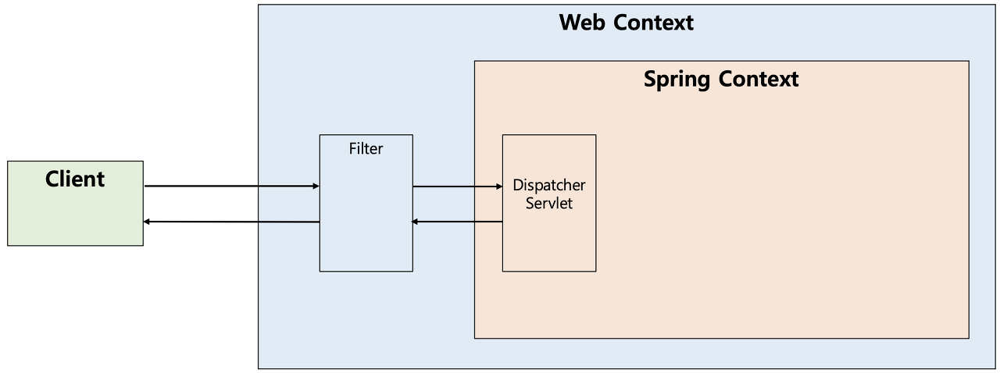
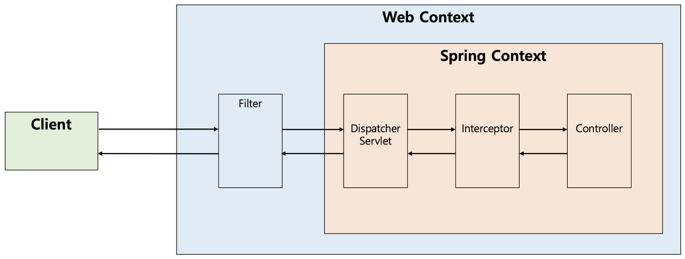
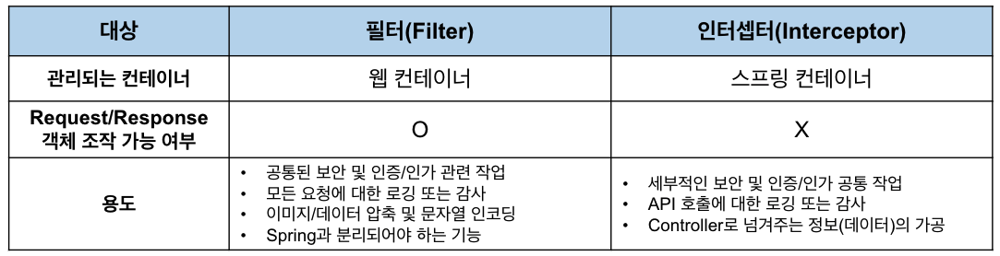

# 🔒 Servlet Filter, Spring Intercepter 특징과 차이 이해하기

#### 개요

Team.Lifestyle이라는 GSM의 학생들끼리 모인 팀이 있다 팀활동중 온라인 스터디를 진행하게 되었고

스터디 주제로 이 주제를 선정하게 되었다.

다들 스프링 시큐리티를 공부하면서 필터와 인터셉터에 대해서는 한번씩 들어보았을 것이다.

둘이 다른건 알겠지만 무엇이 다른지 제대로 설명못하는 나와 다른 백엔드 개발자들을 위해

한번에 정리해보도록 하겠다. 그리고 한번 AOP 관점으로도 알아보자

자바로 웹 개발을 하다보면, 공통적으로 처리해야 할 업무들이 많다.

### 서블릿 필터 (Servelt Filter)

필터는 간단히 말해서 HTTP요청과 응답을 변경, 재사용이 가능한 코드이다.

객체의 형태로 존재하며 클라이언트로부터 오는 요청과 최종 자원 사이에 위치해 클라이언트의 요청 정보를 변경할 수 있다.

필터는 J2EE 표준 스펙 기능으로 디스패처 서블릿(Dispatcher Servlet)에 요청이 전달되기 전/후에 url 패턴에 맞는 모든 요청에 대해 부가작업을 처리할 수 있는 기능을 제공한다.

디스패처 서블릿은 스프링의 가장 앞단에 존재하는 프론트 컨트롤러이므로, 필터는 스프링 범위 밖에서 처리된다.

즉, 스프링 컨테이너가 아니라 톰캣과 같은 웹 컨테이너에 의해 관리가 되는 것이다.(스프링 빈으로는 등록 가능)

디스패처 서블릿 전/후에 처리하는 것이다.



**필터의 흐름**

HTTP 요청 -> WAS -> Filter -> Servlet -> Controller

필터를 적용하면 필터가 호출된 후 다음에 서블릿이 호출된다.

**필터 제한**

HTTP 요청 -> WAS -> Filter -> Servlet -> Controller // 로그인 사용자

HTTP 요청 -> WAS -> Filter(적절하지 않은 요청이라 생각하면 서블릿 호출 x) //비 로그인 사용자

필터에서 적절하지 않은 요청이라고 판단되면 그곳에서 끝낼 수 있다.

**필터 체인**

HTTP 요청 -> WAS -> Filter1 -> Filter2 -> Filter3 -> Servlet -> Controller

필터는 이런식으로 체이닝을 할 수 있다.

예를 들어 로그를 남기는 필터를 적용 후 로그인 여부를 체크하는 필터를 추가할 수 있다.

#### 필터의 인터페이스, 메서드

필터를 추가하기 위해서는 javax.servlet의 Filter 인터페이스를 구현해야하며 이는 다음 3가지 메서드를 가지고있다.

1. init()

2. doFilter()

3. destroy()

```
public interface Filter {

    public default void init(FilterConfig filterConfig) throws ServletException {}

    public void doFilter(ServletRequest request, ServletResponse response,
            FilterChain chain) throws IOException, ServletException;

    public default void destroy() {}
}
```

**init()**

* init메서드는 필터 객체를 초기화시키고 서비스를 추가하기 위한 메서드다.
* 웹 컨테이너가 1회의 init 메서드를 호출해 필터 객체를 초기화하면 이후 요청들은 doFilter를 통해 처리된다.

**doFilter()**

* doFilter는 url 패턴에 맞는 모든 HTTP 요청이 디스패처 서블릿으로 전달되기전에 웹 컨테이너에 의해 실행되는 메서드다.
* doFilter에 인자로는 FilterChain이 있다. FilterChain의 doFilter를 통해 다음 대상으로 요청을 전달하게 된다.
* chain.doFilter() 전/후에 우리가 필요한 처리 과정을 넣어줌으로써 원하는 처리를 진행할 수 있다.

**destroy()**

* destroy메서드는 필터 객체를 서비스에서 제거하며 사용하는 자원을 반환하는 메서드다.
* 이는 웹 컨테이너에 의해 1번만 호출되며 이후에는 doFilter가 사용되지 않는다.

예시 코드 : HTTP 요청으로 오는 유저의 정보를 로그로 찍는 필터를 만들어보자

```
@Slf4j
public class LogFilter implements Filter {
	
    @Override
    public void doFilter(ServletReqeust req, ServletResponse res, FilterChain chain) throws IOException, ServletException {
    	log.info("Run LogFilter.doFilter()");
        
        // ServletRequest는 기능이 많지 않다 그래서 다운캐스팅을 사용한다.
        // HTTP 요청이 아닌 경우까지 고려해 만든 인터페이스기 때문.
        
        HttpServletRequest request = (HttpServletRequest) req;
        String requestURI = request.getRequestURI();
        String uuid = UUID.randomUUID().toString();
        
        try{
        	log.info("로그필터 Request {} , {}",uuid,requestURI);
            // 다음 필터가 있으면 호출 없으면 서블릿 호출 이 부분이 없으면 다음 단계가 진행이 되지 않는다.
            chain.doFilter(request, response); 
        } catch(Exception e) {
        	throw e;
        } finally{
        	log.info("로그필터 종료");
        }
    }
}
```

UUID.randomUUID().toString(): 요청을 구분 짓기 위함이다.

*Filter를 만들었으면 FilterRegisterBean을 사용해 필터를 빈으로 등록해야한다.*

### 인터셉터 (Interceptor)

Spring이 제공하는 기술로써, 디스패처 서블릿이 컨트롤러의 핸들러(사용자가 요청한 url에 따라 실행되어야 할 메서드, 이하 핸들러)를 호출하기 전과 후에 요청과 응답을 참조하거나 가공할 수 있는 일종의 필터다.

Intercept라는 단어는 '낚아채다'라는 의미이며 해당 단어와 의미와 같이 사용자 요청에 의해 서버에 들어온 Request객체를

컨트롤러의 핸들러로 도달하기전에 낚아채 개발자가 원하는 추가적인 작업을 한 후 핸들러로 보낼 수 있도록 해주는것이 인터셉터다.

웹 컨테이너에서 동작하는 필터와 달리 인터셉터는 스프링 컨텍스트에서 동작한다.

디스패처 서블릿은 핸들러 매핑을 통해 적절한 컨트롤러를 찾도록 요청하는데 그 결과로 시행 체인(Handler ExecutionChain)을 돌려준다. 그래서 이 실행 체인은 1개 이상의 인터셉터가 등록되어 있다면 순차적으로 인터셉터들을 거쳐 컨트롤러가 실행되도록 하고, 없다면 바로 컨트롤러를 실행시킨다.

인터셉터는 스프링 컨텍스트내에서 동작하므로 웹 컨텍스트에 있는 필터를 거쳐 프론트컨트롤러인 디스패처 서블릿이 요청을 받은 후 동작하게 된다.

**사용하는 이유?**

특정 컨트롤러의 핸들러가 실행되기 전이나 후에 추가적인 작업을 위해 인터셉터를 사용하는데

(추가적인 작업으로는 로그인체크, 권한 체크 등이 있다.)

예시를 들어보겠다.

오직 개발자만 사용할 수 있는 관리자 컨트롤러 핸들러를 작성했다고 해보자.

개발자는 오직 관리자 계정만 실행할 수 있도록 하기 위해 핸들러에 접근하는 사용자가 관리자인지 확인하는 세션 체크 코드들을

각 핸들러들에게 하나하나씩 작성해주어야한다. 작성해주는 핸들러의 수가 만약 많아진다면 어떻게 될까?

1. 메모리 낭비, 서버의 부하

적용해야할 핸들러 수만큼 세션체크 코드들을 작성함으로써 반복되는 코드들이 많아져서다.

2.코드의 누락에 대한 걱정

사람이 작성하는 것이기 때문에 누락과 같은 실수가 발생할 수 있다. 만약 회원정보에 접근하는 핸들러에 세션체크가 누락된다면?

상상만해도 끔찍하다.



위 그림은 순서를 도식화한 것이므로 인터셉터가 컨트롤러에게 요청을 위임하지는 않는다.

#### 인터셉터의 인터페이스,메서드

인터셉터를 추가하기 위해서는 org.springframework.web.servlet의 HandlerInterceptor 인터페이스를 구현(implements)해야 하며, 이는 다음의 3가지 메소드를 가지고 있다.

1. preHandle()

2. postHandle()

3. afterCompletion()

```
public interface HandlerInterceptor {

    default boolean preHandle(HttpServletRequest request, HttpServletResponse response, Object handler)
        throws Exception {
        
        return true;
    }

    default void postHandle(HttpServletRequest request, HttpServletResponse response, Object handler,
        @Nullable ModelAndView modelAndView) throws Exception {
    }

    default void afterCompletion(HttpServletRequest request, HttpServletResponse response, Object handler,
        @Nullable Exception ex) throws Exception {
    }
}
```

**preHandle()**

* 컨트롤러가 호출되기 전에 실행된다.
* 컨트롤러 이전에 처리해야하는 전처리 작업, 요청 정보를 가공하거나 추가하는 경우에 사용할 수 있다.
* preHandle의 3번째 파라미터인 handler 파라미터는 핸들러 매핑이 찾아준 컨트롤러 빈에 매핑되는 HandlerMethod라는 새로운 타입의 객체로써, @RequestMapping이 붙은 메소드의 정보를 추상화한 객체이다
* 실행되어야 할 핸들러에 대한 정보를 인자값으로 받기 때문에 '서블릿 필터'에 비해 세밀하고 로직을 구성할 수 있다.
* 리턴값이 boolean이다. 리턴에 true일 경우 preHandle()을 실행한 후 핸들러에 접근한다
* false일 경우 작업을 중단하기 때문에 컨트롤러와 남은 인터셉터가 실행되지 않는다.

**postHandle()**

* 컨트롤러를 호출된 후에 실행된다.
* 핸들러가 실행은 완료되었지만 아직 뷰가 생성되기 이전에 호출된다.
* ModelAndView 타입의 정보가 인자값으로 받는다. 따라서 컨트롤러에서 뷰 정보를 전달하기 위해 작업한 모델의 객체의 정보를 참조하거나 조작할 수 있다. 최근에는 JSON형태로 데이터를 제공하는 RestAPI기반의 컨트롤러(@RestController)를 만들면서 자주 사용되지는 않는다.
* preHandle()에서 false를 리턴할 경우 실행되지 않는다.
* 적용중인 인터셉터가 여러개인 경우에는 preHandle()은 역순으로 호출된다.
* 비동기적인 요청처리시에는 처리되지 않는다.
* 컨트롤러 하위 계층에서 작업을 진행하다가 중간에 예외가 발생하면 postHandle은 호출되지 않는다.

**afterCompletion()**

* 모든 View에서 최종 결과를 생성하는 일을 포함한 모든 작업이 완료된 후에 실행된다.
* 요청 처리중 사용한 리소스를 반환해주기 적당한 메서드다.
* preHandle()에서 false를 리턴할 경우 실행되지 않는다.
* 적용중인 인터셉터가 여러개인경우 preHandle()는 역순으로 호출된다.
* 비동기적 요청 처리시에 호출되지않는다.
* postHandle()과 달리 컨트롤러 하위 계층에서 작업을 진행하다가 중간에 예외가 발생하더라도 afterCompletion은 반드시 호출된다.

HandlerInterceptor작업의 로그를 찍는 인터셉터를 구현해보았다.

```
@Slf4j
public class CustomInterceptor implements HandlerInterceptor {
 
    @Override
    public boolean preHandle(HttpServletRequest request, HttpServletResponse response, Object handler)
            throws Exception {
        
        log.info("preHandle1");
        
        return true;
    }
 
    @Override
    public void postHandle(HttpServletRequest request, HttpServletResponse response, Object handler,
            ModelAndView modelAndView) throws Exception {
        
        log.info("postHandle1");
        
    }
 
    @Override
    public void afterCompletion(HttpServletRequest request, HttpServletResponse response, Object handler, Exception ex)
            throws Exception {
        
        log.info("afterCompletion1");
        
    }    
    
}
```

#### 인터셉터 vs AOP

인터셉터 대신에 컨트롤러들에 적용할 부가기능을 어드바이스로 만들어 AOP를 적용할 수도 있다.

하지만 다음과 같은 이유들로 컨트롤러의 호출 과정에 적용되는 부가기능들은 인터셉터를 사용하는 편이 낫다.

1. 컨트롤러 타입과 실행 메서드가 모두 제각각이라 포인트컷(적용할 메서드 선별)의 작성이 어렵다.

2. 컨트롤러는 파라미터나 리턴 값이 일정하지 않다.

3. AOP에서는 HttpServletRequest,Response 객체를 얻기 어렵지만 인터셉터는 파라미터로 넘어온다.

### 필터(FIlter) vs 인터셉터(Interceptor) 차이

필터와 인터셉터는 각각이 관리되는 컨테이너와 Request/Response의 조작 가능여부가 다르고, 그에 따라 용도가 다르다.



일부에서 필터(Filter)가 스프링 빈으로 등록되지 못하며, 빈을 주입 받을 수도 없다고 하는데, 이는 잘못된 설명이다. 이는 매우 옛날의 이야기이며, 필터는 현재 스프링 빈으로 등록이 가능하며, 다른 곳에 주입되거나 다른 빈을 주입받을 수도 있다.

**Request,Response 객체 조작 여부**

필터는 Request,Response를 조작할 수 있지만 인터셉터는 조작할 수 없다.

여기서 조작은 내부 상태 변경이 아니라 다른 객체로 바꿔친다는 의미이다.

필터가 다음 필터를 호출하기 위해서는 필터 체이닝을 해주어야한다. 그리고 이때 Request/Response객체를 넘겨준다.

즉 우리가 원하는 Request/Response객체를 넘겨줄 수 있다. NPE(NullPointException)가 나겠지만 null로도 넣을 수 있는것이다.

```
public MyFilter implements Filter {

    public void doFilter(ServletRequest request, ServletResponse response, FilterChain chain) {
        // 개발자가 다른 request와 response를 넣어줄 수 있음
        chain.doFilter(request, response);       
    }
    
}
```

하지만 인터셉터는 처리 과정이 필터와는 다르다.

디스패처 서블릿이 여러 인터셉터 목록을 가지고 있고 반복문으로 순차적으로 실행시킨다.

그리고 true를 반환해야 다음 인터셉터가 실행되거나 컨트롤러로 요청이 전달되며 false는 요청이 중단된다.

그러므로 우리가 다른 Request/Response 객체를 넘겨줄 수 없다. 그리고 이러한 부분이 필터와 확실히 다른점이다.

```
public class MyInterceptor implements HandlerInterceptor {

    default boolean preHandle(HttpServletRequest request, HttpServletResponse response, Object handler) {
        // Request/Response를 교체할 수 없고 boolean 값만 반환할 수 있다.
        return true;
    }

}
```

### 필터(Filter)와 인터셉터(Interceptor)의 용도 및 예시

**필터의 용도 및 예시**

* 공통된 보안 및 인증/인가 관련 작업
* 모든 요청에 대한 로깅과 검사
* 이미지/데이터 압축 및 문자열 인코딩
* 스프링과 분리되어야 하는 기능들

필터에서는 기본적으로 **스프링과 무관하게 전역적으로 처리해야하는 작업**들을 처리할 수 있다.

대표적으로 보안 공통 작업이 있고 필터는 인터셉터보다 앞단에서 동작하므로 전역적으로 해야하는 보안검사(XSS 방어 등)를 하여 올바른 요청이 아닐 경우에 차단을 할 수 있다. 그러면 스프링 컨테이너까지 요청이 전달되지 못하고 차단되므로 안정성을 높일 수 있다.

또한 이미지 필터는 이미지나 데이터 압축이나 문자열 인코딩과 같이 **웹 애플리케이션에 전반적으로 사용되는 기능을 구현**하기에 적당하다. 필터는 다음 체인으로 넘기는 ServletRequest/ServletResponse 객체를 조작할 수 있다는 점에서 인터셉터보다 훨씬 강력한 기술이다.

**인터셉터의 용도 및 예시**

* 세부적인 보안 및 인증/인가 공통 작업
* API 호출에 대한 로깅 또는 검사
* 컨트롤러로 넘겨주는 데이터가공

인터셉터는 **클라이언트의 요청과 관련되어 전역적으로 처리해야 하는 작업들을 처리할 수 있다.**

대표적으로 세부적으로 적용해야 하는 인증과 인가와 같이 클라이언트 요청과 관련된 작업 등이 있다.

예를 들어 특정 그룹의 사용자는 어떤 기능을 사용하지 못하는 경우가 있다.

이러한 작업들을 컨트롤러로 넘어가기 전에 검사해야 하므로 인터셉터가 처리하기 적합하다.

또한 인터셉터는 필터와 다르게 HttpServletRequest/HttpServletResponse 등과 같은 객체를 제공받으므로

객체 자체를 조작할 수는 없다. 대신 해당 객체의 내부적으로 갖는 성질은 조작할 수 있으므로 **컨트롤러로 넘겨주기 위한 정보를 가공**하기에는 용이하다. 예를 들어서 사용자 ID를 기반으로 조회한 사용자 정보를 HttpServletRequest에 넣어줄 수 있다.

그 외에도 우리는 다양한 목적으로 api 호출에 대한 정보들을 기록해야 할 수 있다. 이러한 경우에 HttpServletRequest, Response를 제공해주는 인터셉터는 클라이언트의 IP나 요청 정보들을 포함해 기록하기 용이하다.

대표적으로 필터(Filter)를 인증과 인가에 사용하는 도구로는 SpringSecurity가 있다. SpringSecurity의 특징 중 하나는 Spring MVC에 종속적이지 않다는 것인데, 이러한 이유로는 필터 기반으로 인증/인가 처리를 하기 때문이다.
