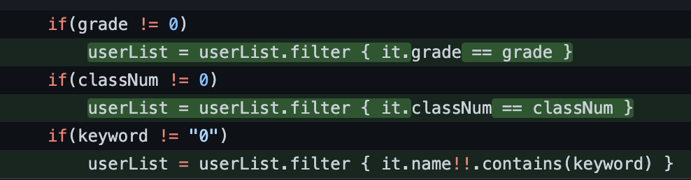
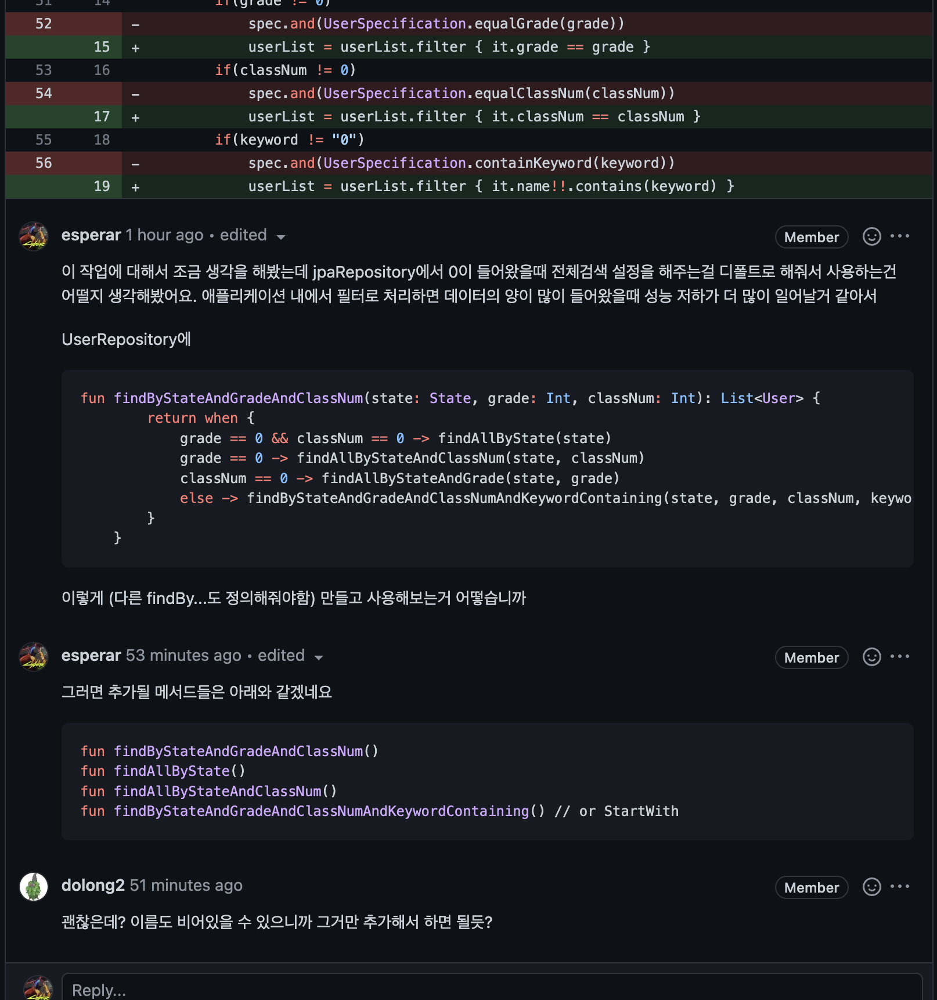

# [Kotlin, Spring boot] 검색 api에서 find Query vs Internal Function 데이터 처리 효율? 🤔

### 개요

교내 프로젝트중 교내 계정 통합 소셜 로그인 서비스 GAuth를 개발하는 중에 가입된 유저를 검색하는 api가 있다 학년 반 키워드를 입력받아 검색 기능을 처리했고 만약 0을 입력받으면 전부 검색한다는 요구사항이 있었다. 그리고 그걸 내가 개발한게 아니고 팀원이 개발을 해서 pull request를 보내고 코드리뷰를 하는 과정에서 궁금증이 생겼다.

findAllByState (State는 CREATED, PENDING으로 CREATED를 가져오는 jpa 메서드)로 유저 리스트를 가져오고

if(grade != 0) users.filter{ it.grade == grade } 이런식으로 애플리케이션 내부로직에서 필터작업을 했다.



그런데 뭔가 아쉬운 느낌이 들었다. 과연 애플리케이션 내부 로직으로 유저 리스트와 같은 많은 연산을 필요로하는 작업을 처리해도 되는걸까 .contains를 사용했을때 최악의 경우에 users.size 만큼 돌아야 한다는 단점도 있었다.

find query를 사용해서 검색을 하는 것이 성능상인 측면으로 더욱 좋아보였다. 3번의 filter 과정보다는 0이 입력됐을때 상황에 따라 find를 해주는 것을 바꿔보는것은 어떨까라는 생각을 해보았다.

그래서 JpaRepository에 함수를 선언하는데 그곳에서 when을 사용해 인자로 받은 (grade, classNum, keyword)가 0일때 다른 find메서드를 사용해주는 형식으로 디폴트 함수를 userRepository에 만드는 것이다.

```
fun findByStateAndGradeAndClassNum(state: State, grade: Int, classNum: Int): List<User> {
        return when {
            grade == 0 && classNum == 0 -> findAllByState(state)
            grade == 0 -> findAllByStateAndClassNum(state, classNum)
            classNum == 0 -> findAllByStateAndGrade(state, grade)
            else -> findByStateAndGradeAndClassNumAndKeywordContaining(state, grade, classNum, keyword)
        }
    }
```

이런식이다.

*그에 따라 findAllByStateAndClassNum, findAllByStateAndGrade, findByStateAndGradeAndClassNumAndKeywordContaining과 같은 메서드들을 선언해줘야한다.*



물론 find를 하는것이 꼭 내부 함수를 통해 데이터를 처리하는 것보다 무조건적으로 좋다고는 할 수 없다. find쿼리만으로는 찾을 수 있는 데이터의 한계가 있기 때문이다.

복잡한 조건이 필요하거나 쿼리만으로 데이터를 검색하는데에 한계가 있으면 내부함수 그리고 웬만한 데이터 처리 작업은 find쿼리로 수행하는 것이 좋아보인다.

#### 결론

1. 내부 함수로 검색 api를 구현했는데 쿼리만으로 해결이 가능해보임 그리고 조금 코드가 지저분해보임

2. JpaRepository 를 구현한 repository 클래스에서 검증처리와 검증에 따른 find 메서드를 실행함.

3. find 쿼리가 많은 연산을 필요로하는 데이터를 처리하는 것 보다는 성능상으로 나아보임

4. 쿼리문만으로는 할 수있는것은 한계가 있기때문에 상황에 맞게 코드를 작성해야할거같다.
