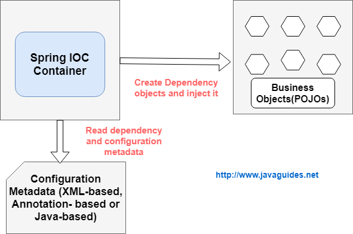
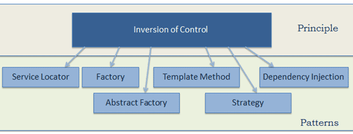
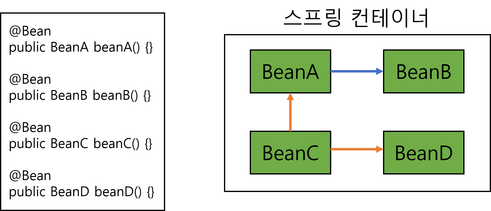

# [Spring] IoC, DI, Spring Container, Bean 완벽하게 알아보자 📗

### 개요

스프링 프레임워크를 사용하는 개발자라면 IoC, DI, Container, Bean 이 네가지는 반드시 알아가야할 개념이라고  생각한다.

그렇기에 이시간에 완벽하게 정복 해보도록 하자

### IoC (Inversion of Control)

**IoC란 Inversion of Control의 약어로 해석하면 제어의 역전이다.**

**말 그대로 메서드나 객체의 호출작업을 개발자가 결정하는 것이 아닌 외부에서 결정되는 것이다.**

**장점**

객체의 의존성을 역전시켜 객체 간의 결합도를 줄이고 유연한 코드를 짜게한다.

가독성 및 코드중복과 유지보수를 더욱 편하게 할 수 있게 해준다.

일반적인 의존성에 대한 제어권: 개발자가 직접 의존성을 만듦

-> *의존성은 쉽게 말해서 어떠한 객체가 사용해야 할 객체라고 할 수 있고, 이것을 직접 생성자를 통해*

*만들어쓰면 의존성을 자기가 직접 만들어 쓴다고 할 수있다.*

직접적으로 의존성을 만들지 않고, 외부에서 의존성을 가져오는 경우를 말할 수 있다.

이 방식을 사용해 개발자는 필요한 부분을 개발해 조립하듯이 개발을 하게 된다.

조립된 코드의 최종 호출은 개발자에 의해서 제어되는 것이 아닌 프레임워크 내부에서 결정된 대로 이뤄진다.

이러한 현상을 **제어의 역전** 이라고 표현한다.

### DI (Dependency Injection)

**DI는 Dependency Injection의 줄임말로 번역하면 의존성 주입이라는 말이다.**

말 그대로 객체를 직접 생성하는 것이 아닌 외부에서 생성 후 주입시켜주는 방식이다.

*의존성 주입은 제어의 역전이 일어날 때 스프링 내부에 있는 객체들간의 관계를 관리할 때 사용하는 기법이다.*

*자바는 일반적으로 인터페이스를 사용해 의존적인 객체의 관계를 최대한 유연하게 처리할 수 있도록 한다.*

의존성 주입은 의존적인 객체를 직접 생성하거나 제어하는 것이 아닌 특정 객체에 필요한

**객체를 외부에서** **결정 후 연결**시키는 것을 의미한다.

즉, 우리는 클래스의 기능을 추상적으로 묶어둔 인터페이스를 쓰면 되는 것이다.

나머지는 스프링에서 객체를 주입해주기 때문 (ex : Service 인터페이스와 ServiceImpl 구현부를 만든 후 Service로 선언해 사용)

따라서 이러한 의존성 주입을 통해 **모듈 간 결합도는 낮아지고 유연성은 높아진다.**

### Spring Container

Spring Container는 **자바 객체의 생명 주기를 관리하고, 생성된 자바 객체들에게 추가적인 기능을 제공하는 역할을 한다.**

여기서 말하는 자바 객체를 스프링에서 **Bean** 부른다. 그리고 **IoC**와 **DI**의 원리가 여기에 적용이 된다.

**스프링 컨테이너는 두가지 종류가 있는데 BeanFactory, ApplicationContext가 있다.**

**BeanFactory**

빈을 생성하고 의존관계를 설정하는 기능을 담당하는 가장 기본적인 IoC 컨테이너자 클래스다.

****BeanFactory는 빈을 등록, 생성, 조회후 돌려주는 등 빈 관리를 하는 역할을 한다. getBean()메서드를 통해 빈을 인스턴스화할 수 있다.

**ApplicationContext**

ApplicationContext는 BeanFactory를 구현하고 있어 BeanFactory의 확장된 버전이라 생각하면 된다.

-> 빈 팩토리라고 말할 때 빈을 생성하고 관계를 설정하는 IoC의 기본 기능에 초점을 맞춘 것이다.

-> 애플리케이션 컨텍스트는 별도의 정보를 참고해 빈의 생성, 관계 설정 등 제어를 총괄하는 것에 초점을 맞춘 것이다.

스프링 컨테이너의 생성 과정은 비어있는 스프링 컨테이너가 생성이되고

스프링 빈이 등록(Java, XML등을 기반으로) 되며 그 이후로 스프링 빈의 의존관계가 설정(DI)된다.

그럼 여기서 Bean은 무엇일까?

### Bean

**Spring IoC컨테이너가 관리하는 자바 객체를 빈(Bean)이라고 부른다**

스프링 빈을 컨테이너에 등록하는 방법은 두가지가 있다.

1. 자바 annotation을 이용한 빈 등록 방법.

@Component 어노테이션이 등록이 되어있으면 Spring이 어노테이션을 확인하고 자체적으로 빈에 등록한다.

2. Bean Configuration File에 직접 등록

@Configuration과 @Bean 어노테이션을 이용해 직접 빈을 등록할 수 있다.

#### 참고글

<https://melonicedlatte.com/2021/07/11/232800.html>

[스프링 빈(Spring Bean)이란? 개념 정리 - Easy is Perfect

melonicedlatte.com](https://melonicedlatte.com/2021/07/11/232800.html)

<https://chanhuiseok.github.io/posts/spring-4/>

[[Spring] Spring의 IoC(Inversion of Control)과 Bean

컴퓨터/IT/알고리즘 정리 블로그

chanhuiseok.github.io](https://chanhuiseok.github.io/posts/spring-4/)

<https://dev-aiden.com/spring/Spring-Container/>

[[Spring] 스프링 컨테이너(Spring Container)

스프링 컨테이너(Spring Container)

dev-aiden.com](https://dev-aiden.com/spring/Spring-Container/)
