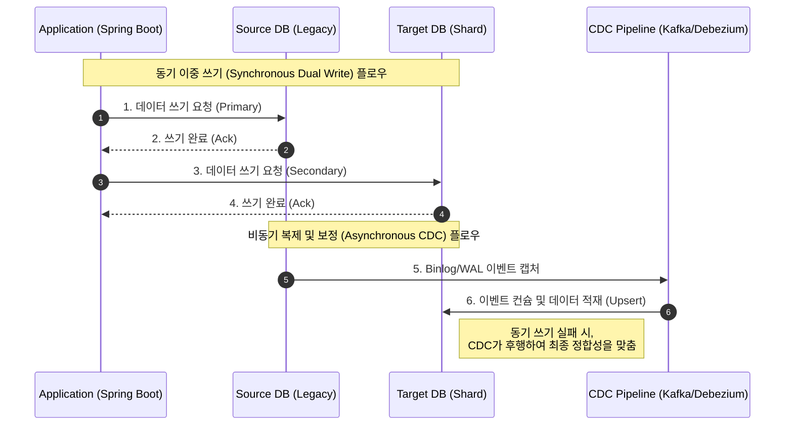

# Spring @Transactional 트랜잭션 바인딩과 Auto-Commit

[이 글](http://github.com/esperar/estudy/blob/master/Back-End/dbmigrate.md) 에서 언급한 내용중에서 다중 데이터소스환경에서 `@Transactional` 활용을 하면 동작은해도 트랜잭션 정합성이 보장이 안될 수 있다고 했다.

그 이유는 다중 데이터베이스 환경이기 때문에 이 어노테이션을 함수로 두고 

```kt
@Transactional
fun create() {
    sourceDbRepository.save(User(name = "khope"))

    try {
        targetDbRepository.save(User(name = "khope"))
    } catch (e: Exception) {
        ...
    }
}
```

이런류의 코드를 동작시켰고 sourceDb와 targetDb의 Datasource가 다를때, 트랜잭션을 하나로 묶을 수 없기 때문에 (애초에 디비가 달라서) 이다.

물리적으로 봣을때 당연한 개념인데 `Transactional` 어노테이션이 데이터소스가 다른게 여러개면 튕겨낼 줄 알았는데, (물론 세팅하는 과정에서 `@Primary`로 줘서 기본값을 주면 읽어올때 primary를 읽어 튕겨내진 않을듯.) 단순 궁금증이 생겼다 어떻게 트랜잭셔널이 구성되는가.

그래서 그냥 내부 동작원리를 공부하기로 했다.

### 트랜잭션 바인딩과 Auto-Commit

**트랜잭션 매니저 바인딩 Transaction Manager Binding**: Spring의 `@Transactional` 어노테이션은 AOP를 통해 동작하며, 기본적으로 단 하나의 **TrnasacionalManager**와 결합한다. 명시하지 않으면 `Primary`로 설정된 매니저(여기서는 source db)만 현재 스레드에 바인딩한다.

**Auto-Commit**: DBMS의 기본 동작 방식으로 트랜잭션 제어(BEGIN/COMMIT)가 명시적으로 선언되지 않은 세션에서 쿼리가 실행되면 즉시 디스크에 영구 반영하는 속성이다.

그래서 커스텀 구성했을때 예외가 터지지 않고 동작하는 이유는? spring은 하나의 트랜잭셔널 블록 내에서 외부 네트워크 api를 호출하거나 파일을 쓰거나 다른 db에 접근하는 등 이기종 자원 접근을 프레임워크 단에서 막지 않는다.

쉽게 말해서 다른 db.get()이나 externalApiClient.get()이나. 물리적으로 다른 source를 보고 get해온다는 점은 같으므로 프레임워크단에서 막을 이유가 없기 때문에 그렇게 구현을 해놓은것이고.

저 위에글 링크에서 dual write 시나리오를 예기하는데 내부적으로 일어나는 동작순서는 다음과 같다.

1. **트랜잭션 시작**: 메서드 진입시 `@Primary`인 `sourceTransactionalmanager`가 SourceDB의 커넥션을 가져와 `autocommit=false`로 설정하고 트랜잭션을 연다.
2. **SourceDB 쓰기**: jpa source db에 insert 쿼리 (커밋 이전)
3. **TargetDB 쓰기**: 여기가 문제 구간인데 shardUserRepository.save() 가 호출되고 targetdb의 엔티티 매니저는 현재 스레드를 확인하지만 target db용으로 열려있는 트랜잭션을 찾지 못한다.
4. **AutoCommit**: target db 엔티티 매니저는 예외를 던지는 대신, 단순히 `targetDataSouce`에 커넥션을 하나 빌려와 트랜잭션 없는 단일 쿼리 autocommit을 하고 커넥션을 즉시 반환해버린다.
5. **트랜잭션 종료**: 메서드가 정상 종료되면 source db의 트랜잭션이 비로소 commit 된다.


이러한 암묵적인 동작을 눈으로 확인하려면 트랜잭션 매니저의 로그레벨읠 디버그로 낮춰서 스레드 바인딩 상태를 추적할 수 있다

```yml
logging:
  level:
    org.springframework.transaction: DEBUG
    org.springframework.orm.jpa: DEBUG
    com.zaxxer.hikari: TRACE
```

위 설정을 켜고 실행하면 서버 로그에 다음과 같은 흐름이 찍힌다.

1. `Creating new transaction with name ...` Source 트랜잭션 생성
2. `Aquired Connection [HikaryProxyConnection@...] for JDBC transaction` (Source Connection 획득)
3. Target DB 쿼리 실행 시 트랜잭션 과련 로그 없이 순수 db 쿼리만 실행 (target 커넥션 획득시 즉시 반환)
4. `Initiating transaction commit` (Source 트랜잭션 커밋)

명시적 트랜잭션 분리 로직 (에러 발생 유도 방지)를 통해 이러한 혼선을 막을 수 있는데 target db에 접근하는 로직이 source db 트랜잭션에 의존하지 않음을 명시하거나 트랜잭션 저파 속성을 분리하는것이 좋다.

```kt
@Service
class TargetDbWriteService(
    private val shardUserRepository: ShardUserRepository
) {
    // REQUIRES_NEW를 통해 Target DB 전용 물리 트랜잭션을 별도로 엽니다.
    // 명시적으로 트랜잭션을 선언하여 Auto-commit에 의존하지 않도록 합니다.
    @Transactional(transactionManager = "targetTransactionManager", propagation = Propagation.REQUIRES_NEW)
    fun saveToTarget(entity: ShardEntity) {
        shardUserRepository.save(entity)
    }
}
```

### 해결 이후 ChainedTransactionManager의 퇴출과 대안

과거에는 이러한 문제를 임시방편으로 묶기위해 spring data에서 `ChainedTransactionManager`라는 것을 제공했다.

SourceDB가 성공하면 TargetDB도 커밋하고 하나라도 실패하면 둘 다 롤백하려는 시도다. 

하지만 두 번째 트랜잭션을 커밋하던 찰나에 순간에 네트워크가 단절되면 첫 번째 트랜잭션은 이미 커밋되는 결함 있는 2PC 였기 때문에, spring에서는 이를 deprecated 처리했다.

https://docs.spring.io/spring-data/commons/docs/current/api/org/springframework/data/transaction/ChainedTransactionManager.html

따라서 억지로 두 db를 하나의 트랜잭션으로 묶기보다 db하나를 철저히 트랜잭션으로 보호하고 보조 db의 반영은 실패시 이력을 남겨 백그라운드 스케줄러가 retry하는 구조로 eventually consistency하게 동작하도록하자.

