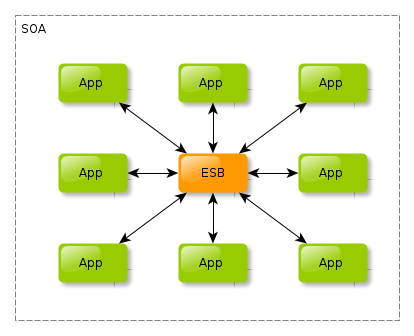

# MSA, MA, SOA(Service Oriented Architecture), ESB, SOAP

### 개요

스프링 클라우드 관련 기술을 익히기전 모놀리식 아키텍처와 마이크로서비스 아키텍처를 공부하던 중 모놀리식 아키텍처에서의 SOA, ESB, SOAP에 대해서 더 자세히 공부해보려고한다.

### 모놀리식 아키텍처

하나의 거대한 애플리케이션에서 모든 작업을 처리하는 아키텍처다.

내부적으로 의존성이 강하며 구조적으로 결합도가 높은 아키텍처다.

모든 작업을 하나의 하드웨어에서 처리하므로 강력한 하드웨어가 필요하며,

대용량 트래픽이 쏠렸을 때 시스템이 무거워질 수 있다.

### 마이크로 서비스 아키텍처

작고 독립적인 서비스들을 쪼개 팀 별로 독립적으로 개발 배포를 할 수 있는 아키텍처다.

대용량 트래픽이 쏠렸을 때도 유연하게 대처가 가능하다.

수평적 확장이 가능하며 클라우드 서비스에 적합한 아키텍처로 볼 수 있다.

### SOA Service Oriented Architecture

SOA는 서비스 지향 아키텍처로, **서비스 중심으로** 개발을 진행하고, 각 서비스들의 기능을 공유해 재가용성을 확보하는 아키텍처다.

SOA에서 서비스는 재사용이 가능한 독립 모듈이며 각 서비스는 명확한 기능을 수행한다, 특정 입력 및 출력에 의존한다. 이러한 서비스는 적절한 인터페이스를 사용해 다른 시스템 및 서비스에서 호출될 수 있다.

**SOA의 장점**

* 재사용성
* 유연성
* 상호 운영성
* 모듈화

**SOA의 단점**

SOA는 각 서비스가 독립적으로 개발되기 때문에, 서비스간의 의존성 관리가 어려울 수 있으며, 서비스의 개수가 증가하면서에 따라 전체적인 복잡도가 증가할 수 있다.

MSA는 SOA를 구현하는 하나의 아키텍처기도하다. 즉 MSA는 SOA의 개념의 발전으로 볼 수 있다.

MSA가 더 작은 단위의 서비스를 사용해, 서비스 간의 의존성 관리를 좀 더 쉽게 할 수 있다.

### ESB Enterprise Service Bus

ESB는 다양한 애플리케이션, 서비스간의 통합을 지원하기 위한 소프트웨어 아키텍처로, 메시지 지향 미들웨어 (Message Oriented Middleware)를 기반으로, 여러 애플리케이션과 서비스간에 데이터를 전송하고 변환하는 기능을 제공한다.

ESB는 다양한 프로토콜을 지원하며 SOA를 구현하기 위한 핵심 기술 중 하나다. 또 애플리케이션과 서비스 간의 인터페이스를 표준화하고, 중재 역할을 수행해 시스템 간의 유연성과 상호 운용성을 향상시킨다.

### SOAP Simple Object Acess Protocol

**다른 언어로 다른 플랫폼에서 빌드된 애플리케이션이 통신할 수 있도록 설계된 최초 프로토콜이다.**

REST API가 나오기 이전에 생겼으며, 컴퓨터 네트워크 상에서 HTTP, SMTP등을 이용해 XML을 교환하기 위한 통신 규약으로 HTTP 기반에서 동작하기 때문에 프록시와 방화벽의 영향 없이 통신이 가능하다. 그러나 REST API에 비해 구조가 복잡하고 다루기가 어려우며 무겁다는 단점이 있다.

#### SOAP의 구조

soap 메세지는 크게 두 부분으로 **헤더 Header, 바디 Body**로 구분된다

헤더는 메시지의 전송 정보와 수신자에 대한 정보를 포함하며

바디는 실제 전송할 데이터를 포함한다. 이러한 SOAP 메시지는 XML 스키마 (XSD)를 사용해 정의된다.

#### 그러나.. REST

현재는 REST(Representational State Transfer) 방식이 등장하면서 SOAP의 대안으로 대두되고 있으며, 간편한 구조와 빠른 처리 속도로 인해 많은 웹 서비스에서 사용되고 있다.

### 마무리

이렇게 MA, MSA, SOA, ESB, SOAP에 대해서 알아보았다.

앞으로 MSA 기술에 대해 더욱 공부해볼 예정이며 클라우드 기술을 습득해나가고싶다.
