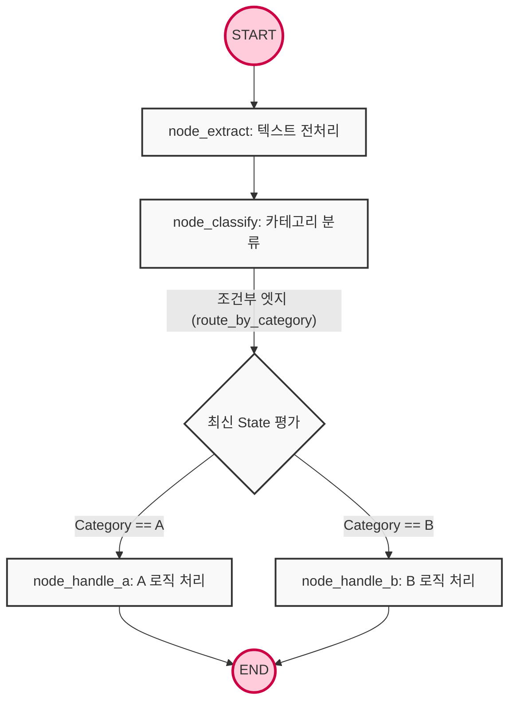

# Agent DAG based on LangGraph

Let's start with a question: How can we control, at a framework level, the problems of LLM-based agents falling into infinite loops or losing context from previous steps when performing complex tasks?

LangGraph is an orchestration framework derived from the LangChain ecosystem to manage the state of LLM-powered agent applications and control execution flow based on graph theory.

- **State (State Schema)**: A state schema is a global data structure that all nodes within the graph can share and modify. It is strictly typed using `TypedDict` and `Pydantic`, and it acts as the agent's memory.
- **Node**: A node is a vertex in the graph, a Python function that performs actual computations or LLM calls. It takes the current state as input, processes the task, and then returns a dictionary that updates specific fields of the state.
- **Edge**: An edge is a connection that defines the control flow between nodes. It is divided into regular edges, which hardcode the execution order, and conditional edges, which dynamically determine the next node based on the state's conditions.
- **DAG (Directed Acyclic Graph)**: A directed graph where cycles do not occur and flow is only in one direction. It is used to architecturally guarantee that an agent's execution will not fall into an infinite loop and will always reach a termination point.

<br>

## Problem Definition

When using simple LangChain chains or the existing `AgentExecutor`, complex, production-level agent systems face the following limitations:

- **Black-boxed Execution Flow:** Existing agent frameworks operate as black boxes, where prompts and tools are given, and the internal workings are opaque. This makes debugging impossible when exceptions occur and makes it difficult for developers to enforce control over specific logic in the desired direction.
- **State Loss and Context Management Limitations:** In pipelines combining multiple steps of inference, tool calls, and data refinement, there is a lack of an explicit global memory mechanism to fully store intermediate results and pass them to the next stage.
- **Non-deterministic Behavior and Risk of Infinite Loops:** In structures where LLMs decide their next actions, hallucinations can lead to uncontrollable states where incorrect tools are repeatedly called or termination conditions are not met.

### Solution Approach

- **State-Based Orchestration:** All inputs and outputs of the agent are unified into a centralized state object. Each node operates by only reading and writing to the state object, without needing to know about other nodes, thereby reducing system coupling and promoting modularity.
- **Declarative Graph Construction**: Task branching, fallback for exceptional situations, and termination conditions are explicitly declared as nodes and edges. This allows leveraging the non-deterministic inference capabilities of LLMs while controlling the overall execution trajectory to move only within the DAG designed by the developer.

<br>

## Detailed Operating Principles and Structure

Let's list how the agent's execution flow is initialized, how data is merged between nodes, and how it's routed based on conditions within the LangGraph engine, from the perspective of memory control flow:



1. **State Initialization & Graph Compilation**: When a developer instantiates a `StateGraph` object, they inject the data schema that will constitute the state. After registering all nodes and edges and calling the `.compile()` method, the LangGraph internal engine validates the connections between nodes and builds an executable graph runtime in memory.
2. **START Node Entry**: When a client passes initial input values with the `invoke()` method, the first business node connected to the graph's built-in START point is triggered. The input values are immediately bound to the state schema and instantiated as a global state object.
3. **Node Execution & State Merging (execution & state reducer)**: The first node (Python function) executes, receiving the current state object as an argument. Once the logic, LLM calls, etc., are processed, the node returns only the fields that need updating as a dictionary, without needing to return the entire state. The LangGraph engine internally activates a reducer function to merge (or overwrite, append) the new data returned by the node into the existing state, thereby creating the latest state.
4. **Conditional Edge Evaluation**: After a node's execution, the engine checks the edges connected to that node. If it's a regular edge, control is immediately passed to the specified next node. If a conditional edge is registered, the engine calls a routing function. The routing function reads the latest state (e.g., a category value determined by an LLM), evaluates it, and then returns the name of the next destination node to branch to as a string.
5. **Termination to End**: When the control flow reaches the graph's built-in END point via routing or an edge, the main event loop stops, and LangGraph returns the final state object at the completion of execution to the client, ending its entire lifecycle. As it's a DAG structure, this flow does not allow backward movement or infinite cycles.

### Example

Let's understand the essence of a Directed Acyclic Graph (DAG) and the role of state, processing data sequentially and conditionally, excluding LLMs.

```py
from typing import TypedDict
from langgraph.graph import StateGraph, START, END

# 1. 전역 상태(State) 스키마 정의
class AgentState(TypedDict):
    input_text: str
    processed_data: str
    category: str

# 2. 개별 노드(Node) 함수 정의
def node_extract(state: AgentState):
    # 입력 텍스트를 처리하고 상태 업데이트 반환
    return {"processed_data": state["input_text"].strip().upper()}

def node_classify(state: AgentState):
    # 처리된 데이터를 기반으로 카테고리 분류 (LLM 모사)
    data = state["processed_data"]
    category = "A" if "URGENT" in data else "B"
    return {"category": category}

def node_handle_a(state: AgentState):
    return {"processed_data": state["processed_data"] + " [HANDLED AS A]"}

def node_handle_b(state: AgentState):
    return {"processed_data": state["processed_data"] + " [HANDLED AS B]"}

# 3. 라우팅 함수 (조건부 엣지용)
def route_by_category(state: AgentState) -> str:
    if state["category"] == "A":
        return "node_a"
    return "node_b"

# 4. StateGraph 선언 및 구축 (DAG 구성)
workflow = StateGraph(AgentState)

# 노드 등록
workflow.add_node("extractor", node_extract)
workflow.add_node("classifier", node_classify)
workflow.add_node("node_a", node_handle_a)
workflow.add_node("node_b", node_handle_b)

# 엣지 연결 (제어 흐름 정의)
workflow.add_edge(START, "extractor")
workflow.add_edge("extractor", "classifier")

# 조건부 엣지 등록 (classifier 노드 종료 후 route_by_category 함수 평가)
workflow.add_conditional_edges(
    "classifier",
    route_by_category,
    {
        "node_a": "node_a", # 라우팅 반환값이 "node_a"일 때 이동할 노드
        "node_b": "node_b"
    }
)

# 분기된 흐름을 END 노드로 수렴 (비순환 보장)
workflow.add_edge("node_a", END)
workflow.add_edge("node_b", END)

# 그래프 컴파일
app = workflow.compile()

# 실행
initial_state = {"input_text": " This is an urgent message "}
result = app.invoke(initial_state)
print(result)
# 출력: {'input_text': ' This is an urgent message ', 'processed_data': 'THIS IS AN URGENT MESSAGE [HANDLED AS A]', 'category': 'A'}
```

Let's say we're building a real document review agent by integrating an LLM.

This is an optimized configuration that secures routing stability using Pydantic's Structured Output and ensures message history accumulates rather than being overwritten by using a reducer.

```py
import operator
from typing import TypedDict, Annotated, Sequence
from pydantic import BaseModel, Field
from langchain_core.messages import BaseMessage, HumanMessage, AIMessage
from langchain_openai import ChatOpenAI
from langgraph.graph import StateGraph, START, END

# 1. Pydantic을 활용한 LLM 구조화 출력 스키마 정의 (라우팅용)
class OutputFormat(BaseModel):
    is_valid: bool = Field(..., description="문서가 요구사항을 충족하는지 여부")
    reason: str = Field(..., description="판단 사유")

# 2. 리듀서(Annotated + operator.add)가 적용된 프로덕션 State 스키마
# messages 리스트는 새로운 반환값이 들어올 때마다 기존 리스트에 append 됨
class GraphState(TypedDict):
    document: str
    messages: Annotated[Sequence[BaseMessage], operator.add]
    is_valid: bool

# 3. LLM 초기화 (구조화된 출력 강제)
llm = ChatOpenAI(model="gpt-4o", temperature=0)
evaluator_llm = llm.with_structured_output(OutputFormat)

# 4. 노드 정의
def document_analyzer_node(state: GraphState):
    """문서를 분석하고 유효성을 평가하는 노드"""
    doc = state["document"]
    prompt = f"다음 문서를 평가하여 완성도를 판단하세요. 문서: {doc}"
    
    # LLM 추론 및 구조화된 결과 파싱
    result: OutputFormat = evaluator_llm.invoke(prompt)
    
    ai_message = AIMessage(content=f"평가 완료. 사유: {result.reason}")
    
    # 상태 업데이트: 메시지 누적 및 유효성 플래그 세팅
    return {"messages": [ai_message], "is_valid": result.is_valid}

def success_handler_node(state: GraphState):
    """유효한 문서일 때 후속 처리를 담당하는 노드"""
    return {"messages": [AIMessage(content="[System] 문서가 승인되어 데이터베이스에 저장되었습니다.")]}

def rejection_handler_node(state: GraphState):
    """유효하지 않은 문서일 때 피드백을 생성하는 노드"""
    return {"messages": [AIMessage(content="[System] 문서가 반려되었습니다. 작성자에게 피드백을 전송합니다.")]}

# 5. 라우팅 로직
def route_based_on_validity(state: GraphState) -> str:
    """State의 is_valid 플래그를 검사하여 분기"""
    if state.get("is_valid"):
        return "success"
    return "rejection"

# 6. DAG 그래프 빌드
builder = StateGraph(GraphState)

builder.add_node("analyzer", document_analyzer_node)
builder.add_node("success", success_handler_node)
builder.add_node("rejection", rejection_handler_node)

builder.add_edge(START, "analyzer")

# 유효성에 따른 분기 (조건부 엣지)
builder.add_conditional_edges(
    "analyzer",
    route_based_on_validity,
    {
        "success": "success",
        "rejection": "rejection"
    }
)

builder.add_edge("success", END)
builder.add_edge("rejection", END)

# 런타임 컴파일
agent_app = builder.compile()

# 실행 예시
def run_agent(doc_text: str):
    inputs = {
        "document": doc_text,
        "messages": [HumanMessage(content="초기 문서 제출")]
    }
    
    # stream()을 사용하여 노드 실행 시점마다 실시간으로 상태 변경을 추적(Observability)
    for event in agent_app.stream(inputs):
        for node_name, state_update in event.items():
            print(f"--- [Node: {node_name}] Executed ---")
            print(state_update["messages"][-1].content)
            print("-" * 40)

# run_agent("이 문서는 완벽하게 작성된 최종 보고서입니다.")
```

### DAG

DAG stands for Directed Acyclic Graph, a logical structure where data or task flow progresses in only one direction, never returning along the path it came from, thus preventing infinite loops.

When designing data pipelines or AI agent workflows, DAGs are adopted to ensure that tasks safely reach a termination point.
