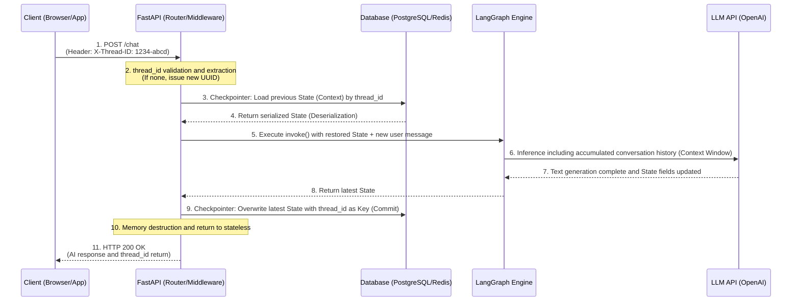

# Agent Context Identification Router in Stateless Protocols

The HTTP protocol is inherently a stateless communication where each request is independent.

So, how can an agent on a single API server, accessed by thousands of users concurrently, accurately remember each user's conversation from 5 minutes ago and maintain context?

Chatbots or autonomous agents utilizing large language models require continuous multi-turn interaction with users.

However, HTTP-based API servers that constitute the backend infrastructure, and LLMs themselves, do not preserve any prior state or memory.

To address this, distributed systems build a persistence architecture that maps network-layer requests to database-layer contexts using a unique identifier, `thread_id`.

- **Statelessness**: Stateless is a network communication paradigm where the server does not retain the client's previous state in memory. While this allows servers to distribute load by simply scaling out instances during traffic increases, it conversely imposes the constraint that every request must contain all the necessary information for processing.
- **Thread Identifier thread_id**: A string, typically in UUID format, that uniquely distinguishes a specific conversation session or logical workflow for a single user, and is different from a user ID. Since one user can have multiple independent threads, `thread_id` is the smallest logical unit for context restoration.
- **Context Isolation**: Frameworks based on async event loops need to safely separate numerous HTTP requests processed concurrently to prevent them from encroaching on each other's memory space, which is context isolation.
- **Checkpointer**: In agent frameworks like LangGraph, this is a persistence management component that serializes and saves the graph's state schema, dependent on a specific `thread_id`, to a database at each node execution point, and then deserializes and restores it to memory on the next request.

<br>

## Problem Definition

Returning to the issue, managing conversation history by relying on simple variables or client-side local storage can lead to critical security incidents and structural flaws in production backend systems.

- **Data Bleed in Concurrent Environments**: If conversation history is stored in a simple Python `global dict` based on user ID or token, a race condition can occur during asynchronous context switching within a single process. If user B's request comes in while waiting for I/O to process user A's request, memory addresses can become intermingled, directly leading to a major security incident where user B's sensitive conversation history is exposed on user A's screen.
- **Bloated Frontend Payloads and Network Latency**: If a server, in an attempt to maintain statelessness, delegates the management of the entire conversation history to the client (web browser), and then sends accumulated conversation history, potentially thousands of tokens long, in the HTTP Body with every API request, this is an anti-pattern. It wastes significant outbound network bandwidth, can cause critical latency amplification in mobile environments, and also presents a security vulnerability where clients can arbitrarily manipulate conversation history.
- **Inability to Scale Out**: Building a server with a stateful approach that stores sessions in the local server's RAM memory resources causes problems in a load-balanced environment. If the first request is routed to server 1 and the second request to server 2, server 2 will not have the user's previous conversation memory, immediately breaking the agent's context.

### Solution

With **identifier injection via standardized headers**, the client sends a unique `thread_id`, issued by the server or at the start of the conversation, included in an HTTP header, e.g., `X-Thread-ID`. This allows the server to immediately identify which conversation context a request belongs to, in approximately O(1) time, simply by parsing the header, regardless of the body data size.

This is essentially a **centralized state store**. The FastAPI router, based on the extracted `thread_id`, queries an independent external database for the serialized previous conversation state object for that session. This allows any physical server instance to retrieve the state by looking at the same database, regardless of where the request is routed. In fact, this seems to solve the problem with a structure similar to an authentication system.

**LangGraph Checkpointer Implementation**: When calling the agent, the `thread_id` is injected into the `configurable` settings object and passed into the framework. Internally, the framework uses this ID to load the previous graph state into memory, and when a new response is generated, it atomically overwrites or saves a snapshot of that ID's record.

<br>

## Detailed Working Principle and Structure

Analyzing the process from when a packet is received by the operating system's network stack to when it's loaded into application memory and interacts with the database to restore state, from an event loop perspective:



1.  **HTTP Packet Reception and Parsing**: When a client's packet arrives at the server, the ASGI server (uvicorn) reads data from the TCP buffer, parses HTTP headers, and dynamically allocates a Request object.
2.  **Header Validation in Middleware/Dependency Injection Layer**: Before entering the FastAPI router, a dependency injection function wrapped with `Depends` is activated. It extracts the `X-Thread-ID` value from the dictionary, and if it doesn't exist, it generates a new value and binds it.
3.  **Persistence Layer Query (IO Blocking)**: Using the `thread_id` value, the controller accesses LangGraph's Checkpointer (e.g., AsyncSqliteSaver or RedisSaver) with the extracted ID as an argument, initiating asynchronous I/O. This returns thread control to the event loop, allowing other user requests to be processed.
4.  **Graph State Deserialization**: The previous session's binary or JSON data retrieved from the database is loaded into memory. Based on this data, the framework perfectly restores and instantiates LangGraph's global state object (e.g., accumulated messages list, flag variables, etc.) to its previous state.
5.  **Agent Execution and Context Accumulation**: After appending the new client message from the current HTTP request to the restored state object, the LLM inference logic is executed. The LLM then generates a response by including the entire restored conversation history in its context window.
6.  **Serialization and Atomic Commit**: Once the agent node's execution finishes and the final `State` is complete, the checkpointer again uses the `thread_id` as the key to overwrite this latest state in the database. If using a snapshot method, it inserts with a timestamp.
7.  **Context Destruction After Response Return**: Once serialization is complete, the controller bundles the final generated text response as JSON and returns it to the client with an HTTP 200 OK. The processed Request object and the restored State object in memory are completely destroyed by the Python garbage collector, making the server stateless again.

### Example

To understand the core of `thread_id` extraction and context isolation using a FastAPI dict without an external database or complex framework:

```py
import uuid
from fastapi import FastAPI, Depends, Header
from typing import Dict, List
from pydantic import BaseModel

app = FastAPI()

# 원리 이해용: 외부 DB를 대체하는 인메모리 세션 저장소 (멀티 프로세스에서는 공유되지 않음)
SESSION_DB: Dict[str, List[str]] = {}

class ChatRequest(BaseModel):
    message: str

# 1. 의존성 주입 함수: HTTP Header에서 thread_id 추출 및 검증
async def get_or_create_thread_id(x_thread_id: str = Header(None)) -> str:
    # 헤더에 ID가 없으면 새로운 대화 세션으로 간주하여 UUID 발급
    if not x_thread_id:
        return str(uuid.uuid4())
    return x_thread_id

@app.post("/v1/chat")
async def chat_endpoint(
    request: ChatRequest,
    thread_id: str = Depends(get_or_create_thread_id)
):
    # 2. 해당 thread_id의 이전 문맥(Context) 로드
    if thread_id not in SESSION_DB:
        SESSION_DB[thread_id] = []
        
    context_history = SESSION_DB[thread_id]
    
    # 3. 새로운 메시지 누적
    context_history.append(f"User: {request.message}")
    
    # 4. (가상) 에이전트 실행 로직: 문맥 길이를 참조하여 응답 생성
    response_text = f"이전까지 총 {len(context_history)-1}번의 대화가 있었습니다. 방금 하신 말씀은 잘 들었습니다."
    context_history.append(f"Agent: {response_text}")
    
    # 5. 응답 반환 시 사용자가 다음 요청에 사용할 수 있도록 thread_id를 명시적으로 전달
    return {
        "thread_id": thread_id,
        "response": response_text
    }
```

Let's look at the code that combines a FastAPI router with LangGraph's `MemorySaver` to inject `thread_id` as a configurable setting, ensuring the continuity of a Directed Acyclic Graph (DAG).

```py
import operator
import uuid
from typing import Annotated, TypedDict, Sequence
from fastapi import FastAPI, Header, HTTPException
from pydantic import BaseModel
from langchain_core.messages import BaseMessage, HumanMessage, AIMessage
from langgraph.graph import StateGraph, START, END
from langgraph.checkpoint.memory import MemorySaver

app = FastAPI()

# 1. LangGraph State 스키마 정의 (메시지가 누적되도록 operator.add 지정)
class GraphState(TypedDict):
    messages: Annotated[Sequence[BaseMessage], operator.add]

# 2. 간단한 에이전트 노드 함수 (실제로는 LLM 추론 로직이 위치함)
def mock_agent_node(state: GraphState):
    history_length = len(state["messages"])
    ai_response = AIMessage(content=f"[서버 응답] 현재 누적된 메시지 수는 {history_length}개 입니다.")
    return {"messages": [ai_response]}

# 3. 그래프 선언 및 체크포인터(영속성 계층) 부착
workflow = StateGraph(GraphState)
workflow.add_node("agent", mock_agent_node)
workflow.add_edge(START, "agent")
workflow.add_edge("agent", END)

# 실무에서는 AsyncSqliteSaver.from_conn_string() 또는 RedisSaver 등을 사용합니다.
# 인메모리 Saver도 thread_id를 기준으로 상태를 완벽히 격리합니다.
checkpointer = MemorySaver()

# 그래프 컴파일 시 checkpointer 주입
agent_app = workflow.compile(checkpointer=checkpointer)

# 4. API 엔드포인트 요청 스키마
class AgentRequest(BaseModel):
    user_input: str

@app.post("/v2/agent/invoke")
async def invoke_agent(
    payload: AgentRequest,
    x_thread_id: str = Header(None, description="대화 세션을 식별하는 고유 UUID")
):
    # A. 식별자 검증
    if not x_thread_id:
        x_thread_id = str(uuid.uuid4())
        
    # B. LangGraph 실행을 위한 Configuration 객체 조립
    # 이 설정값 내부의 'thread_id' 키를 체크포인터가 가로채어 데이터베이스 조회를 수행합니다.
    run_config = {"configurable": {"thread_id": x_thread_id}}
    
    # C. 입력 데이터 구성
    inputs = {"messages": [HumanMessage(content=payload.user_input)]}
    
    try:
        # D. 그래프 실행 (invoke 내부에서 상태 복원 -> 연산 -> 상태 직렬화가 자동으로 일어남)
        result_state = agent_app.invoke(inputs, config=run_config)
        
        # 최종 상태에서 마지막 AI 응답 텍스트 추출
        final_response = result_state["messages"][-1].content
        
        return {
            "status": "success",
            "thread_id": x_thread_id,
            "agent_response": final_response
        }
        
    except Exception as e:
        raise HTTPException(status_code=500, detail=f"에이전트 실행 중 오류 발생: {str(e)}")
```
