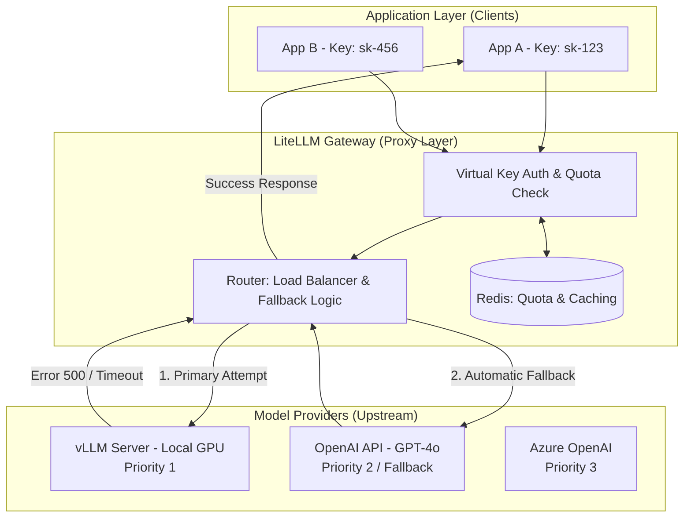

# LiteLLM Proxy Server Configuration

Imagine a scenario where, as your service scales, you need to use OpenAI's GPT-4, and sensitive data must be processed by an in-house vLLM server.

But what if each development team had to manage API keys separately and modify their code to fit different API specifications? Furthermore, would it be efficient to individually implement a feature in every service's code that automatically switches to another model when a specific model server goes down?

**LiteLLM Proxy** is a high-performance reverse proxy and LLM gateway that unifies disparate API specifications from various LLM providers (OpenAI, Anthropic, vLLM, Azure, etc.) into the OpenAI standard format.

- **Unified Inference**: Regardless of whether the backend engine is vLLM or Anthropic, clients only need to send requests to a single address: `https://gateway.internal/v1/chat/completions`. This completely isolates infrastructure complexity from the application layer.
- **Multi-tenancy & Virtual Keys**: This is a hierarchical management structure where a single gateway issues virtual API keys to multiple team tenants and controls the budget, RPM, and TPM for each key.
- **Fallback Routing**: This is a failover mechanism that automatically redirects requests to another model (e.g., GPT-4o) according to predefined priorities when a specific model, such as a private vLLM, fails to respond (e.g., 500 or 429 error).

<br>

## Problem Definition

The biggest engineering bottleneck encountered when building enterprise LLM infrastructure is endpoint fragmentation and ensuring availability.

- **Interface Fragmentation**: While vLLM attempts to follow OpenAI's specification, subtle parameter differences exist, and Anthropic or Google require entirely different payloads. Handling this in individual microservices increases code coupling, making engine replacement impossible.
- **Reliability Issues (SPOF)**: Relying on a single LLM provider can paralyze the entire service if an API failure or rate limit occurs. Especially in high-traffic environments where 429 errors are frequent, securing immediate alternative routes is essential.
- **Lack of Cost and Security Governance**: If each developer issues and uses personal API keys, overall cost tracking becomes impossible, and control or logging points for internal data leakage to external LLMs are lost.

### Solution

- **LLM Gateway Layer**: Deploy LiteLLM Proxy between the application and LLM providers to centralize all communication. This achieves model abstraction, where clients don't need to know the underlying engine.
- **Declarative Routing**: Define model grouping via YAML configuration. For example, group a vLLM server and OpenAI GPT-4 under a group named `gpt-4-level`, designing it to use the lower-cost vLLM normally and switch to GPT-4 only in case of failure.
- **Centralized Policy Management**: Integrate Redis at the gateway level to check quotas for each API key in real-time, enforce virtual key-based usage limits, and collect all input/output logs in a standardized format (Centralized Logging).

<br>

## Detailed Operating Principles and Structure

This is the internal mechanism by which LiteLLM Proxy receives requests, routes them to the appropriate endpoint according to availability policies, and explores alternative paths upon failure.



1.  **Request Ingestion**: The client sends a request to LiteLLM Proxy using an OpenAI SDK or similar. At this point, the model name used is a logical group name like `production-llm`, not the actual engine name.
2.  **Identity & Quota Verification**: The Proxy queries the virtual key information stored in Redis to check the tenant's remaining budget and RPM. If limits are exceeded, it immediately returns a 429 error to prevent upstream overload.
3.  **Dynamic Routing**: The router forwards the request to the target vLLM according to the configured strategy (e.g., least load, round-robin).
4.  **Fallback Trigger**: If a timeout or hardware failure error occurs on the vLLM server, the Proxy's internal Fallback Handler intercepts it. Instead of returning an error to the client, it immediately reconstructs the payload and retries the request with the next priority in the defined list, which is the OpenAI API.
5.  **Response Transformation**: The response received from the upstream provider is normalized back into the standard OpenAI format and finally returned to the client. The client receives a stable response, unaware that a failure occurred in the interim.

```yaml
model_list:
  # Group two models under a single name 'my-llm'
  - model_name: my-llm 
    litellm_params:
      model: openai/facebook/opt-125m # Model name loaded on vLLM
      api_base: http://vllm-server:8000/v1
      api_key: "not-needed"
  
  - model_name: my-llm
    litellm_params:
      model: gpt-4o
      api_key: os.environ/OPENAI_API_KEY

router_settings:
  routing_strategy: round-robin # Call alternately by default
```

Let's also look at a production configuration that includes fallback rules and tenant management.

This is an example of precisely configured error code-specific fallbacks and priorities to maximize availability in a real multi-tenant environment.

```yaml
model_list:
  # [Primary] In-house vLLM server (highest priority)
  - model_name: enterprise-gpt
    litellm_params:
      model: openai/Llama-3-70B
      api_base: https://vllm.internal.com/v1
      api_key: sk-vllm-internal
      rpm: 100 # Limit adjusted to vLLM server performance
    model_info:
      id: "vllm-1"

  # [Secondary] OpenAI GPT-4o (fallback if vLLM fails)
  - model_name: enterprise-gpt
    litellm_params:
      model: gpt-4o
      api_key: os.environ/OPENAI_API_KEY
    model_info:
      id: "openai-fallback"

router_settings:
  routing_strategy: latency-based-routing # Prioritize based on response speed
  # [Key] Define Fallback Logic
  # If the following error occurs in vLLM (vllm-1), immediately switch to openai-fallback
  fallbacks: [{"vllm-1": ["openai-fallback"]}]
  allowed_fails: 3 # Exclude the model from the list for a certain period after 3 failures (Circuit Breaker)
  cooldown_time: 30 # Cooldown time for failed model (seconds)

general_settings:
  master_key: sk-master-1234
  database_url: "redis://localhost:6379/0" # Redis for quota and caching
  store_model_in_db: True # Allow dynamic addition of new models

# Virtual key settings per tenant (can be created via API, but shown as example)
# Key A: 'SearchTeam' - Budget $100/mo, RPM 50
# Key B: 'AdTeam' - Budget $1000/mo, RPM 500
```

<br>

## LiteLLM

Let's add a bit more supplementary explanation about LiteLLM.

LiteLLM is an open-source proxy server and LLM gateway that unifies the disparate API specifications of various Large Language Model (LLM) providers into a single standard.

Modern large-scale AI services adopt a multi-model architecture, not relying on a single model, but rather mixing external commercial APIs and internal private vLLM servers based on purpose and cost.

However, because each provider has completely different endpoint URLs, authentication methods, and JSON payload structures, a coupling problem arises where business logic must be extensively modified every time a backend application model is replaced or added.

- Clients send requests to the LiteLLM Proxy using only the OpenAI API standard specification, regardless of the target model.
- LiteLLM analyzes the received payload, dynamically transforms it into the unique data structure required by the actual target model, and then forwards it to the backend.
- This allows the application layer to achieve model abstraction, remaining unaffected by changes in the underlying LLM infrastructure.

### Key Gateway-Based Enterprise Features

Since LiteLLM is a single point of failure (SPOF) through which all traffic passes, it leverages the advantages of an SPOF to centrally handle global control features that are difficult to implement on service servers.

- **Routing and Fallback for Availability Assurance**: If a specific LLM server experiences a hardware failure or API limiting, traffic is redirected to a priority model according to predefined routing rules.
- **Semantic Caching for Performance and Cost Optimization**: Instead of simple string comparison, prompt semantic similarity is compared via embedding vectors. If a request similar beyond a set threshold is received, heavy backend LLM computations are skipped, and a cached previous response from Redis or a vector DB is immediately returned.
- **Multi-tenant Budget Control**: Instead of sharing a single API key, the gateway issues virtual API keys per department or user. Based on atomic operations in Redis, it tracks each key's requests per minute (RPM) and token usage, proactively blocking traffic that exceeds allocated budgets.
