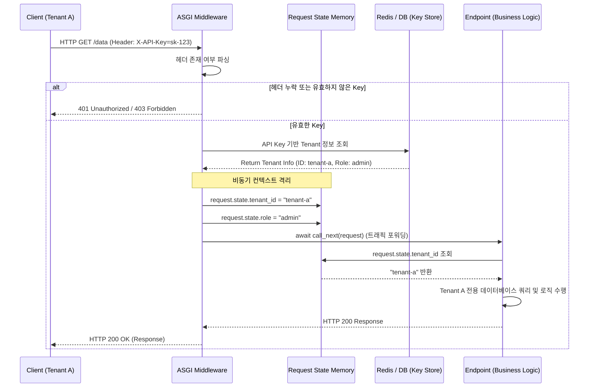

# Tenant-Specific Request Isolation and Authorization Middleware Development

Let's start with a question: when requests from the marketing team, development team, and finance request team simultaneously enter a single API server, how can the server accurately identify the owner of each request and fundamentally prevent team A from accessing team B's data?

In a single server environment handling large-scale traffic, multiple clients or departments sharing a system is called multi-tenancy. In this environment, middleware and header verification techniques are used to logically separate requests from each tenant.

- **Authentication and Authorization**: Authentication is the process of verifying who the requester is via an API key, and authorization is the process of controlling whether the identified tenant has permission to access a specific endpoint or resource.
- **Middleware**: Similar to interrupt handling in operating systems or proxies at the network layer, middleware is a software layer that intervenes before and after a client's HTTP request reaches the final router, intercepting and manipulating packets.
- **Context Isolation**: In a FastAPI environment based on an asynchronous event loop, numerous requests are processed concurrently on a single thread. In this scenario, to prevent a specific tenant's information from mixing with another tenant's requests, an independent memory space, `request.state`, is allocated for each request object's lifecycle, thereby isolating data.

<br>

## Problem Definition

When designing an API server in a multi-tenant environment, incorrect implementation of authorization can lead to serious architectural flaws and security vulnerabilities.

- **Fragmentation of Cross-cutting Concerns**: If API key reading and tenant verification code is duplicated for dozens or hundreds of API endpoints, code coupling becomes extremely high. When a new department is added or authentication logic changes, all APIs must be modified, leading to an unmaintainable state.
- **Risk of Data Contamination**: If global variables or singleton patterns are misused to utilize the tenant ID of the current request, context switching can occur in an asynchronous environment, potentially leading to a security incident where team B's identifier overwrites team A's request.
- **Authorization Bypass Vulnerability**: If tenant separation is handled within the business logic, a developer might accidentally omit verification logic for a specific endpoint, exposing a path for unauthorized access to other tenant resources. (Insecure Direct Object Reference)

### Solution

- **Applying Aspect-Oriented Programming (AOP) via Middleware**: Completely extract tenant identification and authentication logic from individual API controllers and elevate it to the ASGI (Asynchronous Server Gateway Interface) middleware layer, which is the application's entry point. This ensures, at an architectural level, that all traffic reaching the router has already been verified.
- **Identifier Delivery based on HTTP Header**: Enforce sending API keys or tokens in HTTP headers (X-API-Key) rather than URLs, according to security standards, to prevent sensitive information from being left in logging systems.
- **Secure Metadata Propagation using Request State**: Bind tenant identifiers, department names, etc., extracted by middleware to the `request.state` object. This object has an isolated lifecycle, persisting only from the start of the HTTP request until the response is returned, making it safe in concurrent environments.

<br>

## Detailed Operating Principles and Structuring

The following describes the authorization flow from when a client's request enters the FastAPI server, passes through middleware, and reaches the final business logic.



1.  **Request Interception**: When a client sends a request, an ASGI server like Uvicorn receives it and passes it to the FastAPI app. At this point, the middleware positioned at the forefront intercepts the Request object first.
2.  **Header Parsing & Verification**: The middleware extracts the `X-API-Key` from the HTTP header dictionary. It queries an internal cache or DB to identify if the key is valid and to which tenant department it is assigned. If it fails, it immediately returns an HTTP 401/403 exception to the client, blocking the request, without passing traffic to the router.
3.  **State Injection**: Once verification is complete, the tenant's unique identifier (`tenant_id`) and `Role` are injected into the `request.state` space, which is the unique memory area for that request.
4.  **Forwarding & Execution**: By calling the `call_next(request)` function, the verified request object is forwarded to the downstream router's business logic. Router developers no longer need to write authentication code and can focus solely on the core logic of filtering data for the respective department by retrieving `request.state.tenant_id`.

### Example

Let's look at an example of basic tenant separation using dependency injection.

This is a straightforward skeleton code that inspects HTTP Headers and identifies tenants at the endpoint level, leveraging FastAPI's design philosophy of `Depends` before applying middleware.

```py
from fastapi import FastAPI, Depends, HTTPException, Security
from fastapi.security.api_key import APIKeyHeader

app = FastAPI()

# 1. 검사할 HTTP Header Key 이름 지정
API_KEY_NAME = "X-API-Key"
api_key_header = APIKeyHeader(name=API_KEY_NAME, auto_error=False)

# 2. 임시 테넌트 데이터베이스 (API Key -> 부서명 매핑)
TENANT_DB = {
    "key-marketing-101": "Marketing_Department",
    "key-dev-202": "Development_Department"
}

# 3. 인증 및 식별 로직 (의존성 함수)
async def get_current_tenant(api_key: str = Security(api_key_header)):
    if api_key not in TENANT_DB:
        raise HTTPException(
            status_code=401,
            detail="Invalid or missing API Key"
        )
    # 식별된 테넌트(부서) 이름 반환
    return TENANT_DB[api_key]

# 4. 비즈니스 로직 (엔드포인트)
@app.get("/api/v1/dashboard")
async def get_dashboard_data(tenant_name: str = Depends(get_current_tenant)):
    # 엔드포인트는 이미 검증된 tenant_name만 넘겨받아 해당 부서의 데이터만 반환합니다.
    return {
        "message": "Access Granted",
        "tenant": tenant_name,
        "data": f"Confidential data for {tenant_name}"
    }
```

Global Authorization Pipeline Inheriting from BaseHTTPMiddleware

In a production environment, to ensure all requests are verified without exception, traffic is controlled at a global level via `BaseHTTPMiddleware`, and data is isolated using `request.state`.

```py
from fastapi import FastAPI, Request, HTTPException
from fastapi.responses import JSONResponse
from starlette.middleware.base import BaseHTTPMiddleware
import time

app = FastAPI()

# 실무 환경을 가정한 가상의 비동기 DB 조회 함수
async def fetch_tenant_from_db(api_key: str) -> dict:
    # (실제로는 Redis나 RDBMS에서 API Key 조회 및 캐싱 수행)
    mock_db = {
        "sk-finance-prod": {"tenant_id": "T_FIN_001", "role": "admin"},
        "sk-hr-prod": {"tenant_id": "T_HR_002", "role": "viewer"}
    }
    return mock_db.get(api_key)

# 1. 전역 인가 미들웨어 클래스 정의
class TenantAuthMiddleware(BaseHTTPMiddleware):
    async def dispatch(self, request: Request, call_next):
        # 2. 인증을 우회해야 하는 공개 엔드포인트(Health Check 등) 예외 처리
        if request.url.path in ["/health", "/docs", "/openapi.json"]:
            return await call_next(request)

        # 3. HTTP Header에서 API Key 추출
        api_key = request.headers.get("X-API-Key")
        if not api_key:
            return JSONResponse(
                status_code=401,
                content={"detail": "Missing X-API-Key header"}
            )

        # 4. API Key 검증 및 테넌트 식별
        tenant_info = await fetch_tenant_from_db(api_key)
        if not tenant_info:
            return JSONResponse(
                status_code=403,
                content={"detail": "Invalid API Key or Revoked Access"}
            )

        # 5. [핵심] 식별된 테넌트 데이터를 request.state에 격리하여 주입
        # 이 변수는 현재 요청의 생명주기 동안에만 스레드-안전하게 유지됩니다.
        request.state.tenant_id = tenant_info["tenant_id"]
        request.state.role = tenant_info["role"]
        request.state.request_time = time.time()

        # 6. 다음 계층(라우터 또는 다음 미들웨어)으로 요청 포워딩
        response = await call_next(request)
        
        return response

# 미들웨어 앱에 등록
app.add_middleware(TenantAuthMiddleware)

# 비즈니스 로직 엔드포인트
@app.get("/api/v1/billing")
async def get_billing_info(request: Request):
    # 7. 컨트롤러는 미들웨어가 주입한 request.state 값을 꺼내어 사용
    tenant_id = request.state.tenant_id
    role = request.state.role
    
    # 인가(Authorization) 확인: 관리자 권한인지 체크
    if role != "admin":
        raise HTTPException(status_code=403, detail="Admin role required for billing access")
        
    # 테넌트 분리 로직: DB 쿼리 시 무조건 WHERE tenant_id = request.state.tenant_id 조건을 붙이도록 강제됨
    return {
        "status": "success",
        "tenant_id": tenant_id,
        "billing_data": [
            {"month": "April", "amount": 10000}
        ]
    }
```
