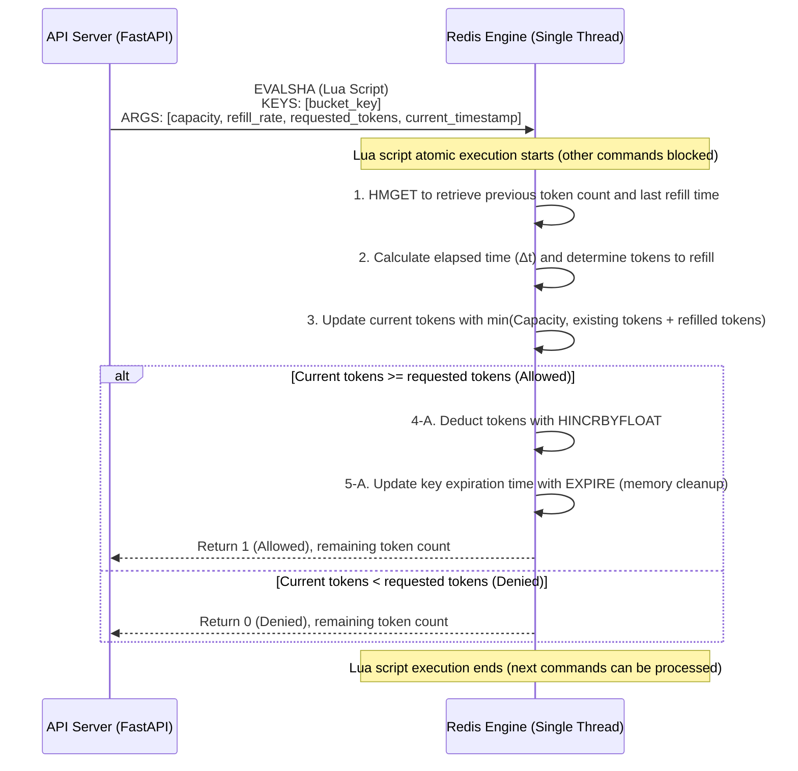

# Token Bucket-Based Rate Limiting

When thousands of traffic requests enter multiple distributed API servers, how can we accurately allow only permitted traffic (e.g., 100 requests per minute) to pass and block the excess, all without a single database bottleneck? Specifically, how should we manage concurrency conflicts that arise when querying and deducting the number of remaining tokens (request allowances)?

Rate limiting is a critical network architecture technique that controls the frequency of client requests to protect system availability. To implement this in a distributed environment, we will combine it with an in-memory store, Redis, using Lua scripting.

-   **Token Bucket**: This algorithm fills a token bucket at a constant rate (Refill Rate). Each time a client sends a request, it takes one token from the bucket. If no tokens are available, the request is denied. It allows for temporary traffic bursts while controlling the average throughput.
-   **Atomicity and Lua Scripts**: Redis operates on a single-threaded basis. When multiple commands (GET, INCRBY, EXPIRE) are bundled into a single script and executed by its built-in Lua script engine, Redis will not process commands from other clients until that script finishes. This ensures perfect transaction isolation and atomicity in a distributed environment.

<br>

## Problem Definition

Implementing rate limiting with simple application-level logic leads to severe concurrency issues and performance bottlenecks.

-   **Race Conditions**: Suppose servers A and B execute a three-step logic (GET, SET or INCRBY) to query, deduct, and save a client's remaining tokens. If both servers read the same initial value, update loss will occur, leading to duplicate or missed token deductions.
-   **Network I/O Overhead**: Even if Redis's `MULTI/EXEC` is used for transactions to protect atomicity, multiple network round-trip times (RTTs) between the client and Redis occur, significantly increasing latency.

### Solution Approach

-   **Delegating Operations via Lua Script**: The entire logic for state lookup, token calculation, deduction, and expire setting (to prevent memory leaks) is written as a Lua script and pushed into the Redis engine.
-   **Minimizing Network Costs and Ensuring Concurrency**: The application sends only the script's SHA hash (`EVALSHA`) and arguments to Redis in a single call. Redis then executes this script internally as a single atomic operation, inherently preventing race conditions and reducing network RTT to just one.

<br>

## Detailed Operating Principles and Structure

This flow illustrates how the Lua script inside Redis atomically processes the mathematical model of the token bucket algorithm when a client request arrives.

The token refill formula for a token bucket is defined as follows:

$$ Current\_Tokens = \min(Capacity, Previous\_Tokens + (\Delta Time \times Refill\_Rate)) $$



1.  **State Lookup**: The Lua script retrieves the last request processing time (`last_refill_time`) and remaining tokens (`tokens`) using `bucket_key`. If the key does not exist, it's considered the first request, and the bucket is initialized to its maximum capacity.
2.  **Token Refill Calculation**: It calculates the difference between the current timestamp and `last_refill_time`, then multiplies it by the per-second `refill_rate` to mathematically determine the number of tokens that should have accumulated.
3.  **Token Deduction and Expiration**: If the calculated tokens are greater than the requested amount, tokens are immediately deducted using `INCRBY` (or `HINCRBYFLOAT` for floating-point operations). Simultaneously, an `EXPIRE` command is called to set a TTL, preventing the key from permanently occupying memory. All these processes complete within 0.1ms without a context switch.

### Example

This is the core business logic to be executed within the Redis engine. To synchronize time in a distributed environment, it is safer to pass the timestamp as an argument from the calling application rather than relying on the Redis server's time.

```lua
-- token_bucket.lua
local key = KEYS[1]
local capacity = tonumber(ARGV[1])
local refill_rate = tonumber(ARGV[2])  -- Tokens refilled per second
local requested = tonumber(ARGV[3])    -- Tokens to consume
local now = tonumber(ARGV[4])          -- Current timestamp (in seconds)

-- Retrieve previous state from Redis Hash structure
local bucket = redis.call('HMGET', key, 'tokens', 'last_refill_time')
local tokens = tonumber(bucket[1])
local last_refill_time = tonumber(bucket[2])

if not tokens then
    -- Initialize bucket to max capacity on first request
    tokens = capacity
    last_refill_time = now
else
    -- Apply token refill logic based on elapsed time
    local delta_time = math.max(0, now - last_refill_time)
    local refilled_tokens = delta_time * refill_rate
    tokens = math.min(capacity, tokens + refilled_tokens)
end

-- Determine if token deduction is possible
if tokens >= requested then
    tokens = tokens - requested
    -- Deduct tokens and save last refill time (HSET atomic execution)
    redis.call('HMSET', key, 'tokens', tokens, 'last_refill_time', now)
    
    -- [CORE] Set TTL to prevent memory waste (EXPIRE)
    -- Calculate time for bucket to fully refill, then set expiration with a buffer
    local ttl = math.ceil(capacity / refill_rate) + 10
    redis.call('EXPIRE', key, ttl)
    
    return {1, tokens} -- 1: Allowed
else
    -- If denied, do not deduct tokens; return only current remaining tokens
    return {0, tokens} -- 0: Denied
end
```

In a real server environment, a long Lua string is not sent over the network with every request.

When the server starts, the script is pre-loaded (register_script) into Redis and then called only by its SHA hash (`EVALSHA`), minimizing bandwidth usage.

```py
import time
import redis.asyncio as redis
from fastapi import FastAPI, HTTPException, Request

app = FastAPI()

# Asynchronous Redis client connection
redis_client = redis.Redis(host='localhost', port=6379, decode_responses=True)

# 1. Register (cache) the Lua script in Redis upon server startup to create a script object
# This automatically uses EVALSHA for every subsequent call.
LUA_SCRIPT = """
-- (Same as the token_bucket.lua code content in item 5 above)
-- Omitted
"""
rate_limit_script = redis_client.register_script(LUA_SCRIPT)

# Token Bucket policy settings (e.g., max 10 tokens, refill 2 per second)
BUCKET_CAPACITY = 10
REFILL_RATE = 2

async def check_rate_limit(client_ip: str) -> dict:
    bucket_key = f"rate_limit:ip:{client_ip}"
    current_timestamp = time.time()
    
    # 2. Execute the cached Lua script (atomic operation)
    # The keys list maps to KEYS[1], and the args list maps to ARGV[1]~ARGV[4].
    result = await rate_limit_script(
        keys=[bucket_key],
        args=[BUCKET_CAPACITY, REFILL_RATE, 1, current_timestamp]
    )
    
    is_allowed = bool(result[0])
    remaining_tokens = result[1]
    
    return {"is_allowed": is_allowed, "remaining": remaining_tokens}

@app.middleware("http")
async def rate_limiting_middleware(request: Request, call_next):
    client_ip = request.client.host
    
    # 3. Validate all incoming requests with O(1) time complexity
    limit_status = await check_rate_limit(client_ip)
    
    if not limit_status["is_allowed"]:
        raise HTTPException(
            status_code=429,
            detail="Too Many Requests. Token bucket is empty."
        )
        
    response = await call_next(request)
    
    # 4. Inject standard headers (RateLimit) so clients know the remaining request count
    response.headers["X-RateLimit-Remaining"] = str(limit_status["remaining"])
    response.headers["X-RateLimit-Limit"] = str(BUCKET_CAPACITY)
    
    return response
```
