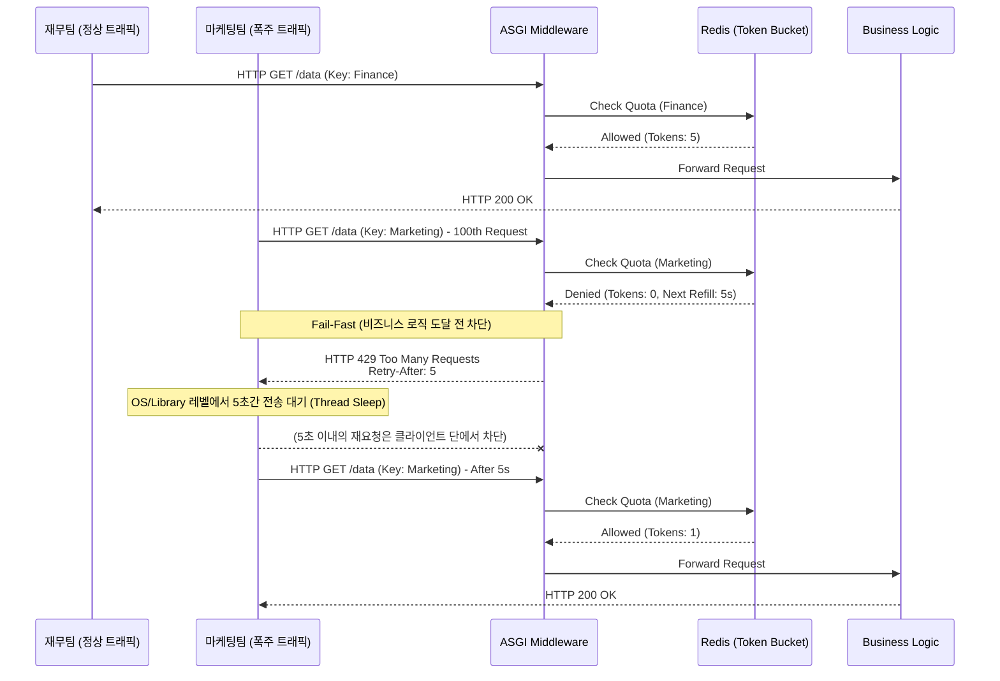

# Implementing Noisy Neighbor Blocking Logic

Let's start with a question: In a multi-tenant architecture, how can we use network standard protocols to prevent a specific department (e.g., the marketing team) from exhausting the server's thread pool and TCP connections by running large-scale batch jobs that make thousands of API calls per second, leading to timeouts for normal requests from other departments (e.g., the finance team)?

In distributed systems, the phenomenon where a specific tenant monopolizes shared resources, thereby degrading the overall system's availability, is called the **Noisy Neighbor** problem.

The key to controlling this at the network layer is to utilize HTTP 429 (Too Many Requests) and Retry-After.

- **HTTP 429 Too Many Requests (RFC 6585)**: This status code explicitly informs the client that their request rate has exceeded the allowed limit. Unlike 503 (Service Unavailable), which simply severs the connection, 429 provides the client with a precise reason: their requests were denied due to excessive volume.
- **Retry-After Header (RFC 7231)**: This control header accompanies a 429 response and indicates the physical time (an integer in seconds or an HTTP-Date format) the client must wait before retrying the next request.
- **Fail-Fast**: This architectural pattern involves immediately terminating a connection at the API entry point (Middleware/Gateway) before reaching heavy backend business logic or database I/O, thereby preserving the server's computing resources.

<br>

## Problem Definition

If requests are simply ignored or handled with generic errors (e.g., 500) without standard HTTP control headers, critical cascading failures can occur at the system level.

- **TCP Backlog and Worker Thread Exhaustion**: Servers have a limited capacity for concurrent connections. If malicious traffic penetrates deep into the business layer, it occupies threads to process transactions, causing the OS kernel's TCP Listen Backlog queue to fill up. This leads to legitimate connection requests (SYN) from other departments being dropped.
- **Thundering Herd Problem**: If only a 429 status code is returned and the Retry-After header is omitted, the client application's default retry logic will immediately resend traffic. Thousands of blocked requests continuously hammering the server without backoff, perhaps every 0.1 seconds, can cause resource overload on the rate limiter itself, creating a distributed denial-of-service (DDoS) condition.

### Solution Approach

- **Early Rejection**: Before traffic reaches the framework router, the token bucket status is checked immediately after tenant identification (API Key) at the ASGI middleware layer. If the threshold is exceeded, body processing is skipped, and a 429 response is immediately returned, quickly releasing the OS-level file descriptor.
- **Cooperative Throttling**: The Retry-After header explicitly instructs clients to retry after 30 seconds. This forces client network libraries (like axios, requests, etc.) to physically halt outbound packet generation for that duration, effectively eliminating inbound traffic directed at the server.

<br>

## Detailed Operation and Structure

Let's examine how the API Gateway middleware handles traffic and instructs `Retry-After` when a specific tenant's quota is exhausted.



1.  **Normal Traffic Processing**: The finance team's request is allowed after checking the Redis token bucket, so it is assigned to a normal business logic thread for processing.
2.  **Quota Exhaustion Identification**: When the marketing team's burst of traffic arrives, the middleware receives a denial response from Redis. At this point, Redis not only indicates that tokens are denied but also calculates and provides the remaining time until the next token is refilled to the middleware.
3.  **Fail-Fast and Header Injection**: The middleware intercepts the connection without routing it to business logic or database queries. It changes the HTTP status code to 429 and returns it to the client with `Retry-After:5` specified in the response header. This process is very lightweight and does not block the server's main event loop.
4.  **Client Backoff**: A standards-compliant client system, upon receiving this header, will use its own scheduler to halt packet generation for that API for 5 seconds, thereby protecting the server's network socket queue.

<br>

## 429, Retry-After Header Return Structure

This is the most straightforward endpoint defense logic, explicitly injecting control headers when a specific department's request count exceeds a limit, using an in-memory counter without Redis integration.

```py
from fastapi import FastAPI, Request, HTTPException
from fastapi.responses import JSONResponse

app = FastAPI()

# 원리 이해용 인메모리 카운터 및 제한 설정
tenant_usage = {"marketing": 150}
LIMIT = 100
RETRY_WAIT_SECONDS = 30

@app.get("/api/v1/resource")
async def get_resource(request: Request):
    # 실제로는 미들웨어에서 추출된 request.state.tenant_id를 사용합니다.
    tenant_id = "marketing" 
    
    if tenant_usage[tenant_id] > LIMIT:
        # HTTP 429 예외를 발생시키고, headers 딕셔너리에 Retry-After 주입
        raise HTTPException(
            status_code=429,
            detail="Rate limit exceeded. Please slow down.",
            headers={"Retry-After": str(RETRY_WAIT_SECONDS)}
        )
        
    return {"message": "Success"}
```

Let's also look at a token bucket-based dynamic retry-after calculation middleware.

Combining this with the token bucket Lua script from the previous post, we can see the logic that calculates the exact milliseconds remaining until the next token bucket is refilled, rather than a hardcoded wait time, and returns it as a Retry-After header.

```py
import time
import math
from fastapi import FastAPI, Request
from fastapi.responses import JSONResponse
from starlette.middleware.base import BaseHTTPMiddleware

app = FastAPI()

# 가상의 Rate Limiter 클래스 (내부적으로 Redis Lua 스크립트 호출)
class RedisRateLimiter:
    async def is_allowed(self, tenant_id: str):
        # Redis 검증 후 반환되는 결과값 시뮬레이션
        # 실무에서는 Lua 스크립트가 토큰이 없을 경우 남은 시간(time_to_next_token)을 계산하여 반환하도록 작성됩니다.
        refill_rate = 5  # 초당 5개 충전 (1개당 0.2초 소요)
        
        # [시나리오] 마케팅팀 버킷이 완전히 비어있다고 가정
        if tenant_id == "marketing_team":
            # 1개 토큰이 차는 데 필요한 초(seconds) 계산 (올림 처리)
            # 수식: 1 / refill_rate
            time_until_valid = math.ceil(1 / refill_rate) 
            return {"allowed": False, "retry_after": time_until_valid}
            
        return {"allowed": True, "retry_after": 0}

limiter = RedisRateLimiter()

class RateLimitMiddleware(BaseHTTPMiddleware):
    async def dispatch(self, request: Request, call_next):
        # 1. 헤더 검증 미들웨어 등을 통해 식별된 테넌트 ID 획득
        # (예제를 위해 하드코딩, 실제로는 request.state 등에서 조회)
        tenant_id = request.headers.get("X-Tenant-ID", "unknown")
        
        # 2. Redis 기반 토큰 검증 수행
        limit_result = await limiter.is_allowed(tenant_id)
        
        # 3. 토큰이 고갈된 경우 (Noisy Neighbor 차단)
        if not limit_result["allowed"]:
            retry_after_seconds = limit_result["retry_after"]
            
            # [핵심] JSONResponse를 직접 생성하여 비즈니스 로직 개입 없이 Fail-Fast 처리
            return JSONResponse(
                status_code=429,
                content={
                    "error": "Too Many Requests",
                    "detail": f"Tenant '{tenant_id}' quota exceeded.",
                    "wait_seconds": retry_after_seconds
                },
                headers={
                    # HTTP 표준 제어 헤더 주입 (문자열 타입의 초 단위 정수)
                    "Retry-After": str(retry_after_seconds),
                    # 필요에 따라 커스텀 헤더 추가
                    "X-RateLimit-Reset": str(int(time.time()) + retry_after_seconds)
                }
            )
            
        # 4. 검증을 통과한 정상 트래픽만 라우터로 포워딩
        return await call_next(request)

app.add_middleware(RateLimitMiddleware)

@app.get("/data")
async def fetch_data():
    return {"data": "This is protected data"}
```
