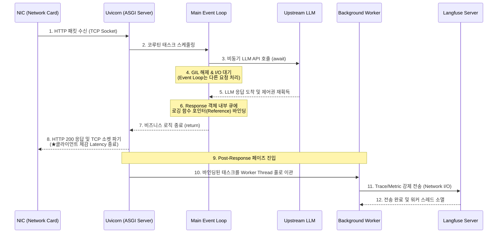

# Observability Pipeline for Latency-Free Prompt Token Usage Logging

Even after LLM response text generation is complete, should the client still bear the network latency of sending usage data to an external logging server?

To simultaneously achieve fast response times for LLM applications and maintain the integrity of optimization monitoring, we can combine a framework-level asynchronous queue with specialized observability tools to solve this problem.

- **Langfuse SDK (Observability Platform)**: An LLMOps-specific observability tool that collects and visualizes LLM input/output prompts, duration, and token usage metrics generated by applications, bundling them into a single trace on a central server.
- **FastAPI BackgroundTasks**: A lightweight task queue that operates within the Starlette framework, which FastAPI is built upon, without requiring the infrastructure setup of a separate heavy message broker.
- **Fire-and-Forget Pattern**: An asynchronous architectural pattern where the main process "fires" a task to a worker and "forgets" about it, immediately closing the TCP socket with the client without waiting for the task's success or completion.

<br>

## Problem Definition

Tightly coupling observability (logging) logic with the main business logic can lead to critical performance and availability issues.

- **Latency amplification due to synchronous I/O bottleneck**: In a Python environment, sending data to the Langfuse API is an external HTTP request, which inevitably causes tens to hundreds of milliseconds of I/O blocking. If this is placed in the main flow, clients will experience socket waiting (TTFB delay) until log transmission is complete, even after LLM inference has finished.
- **SPOF propagation**: If the Langfuse cloud server is temporarily down or a network timeout occurs, exceptions and delays are directly propagated to the main server's HTTP response thread, leading to cascading failures that can cause the core business itself to fail.

### Solution Approach

- **Physical Isolation of Lifecycles:** The HTTP response lifecycle and the logging pipeline cycle are separated at the framework level. The main endpoint sends an HTTP 200 response to the client immediately upon receiving an answer from the external LLM, thereby terminating communication.
- **Leveraging Response Binding Queue**: When the main logic finishes, if prompt and token data objects are passed via a `BackgroundTasks` object, the framework binds these function pointers to the response object and quietly executes them in the background immediately after the connection is terminated.

<br>

## Detailed Operating Principles and Structure

Let's analyze this at the event loop and thread level.

This is an extremely detailed operational mechanism that occurs within the OS and framework, from client packet reception to background logging completion, without a diagram.



1.  **HTTP Request Reception and Event Loop Assignment:** When a client's packet reaches the server's NIC, Uvicorn, an ASGI server, reads data from the TCP socket and performs HTTP parsing. Subsequently, based on the parsed data, it schedules a coroutine task on the main event loop to be handled by the controller.
2.  **Main Business Logic I/O Control Return:** The controller calls an external LLM API using `await`. At this point, Python's GIL (Global Interpreter Lock) is released, and the event loop, instead of blocking while waiting for a response, moves on to process other user traffic. When the LLM response arrives, it reacquires control and returns.
3.  **Loading `BackgroundTasks` Object into Memory:** Immediately after the LLM response text and token information are gathered, `background_tasks.add_task(logging_function, arguments)` is called within the controller code. It's important to note that the logging function is absolutely not executed at this point. The Starlette framework merely queues the function pointer and its arguments in a private list within the memory of the `Response` object that will be returned.
4.  **Socket Connection Termination (Early Return and Latency Finalization)**: When the business logic terminates upon encountering a `return` statement, Uvicorn writes the prepared JSON payload and HTTP 200 code to the file descriptor socket connected to the client, and immediately logically terminates the TCP connection (either `FIN` or transitions to a Keep-Alive waiting state). At this point, the latency perceived by the client ends.
5.  **Post-Response Scheduling**: Immediately after the client and response processing are fully completed, and before Starlette's response middleware layer is destroyed, it checks one last time if there is a list of tasks bound to the `Response` object. If there are loaded tasks, they are handed over to Python's AnyIO or asyncio worker thread pool for sequential execution.
6.  **Logging I/O and Background Destruction**: Network I/O occurs when the worker thread sends an HTTPS POST request to Langfuse. Even if a timeout or exception occurs here, it does not affect the main event loop or the client who has already received a response. Once the transmission is complete, the background thread context quietly perishes from memory.

### Examples

This code implements logging code that runs completely independently outside the client and HTTP response lifecycle, prior to Langfuse integration.

```py
from fastapi import FastAPI, BackgroundTasks
import time
import logging

app = FastAPI()
logger = logging.getLogger("uvicorn")

# 클라이언트 응답과 무관하게 백그라운드에서 동작할 딜레이 함수
def simulate_heavy_logging(prompt: str, response: str):
    logger.info(f"백그라운드 워커 진입: {prompt}")
    # 무거운 Network I/O 대기시간(3초)을 강제 모사
    # 이 3초 동안 클라이언트는 이미 응답을 받고 떠난 상태임
    time.sleep(3) 
    logger.info("백그라운드 워커 소멸: 로그 저장 완료")

@app.post("/v1/simple_chat")
async def simple_chat_endpoint(prompt: str, background_tasks: BackgroundTasks):
    # 1. 메인 비즈니스 로직 (즉시 완료된다고 가정)
    fake_llm_response = f"'{prompt}' 텍스트 생성 완료"
    
    # 2. 백그라운드 태스크 메모리 큐에 함수 포인터와 인자 적재
    background_tasks.add_task(
        simulate_heavy_logging, 
        prompt=prompt, 
        response=fake_llm_response
    )
    
    # 3. 로깅 대기 없이 클라이언트 소켓에 즉시 반환 및 연결 파기
    return {"status": "success", "data": fake_llm_response}
```

Now, let's look at a code example that structures prompt, duration, metadata, and token usage metrics into Langfuse's `Trace` and `Generation` objects and safely flushes them in a background thread.

```py
import time
from fastapi import FastAPI, BackgroundTasks
from langfuse import Langfuse
from pydantic import BaseModel

app = FastAPI()

# 1. Langfuse SDK 클라이언트 초기화
# 내부적으로 HTTP 연결 풀링을 사용하며 비동기/멀티스레드 환경에서 Thread-safe 보장
langfuse = Langfuse(
    public_key="pk-lf-...",
    secret_key="sk-lf-...",
    host="https://cloud.langfuse.com"
)

class ChatRequest(BaseModel):
    user_id: str
    prompt: str

# 2. 백그라운드 스레드에서 실행될 실제 Langfuse 로깅 파이프라인
def async_langfuse_logger(user_id: str, prompt: str, completion: str, metrics: dict, latency_ms: int):
    try:
        # A. 단일 실행 흐름을 묶는 최상위 Trace 객체 생성
        trace = langfuse.trace(
            name="chat_generation_pipeline",
            user_id=user_id,
            metadata={"latency_ms": latency_ms}
        )
        
        # B. Trace 내부에 구체적인 LLM 호출 내역(Span/Generation) 및 토큰 매핑
        trace.generation(
            name="openai-gpt-4o-call",
            model="gpt-4o",
            input=prompt,
            output=completion,
            usage=metrics # 예: {"prompt_tokens": 15, "completion_tokens": 10, "total_tokens": 25}
        )
        
        # C. [핵심] 메모리 버퍼에 쌓인 이벤트를 네트워크를 통해 Langfuse 서버로 강제 전송
        # 이 과정에서 발생하는 I/O 딜레이는 메인 서버 성능에 영향을 주지 않음
        langfuse.flush()
    except Exception as e:
        # 로깅 서버 장애가 메인 서비스 장애로 역전파되지 않도록 예외 차단
        print(f"[Observability Error] Langfuse 로깅 실패 (Non-fatal): {e}")

@app.post("/v1/production_chat")
async def production_chat_endpoint(request: ChatRequest, bg_tasks: BackgroundTasks):
    start_time = time.time()
    
    # 3. 외부 LLM 호출 모사 (실제 환경에서는 vLLM 등 await I/O 호출 수행)
    mock_llm_output = "안녕하세요, 무엇을 도와드릴까요?"
    mock_token_usage = {
        "prompt_tokens": 15, 
        "completion_tokens": 10, 
        "total_tokens": 25
    }
    
    # 추론 소요 시간 밀리초 단위 계산
    duration_ms = int((time.time() - start_time) * 1000)

    # 4. BackgroundTasks에 로깅 함수와 추출된 메트릭 데이터를 바인딩
    bg_tasks.add_task(
        async_langfuse_logger,
        user_id=request.user_id,
        prompt=request.prompt,
        completion=mock_llm_output,
        metrics=mock_token_usage,
        latency_ms=duration_ms
    )

    # 5. 로깅 전송 완료를 기다리지 않고 HTTP 200 즉시 반환 (Fail-fast 패턴 응용)
    return {
        "response": mock_llm_output,
        "usage": mock_token_usage
    }
```

<br>

## Additional

### What is Starlette

It is the heart and physics engine of FastAPI.

The framework we call FastAPI didn't actually build all web functionalities from the ground up by itself.

It's more like a shell built on top of Starlette, an extremely fast and lightweight asynchronous (ASGI) web toolkit, with data validation (Pydantic) and documentation (OpenAPI) specifications attached.

-   **Role**: The entity that implements and executes the acts of sending Request-Response, routing, middleware processing, WebSocket integration, and the `BackgroundTasks` mechanism itself. This is Starlette.

### GIL (Global Interpreter Lock)

It is the Python interpreter's colossal single lock.

The GIL is a mutual exclusion lock (mutex) that forces CPython (the most standard Python implementation) to execute Python bytecode with only one thread at a time.

The reason it becomes a bottleneck is that it nullifies the benefits of multi-core processors.

-   Let's assume we have a server with 8 CPU cores and we create 8 threads to perform heavy mathematical computations or CPU-bound tasks.
-   In C or Java, 8 cores would work simultaneously, but Python only has one lock, the GIL.
-   Consequently, the 8 threads will perform context switching alternately to acquire this lock, effectively taking the same amount of time as running on a single core, and sometimes even slower due to overhead.

However, when performing I/O-bound tasks that involve external responses, such as network communication or database queries, Python voluntarily releases the GIL and waits, thus allowing the benefits of async or multithreading to be fully realized.

But why hasn't Python abandoned the GIL?

The GIL is not merely a relic; it's a powerful weapon that has sustained the Python ecosystem.

1.  **Perfect Stability in Memory Management and GC Assurance**
    1.  Python manages memory using a reference counting technique that tracks how many times a variable is referenced.
    2.  Without the GIL, multiple threads manipulating a variable's reference count simultaneously would lead to a race condition, potentially corrupting in-use memory or causing memory leaks. The GIL fundamentally prevents this.
2.  **High Performance in Single-Threaded Operations**
    1.  The process of individually applying and releasing small, fine-grained locks to tens of thousands of variables to prevent memory conflicts introduces overhead to the computer.
    2.  Python, in contrast, feels like simply putting one lock on an entire room, which means that when operating in a single thread, the computational cost of managing locks is almost negligible, making it fast.
3.  **Driving Explosive Growth in the C Extension Ecosystem**
    1.  This is key: core libraries like NumPy, Pandas, TensorFlow, and PyTorch are internally written in C/C++.
    2.  When C-written modules are integrated with Python, the GIL acts as a large shield protecting thread safety, allowing developers to easily create Python libraries without complex concurrency handling. Paradoxically, Python becoming the standard for AI and data science can be attributed to the GIL.
