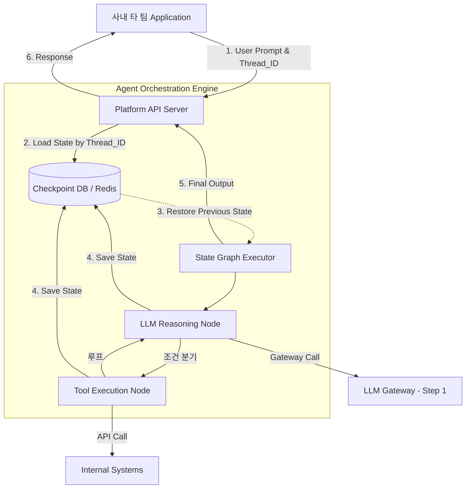

# RAG and Agent Serving Pipeline

How can a data scientist transition complex Agent logic, validated in a Jupyter Notebook environment, into a production API server capable of handling thousands of concurrent requests?

While experimental code runs synchronously, occupying memory in a single thread, a production server operates in a stateless environment where scale-out or restarts can occur at any time.

What foundation is needed to reliably serve long-running Agent processes, which can take several seconds or more to call tools and await LLM responses, without relying on the server's volatile memory?

The architecture introduced to solve the above questions is a **State Machine-based Agent Orchestration Platform.**

It's a serving methodology that goes beyond procedural code execution, separating an Agent's workflow into events and state sets, which are then recorded and tracked in a database.

- **State Graph**: A declarative structure that defines an Agent's execution logic as nodes and edges in a Directed Acyclic Graph (DAG) format.
- **Checkpointing**: A technique for saving all current context (prompt history, internal variables) as a snapshot in an external store like Redis or PostgreSQL each time an Agent completes a node's task (e.g., tool calling).
- **Long-running Workflow**: An asynchronous workflow that extends beyond the short lifecycle of an HTTP request-response, potentially calling external APIs or awaiting human approval for minutes to hours.

<br>

## Problem Definition

**There was a structural disconnect between data scientists' local experimental code and the stateless production backend environment, leading to inconsistency issues where logic had to be reimplemented (inference restarted) with each deployment. Furthermore, conventional synchronous web servers had limitations in tracking complex Agent processes that sequentially call multiple tools or recovering from failures.**

For example, when a backend developer ports a complex RAG prompt chain, completed by a model engineer in a Python script, into server code, subtle logic omissions can alter search quality. Or, if an Agent is waiting for an internal external API response for 10 seconds and the Kubernetes pod restarts due to scaling, the memory holding the in-progress Agent's work context evaporates, returning a 500 error to the user and requiring a restart from scratch.

### Solving

- **Graph-based Declarative Workflow Separation**: Instead of hardcoding Agent logic within procedural code like while loops, retrieve nodes, generate nodes, and execute nodes are separated, and the conditions for transitions between each node are declared in a graph format and registered with the platform. This allows the graph definition from the experimental environment to be deployed and run directly on the production engine.
- **State Persistence using External Storage**: The Agent's context (conversation history, intermediate computation results) that relied on server memory is eliminated. Each time a node's execution on the graph is completed, the entire state is serialized and stored (checkpointed) in Redis. Even if a server instance goes down, a new instance can query the client thread ID, retrieve the state from Redis at the point of interruption, and accurately resume the operation.

<br>

## Operational Principles and Structure

Let's look at the logical data flow where a stateless API server serves an Agent graph using a checkpoint database in a production environment.



1. **Initialization and Recovery**: When a client sends a request with a unique `Thread_ID`, the API server loads the previous state of that thread from the Checkpoint DB.
2. **Graph Traversal**: The `State Graph Executor` determines and executes the next node (LLM, inference) based on the current state.
3. **Checkpointing**: Immediately after a node's execution and just before moving to the next node, the modified state payload is overwritten in the DB. At this point, the system is safe even if the server goes down.
4. **Termination**: Upon reaching the termination node, the final generated text is returned to the client.

```json
{
  "thread_id": "usr-session-9912",
  "checkpoint_id": "cp-step-004",
  "data": {
    "messages": [
      {"role": "user", "content": "내 최근 주문 내역 알려줘."},
      {"role": "assistant", "content": null, "tool_calls": [{"id": "call_1", "name": "get_orders", "args": {"user_id": "A101"}}]},
      {"role": "tool", "tool_call_id": "call_1", "content": "[{'id': 'ORD-01', 'item': '의자'}]"}
    ],
    "values": {
      "user_status": "VIP",
      "last_retrieved_orders": ["ORD-01"]
    }
  },
  "metadata": {
    "current_node": "order_retrieval_node",
    "parent_checkpoint_id": "cp-step-003",
    "timestamp": "2026-04-22T14:50:00Z"
  }
}
```

The state checkpoint data structure, serialized and stored in Redis or a database, looks like the above.

With this data, even if the server completely shuts down and restarts, inference can resume from that exact point.

### Example

Let's look at the core logic that defines a state schema, registers each task as a node, and then connects them into an executable graph, rather than using procedural code. This concept is borrowed from the LangGraph framework.

```py
from typing import TypedDict, List
import json

# 1. 그래프 전체를 관통하는 상태(State) 데이터 스키마 정의
class AgentState(TypedDict):
    messages: List[str]      # 대화 이력 누적
    next_step: str           # 다음 실행할 노드 지정
    tool_result: str         # 도구 실행 결과 저장소

# 2. 개별 노드(작업 단위) 함수 정의
def llm_reasoning_node(state: AgentState) -> AgentState:
    """LLM을 호출하여 판단을 내리는 노드"""
    print("[Node: LLM] 이력과 도구 결과를 바탕으로 추론 중...")
    # 가정: LLM이 텍스트 생성을 완료했거나, 도구 호출이 필요하다고 판단함
    state["messages"].append("LLM: 고객 데이터 조회가 필요합니다.")
    state["next_step"] = "tool_node" # 다음 이동 경로 지정
    return state

def tool_execution_node(state: AgentState) -> AgentState:
    """실제 사내 API를 실행하는 노드"""
    print("[Node: Tool] 데이터베이스 접근 및 API 실행 중...")
    state["tool_result"] = "{'status': 'VIP', 'discount': 0.1}"
    state["next_step"] = "llm_node" # 도구 실행 후 다시 LLM으로 반환
    return state

# 3. 그래프 엔진 시뮬레이션 (Orchestrator)
def run_agent_graph(initial_state: AgentState, max_steps: int = 5):
    """정의된 노드들을 상태 기반으로 순회하며 실행합니다."""
    current_state = initial_state
    
    for _ in range(max_steps):
        # 현재 상태를 DB에 저장하는 Checkpointing 위치
        save_to_db("thread_123", current_state) 
        
        current_step = current_state.get("next_step")
        if current_step == "llm_node":
            current_state = llm_reasoning_node(current_state)
        elif current_step == "tool_node":
            current_state = tool_execution_node(current_state)
        elif current_step == "end":
            break
            
    return current_state

def save_to_db(thread_id, state):
    # 실제로는 Redis 등에 JSON 직렬화하여 저장
    pass
```

This is the backend router structure where the platform team safely controls the Agent graph by communicating with the DB within a FastAPI web server.

Even if a client's network connection is lost or a server crashes, the work history is safely preserved.

```py
from fastapi import FastAPI, BackgroundTasks
from pydantic import BaseModel
import redis

app = FastAPI()
redis_client = redis.Redis(host='platform-redis', port=6379, db=0)

class AgentRequest(BaseModel):
    thread_id: str      # 사용자 또는 세션을 식별하는 고유 ID
    user_input: str     # 새로운 프롬프트

def load_checkpoint(thread_id: str) -> dict:
    """Redis에서 그래프의 이전 상태를 복구합니다."""
    data = redis_client.get(f"agent_state:{thread_id}")
    if data:
        return json.loads(data)
    # 초기 상태 반환
    return {"messages": [], "next_step": "llm_node", "tool_result": ""}

def save_checkpoint(thread_id: str, state: dict):
    """그래프의 현재 상태를 Redis에 덮어씁니다."""
    redis_client.set(f"agent_state:{thread_id}", json.dumps(state))

@app.post("/api/v1/agent/invoke")
def invoke_agent_workflow(request: AgentRequest):
    """
    무상태(Stateless) API 엔드포인트. 
    메모리가 아닌 DB에서 컨텍스트를 가져와 Agent 작업을 재개합니다.
    """
    
    # 1. 상태 복구 (이전 대화 내역 및 중단된 노드 정보 로드)
    current_state = load_checkpoint(request.thread_id)
    
    # 2. 새로운 사용자 입력 반영
    current_state["messages"].append(f"User: {request.user_input}")
    
    # 3. 플랫폼 그래프 엔진 구동 (예시 1의 run_agent_graph 형태)
    # 내부적으로 각 노드를 통과할 때마다 save_checkpoint가 호출되도록 설계됨
    try:
        final_state = run_agent_graph(current_state)
        
        # 4. 최종 결과 반환 직전 상태 저장
        save_checkpoint(request.thread_id, final_state)
        
        return {
            "thread_id": request.thread_id,
            "response": final_state["messages"][-1]
        }
        
    except Exception as e:
        # 5. 서버 다운이나 장애 발생 시, DB에 기록된 마지막 체크포인트까지만 안전하게 보존됨
        return {"error": f"Agent 프로세스 중단: {str(e)}"}
```
