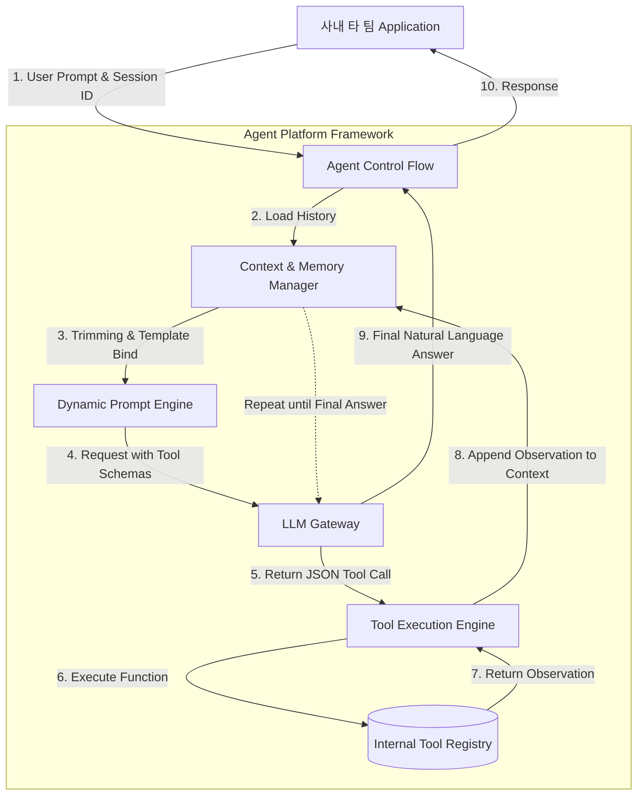

# AI Agent Tooling and Dynamic Prompt/Context Management Platform

LLMs are fundamentally just a collection of weights learned in the past, so they lack the ability to directly perform physical actions such as querying customer information from a current database or sending emails.

Furthermore, if multiple teams create Agents for different purposes and simply hardcode accumulated conversation history, it will exceed context window limits, leading to server crashes or skyrocketing API costs.

So, how should a platform provide LLMs with standardized access to internal systems (tools) and a foundation for efficiently managing the explosively growing conversation context?

The solution to this question is building an **Agentic Workflow platform.**

This architecture combines LLM's reasoning capabilities with internal systems' execution capabilities, centrally controlling state and memory at the platform level.

- **AI Agent**: Beyond a simple text generator, an autonomous system that plans to achieve a given goal, interacts with the environment using external tools, and solves problems.
- **Tool Use (Function Calling)**: A standard communication protocol that overcomes the structural limitation of LLMs not being able to execute code directly. By injecting the signatures/JSON schemas of available functions into the LLM beforehand, the LLM analyzes natural language to determine which function to execute with which parameters, returns it in JSON format, and the backend server platform executes it on its behalf, passing the result back to the LLM.
- **ReAct (Reasoning and Acting) Paradigm**: A logical cycle for an Agent to perform tasks, a prompting engineering technique that forces a loop of [thought: analyze current state -> action: decide which tool to use -> observation: observe the tool's execution result] until the correct answer is found.
- **Context Window Optimization**: A memory management technique that dynamically injects prompts via a template engine within the LLM's maximum token limit (8k, 128k), calculates the token count of past conversation history, and trims (Trimming/Sliding Window) or summarizes and injects less important parts.

<br>

## Problem Definition

**The LLM itself had a problem of hallucination due to its inability to access real-time data. Furthermore, each product team hardcoded and managed prompt templates and conversation history at the individual application level, making token optimization impossible, leading to skyrocketing costs and exceeding response times. For example, these are the kinds of problems:**

ex) For instance, an internal CS chatbot team, trying to handle a request like **'Check today's customer refund details,'** might forcibly insert refund API call logic as text into the system prompt, leading to errors due to incorrect LLM formatting. Or, they might send dozens of previous conversation histories directly to the LLM server without any refinement, wasting thousands of won in token costs for a single API call, ultimately causing the service to crash with a `max_tokens` error.

### Problem-Solving Approach

- **Standardized Tool Registry and Protocol Provision**: The platform team converts various internal backend APIs (e.g., refund inquiry, stock check) into standard JSON Schema specifications and registers them in a central repository. Individual product teams can inject the required tool's ID into an Agent instance without implementing any code. The platform framework takes charge of parsing LLM responses and handling the Control Flow for actual function calls.
- **Dynamic Template Engine and Memory Pipeline Construction**: By introducing a template engine like `Jinja2`, prompt variables such as user session information, permissions, and current date are dynamically bound at runtime. Concurrently, before the request is passed to the LLM Gateway, the platform pre-calculates the total payload's token count using tools like Tiktoken and, if a threshold is exceeded, applies a token text splitter that automatically provides messages from the oldest in the queue.

<br>

## Detailed Operating Principles and Structure

This is the ReAct loop structure where Tool Calling and Context management occur within the Agent framework provided by the platform.



1. **Initialization**: When a user request and session ID are received, the `Context Manager` loads past conversation history from storage and trims it to fit the configured limit (e.g., 4000 tokens).
2. **Specification Injection**: The schema of available tools is sent to the LLM Gateway along with the system prompt.
3. **ReAct Loop Execution**: If the LLM returns a function call instruction instead of text, the tool execution engine actually executes the internal API. The resulting Observation is then added back to the Context and sent again to the LLM.
4. **Termination**: When the LLM determines that no more tools are needed and generates a final text response, it is returned to the client.

### Example

This is the standard JSON schema specification defined by the platform to teach the LLM about the existence and usage of internal APIs.

The natural language description plays the most crucial role, and the LLM reads this description to infer when to use this tool.

```py
# JSON Schema specification for the 'customer order inquiry' tool defined by the platform team
# The LLM reads this specification and returns JSON matching the parameter types.

get_order_status_tool_schema = {
    "type": "function",
    "function": {
        "name": "get_order_status",
        "description": "고객의 현재 주문 배송 상태를 데이터베이스에서 조회합니다. 사용자가 주문 번호를 언급할 때만 사용하세요.",
        "parameters": {
            "type": "object",
            "properties": {
                "order_id": {
                    "type": "string",
                    "description": "조회할 주문 번호 (예: ORD-12345)"
                },
                "user_id": {
                    "type": "string",
                    "description": "요청한 고객의 시스템 ID"
                }
            },
            "required": ["order_id", "user_id"]
        }
    }
}
```

Let's also look at the context manager class provided by the platform core, which prevents internal developers from having to manually concatenate complex prompt strings or calculate tokens. It provides a dynamic prompt engine and token trimming.

```py
import tiktoken
from typing import List, Dict
from jinja2 import Template

class PlatformContextManager:
    """
    Platform class that defends against LLM's Context Window limitations and dynamically binds prompts
    """
    def __init__(self, model_name: str = "gpt-4", max_tokens: int = 4000):
        # 1. Initialize tokenizer (encoder) for each model
        self.tokenizer = tiktoken.encoding_for_model(model_name)
        self.max_tokens = max_tokens
        
        # 2. Dynamic system prompt template (Jinja2 syntax)
        self.system_template = Template(
            "You are an AI assistant for the {{ department }} team.\n"
            "Today's date is {{ current_date }}.\n"
            "You have access to internal tools."
        )

    def _count_tokens(self, text: str) -> int:
        """Accurately calculates the actual token count of a string."""
        return len(self.tokenizer.encode(text))

    def build_context(
        self, 
        department: str, 
        current_date: str, 
        chat_history: List[Dict[str, str]], 
        new_user_message: str
    ) -> List[Dict[str, str]]:
        """
        Binds variables and generates the final payload by safely trimming past history to not exceed token limits.
        """
        
        # 1. System prompt rendering and token calculation
        system_content = self.system_template.render(
            department=department, current_date=current_date
        )
        final_messages = [{"role": "system", "content": system_content}]
        current_tokens = self._count_tokens(system_content) + self._count_tokens(new_user_message)
        
        # 2. Sliding window for past history (add from newest message in reverse, checking limits)
        safe_history = []
        for message in reversed(chat_history):
            msg_tokens = self._count_tokens(message["content"])
            if current_tokens + msg_tokens > self.max_tokens:
                break # If token limit exceeded, discard past history (Trimming)
            
            safe_history.insert(0, message)
            current_tokens += msg_tokens
            
        # 3. Final assembly
        final_messages.extend(safe_history)
        final_messages.append({"role": "user", "content": new_user_message})
        
        return final_messages

# --- Example of application in internal systems ---
# context_mgr = PlatformContextManager(max_tokens=3000)
# safe_payload = context_mgr.build_context(
#     department="CS",
#     current_date="2026-04-22",
#     chat_history=[{"role": "user", "content": "어제 주문한 건..."}], # long array of past data
#     new_user_message="배송 상태 조회해줘."
# )
# 
# # Developers can send safe_payload to the LLM Gateway without worrying about token OOM.
```
