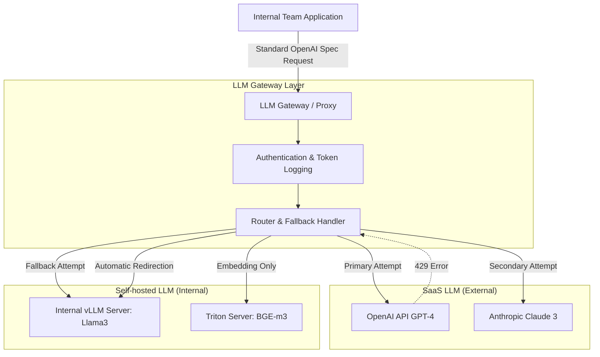

# LLM Gateway and Integrated Routing for Multi-Model (SaaS & Self-hosted)

Let's say Team A uses the OpenAI API, and Team B uses vLLM (Llama3) deployed on their internal network for security.

Both teams are separately implementing and maintaining their API call code.

If an OpenAI server outage occurs, how should the system be designed to immediately redirect traffic to an internal vLLM server without modifying client code, and to centrally control the entire organization's token usage?

The technology introduced to solve the above problem is an **LLM Gateway (AI Proxy)**.

**It is a middleware architecture positioned between clients and multiple LLMs (SaaS or Self-Hosted) that standardizes API specifications, performs load balancing, provides failover fallback, and centralizes token monitoring.**

<br>

## Problem Definition

The API specifications and authentication methods of various LLM providers (OpenAI, Anthropic, and various open-source models) are fragmented, leading to redundant implementation issues where other teams have to write separate integration code every time they adopt a platform.

There was a systemic limitation where immediate redirection to another model was impossible when a specific external model experienced an outage or rate limit. For example,

If an Agent in a production service calls the OpenAI GPT-4 API and receives an HTTP 429 "Too Many Requests" error, the entire service stops and returns an error because it cannot immediately hand over the request to its internally deployed vLLM server.

### Problem-Solving Approach

-   **Provide a Single Standard API Specification**: The platform team provides only one OpenAI Compatible API specification to in-house developers. In-house developers send requests to the Gateway without needing to know which LLM is on the backend. The Gateway internally translates and forwards requests according to each provider's specification.
-   **Dynamic Routing and Fallback**: Routing rules are configured at the gateway level. If a primary model call fails or times out, a pipeline is built to retry the request with a predefined secondary model, ensuring availability.

<br>

## Detailed Operating Principles and Structure

This is the data flow where the LLM Gateway integrates and processes in-house hosted models with SaaS APIs.



1.  **Request Reception**: An internal client sends the model name `model=gpt-4` and the prompt to the gateway server.
2.  **Routing Rule Evaluation**: The Gateway finds the actual endpoint mapped to the requested model.
3.  **Request Transformation and Forwarding**: If the target is Anthropic, the OpenAI format is converted to the Anthropic format before the request is sent. If the target is an internal vLLM, it is forwarded as is. vLLM natively supports the OpenAI specification.
4.  **Failure Detection and Redirection**: If a 4xx/5xx error is returned from the primary target, the gateway does not return an error to the client but resends the prompt to the secondary target according to internal settings.

### Example

Let's look at the logic that implements the principle of the Gateway detecting errors and redirecting requests to another model.

In practice, validated proxy libraries like LiteLLM are used.

```py
import openai
import anthropic
import time

def gateway_routing_with_fallback(prompt: str):
    """
    Primary: Attempt to call OpenAI GPT-4
    Secondary: Fallback to internal hosted vLLM server upon failure
    """

    try:
        print("Attempting primary OpenAI API")
        client = openai.OpenAI(api_key="sk...")
        response client.chat.completions.create(
            model="gpt-4",
            messages=[{"role": "user", "content: prompt"}],
            timeout=5
        )
        return response.choices[0].message.content
    except Exception as e:
        print(f"OpenAI API failed {e}. vLLM Fallback")
    
    try:
        print("Secondary: Attempting internal vLLM server...")
        vllm_client = openai.OpenAI(
            base_url="http://internal-vllm-server:8000/v1",
            api_key="EMPTY" # Authentication omitted for internal network
        )
        response = vllm_client.chat.completions.create(
            model="meta-llama/Llama-3-8B-Instruct",
            messages=[{"role": "user", "content": prompt}]
        )
        return response.choices[0].message.content

    except Exception as e:
        return f"All LLM servers unresponsive: {e}"

# print(gateway_routing_with_fallback("Hello."))
```

LiteLLM Proxy Configuration

Instead of writing routing code directly, a specialized Gateway framework like `LiteLLM` is deployed and used as a container.

This is the routing and fallback configuration file structure provided to internal teams as a platform.

```yaml
# litellm_config.yaml
# Gateway configuration file centrally managed by the LLM platform team

model_list:
  # 1. SaaS LLM Configuration
  - model_name: platform-gpt
    litellm_params:
      model: gpt-4
      api_key: os.environ/OPENAI_API_KEY
      
  # 2. Internal Hosted LLM Configuration (vLLM)
  - model_name: platform-local
    litellm_params:
      model: openai/meta-llama/Llama-3-8B-Instruct
      api_base: http://internal-vllm-server:8000/v1
      api_key: EMPTY

# Define router load balancing and Fallback rules
router_settings:
  fallback_dict:
    # If an internal client calls "platform-gpt" and it fails,
    # the platform core automatically redirects to "platform-local" (vLLM)
    platform-gpt: ["platform-local"]
```

Once such an LLM Gateway is established, other internal teams simply need to send requests conforming to the OpenAI API specification to `http://internal-gateway-address:4000`. Model integration, load balancing, and error handling are controlled by the platform team.
