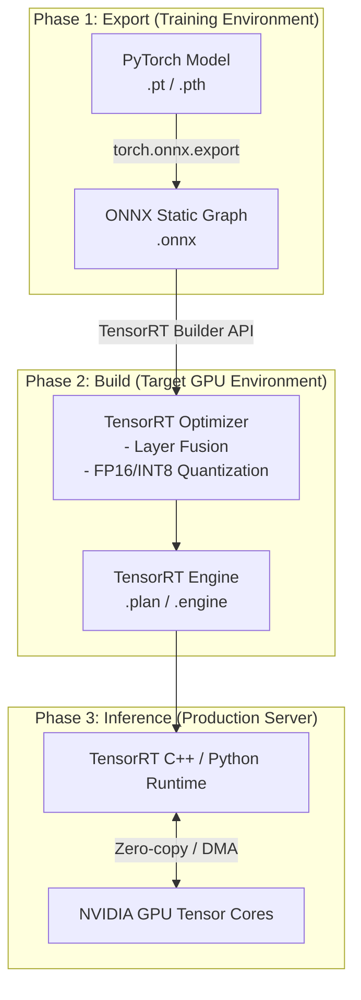

# Model Optimization and Inference Latency Optimization Pipeline

When deep learning models trained in the Python ecosystem (PyTorch, TensorFlow) are deployed directly to a production API server, why do they fail to fully utilize GPU computational power and instead encounter bottlenecks?

How should an inference pipeline be designed to maximize the processing speed of target NVIDIA GPUs, while maintaining the same model architecture and removing framework dependencies?

The pipeline introduced to solve the problems defined above is **ONNX conversion and TensorRT engine building**.

This is an engineering technique that dramatically shortens execution speed by extracting the model's weights and operational structure into the standard ONNX format, and then optimizing it at the kernel level (TensorRT) for a specific GPU architecture.

<br>

## Problem Definition

In other words, there was a problem where the overhead from dynamic computation graph processing in frameworks like PyTorch and the Python GIL (Global Interpreter Lock) caused CPU memory allocation and scheduling to take longer than the actual GPU computation time. This led to a sharp increase in inference latency under high-traffic conditions, limiting service availability.

For example, consider this problem: "When hundreds of embedding requests come in per second, the model's pure matrix multiplication operation completes in 5ms, but unnecessary safety checks within the Python object creation framework intervene, extending the final API response time perceived by the client to over 100ms."

### How the Solution Works

This pipeline undergoes a two-stage conversion process

1.  **Framework-Independent Standard Format Conversion: PyTorch -> ONNX**
    *   Pass a dummy tensor through the PyTorch model to trace all execution flows.
    *   This serializes the structure and weights into the ONNX format, which is a static computation graph that does not require the Python runtime.
2.  **Hardware-Dependent Kernel Optimization: ONNX -> TensorRT**
    *   **Layer Fusion (Vertical/Horizontal Fusion)**: Merges multiple independent layers (Convolution, Batch Norm, ReLU) into a single CUDA kernel operation to reduce GPU memory I/O read/write counts.
    *   **Precision Calibration**: To reduce computation speed and VRAM usage, the data type of weights is lowered from FP32 to FP16 or INT8 (quantization).
    *   **Kernel Auto-Tuning**: Selects the most optimized execution path for the exact GPU model (e.g., A100, T4) architecture where the build is being performed, generating a binary engine `.engine` / `.plan` file.

> **To elaborate on kernel auto-tuning**
> When building an engine, TensorRT individually runs dozens of different CUDA kernel algorithms for the same matrix multiplication operation on the actual installed GPU and directly measures the processing speed per second.
>
> Since the internal cache memory and physical structure of Tensor Cores are completely different between A100 and T4, this profiling process selects and assembles only the kernels that operate fastest without bottlenecks in the current hardware environment.
>
> Due to this hardware-specific tuning method, the completed `.engine` binary file cannot be copied and reused on different types of GPU servers; it must be rebuilt on the target device where the service will actually run.
>
> Here, 'assembling' means that an AI model is a pipeline of dozens or hundreds of mathematical formula layers connected in sequence. Even for the same multiplication and addition operations, there are dozens of different calculation algorithms. The process involves determining which formulas and in what order will be fastest on the currently installed GPU, and then selecting only the optimized methods to connect them into a single block. This is what 'assembling' refers to. What's fast on an A100 GPU might be slow on a T4. The goal is to allow operations to behave flexibly depending on the GPU.



Let's look at the code logic for converting a PyTorch model to ONNX as an example.

This script traces and saves a dynamically operating PyTorch model as a static graph with fixed or variable input sizes.

```py
import torch
import torchvision.models as models

def export_to_onnx():
    # 1. 학습된 PyTorch 모델 로드 및 평가 모드 전환
    model = models.resnet50(pretrained=True)
    model.eval()

    # 2. 모델 연산 흐름을 추적하기 위한 더미 입력 데이터 생성 (Batch, Channel, Height, Width)
    dummy_input = torch.randn(1, 3, 224, 224, device='cpu')

    # 3. ONNX 포맷으로 Export
    # 주의: 배치 사이즈 등 동적으로 변해야 하는 차원은 dynamic_axes로 명시해야 합니다.
    torch.onnx.export(
        model, 
        dummy_input, 
        "resnet50.onnx",               # 저장할 파일명
        export_params=True,            # 가중치 포함 여부
        opset_version=13,              # ONNX 오퍼레이션 셋 버전
        do_constant_folding=True,      # 상수 폴딩 최적화 활성화
        input_names=['input'],         # 그래프 입력 노드 이름
        output_names=['output'],       # 그래프 출력 노드 이름
        dynamic_axes={                 # 배치 사이즈를 동적(가변)으로 설정
            'input': {0: 'batch_size'},    
            'output': {0: 'batch_size'}
        }
    )
    print("ONNX 변환 완료: resnet50.onnx")

# export_to_onnx()
```

Let's also look at a script that reads an ONNX file and builds a TensorRT engine binary file with FP16 precision applied, on the actual GPU serving device.

This task is hardware-dependent and must be performed in an environment identical to the GPU infrastructure of the server where it will be deployed.

```py
import tensorrt as trt

# TensorRT 로거 초기화
TRT_LOGGER = trt.Logger(trt.Logger.WARNING)

def build_tensorrt_engine(onnx_file_path, engine_file_path):
    """ONNX 파일을 읽어 FP16 최적화가 적용된 TensorRT Engine으로 빌드합니다."""
    
    # 1. Builder 및 Network 초기화 (명시적 배치 사이즈 허용)
    builder = trt.Builder(TRT_LOGGER)
    network = builder.create_network(1 << int(trt.NetworkDefinitionCreationFlag.EXPLICIT_BATCH))
    config = builder.create_builder_config()
    
    # 2. 작업 공간(Workspace) 메모리 할당 및 정밀도 설정
    config.set_memory_pool_limit(trt.MemoryPoolType.WORKSPACE, 2 * (1 << 30)) # 2GB
    
    # 해당 GPU가 FP16(반정밀도) 연산을 지원한다면 활성화
    if builder.platform_has_fast_fp16:
        config.set_flag(trt.BuilderFlag.FP16)
        print("FP16 최적화 모드 활성화됨")

    # 3. ONNX 파서를 통해 모델 구조 파싱
    parser = trt.OnnxParser(network, TRT_LOGGER)
    with open(onnx_file_path, 'rb') as model:
        if not parser.parse(model.read()):
            print("ONNX 파싱 실패:")
            for error in range(parser.num_errors):
                print(parser.get_error(error))
            return None

    # 4. 동적 배치를 사용하는 경우 최적화 프로필(Optimization Profile) 설정 필수
    profile = builder.create_optimization_profile()
    # 파라미터: (입력명, 최소 차원, 최적 차원, 최대 차원)
    profile.set_shape("input", (1, 3, 224, 224), (8, 3, 224, 224), (32, 3, 224, 224))
    config.add_optimization_profile(profile)

    # 5. 직렬화된 엔진 바이너리 빌드 (이 과정에서 GPU 커널 튜닝이 일어나므로 수 분 소요됨)
    print("TensorRT 엔진 빌드 중... (시간이 소요됩니다)")
    serialized_engine = builder.build_serialized_network(network, config)

    # 6. 파일로 저장
    with open(engine_file_path, "wb") as f:
        f.write(serialized_engine)
    print(f"TensorRT 엔진 저장 완료: {engine_file_path}")

# build_tensorrt_engine("resnet50.onnx", "resnet50_fp16.engine")
```
