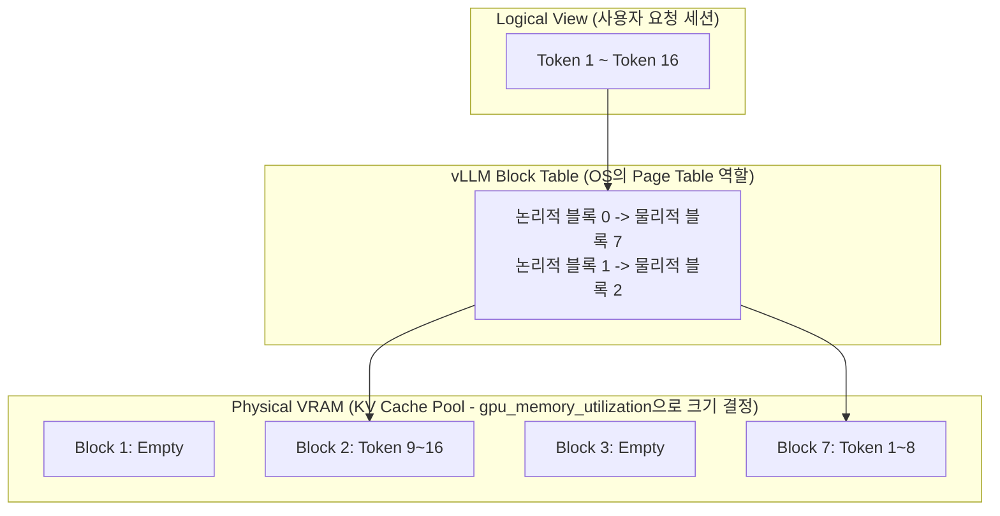
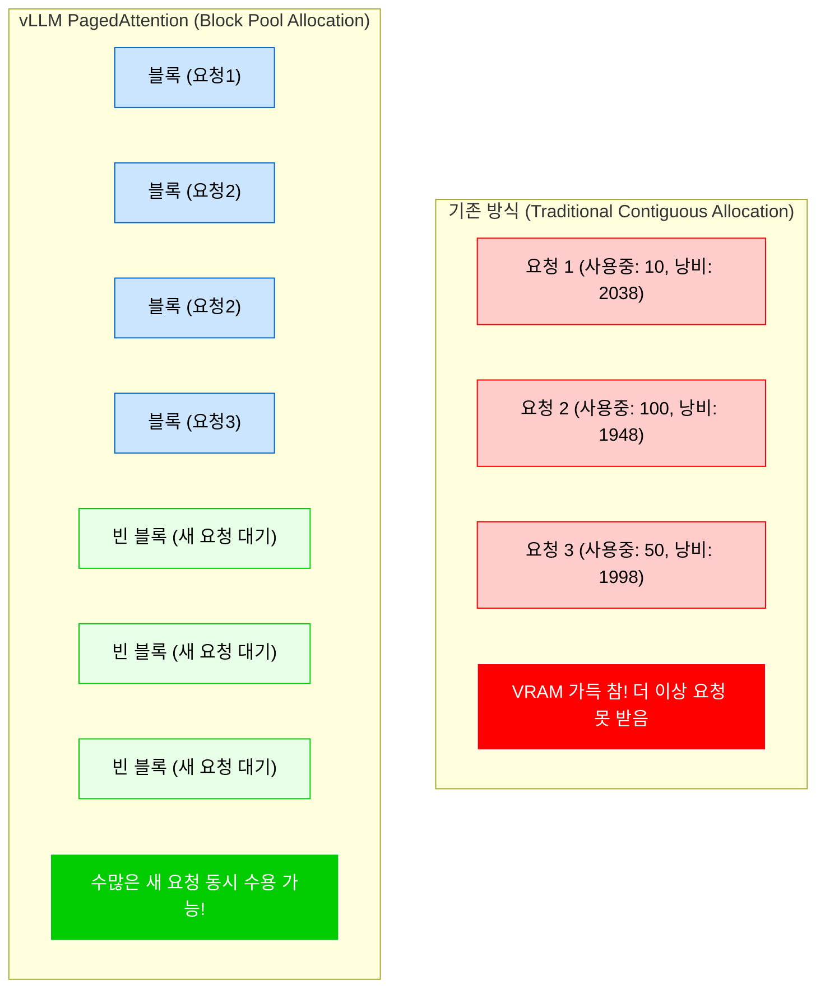

# vLLM Engine Memory Optimization Based on PagedAttention

Let's start with a question: To predict the next word, an LLM must remember all previously generated words in its computational state, the KV Cache. But when a user asks a question, can the LLM know in advance how many characters its final answer will be? If not, how much GPU VRAM should the server allocate to store this uncertain length of data?

The innovative architecture that solves this memory allocation dilemma by adopting the operating system's virtual memory paging technique is vLLM's **PagedAttention**.

-   **KV Cache** is a Key-Value Cache technique where, when an LLM generates text, it caches the attention vector values (key and value) of previously computed tokens in VRAM to avoid recalculating them every time. It is the primary culprit consuming the most VRAM during LLM serving.
-   **PagedAttention** splits the KV Cache in VRAM into fixed-size blocks (e.g., 16 tokens), similar to how an operating system manages physical memory by dividing it into pages of a certain size. This eliminates the need for contiguous memory space, dramatically reducing memory fragmentation.
-   **gpu_memory_utilization**: This parameter determines the proportion (e.g., 0.9) of the total GPU VRAM that vLLM will pre-occupy as a KV Cache pool when the server starts.
-   **max_num_batched_tokens**: This parameter limits the maximum number of tokens (combining both prompt and generated tokens) that can be processed simultaneously in a single GPU operation (forward pass).

<br>

## Problem Definition

Existing LLM serving engines (like Hugging Face) suffered from internal fragmentation because they didn't know the response length. They would unconditionally pre-allocate a contiguous block of VRAM equal to the maximum token length allowed by the model.

For example, if a short, single-sentence response of 10 tokens was actually generated, but a vast space of 2048 tokens was reserved and tied up in VRAM, it couldn't accept requests from other users. This led to a critical bottleneck where the GPU's compute cores were idle, but VRAM was full (OOM), preventing even 10 concurrent users.

### Solution Approach

-   **Pre-allocation of Block Pool**: When the process starts, the `gpu_memory_utilization` setting is used to pre-occupy most of the VRAM remaining after model weights are loaded, as a massive KV cache pool made of blocks. This is analogous to how an operating system manages memory with a paging table at boot time. (Here, the pool allocation and the mapping of KV cache per response are different.)
-   **Dynamic Block Mapping and Throughput Control**: As responses are generated, physical blocks are dynamically mapped only as needed. Simultaneously, `max_num_batched_tokens` is adjusted appropriately to control traffic, preventing the KV Cache pool from being instantly depleted or exceeding GPU computation limits due to too many tokens in a single computation cycle.

<br>

## Detailed Operating Principle and Structure

This is the PagedAttention structure where logical token sequences are mapped to fragmented physical VRAM blocks, similar to an operating system's page table.



To give the most intuitive example of how these two parameters are applied:

```py
from vllm import LLM, SamplingParams

# 1. Initialize PagedAttention engine and control parameters
llm = LLM(
    model="meta-llama/Llama-3-8B",
    # [Key Parameter 1] gpu_memory_utilization
    # Limits vLLM to use only 80% of total VRAM.
    # (Leaving the remaining 20% for other processes or the OS)
    gpu_memory_utilization=0.80, 
    
    # [Key Parameter 2] max_num_batched_tokens
    # Maximum number of tokens to process in a single GPU tick.
    # Too large can cause computational OOM, too small reduces throughput.
    max_num_batched_tokens=4096,
    
    # [Optional] KV Cache block size (default 16).
    # Similar to deciding whether OS Page Size is 4KB or 8KB.
    block_size=16 
)

# 2. Set sampling parameters and run inference
prompts = ["리눅스 커널의 mmap() 동작 원리를 설명해줘.", "JVM의 G1GC에 대해 알려줘."]
sampling_params = SamplingParams(temperature=0.7, max_tokens=200)

# Internally, PagedAttention processes 2 prompts concurrently without memory waste
outputs = llm.generate(prompts, sampling_params)

for output in outputs:
    print(f"Prompt: {output.prompt!r}, Generated: {output.outputs[0].text!r}")
```

This is how it works. For asynchronous vLLM engine operation in a FastAPI serving environment, you can configure `AsyncLLMEngine` with optimized parameters to handle random incoming traffic in a real production environment.

```py
from fastapi import FastAPI
from vllm.engine.arg_utils import AsyncEngineArgs
from vllm.engine.async_llm_engine import AsyncLLMEngine
from vllm.sampling_params import SamplingParams
import uuid

app = FastAPI()

# 1. Setup production-grade asynchronous engine parameters
# Inject values tuned for the VRAM specifications of the deployment machine (e.g., A100 80GB)
engine_args = AsyncEngineArgs(
    model="meta-llama/Llama-3-8B",
    # For production-only GPUs, maximize to 0.90 ~ 0.95 to secure the KV Cache pool to its extreme.
    gpu_memory_utilization=0.90,
    
    # If GPU core performance is high, increase this value to parallelize more tokens at once (increase Throughput).
    max_num_batched_tokens=8192,
    
    # If using Tensor Parallelism (when combining multiple GPUs)
    tensor_parallel_size=1
)

# 2. Build the engine (When the server starts, 90% of VRAM is pre-allocated for KV Cache)
engine = AsyncLLMEngine.from_engine_args(engine_args)

# 3. Implement asynchronous endpoint
@app.post("/generate")
async def generate_endpoint(prompt: str):
    request_id = str(uuid.uuid4()) # Unique ID per request
    sampling_params = SamplingParams(temperature=0.1, max_tokens=512)
    
    # The vLLM engine internally queues requests and returns asynchronous streams
    # by allocating blocks via PagedAttention.
    results_generator = engine.generate(prompt, sampling_params, request_id)
    
    final_output = None
    async for request_output in results_generator:
        # Streaming processing (simplified here to return only the final result)
        final_output = request_output
        
    return {"text": final_output.outputs[0].text}
```

At this point, one might wonder: isn't allocating memory with `gpu_memory_utilization` the same as the existing method of allocating 2096 tokens? Is the storage location different?

It's similar to the memory allocation page mechanism, but to get straight to the point, while physically occupying VRAM space when the server starts is the same, the fundamental difference lies in **how individual user requests are distributed within that pre-secured memory space.**

The core is solving internal fragmentation.

1.  In the traditional method, because the server doesn't know how many characters the LLM will ultimately generate, it unconditionally allocates a contiguous block of VRAM equal to the model's maximum value for each request. This is done on a per-request basis.
2.  In the vLLM method, using PagedAttention, the `gpu_memory_utilization` setting pre-allocates 90% of the server's total VRAM by cutting it into tens of thousands of very small blocks (e.g., 16 tokens each) to create a massive shared pool. When a request comes in, it's not given a brute-force allocation; instead, the memory occupancy per request is lower, and the possibility of OOM is also reduced. This allows for efficient use.

The trade-off is sacrificing early allocation of a large space for the benefit of efficient processing.

Assuming 100GB of VRAM, let's look at the internal memory loading state of the two methods:



In summary, while the physical phenomenon of occupying 90% of GPU memory at server startup is the same,

the problem of that massive space being sparsely occupied and wasted by only 10-20 requests in the traditional method has been solved.

By splitting that space into small blocks and filling them tightly without gaps, **hundreds of requests can be processed concurrently in parallel.** Even if the amount of memory consumed is the same, the processing throughput is tens of times higher.
