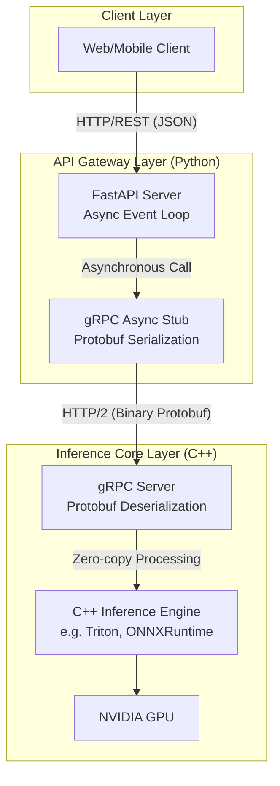

# Implementing a High-Performance Asynchronous API Layer Communicating with a Core Inference Engine

Developing deep learning models is convenient with Python, but what happens if an API server written in Python directly handles heavy image tensor operations?

Due to Python's inherent limitations, even with asynchronous processing, the entire server can experience hiccups.

Therefore, it's common practice to separate the API server that receives user requests from the engine that performs mathematical computations, and connect them via the fastest possible communication network.

To implement this structure, let's design an MSA that combines FastAPI, gRPC, and a C++-based inference engine.

<br>

## Problem Definition

When operating an AI service with a traditional single Python server (Flask + PyTorch), there are two critical bottlenecks.

- **Python GIL (Global Interpreter Lock) Limitations**: Python can execute only one thread of Python bytecode at a time. If heavy model inference starts running within Python's memory space, even light API requests from other users cannot be processed, leading to blocking.
- **REST/JSON Serialization Overhead**: When exchanging images or large embedding vectors (e.g., 1024-dimensional float arrays) via REST API by converting them to JSON text, the data size can balloon several times over, wasting significant CPU resources and time parsing the text.

### Solution Approach

- **Decoupling**: The API gateway role is handled by Python FastAPI, which specializes in asynchronous I/O processing. The actual heavy GPU tensor operations are offloaded to a dedicated container running a C++-written Triton Inference Server.
- **gRPC, Protobuf**: Communication between FastAPI and the C++ engine uses gRPC instead of heavy JSON REST APIs. This serializes data into a compressed binary format rather than text, dramatically reducing network transfer size and maximizing parsing speed.

<br>

## Detailed Operation Principles and Structure

We structured the flow where FastAPI receives HTTP JSON requests from clients, converts them into binary Protobuf data, and communicates with the C++ inference engine via gRPC.



### Example

Let's look at the interface design that defines the communication protocol. This file is compiled to generate both Python client code and C++ server code simultaneously.

```proto
syntax = "proto3";

package inference;

// Service definition for inference
service InferenceService {
  // RPC method that returns results when a client sends a request
  rpc ModelInfer (InferRequest) returns (InferResponse) {}
}

// Request data structure (receives multi-dimensional tensor data as a binary array)
message InferRequest {
  string model_name = 1;
  message Tensor {
    string name = 1;
    repeated int64 shape = 2; // e.g.: [1, 3, 224, 224]
    bytes tensor_content = 3; // Actual image/vector data sent as Raw Binary
  }
  repeated Tensor inputs = 2;
}

// Response data structure
message InferResponse {
  string model_name = 1;
  message Tensor {
    string name = 1;
    repeated int64 shape = 2;
    bytes tensor_content = 3;
  }
  repeated Tensor outputs = 2;
}
```

Let's also look at the logic for sending non-blocking inference requests to the C++ server using grpc.aio within a FastAPI application.

```py
import grpc
from fastapi import FastAPI, UploadFile
import numpy as np

# Python module automatically generated by the proto compiler (based on the above code)
import inference_pb2
import inference_pb2_grpc

app = FastAPI()

# Target C++ inference engine address
TRITON_GRPC_URL = "triton-server:8001"

@app.post("/predict")
async def predict_image(file: UploadFile):
    # 1. Convert image bytes received from client to Numpy array (preprocessing)
    image_bytes = await file.read()
    # (Dummy conversion for example - in reality, use cv2.imdecode, etc.)
    input_array = np.zeros((1, 3, 224, 224), dtype=np.float32) 
    
    # 2. Serialize Numpy array to Protobuf binary format (memory dump)
    raw_binary_data = input_array.tobytes()

    # 3. Assemble gRPC request object
    request = inference_pb2.InferRequest(
        model_name="resnet50_cpp",
        inputs=[
            inference_pb2.InferRequest.Tensor(
                name="input_tensor",
                shape=[1, 3, 224, 224],
                tensor_content=raw_binary_data
            )
        ]
    )

    # 4. Create asynchronous gRPC channel and send request (during this time, FastAPI thread handles other user requests)
    async with grpc.aio.insecure_channel(TRITON_GRPC_URL) as channel:
        stub = inference_pb2_grpc.InferenceServiceStub(channel)
        
        # Request computation from C++ server
        response = await stub.ModelInfer(request)

    # 5. Deserialize the received binary data back into a Numpy array
    output_array = np.frombuffer(
        response.outputs[0].tensor_content, dtype=np.float32
    ).reshape(response.outputs[0].shape)

    return {"predictions": output_array.tolist()}
```

The biggest problem with the code above is that **a new gRPC connection is established and torn down with every API request.**

This causes significant latency, and it's better to implement connection pooling, timeouts, and error handling.

```py
import grpc
from fastapi import FastAPI, HTTPException, status
from contextlib import asynccontextmanager
import inference_pb2
import inference_pb2_grpc
import logging

logger = logging.getLogger(__name__)

# Global gRPC channel and stub (singleton)
grpc_channel: grpc.aio.Channel = None
grpc_stub: inference_pb2_grpc.InferenceServiceStub = None

# --- 1. Reusing gRPC Channel with Lifespan (Connection Pooling Role) ---
@asynccontextmanager
async def lifespan(app: FastAPI):
    global grpc_channel, grpc_stub
    logger.info("Initializing gRPC connection with C++ inference server...")
    
    # Create and maintain the channel only once when the application starts (utilizing HTTP/2 multiplexing)
    # Remove maximum message send/receive size limit (e.g., 1GB) via options
    MAX_MSG_LENGTH = 1024 * 1024 * 1024 
    grpc_channel = grpc.aio.insecure_channel(
        "triton-server:8001",
        options=[
            ('grpc.max_send_message_length', MAX_MSG_LENGTH),
            ('grpc.max_receive_message_length', MAX_MSG_LENGTH),
            ('grpc.keepalive_time_ms', 10000), # Prevent connection loss with KeepAlive pings
        ]
    )
    grpc_stub = inference_pb2_grpc.InferenceServiceStub(grpc_channel)
    yield
    
    logger.info("Safely closing gRPC channel...")
    await grpc_channel.close()

app = FastAPI(lifespan=lifespan)

# --- 2. Robust Endpoint with Exception Handling and Timeout ---
@app.post("/predict/v2")
async def predict_robust(request_data: dict):
    # ... (Data preparation logic omitted) ...
    request = inference_pb2.InferRequest(model_name="resnet50_cpp")
    
    try:
        # [Key Quality 1] Timeout setting: Prevents FastAPI server from waiting indefinitely if the C++ engine crashes
        response = await grpc_stub.ModelInfer(request, timeout=3.0)
        return {"status": "success", "data": "..."}
        
    except grpc.aio.AioRpcError as rpc_error:
        # [Key Quality 2] Appropriately convert gRPC status codes to HTTP status codes and deliver to the client
        if rpc_error.code() == grpc.StatusCode.DEADLINE_EXCEEDED:
            logger.error("Inference engine response timed out (Timeout)")
            raise HTTPException(status_code=status.HTTP_504_GATEWAY_TIMEOUT, detail="Inference server timeout")
        
        elif rpc_error.code() == grpc.StatusCode.UNAVAILABLE:
            logger.error("Inference engine server is down.")
            raise HTTPException(status_code=status.HTTP_503_SERVICE_UNAVAILABLE, detail="Inference server offline")
            
        else:
            logger.error(f"Unknown gRPC error: {rpc_error.details()}")
            raise HTTPException(status_code=status.HTTP_500_INTERNAL_SERVER_ERROR, detail="Internal inference error")
```
