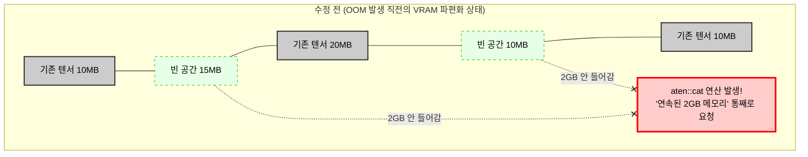

# Nesight Systems, PyTorch Profiler VRAM Memory Bottleneck Profiling

Let's say a `CUDA Out of Memory` error suddenly occurs during LLM serving, causing the server to crash. Arbitrarily halving the batch size to resolve this would not be sound engineering.

Just as one would take a heap dump and analyze object reference graphs when a memory leak occurs in a server application, it's necessary to examine exactly which tensor operations are consuming a lot of memory within the GPU VRAM.

To prevent GPU resource waste and overcome bottlenecks in an AI model serving environment, specialized profiling techniques are required that perform cross-validation at both the hardware and framework levels.

- **Nsight Systems (nsys):** A system-level profiler provided by NVIDIA that macroscopically analyzes interactions between CPU and GPU, PCIe bottlenecks, CUDA API call delays, kernel execution times, and OS thread scheduling on a timeline.
- **Pytorch Profiler**: Tracks microscopic operations within the framework. It records how much VRAM is dynamically allocated and deallocated when specific model layers (`aten::matmul`, `atem::scaled_dot_product_attention`) are executed, and what the tensor shapes are.
- **VRAM Memory Spike**: A phenomenon where VRAM usage temporarily surges due to activation tensors that are momentarily created and then disappear during a Forward Pass, in addition to the model's static weights. A major cause of OOM.

<br>

## Problem Definition

Simply checking VRAM usage with the `nvidia-smi` command is like looking at the fuel gauge on a car's dashboard while it's driving.

You know the fuel is depleting, but you can't tell which engine component is leaking fuel.

e.g.) The Attention operation in LLMs consumes memory proportional to the square of the sequence length ($O(N^2)$). The moment a user request length exceeds 4,096 tokens in a serving engine, the VRAM allocation for storing intermediate operations skyrockets. If VRAM fragmentation occurs, similar to `mmap()` failures or page faults, an OOM crash can happen because a contiguous memory block cannot be found, even if the total remaining free space is sufficient.

### Solution

- **Top-down Macroscopic Analysis with Nsight System**: Insert NVTX (NVIDIA Tools Extension) markers into the server code to identify GPU starvation – which part of the pipeline, from HTTP request reception, preprocessing, GPU transfer, model inference, to response return, causes the CPU to wait for the GPU.
- **Bottom-up Microscopic Analysis with PyTorch Profiler**: Use VRAM memory or timeline features, with `profile_memory=True` enabled, to track unnecessary memory copies or the lifecycle of temporary tensors occurring in specific Attention kernels or LayerNorm blocks, and use this as a basis for replacing them with memory-efficient kernels like FlashAttention.

<br>

## Detailed Operating Principles and Structure

This is a profiling architecture that shows how a Python application's operations are traced and recorded through the underlying CUDA runtime down to the hardware level.

```mermaid
graph TD
    subgraph "Application Layer (FastAPI / vLLM)"
        Req[API Request] --> P_Start[PyTorch Profiler Start]
        P_Start --> N_Mark[NVTX Range Push: 'Forward Pass']
        N_Mark --> Fwd[Model Forward Execution]
        Fwd --> N_End[NVTX Range Pop]
        N_End --> P_End[PyTorch Profiler End]
    end

    subgraph "Framework & Driver Layer"
        Fwd -.-> CudaMalloc[cudaMalloc / cudaFree (VRAM 동적 할당)]
        Fwd -.-> CudaKernel[CUDA Kernel Launch (행렬 연산)]
    end

    subgraph "Profiling Tools & Output"
        P_End == Export ==> TraceJson[Chrome Tracing (.json)\n- 연산자별 수행 시간\n- 텐서 메모리 라이프사이클]
        CudaMalloc & CudaKernel == Intercept ==> Nsys[nsys daemon]
        Nsys == Export ==> Qddb[Nsight Report (.nsys-rep)\n- 하드웨어 타임라인\n- PCIe 대역폭 병목]
    end
```

Looking at more code examples, I'll write a basic script to track which operations consume the most VRAM within a single forward pass of a model, and if there are any points where memory is not released and leaks.

```py
import torch
import torchvision.models as models
from torch.profiler import profile, record_function, ProfilerActivity

# 모델 및 더미 데이터 준비 (GPU 적재)
model = models.resnet50().cuda().eval()
inputs = torch.randn(16, 3, 224, 224).cuda()

# PyTorch Profiler 실행 컨텍스트
with profile(
    activities=[ProfilerActivity.CPU, ProfilerActivity.CUDA], # CPU/GPU 모두 추적
    profile_memory=True,  # [핵심] VRAM 메모리 할당/해제 추적 활성화
    record_shapes=True,   # 연산에 사용된 텐서의 크기(Shape) 기록
    with_stack=True       # 파이썬 소스 코드의 어느 줄에서 호출되었는지 콜스택 기록
) as prof:
    
    # 1. 특정 구간에 프로파일러 마커 삽입
    with record_function("model_inference"):
        with torch.no_grad():
            outputs = model(inputs)

# 2. 콘솔에 메모리 소모량이 가장 큰 순서대로 연산자 정렬하여 출력
print(prof.key_averages().table(sort_by="self_cuda_memory_usage", row_limit=10))

# 3. 크롬 브라우저(chrome://tracing)에서 시각적으로 분석 가능한 파일로 내보내기
prof.export_chrome_trace("trace_memory_profile.json")
```

And if you want to hook into a running API server process externally with the `nsys` CLI tool for analysis, you need to embed NVTX markers within your source code to visually locate your functions within the vast hardware timeline.

```py
import torch
import torch.cuda.nvtx as nvtx
from fastapi import FastAPI, Request

app = FastAPI()
model = load_llm_model().cuda().eval()

@app.post("/generate")
async def generate_text(request: Request, prompt: str):
    # [핵심 1] NVTX 마커 Push: Nsight Systems 타임라인에 'API_Request_Processing' 블록 생성
    nvtx.range_push(f"API_Request_Processing_{request.client.host}")
    
    try:
        # 데이터 전처리 구간 마킹 (CPU 작업)
        nvtx.range_push("1_Tokenization")
        input_ids = tokenizer(prompt, return_tensors="pt").input_ids.cuda()
        nvtx.range_pop() # 1_Tokenization 종료
        
        # 실제 모델 추론 구간 마킹 (GPU 커널 런치)
        nvtx.range_push("2_Model_Forward")
        with torch.no_grad():
            output_ids = model.generate(input_ids, max_length=100)
        nvtx.range_pop() # 2_Model_Forward 종료
        
        return {"text": tokenizer.decode(output_ids[0])}
        
    finally:
        # [핵심 2] NVTX 마커 Pop: 에러가 나더라도 반드시 마커를 닫아줌
        nvtx.range_pop() # API_Request_Processing 종료

# ==========================================
# [서버 실행 명령어]
# 일반적인 uvicorn 실행 대신, nsys daemon으로 감싸서 실행합니다.
# $ nsys profile -t cuda,nvtx,osrt -s none -o llm_serve_profile uvicorn main:app --host 0.0.0.0
# ==========================================
```

Looking at the VRAM extraction pipeline code at a production level,

This is similar to how memory issues were caught in native systems by tracking `mmap()` return values or using async-profiler. PyTorch 2.1 and later versions include a powerful feature that allows dumping the physical state of GPU memory to a file, much like a heap dump, for analysis. This code represents an advanced engineering technique to create a backdoor API in a serving server to immediately extract a memory snapshot when OOM symptoms appear during live service.

```py
from fastapi import FastAPI, BackgroundTasks
import torch
import logging

logger = logging.getLogger(__name__)
app = FastAPI()

# 1. 서버 기동 시 VRAM 메모리 할당 이력(History) 기록을 백그라운드에서 활성화
@app.on_event("startup")
def enable_memory_history():
    logger.info("VRAM 메모리 할당 내역 추적기 활성화 (MAX_ENTRIES=100000)")
    # 최대 10만 개의 메모리 할당/해제 이벤트를 링 버퍼(Ring Buffer) 형태로 기록
    torch.cuda.memory._record_memory_history(max_entries=100000)

# 2. 관리자 전용 엔드포인트: 라이브 서비스의 메모리 스냅샷 추출
@app.get("/admin/profile/vram_snapshot")
async def dump_vram_snapshot():
    dump_filename = "/tmp/vram_snapshot.pickle"
    try:
        # 현재 GPU 메모리에 올라가 있는 모든 텐서 블록의 주소, 크기, 할당 스택 트레이스를 덤프
        snapshot = torch.cuda.memory._snapshot()
        
        # 파일로 직렬화하여 저장 (이후 https://pytorch.org/memory_viz 웹 도구에 드래그하여 시각화 분석)
        with open(dump_filename, "wb") as f:
            import pickle
            pickle.dump(snapshot, f)
            
        return {"status": "success", "message": f"VRAM Snapshot saved to {dump_filename}"}
    except Exception as e:
        logger.error(f"메모리 스냅샷 추출 실패: {e}")
        return {"status": "error", "message": str(e)}

# 3. [최적화 팁] CPU -> GPU 데이터 전송 시 Page Fault 방지 (Pinned Memory)
# 시스템 엔지니어링 관점에서 커널 메모리 페이지 폴트는 치명적인 지연을 낳습니다.
# DataLoader나 입력 텐서 생성 시 `.pin_memory()`를 사용하면,
# OS 커널이 해당 메모리를 페이징(Swap)하지 못하게 잠가버리므로(Locked),
# PCIe 버스를 통한 DMA(Direct Memory Access) 전송 속도가 극대화됩니다.
def prepare_tensor(data):
    # 일반적인 할당보다 PCIe 전송 병목을 줄이는 저수준 최적화
    return torch.tensor(data).pin_memory().cuda(non_blocking=True)
```

- `torch.cuda.memory._record_memory_history()` performs the exact same role in a VRAM environment as `valgrind` or heap profilers do for finding memory leaks in existing C++ based servers.
- When such extracted snapshots are fed into an analysis tool, visual evidence can be obtained, much like a flamegraph, showing which tensor, created on which line of which Python file, is causing GPU memory fragmentation at a block level. This enables architectural improvements that fundamentally optimize the root-cause kernel, rather than just arbitrarily reducing batch sizes.

<br>

### Troubleshooting Scenario Example

Now that we've covered profiling methods for VRAM and other aspects, let's conduct a virtual simulation. We'll examine what bottlenecks existed, what metrics were used to identify them, and how the problem was resolved.

#### Scenario

Let's assume a plausible OOM failure scenario. The failure occurred on a real-time voice-based AI agent server.

While the user and AI were having a long conversation, the server suddenly threw an OOM error and crashed. This happened even though `nvidia-smi` monitoring just before the crash showed about 15GB of free space out of a total of 80GB VRAM.

Let's say we extracted `vram_snapshot.pickle` just before the error occurred via the backdoor API described earlier and uploaded it to the PyTorch memory visualizer website.



1. We can first identify **memory fragmentation**. Looking at the visualization map, although there's 15GB, it's not clumped into large blocks but rather fragmented into small pieces of 10MB or 20MB, caused by frequent memory allocations and deallocations at the C or OS kernel level.
2. The second timeline shows a massive memory spike block that surged at the far right end when the server crashed. Detailed logs reveal that during an `aten::cat` tensor concatenation operation, a sudden request for a 2GB contiguous memory block was made to the GPU. Due to fragmentation, no free space could be found, resulting in an "allocation 0GB" error and an OOM crash.

Clicking on the `aten::cat` block to find the root cause code, the line accumulating tensors in the Python code context was identified as the culprit.

```py
# [수정 전 문제의 코드]
def update_chat_history(past_tensors, new_token_tensor):
    # 대화가 길어질 때마다 기존 텐서와 새로운 텐서를 계속 이어 붙임
    updated_history = torch.cat([past_tensors, new_token_tensor], dim=1)
    return updated_history
```

In PyTorch, the `torch.cat()` operation doesn't simply append an element to the end of a list internally. Instead, on GPU memory, it allocates a completely new, massive memory block (`cudaMalloc`) equal to the existing size plus the new size, then copies all existing data, appends the new data, and finally performs the heavy task of deallocating the old memory block (`cudaFree`) repeatedly every time a token is generated.

As the conversation lengthens, the tensor to be copied grows larger, and the process of discarding old memory and allocating new memory exacerbates VRAM fragmentation.

Furthermore, examining the profiler's tensor properties revealed that `requires_grad=True` was mistakenly maintained by the developer, causing the computation graph to also consume VRAM.

Based on the profiling results, the following modifications can be made.

```py
# [수정 후 코드: Static Cache (Memory Pool) 및 추론 모드 적용]

# 1. 서버 구동 시점에 최대 대화 길이를 감당할 수 있는 거대한 빈 텐서를 미리 할당 (메모리 풀링)
MAX_SEQ_LEN = 8192

# inference_mode를 씌워 역전파 기록이 절대 남지 않도록 원천 차단
with torch.inference_mode():
    # 연속된 메모리 공간을 초기에 한 번만 통째로 확보
    static_cache = torch.zeros((1, MAX_SEQ_LEN, hidden_size), device='cuda')

def update_chat_history_optimized(current_length, new_token_tensor):
    # 2. torch.cat()으로 메모리를 매번 재할당하는 대신, 
    # 이미 뚫어놓은 정적 텐서(static_cache)의 특정 인덱스 포인터에 값만 덮어씌움 (In-place operation)
    static_cache[:, current_length:current_length+1, :] = new_token_tensor
    return current_length + 1
```

The process of repeatedly allocating and deallocating memory was eliminated. The architecture was changed to a STATIC KV CACHE, where a large chunk of memory is pre-allocated, and values are filled by simply advancing an offset index, a common practice in system programming. Simultaneously, inference mode was enforced, eliminating the space occupied by metadata.

After deploying these modifications and running the profiler again, it can be observed that the memory spikes that previously surged like mountains with every tick have disappeared, and VRAM fragmentation metrics remain close to 0% during traffic surges, indicating that the OOM issue has been resolved.

```mermaid
graph TD
    subgraph "수정 전 (OOM 발생 직전의 VRAM 파편화 상태)"
        direction LR
        B1[기존 텐서 10MB]:::used
        F1[빈 공간 15MB]:::free
        B2[기존 텐서 20MB]:::used
        F2[빈 공간 10MB]:::free
        B3[기존 텐서 10MB]:::used
        
        Spike[aten::cat 연산 발생!<br/>'연속된 2GB 메모리' 통째로 요청]:::error

        B1 --- F1 --- B2 --- F2 --- B3
        
        F1 -. "2GB 안 들어감" .-x Spike
        F2 -. "2GB 안 들어감" .-x Spike
    end

    subgraph "수정 후 (Static Cache / Memory Pool 적용)"
        direction LR
        Pool[서버 기동 시 미리 뚫어놓은<br/>거대한 단일 정적 메모리 공간<br/>MAX_SEQ_LEN (연속된 10GB)]:::pool
        
        Token1[토큰 1 덮어쓰기]:::insert
        Token2[토큰 2 덮어쓰기]:::insert
        Token3[토큰 3 덮어쓰기]:::insert

        Pool --> Token1 --> Token2 --> Token3
    end

    classDef used fill:#cccccc,stroke:#333,stroke-width:2px,color:#000
    classDef free fill:#e6ffe6,stroke:#00cc00,stroke-dasharray: 5 5,color:#000
    classDef error fill:#ffcccc,stroke:#ff0000,stroke-width:3px,color:#000
    classDef pool fill:#cce5ff,stroke:#0066cc,stroke-width:2px,color:#000
    classDef insert fill:#ffffcc,stroke:#cccc00,stroke-width:1px,color:#000
```
