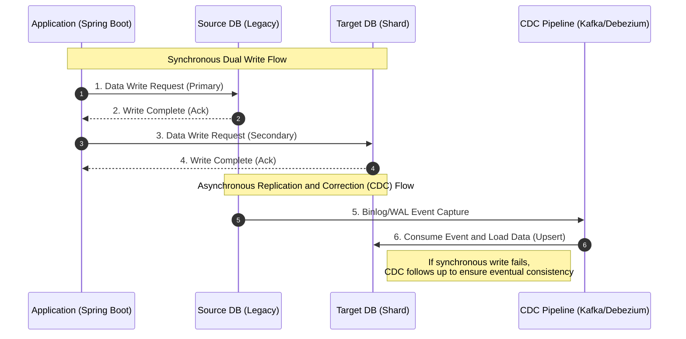

# Spring @Transactional Transaction Binding and Auto-Commit

In the [article](http://github.com/esperar/estudy/blob/master/Back-End/dbmigrate.md) mentioned, it was stated that using `@Transactional` in a multi-datasource environment might work, but transaction consistency might not be guaranteed.

The reason is that in a multi-database environment, if you place this annotation on a function like this:

```kt
@Transactional
fun create() {
    sourceDbRepository.save(User(name = "khope"))

    try {
        targetDbRepository.save(User(name = "khope"))
    } catch (e: Exception) {
        ...
    }
}
```

If you run this kind of code and the `sourceDb` and `targetDb` have different `Datasource`s, you cannot bind them into a single transaction (because they are fundamentally different databases).

From a physical perspective, this is an obvious concept, but I expected the `Transactional` annotation to reject multiple datasources if they were different (though, during setup, if `@Primary` is used to set a default, it would likely read the primary one and not reject it). A simple question arose: how is a transactional context composed?

So, I decided to study its internal working principles.

### Transaction Binding and Auto-Commit

**Transaction Manager Binding**: Spring's `@Transactional` annotation operates via AOP and, by default, binds with only one **TransactionManager**. If not explicitly specified, only the manager configured as `Primary` (in this case, the source DB) is bound to the current thread.

**Auto-Commit**: This is the default behavior of a DBMS where, if a query is executed in a session without explicit transaction control (BEGIN/COMMIT), it is immediately and permanently written to disk.

So, why does it work without throwing an exception when custom configured? Spring does not prevent heterogeneous resource access, such as calling external network APIs, writing files, or accessing other databases, within a single transactional block at the framework level.

Simply put, whether it's `db.get()` or `externalApiClient.get()`, the act of retrieving data from a physically different source is the same, so there's no reason for the framework to block it, which is why it's implemented that way.

The article linked above discusses a dual-write scenario, and the internal sequence of operations is as follows:

1.  **Transaction Start**: Upon method entry, the `@Primary` `sourceTransactionalmanager` acquires a connection from the SourceDB, sets `autocommit=false`, and opens a transaction.
2.  **SourceDB Write**: An insert query is executed on the JPA source DB (before commit).
3.  **TargetDB Write**: This is the problematic section. When `shardUserRepository.save()` is called, the target DB's entity manager checks the current thread but cannot find an open transaction for the target DB.
4.  **AutoCommit**: Instead of throwing an exception, the target DB entity manager simply borrows a connection from the `targetDataSource`, performs a single query autocommit without a transaction, and immediately returns the connection.
5.  **Transaction End**: When the method completes normally, the source DB's transaction is finally committed.

To visually confirm this implicit behavior, you can lower the transaction manager's log level to DEBUG to track the thread binding status.

```yml
logging:
  level:
    org.springframework.transaction: DEBUG
    org.springframework.orm.jpa: DEBUG
    com.zaxxer.hikari: TRACE
```

If you enable the above settings and run the application, the server logs will show the following flow:

1.  ``Creating new transaction with name ...` Source transaction created`
2.  ``Aquired Connection [HikaryProxyConnection@...] for JDBC transaction` (Source Connection acquired)`
3.  When the Target DB query is executed, only the pure DB query runs without transaction-related logs (target connection acquired and immediately returned).
4.  ``Initiating transaction commit` (Source transaction committed)`

This confusion can be prevented through explicit transaction separation logic (to avoid inducing errors). It's best to explicitly state that the logic accessing the target DB does not depend on the source DB transaction, or to separate the transaction propagation attributes.

```kt
@Service
class TargetDbWriteService(
    private val shardUserRepository: ShardUserRepository
) {
    // REQUIRES_NEW opens a separate physical transaction dedicated to the Target DB.
    // Explicitly declaring a transaction prevents reliance on Auto-commit.
    @Transactional(transactionManager = "targetTransactionManager", propagation = Propagation.REQUIRES_NEW)
    fun saveToTarget(entity: ShardEntity) {
        shardUserRepository.save(entity)
    }
}
```

### After the Solution: The Retirement of ChainedTransactionManager and Alternatives

In the past, Spring Data provided `ChainedTransactionManager` as a temporary solution to bundle such issues.

The attempt was to commit the TargetDB if the SourceDB succeeded, and roll back both if either failed.

However, because it was a flawed 2PC where the first transaction would already be committed if the network was suddenly disconnected while the second transaction was being committed, Spring deprecated it.

https://docs.spring.io/spring-data/commons/docs/current/api/org/springframework/data/transaction/ChainedTransactionManager.html

Therefore, rather than forcibly binding two databases into a single transaction, it's better to thoroughly protect one database with a transaction and allow the auxiliary database's reflection to operate with eventual consistency, by logging failures and having a background scheduler retry them.


