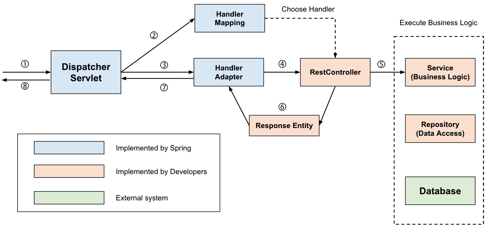

# 💻 디스패처 서블릿 Dispatcher-Servlet의 개념과 동작 과정 알아보기

#### 개요

스프링 AOP, Filter, Interceptor과 같은 개념을 공부하면서 디스패처 서블릿에 대한 얘기가 나오는데

아직 디스패처 서블릿에 대한 개념이 부족한 것 같아 한번 개념과 동작과정을 정리해보려고 한다.

#### Servlet (Java Servlet)

***자바 서블릿이란 자바를 사용해 웹을 등족으로 생성하는 서버측 프로그램 혹은 그 사양을 말한다.***

*흔히 서블릿이라고 불리며 자바 서블릿은 웹 서버의 성능을 향상시키기위해 사용되는 자바의 클래스 일종이다.*

*즉, 서블릿은 클라이언트의 요청을 처리, 그 결과를 반환하는 웹 프로그래밍 기술이다.*

### Dispatcher-Servlet

dispatch는 "보내다" 라는 뜻을 가지고있고 이러한 단어를 포함해 디스패처 서블릿은 HTTP로 들어오는 모든 요청을

가장 먼저 받아서 적합한 컨트롤러에 위임해주는 **프론트 컨트롤러**로 정의된다.

*프론트 컨트롤러란? (Front Controller)*

*주로 서블릿 컨테이너 제일 앞에서 서버로 들어오는 클라이언트들의 모든 요청을 받아 처리해주는 컨트롤러다.*

*MVC 구조에서 사용되는 디자인 패턴이다. (과거에는 이게 없어서 web.xml에 모든 url을 등록하는 불편함이..)*

클라이언트로부터 오는 요청은 톰캣과 같은 서블릿 컨테이너가 요청을 받게 된다, 그리고 이 모든 요청을

프론트 컨트롤러인 디스패처 서블릿이 가장 먼저 받는다. 디스패처 서블릿은 공통적인 작업을 먼저 처리 후

요청에 해당하는 컨트롤러를 찾아 작업을 위임해준다.

**장점**

-> 디스패처 서블릿이 해당 애플리케이션으로 들어오는 모든 요청을 핸들링 한다.

-> 공통 작업을 처리해준다. (우리는 컨트롤러를 구현해두기만 하면 디스패처 서블릿이 알아서 위임해주어 편리한 구조를 가진다.)

**but**

디스패처 서블릿은 정적 자원을 처리하면서 문제가하나 발생한다. 그 이유는 디스패처 서블릿이

**모든 요청을 처리하다 보니 image, HTML, CSS, JavaScript**와 같은 정적자원을 불러오지 못하는 상황도 발생한다/

이러한 방법을 해결하기위해 개발자들은 두가지의 방법을 고안했다.

1. 정적 자원 요청과 애플리케이션 요청 분리

2. 애플리케이션에 대한 요청 탐색 후 없으면 정적 자원에 대한 요청으로 처리

**1. 정적 자원 요청과 애플리케이션 요청 분리**

-> /app 의 URL로 접근하면 Dispatcher Servlet이 담당

-> /resource 의 URL로 접근하면 Dispatcher Servlet이 컨트롤할 수 없으므로 담당하지 않는다.

괜찮아 보이는 방법이지만 이렇게 설계하면 코드가 상당히 지저분해진고 모든 요청에 대해서 저런

URL(app, resource)을 붙여줘야 하므로 직관적인 설계가 될 수 없다.

**2. 애플리케이션에 대한 요청을 탐색 후 없으면 정적 자원에 대한 요청으로 처리**

정적 자원의 요청과 애플리케이션 요청을 분리하는 방법의 한계를 느끼고 이러한 방법을 고안해내었다.

**요청에 대한 컨트롤러를 찾을 수 없는 경우에, 2차적으로 설정된 자원 경로를 탐색해 자원을 탐색한다.**

이렇게 영역을 분리하면 리소스 관리에 효율적일 뿐만 아니라 추후에 확장을 용이하게 해주는 장점이 있다.

###

### 동작과정

위의 그림은 디스패처 서블릿의 처리 과정이다. 디스패처 서블릿은 앞서 말한대로 **적합한 컨트롤러와 메서드를 찾아 요청을 위임한다.**

1. 클라이언트의 요청을 디스패처 서블릿이 받는다.

2. 요청 정보를 통해 요청을 위임할 컨트롤러를 찾는다.

3. 요청을 컨트롤러로 위임할 핸들러 어댑터를 찾아서 전달한다.

4. 핸들러 어댑터가 컨트롤러로 요청을 위임한다.

5. 비즈니스 로직을 처리한다.

6. 컨트롤러가 값을 반환한다.

7. HanlderAdapter가 반환값을 처리한다.

8. 서버의 응답을 클라이언트로 반환한다.

**클라이언트의 요청을 디스패처 서블릿이 받는다.**

위의 그림은 처리 순서를 도식화한 것으로 앞서 설명했듯 서블릿은 가장 먼저 요청을 받는 프론트 컨트롤러다.

서블릿 컨텍스트(Web Context)에서 필터들을 지나 스프링 컨텍스트에서 디스패처 서블릿이 가장 먼저 요청을 받는다.

실제로 Interceptor가 Controller로 요청을 위임하지는 않는다. 그저 위에 말했듯 처리순서를 도식화 한 것 뿐이다.

**요청 정보를 통해 요청을 위임할 컨트롤러를 찾는다.**

디스패처 서블릿은 요청을 처리할 컨트롤러를 찾고 해당 메소드를 호출해야 한다.

HandlerMapping 구현체중 하나인 **RequestMapping HandlerMapping은 @Controller로 작성된 모든 컨트롤러 빈을 파싱하여 HashMap(요청 정보, 처리 대상)으로 관리한다.** 엄밀히 말하자면 컨트롤러가 아닌, 요청에 매핑되는 컨트롤러와 해당 메서드를 갖는 HandlerMethod 객체를 찾는다. 그래서 핸들러 매핑은 요청이 오면 HTTP Method, URI등을 통해 Key 객체인 요청 정보를 만들고, Value인 요청을 처리할 HandlerMethod를 찾아 HandlerMethodExecutionChain으로 감싸 반환한다. HandlerMethodExecutionChain으로 감싸는 이유는 컨트롤러로 요청을 넘겨주기 전 처리해야하는 **인터셉터등을** 포함하기 위해서다.

**요청을 컨트롤러로 위임할 핸들러 어댑터를 찾아 전달함**

디스패처 서블릿이 컨트롤러로 직접 요청을 위임하는게 아닌 HandlerAdapter라는 친구를 통해서 요청을 위임한다.

이때 어댑터 인터페이스를 통해 컨트롤러를 호출하는 이유는 컨트롤러 구현방식이 다양해서다.

최근에는 @Controller, @RequestMapping 관련 어노테이션만 사용해 컨트롤러를 작성하긴 하지만

컨트롤러 인터페이스를 통해 클래스를 작성할 수도 있어서다. 스프링은 HanlderAdapter라는 어댑터 인터페이스를 통해

**어댑터 패턴을 적용함으로써 컨트롤러의 구현 방식에 상관 없이 요청을 위임**할 수 있는 것이다.

**핸들러 어댑터가 컨트롤러로 요청을 위임함**

핸들러 어댑터가 컨트롤럴로 요청을 위임하기전 공통적인 전/후 처리 과정이 필요하다.

대표적으로 인터셉터들을 포함해 @RequestParm,@RequestBody 등을 처리하기 위한 ArgumentResolver들과

응답 시에 ResponseEntity의 Body를 Json으로 직렬화하는 등의 처리를 하는

**ReturnValueHandler**등이 어댑터에서 컨트롤러로 전달되기 전 처리됩니다.

그리고 컨트롤러의 메서드를 호출하도록 요청을 위임합니다. 실제로 요청이 위임되는 과정에 리플렉션이 사용됩니다.

요청을 처리할 대상 정보인 HandlerMethod 객체에는 컨트롤러 정보와 메서드 객체가 있으므로 리플렉션 메서드 객체를 invoke 합니다.

*리플렉션(Reflection)이란?*

*구체적인 클래스 타입을 알지 못해도 그 클래스의 메서드, 타입, 변수들에 접근할 수 있도록 해주는 자바 API*

사실 실제로는 HandlerMethod에 컨트롤러 빈 이름과 메서드, 빈 팩토리가 있어 빈 팩토리에서 컨트롤러 빈을 찾습니다.

그리고 해당 컨트롤러 빈 객체로부터 리플렉션을 사용합니다.

**비즈니스 로직을 처리함**

컨트롤러가 서비스를 호출해 비즈니스 로직을 처리합니다.

**컨트롤러가 반환값을 반환함**

비즈니스 로직이 처리된 후 컨트롤러가 반환값을 반환합니다. (ResponseEntity, View Name)

**HandlerAdapter가 반환값을 처리함**

핸들러 어댑터는 컨트롤러로 부터 받은 응답을 응답 처리기인 ReturnValueHandler가 후처리한 후 디스패처 서블릿으로 돌려줍니다.

만약 컨트롤러가 ResponseEntity를 반환하려면 HttpEntityMethodProcessor가 MessageConverter를 사용해 응답 객체를 직렬화 한 후 응답 상태를 설정합니다. 만약 컨트롤러가 뷰 이름을 반환하면 뷰리졸버를 통해 뷰를 반환합니다.

**서버의 응답을 클라이언트로 반환**

디스패처 서블릿을 통해 반환되는 응답은 다시 필터들을 거쳐 클라이언트에게 반환됩니다.

참고글

<https://velog.io/@han_been/%EC%84%9C%EB%B8%94%EB%A6%BF-%EC%BB%A8%ED%85%8C%EC%9D%B4%EB%84%88Servlet-Container-%EB%9E%80>
