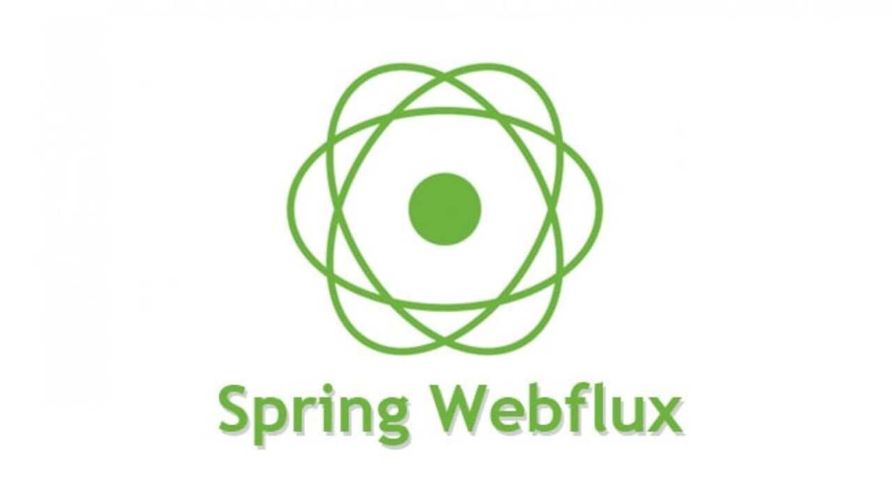
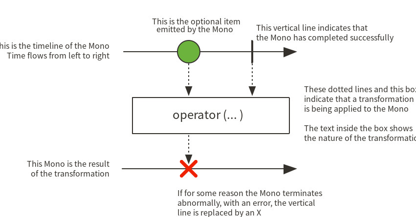
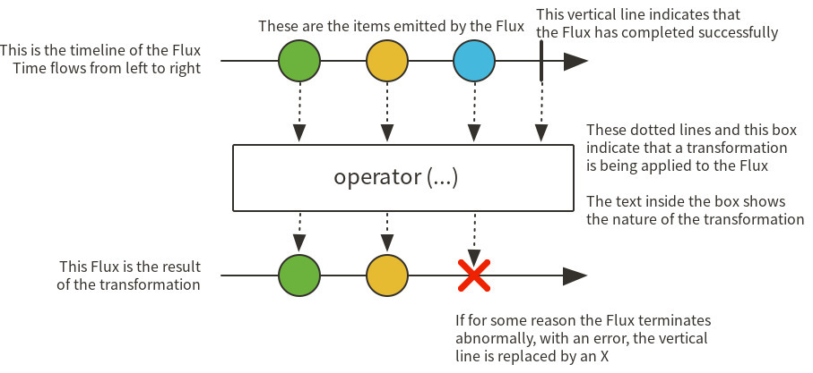

# 📗 Spring WebFlux, Reactive Stream, R2DBC, Mono, Flux 정복하기

### 개요

Non-Blocking 방식의 애플리케이션 api가 대규모 소프트웨어 프로그램에서 성능 향상을 위해 거의 필수다 싶이 사용되는 기술이다. 그렇기에 오늘 Webflux와 리액티브 스트림, 논블라킹에 대해서 정리해보려고한다.

### Non-Blocking

Non-Blocking은 한 번에 하나의 작업을 처리하고 결과를 반환하기전에 다른 작업을 수행할 수 있도록 하는 프로그래밍 스타일이다.

Non-Blocking 특징

* 입출력 작업이나 긴 작업을 수행하는 동안 CPU가 다른 작업을 할당해 자원을 최대한 활용할 수 있다.
* 다중 스레드와 달리 스레드 간의 컨텍스트 스위칭이 발생하지 않아 CPU 부하와 메모리 사용을 최적화할 수 있다.

### Spring WebFlux

Spring WebFlux는 Spring5에서 추가된 Reactive-Stack의 웹 프레임워크로, 클라이언트와 서버간에 리액티브 애플리케이션 개발을 위한 **Non-Blocking Reactive-Stream**을 지원한다.

WebFlux가 생긴 이유로는

1. 적은 양의 스레드와 최소한의 하드웨어 자원으로 동시성을 핸들링하기 위함

2. 함수형 프로그래밍

이 있다.

#### Spirng WebFlux 등장 배경

Spring WebFlux는 기존 스프링 MVC의 한계를 극복하고자 Reactive Programming을 적용한 스프링 프레임 워크 모듈 중 하나다.

기존 스프링 MVC는 서블릿 스팩에서 지원하는 **Thread-Per-Request 모델**로 동작한다. 이는 요청 하나당 하나의 스레드가 할당되는 방식으로, 하나의 요청 처리에 블로킹이 발생하면 해당 요청에 할당된 스레드는 계속 블로킹 상태로 남아있게 된다. 그리고 블로킹 I/O는 CPU 자원을 낭비하는 원인 중 하나다. 또한, 많은 수의 요청을 처리하기 위해서는 많은 수의 스레드가 필요하므로 서버에서 스레드 개수를 미리 고정해야 하며, 이는 **스레드 컨텍스트 스위칭**에 따른 부하 증가를 야기할 수 있다.

이해 비해 Reactive Programming Model은 이벤트 기반의 Non-Blocking I/O를 기반으로 동작하며, 요청에 대한 처리를 담당하는 스레드를 블로킹하지 않고 비동기적으로 처리한다. 이 방식을 사용하면 블로킹 I/O 대기 시간 동안에도 다른 요청을 처리할 수 있으며, 한정된 리소스로도 더 많은 요청을 처리할 수 있다..

즉 Spring WebFlux는 이러한 Reactive Programming Model을 지원하고 높은 성능과 확장성을 제공한다.

비동기 논블로킹 환경의 서버로 Netty가 부상하고 있었으며 이 Netty와의 연동을 위해 Spring은 새로운 API가 필요했다.

스프링 웹플럭스는 아래와 같은 용도로 사용하기를 추천된다.

* 비동기, non-blocking reactive 개발에 사용되는 경우
* 효율적으로 동작하는 고성능 웹 어플리케이션 개발에 사용
* 서비스간 호출이 많은 마이크로서비스 아키텍처에 적합

**Spring WebFlux :**

-> **many request : 1 thread, async + Non-Blocking**

**Spring MVC : 1 request :**

-> **1 thread, sync + Blocking**

### Reactive Stream

Reactive Stream은 **비동기적, Non-Blocking, backpressure 기반의 스트림 처리를 위한 표준 스펙**이다. 이를 사용하면 데이터 처리를 할 때, 다른 작업이 완료될 때까지 기다리는 대기 시간이 없어지고, 작업이 처리되면 즉시 다음 작업을 처리할 수 있어 더 효율적으로 리소스를 활용할 수 있다.

Reactive Stream은 Publisher-Subscriber 패턴을 사용해, Publisher는 데이터를 생성하고 Subscriber는 생성된 데이터를 처리한다. 이 과정에서 발생하는 데이터의 양과 속도가 Subscriber가 처리하는 능력을 초과할 수 있는 경우, backpressure를 통해 Publisher가 데이터 생산을 제한하여 Subscriber가 데이터를 처리할 수 있는 속도에 맞춰 처리할 수 있도록 한다.

### R2DBC

R2DBC (Reactive Relational Deatabase Connectivity)는 **적은 수의 스레드**로 동시성을 처리하고 더 **적은 하드웨어 리소스**로 확장할 수 있는 Non-Blocking 애플리케이션 스택이다.

궁합으로는

* spirng mvc : jpa
* spring webflux: r2dbc

이렇게 볼 수 있다.

Reactive Model이기 때문에 findAll()과 같은 연산을 했을때 List<T>가 아닌 Flux<T>를 리턴하고 <T> 대신에는 Mono<T>를 리턴한다.

### Mono & Flux

Spring Webflux에서 사용하는 reactive library는 Reactor이고 Reactor가 Reactive Streams의 구현체다. 그래서 Webflux 문서에 Reactive Streams가 언급되는 것이고 그것과 같이 Reactor가 나온다.

주요 객체인 Mono / Flux는 결국 웹 플럭스에 동작 구조를 이해하는데 꼭 알고 넘어가야한다.

* Mono : 0 ~ 1개 데이터 전달
* Flux : 0 ~ N개 데이터 전달

Mono와 Flux는 Reactive Streams의 Publisher 인터페이스를 구현하는 구현체이다.

#### Mono

#### Flux

### 마무리 총총

이렇게 WebFlux에 대해서, 관련 용어에 대해서 공부를 해보았다 비동기 처리를 지향하기 위한 나의 공부는 끊임없이..!
